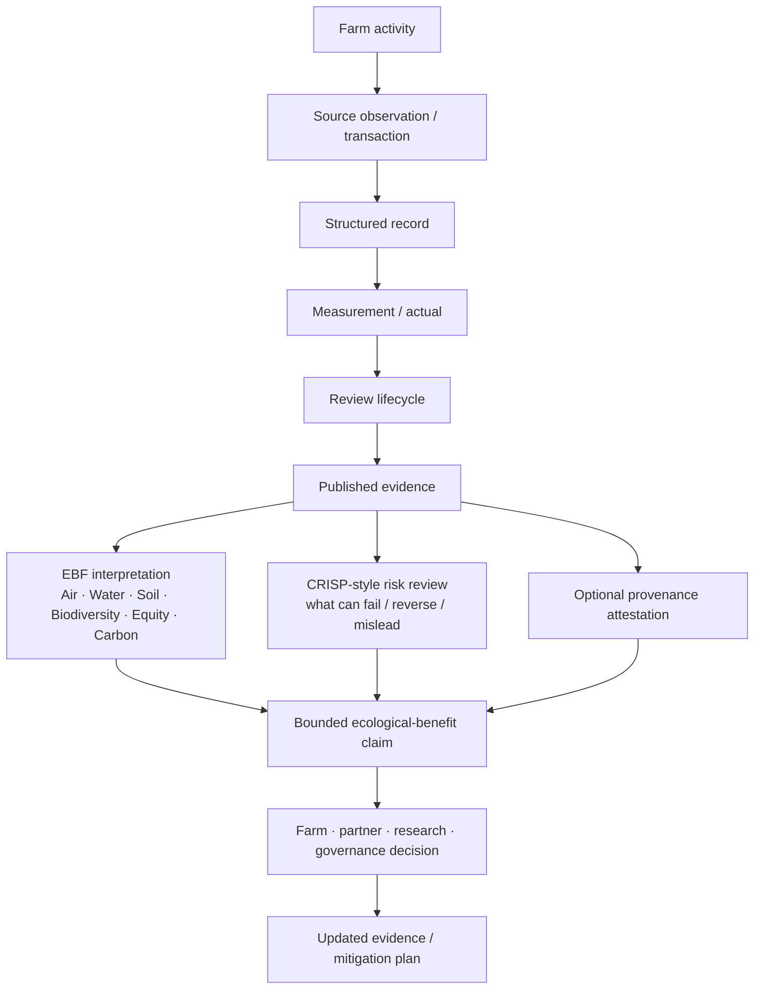
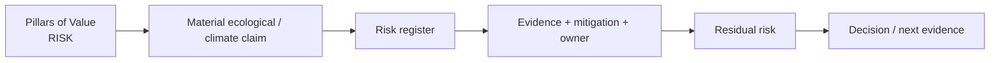

# Ecological frameworks help interpret evidence — they do not create it.

Kokonut uses ecological-impact frameworks **after** farm activity has produced evidence.

Two lenses currently appear across the Framework:

- **EBF — Ecological Benefits Framework** for organizing ecological-benefit claims;
- **CRISP-style risk review** for examining uncertainty that could weaken ecological, climate, financial, operator, or evidence-delivery assumptions.

They should sit above:

- farm observations;
- actual measurements;
- operational records;
- financial actuals;
- MRV review;
- published evidence.

> **MRV asks what the evidence says. EBF helps organize ecological-benefit interpretation. Risk review asks what could make the interpretation fail, weaken, reverse, or mislead.**

<CardGroup cols={2}>
  <Card title="Read the EBF source" icon="leaf" href="https://ebfcommons.org/what-is-ebf/">
    EBF Commons describes the external framework around Air, Water, Soil, Biodiversity, Equity, and Carbon.
  </Card>

  <Card title="Start with MRV" icon="magnifying-glass-chart" href="/ecosystem-wiki/kokonut-farms/measurement-reporting-and-verification">
    Follow the evidence lifecycle before applying an ecological-benefit or risk interpretation.
  </Card>

  <Card title="Use the Positive Impact claim ladder" icon="recycle" href="/kokonut-framework/framework-components/framework-features/methodology-positive-impact">
    Keep alignment, activity, measured outcome, and impact interpretation separate.
  </Card>

  <Card title="See the live reference farm" icon="seedling" href="/ecosystem-wiki/kokonut-farms/adelphi/summary">
    Inspect which ecological practices, measurements, forecasts, and evidence gaps currently exist at Adelphi.
  </Card>
</CardGroup>

<Warning>
  **Neither EBF nor Kokonut's CRISP-style risk review is a substitute for the methodology required by a carbon standard, biodiversity-credit standard, environmental regulator, scientific study, certification body, lender, insurer, or other external assurance process.**
</Warning>

---

## EBF and risk review at a glance

| Layer | Core question | Status in Kokonut | Does not automatically provide |
| --- | --- | --- | --- |
| **MRV** | What was observed, measured, reviewed, and published? | Active evidence methodology | Ecological interpretation by itself |
| **EBF** | Which ecological-benefit domains are relevant, and what evidence supports them? | External framework used as an interpretation lens | Certification, data validation, carbon-credit eligibility |
| **CRISP-style review** | What could weaken, reverse, delay, or invalidate the expected benefit or claim? | Developing Kokonut risk-review pattern | A recognized external risk certification or universally valid score |
| **Positive Impact Methodology** | How strong can the final claim be? | Active Framework methodology | Evidence that does not exist |

<Info>
  The old version of this page expanded CRISP as **“Carbon Risk Identification and Scoring Principles.”** The current repository does not link that expansion to an authoritative external source. This page therefore uses **CRISP-style risk review** as Kokonut terminology rather than presenting that full name as an established external standard.
</Info>

---

## Where these frameworks sit

```mermaid
flowchart TD
    A["Farm activity"] --> B["Source observation / transaction"]
    B --> C["Structured record"]
    C --> D["Measurement / actual"]
    D --> E["Review lifecycle"]
    E --> F["Published evidence"]

    F --> G["EBF interpretation<br/>Air · Water · Soil · Biodiversity · Equity · Carbon"]
    F --> H["CRISP-style risk review<br/>what can fail / reverse / mislead"]

    G --> I["Bounded ecological-benefit claim"]
    H --> I

    F --> J["Optional provenance attestation"]
    J --> I

    I --> K["Farm · partner · research · governance decision"]
    K --> L["Updated evidence / mitigation plan"]
```

The important ordering is:

> **evidence first → interpretation second → decision third**

Not:

> framework → score → proof

---

# EBF — Ecological Benefits Framework

## What the external EBF actually organizes

The externally maintained [Ecological Benefits Framework](https://ebfcommons.org/) describes six interconnected domains:

1. **Air**
2. **Water**
3. **Soil**
4. **Biodiversity**
5. **Equity**
6. **Carbon**

EBF Commons explicitly describes the framework as a shared set of definitions/agreements rather than a data standard or certification.

Kokonut should therefore use EBF as:

- a common ecological-benefit vocabulary;
- a way to organize evidence;
- a way to expose gaps across more than carbon;
- a partner/reporting lens;
- a comparison structure when semantics are consistent.

It should **not** be treated as automatic proof that a benefit exists.

---

## The six EBF domains in Kokonut

| EBF domain | Useful Kokonut question | Example evidence | Overclaim to avoid |
| --- | --- | --- | --- |
| **Air** | Did farm activity measurably change emissions, smoke, dust, pollutants, or another defined air indicator? | Fuel/input records, air-quality data, emissions methodology | “Regenerative farming automatically improved air quality” |
| **Water** | Did water availability, use, runoff, erosion, infiltration, or quality change? | Irrigation records, water quantity/quality data, runoff observations | “Ground cover automatically improved watershed health” |
| **Soil** | Did a defined soil condition change? | Soil moisture, EC, temperature, organic matter/carbon where methodologically appropriate | “Biochar means soil health improved” |
| **Biodiversity** | Did species, habitat, survival, abundance, or another defined biodiversity indicator change? | Inventory, survival, repeated surveys, habitat observations | “More species planted means biodiversity was restored” |
| **Equity** | Who receives benefits, decision power, opportunity, access, and costs? | Ownership, roles, compensation, participation, benefit distribution | “Women-led ownership proves broader equality improved” |
| **Carbon** | Did an appropriate methodology establish an emissions reduction/removal/storage outcome? | Baseline, boundary, carbon method, soil/biomass/input data, uncertainty, verification where required | “Biochar/agroforestry automatically equals verified carbon” |

### EBF is broader than ecology in the narrow sense

The **Equity** domain matters because ecological projects affect people through:

- land access;
- ownership;
- labor;
- income;
- participation;
- distribution of benefits;
- distribution of costs and risks.

That is also why EBF should connect to the Kokonut Pillars—especially **WHO, CONTRIBUTION, RISK, and PUBLIC GOODS**.

---

## EBF evidence maturity

An EBF domain can be relevant at different claim levels.

| Claim level | Soil example | Equity example |
| --- | --- | --- |
| **Alignment** | Farm design includes soil-building practices | Project design includes women-led ownership or local participation |
| **Activity** | Biochar/cover/biological-input practice occurred | Training, work, ownership, or participation occurred |
| **Measured outcome** | A defined soil indicator changed | Compensation, opportunity, participation, or benefit-distribution indicator changed |
| **Impact interpretation** | Evidence supports a bounded soil-condition conclusion | Evidence supports a bounded equity conclusion |

<Warning>
  **Do not create an “EBF score” merely by counting how many of the six domains are mentioned.** Six represented domains are not six achieved benefits.
</Warning>

---

## EBF and the 8 Forms of Capital are related — but not identical

Kokonut's 8 Forms of Capital are an internal value-classification lens.

EBF is an external ecological-benefit framework.

They can overlap without being collapsed.

| EBF domain | Likely Kokonut capital forms |
| --- | --- |
| Air | Natural, Health |
| Water | Natural, Health, Material |
| Soil | Natural, Material |
| Biodiversity | Natural, Intellectual |
| Equity | Social, Human, Financial, Cultural |
| Carbon | Natural, Financial where an actual market/credit relationship exists |

> **EBF domains should not be converted into capital units, and capital forms should not be converted into an EBF score without a transparent methodology.**

---

# CRISP-style risk review

## What Kokonut means by it

Across the current Knowledge Base, **CRISP** is used as shorthand for a structured risk lens around ecological and carbon-related delivery.

Because the repository does not currently provide an authoritative external source for the expansion **“Carbon Risk Identification and Scoring Principles,”** Kokonut should document the method by what it actually does:

> **Identify material risks, connect them to evidence, assign ownership and mitigation, and revisit them as the farm changes.**

That makes it useful even when no numeric score is appropriate.

---

## Risk categories

A farm-level ecological risk review can include:

| Risk category | Core question | Evidence to inspect |
| --- | --- | --- |
| **Methodology / claim risk** | Does the method actually support the claim being made? | Protocol, baseline, boundary, units, uncertainty, reviewer |
| **Climate / physical risk** | Could drought, flood, heat, storm, fire, erosion, or water stress reverse or weaken outcomes? | Weather/climate context, water system, field records, contingency plans |
| **Permanence / reversal risk** | Could the measured benefit later be lost? | Management continuity, mortality, disturbance, land-use change, maintenance |
| **Leakage / displacement risk** | Did the intervention move a burden elsewhere rather than reduce it? | Input sourcing, land-use displacement, waste/material flows, externalized impacts |
| **Agronomic / ecological risk** | Could pests, disease, poor establishment, nutrient imbalance, or inappropriate design undermine the system? | Crop/animal/soil records, survival, field review |
| **Data-quality risk** | Is the evidence incomplete, stale, biased, inconsistent, or incomparable? | Provenance, timestamps, calibration, missing records, review state |
| **Operator / execution risk** | Can the responsible people actually execute and maintain the intervention? | Milestones, roles, maintenance, reporting discipline, capacity |
| **Financial risk** | Can the farm sustain the activity long enough for the expected benefit to occur? | Budget, actual spend, cash flow, revenue actuals, maintenance funding |
| **Legal / land / policy risk** | Could tenure, permits, standards, certification, or policy change affect the claim or activity? | Agreements, land records, legal review, external requirements |
| **Equity / social risk** | Could benefits/costs be distributed unfairly or participation create harm? | Compensation, consent, participation, benefit distribution, grievance records |
| **Technology / infrastructure risk** | Could sensor, irrigation, data, energy, storage, or software failure weaken delivery/evidence? | Uptime, maintenance, QA, backups, failure logs |

These categories should be adapted to the farm and claim.

They are not a fixed universal taxonomy.

---

## Risk scoring is optional — transparency is not

A risk review can be useful without reducing every risk to one number.

A minimum risk record should capture:

| Field | Question |
| --- | --- |
| **Risk** | What can fail, reverse, or mislead? |
| **Claim / asset affected** | Which ecological benefit or farm outcome is exposed? |
| **Evidence** | What makes this risk credible? |
| **Likelihood / uncertainty** | How plausible is it, using the current evidence? |
| **Consequence** | What happens if it materializes? |
| **Mitigation** | What reduces the likelihood or consequence? |
| **Owner** | Who is responsible for managing it? |
| **Trigger / indicator** | What would show the risk is increasing? |
| **Residual risk** | What remains after mitigation? |
| **Review date** | When should the assessment be revisited? |

### If a numeric score is used

Document:

- scale;
- weights;
- formula;
- evidence inputs;
- treatment of missing data;
- thresholds;
- reviewer;
- version;
- sensitivity to changed assumptions.

<Info>
  **A number without a transparent scoring method is decoration, not risk analysis.**
</Info>

---

## Relationship to the Pillars of Value

The Pillars already contain **RISK**.

The ecological risk review is a more detailed extension for claims where ecological, climate, permanence, evidence, or external-standard risk is material.

```mermaid
flowchart LR
    A["Pillars of Value<br/>RISK"] --> B["Material ecological / climate claim"]
    B --> C["Risk register"]
    C --> D["Evidence + mitigation + owner"]
    D --> E["Residual risk"]
    E --> F["Decision / next evidence"]
```

This keeps risk connected to the actual claim instead of producing a detached farm-wide score.

---

## EBF and CRISP-style review work together

The two lenses ask different questions.

| Lens | Question |
| --- | --- |
| **EBF** | Which ecological-benefit domain does the evidence relate to? |
| **Risk review** | What could weaken, reverse, invalidate, or overstate that benefit? |
| **MRV** | What source evidence exists? |
| **Positive Impact Methodology** | What claim level does that evidence justify? |

Example:

> **EBF Soil:** a repeated soil indicator improved during the reporting period.

Risk review then asks:

- Was the baseline comparable?
- Could rainfall explain part of the change?
- Was the same method used?
- Could later disturbance reverse it?
- Is the reporting period long enough?
- Is the result being generalized beyond the measured plot?

The risk analysis **narrows and contextualizes** the benefit claim.

It does not erase a real measured outcome, and it does not manufacture one.

---

## Adelphi: EBF interpretation with current evidence boundaries

Adelphi can be mapped across all six EBF domains, but the evidence maturity differs substantially.

| EBF domain | Current Adelphi basis | Safe current claim | Stronger evidence still needed |
| --- | --- | --- | --- |
| **Air** | Biological-input strategy and farm-operation choices may affect emissions/exposure | Air-related pathways may be relevant | Defined emissions/air-quality baseline, activity data, methodology |
| **Water** | Irrigation/water infrastructure, soil-cover and erosion-management practices | Water-management practices are implemented | Water-use efficiency, runoff, infiltration, water-quality or comparable outcome evidence |
| **Soil** | Biochar, biological inputs, cover, soil observations/probes | Soil-management practices and measurement capability are documented | Repeated comparable soil indicators tied to defined claims |
| **Biodiversity** | Two syntropic plots, agroforestry, nursery, 12+ native/at-risk species identified in repository materials | Biodiversity-relevant design and propagation activity are documented | Verified conservation status, survival, repeated species/habitat evidence |
| **Equity** | Women-led ownership/operations, seven documented jobs, community/training infrastructure | Women-led operation and work/community pathways are documented | Compensation, participation, benefit distribution, wider equity outcomes |
| **Carbon** | Biochar, agroforestry, perennial vegetation, soil practices | Climate-relevant practices create a co-benefit hypothesis | Carbon methodology, baseline, boundary, measurements, uncertainty, permanence, appropriate verification |

<Warning>
  **Adelphi should not currently be described as having a completed EBF impact score, verified carbon outcome, proven biodiversity restoration, improved watershed condition, or demonstrated community-wide equity outcome unless the corresponding evidence and methodology are actually present.**
</Warning>

---

## Adelphi: current risk-review examples

| Risk | Why it matters | Evidence / mitigation to strengthen |
| --- | --- | --- |
| **Long-cycle crop timing** | Coconut/perennial value takes years to mature | Updated survival/phenology/harvest actuals; liquidity plan |
| **Water / climate** | Production and ecological establishment depend on water availability and weather | Water records, infrastructure performance, contingency plan |
| **Soil-claim risk** | Practices may exist before measurable soil response is established | Baseline + repeated comparable measurements |
| **Biodiversity-claim risk** | Species presence/planting can be mistaken for restoration | Survival, repeated surveys, habitat indicators, verified taxonomy/status |
| **Carbon-claim risk** | Biochar/agroforestry can be overstated as quantified sequestration | Carbon method, application/biomass data, uncertainty, permanence review |
| **Financial risk** | Forecast crop revenue may not match realized yield/price/cost | Harvest, sale, cost, cash-flow actuals |
| **Operator capacity risk** | Infrastructure and multi-system farm management require sustained local execution | Roles, maintenance, milestones, operating records |
| **Data-quality risk** | Sparse or inconsistent measurements can create misleading trends | Provenance, reporting periods, QA, missing-data visibility |
| **Equity risk** | Women-led ownership/jobs may be overstated as wider community equity | Compensation, participation, decision-power and distribution evidence |

---

## Publication and attestations

### Published evidence

A published farm record means it passed the applicable Kokonut lifecycle and is available to approved downstream surfaces.

It does not automatically mean:

- external audit;
- scientific peer review;
- regulatory approval;
- environmental certification.

### EAS

An EAS attestation can preserve:

- signer;
- schema;
- timestamp;
- evidence reference;
- provenance.

It cannot independently determine whether an EBF benefit or risk conclusion is scientifically valid.

### IPFS / Filecoin

Content-addressed storage can preserve evidence artifacts.

It is useful where durable public evidence matters.

It is not required for every ecological record, and it proves file identity/integrity rather than truth.

---

## A reusable ecological-interpretation record

For a material EBF or ecological-risk statement, capture:

| Field | Requirement |
| --- | --- |
| **Framework/lens** | EBF domain, risk review, or both |
| **Claim** | What exactly is being asserted? |
| **Claim level** | Alignment, activity, measured outcome, impact interpretation? |
| **Farm / boundary** | Which site, plot, stakeholder group, ecosystem, or system? |
| **Baseline** | What was the starting condition? |
| **Intervention** | What action is relevant? |
| **Metric / observation** | What was recorded? |
| **Method** | How was it measured or assessed? |
| **Reporting period** | When? |
| **Source** | Which governed record/dataset? |
| **Reviewer** | Who reviewed the evidence/interpretation? |
| **EBF domain** | Air, Water, Soil, Biodiversity, Equity, Carbon |
| **Contribution context** | What else may explain the outcome? |
| **Material risks** | What can fail, reverse, or distort the conclusion? |
| **Mitigation / owner** | Who does what next? |
| **Evidence pointer** | Hub record, dataset, file, CID, attestation, report? |
| **Next evidence** | What would strengthen or falsify the conclusion? |

This makes the output auditable without pretending the framework itself performed the measurement.

---

## Reporting cadence should follow the evidence

The old page made EBF and CRISP an annual requirement by default.

Annual review can be useful.

It should not be the only cadence.

Different evidence moves at different speeds:

| Evidence | Useful cadence example |
| --- | --- |
| Weather / irrigation / operational events | Daily to monthly where material |
| Harvest / sales / inputs | Per event / crop cycle |
| Soil measurements | Method-dependent; avoid meaningless over-sampling |
| Vegetation remote sensing | Regular comparable periods |
| Biodiversity / survival | Seasonal / annual / methodology-dependent |
| Equity / work evidence | Reporting-period / program / employment-cycle |
| Carbon | Standard/methodology-defined |
| Full EBF synthesis | Periodic when enough reviewed evidence exists |
| Risk review | Proposal, major change, incident, expansion, reporting period |

> **Choose cadence because it matches the claim and method—not because a dashboard wants another data point.**

---

## How Kokonut Intelligence can support this layer

Kokonut Intelligence can help:

- retrieve reviewed records by EBF domain;
- compare reporting periods;
- calculate defined indicators;
- identify missing baselines;
- flag stale evidence;
- assemble EBF evidence packets;
- maintain risk registers;
- surface changed assumptions;
- compare forecast vs. actual;
- draft interpretations for review;
- link published evidence to attestations.

It should not independently:

- declare a farm EBF-certified;
- invent a CRISP standard that has not been documented;
- create carbon-credit eligibility;
- convert weak evidence into a high ecological score;
- hide uncertainty;
- decide scientific causality;
- substitute AI confidence for domain review.

---

## Common failure modes

| Failure mode | Better practice |
| --- | --- |
| “EBF proves ecological impact.” | EBF organizes interpretation; measurements/methodology support the claim |
| “EBF has four Kokonut dimensions.” | Use EBF's external six-domain structure: Air, Water, Soil, Biodiversity, Equity, Carbon |
| “A practice checks the Soil/Biodiversity box.” | Separate activity from measured outcome |
| “Six EBF domains = six impacts.” | Evaluate each claimed outcome independently |
| “CRISP is an externally standardized Kokonut carbon-risk framework.” | Treat current usage as Kokonut CRISP-style risk analysis unless an authoritative source is adopted |
| “Every risk needs a numeric score.” | Use structured qualitative risk when scoring adds false precision |
| “A high score means the project is safe.” | Preserve evidence, assumptions, residual risk, and review date |
| “EAS verifies EBF/CRISP conclusions.” | EAS supports provenance, not scientific validity |
| “An annual report proves current conditions.” | Check reporting period and freshness |
| “Biochar means Carbon benefit.” | Apply the relevant carbon methodology before quantification |
| “Women-led means Equity improved.” | Report the documented ownership structure; measure wider equity separately |
| “Remote sensing proves Biodiversity.” | Use vegetation indicators as context; use biodiversity-specific evidence for biodiversity claims |

---

## Who should use this layer

<CardGroup cols={2}>
  <Card title="Farm operators" icon="tractor">
    Use ecological and risk lenses to decide what needs to be measured, maintained, changed, or mitigated in real operations.
  </Card>

  <Card title="Impact & research reviewers" icon="microscope">
    Check EBF-domain evidence, methods, claim maturity, contribution context, uncertainty, and risk.
  </Card>

  <Card title="Capital governance participants" icon="building-columns">
    Use ecological interpretation and risk as decision inputs without treating either as an automatic funding verdict or overriding farm/domain expertise.
  </Card>

  <Card title="Guilds & contributors" icon="users">
    Turn ecological evidence gaps and risk mitigations into bounded research, field, data, documentation, or implementation work.
  </Card>

  <Card title="Partners & grant reviewers" icon="file-signature">
    Trace ecological claims to source evidence and distinguish external EBF vocabulary from Kokonut's developing risk-review tooling.
  </Card>

  <Card title="Developers & agents" icon="code">
    Preserve framework version, evidence pointers, risk assumptions, scoring methodology if used, and human/domain review.
  </Card>
</CardGroup>

---

## Current maturity

| Surface | Status | Interpretation |
| --- | --- | --- |
| **EBF external framework** | **External / active reference** | Six domains: Air, Water, Soil, Biodiversity, Equity, Carbon |
| **EBF use in Kokonut** | **Active interpretation lens** | Organizes ecological-benefit evidence; not external certification by itself |
| **CRISP terminology in Kokonut** | **Developing / internally documented** | Risk-review shorthand; current repo does not establish the old expanded name as an external standard |
| **Numeric CRISP scoring** | **Optional / methodology-dependent** | Requires explicit scales, weights, formula, versioning, and evidence |
| **Adelphi EBF mapping** | **Reference implementation** | All six domains can be screened; outcome maturity varies |
| **Adelphi carbon outcome** | **Climate co-benefit hypothesis** | No verified carbon result without fit-for-purpose methodology |
| **Kokonut Intelligence support** | **Active/developing** | Can assemble evidence and decision support; does not certify ecology |
| **Cross-farm ecological comparison** | **Developing** | Requires comparable boundaries, methods, periods, semantics, and evidence |

---

## Continue through the Framework

<CardGroup cols={2}>
  <Card title="EBF Commons" icon="leaf" href="https://ebfcommons.org/">
    Review the external source for the Ecological Benefits Framework and its six ecological-benefit domains.
  </Card>

  <Card title="Positive Impact Methodology" icon="recycle" href="/kokonut-framework/framework-components/framework-features/methodology-positive-impact">
    Apply alignment → activity → measured outcome → impact interpretation before making stronger ecological claims.
  </Card>

  <Card title="Pillars of Value" icon="square-poll-vertical" href="/kokonut-framework/framework-components/pillars-of-value">
    Use WHAT, WHO, HOW MUCH, CONTRIBUTION, RISK, and PUBLIC GOODS to structure value and uncertainty.
  </Card>

  <Card title="8 Forms of Capital" icon="water" href="/kokonut-framework/framework-components/framework-features/8-forms-of-capital">
    Categorize broader value without collapsing unlike outcomes into one ecological score.
  </Card>

  <Card title="MRV Methodology" icon="magnifying-glass-chart" href="/ecosystem-wiki/kokonut-farms/measurement-reporting-and-verification">
    Follow the source evidence and review lifecycle beneath EBF and risk interpretation.
  </Card>

  <Card title="Adelphi Physical Systems" icon="puzzle" href="/ecosystem-wiki/kokonut-farms/adelphi/crops-biodiversity-and-infrastructure">
    Inspect the practices and infrastructure that create ecological hypotheses at the live reference farm.
  </Card>
</CardGroup>

> **Ecological frameworks are most credible when they make the evidence and uncertainty easier to inspect—not when their names are used as substitutes for measurement, methodology, or external assurance.**
