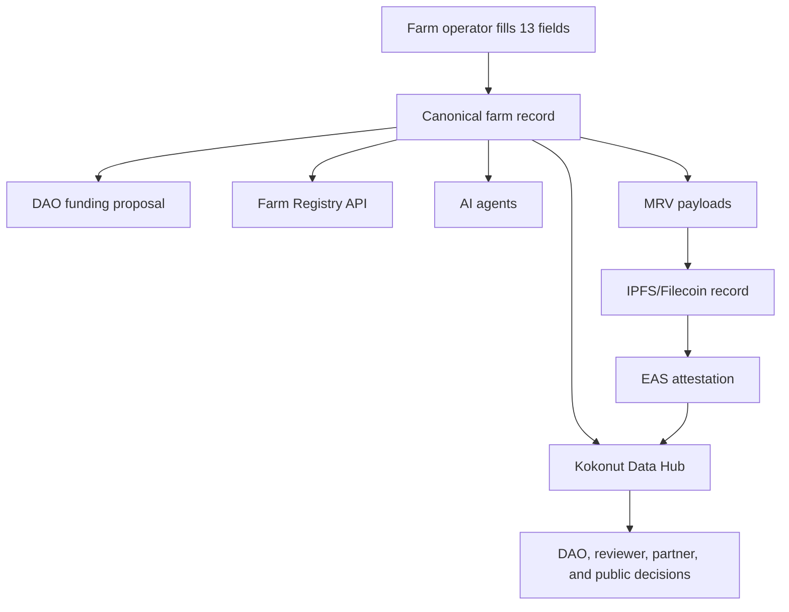
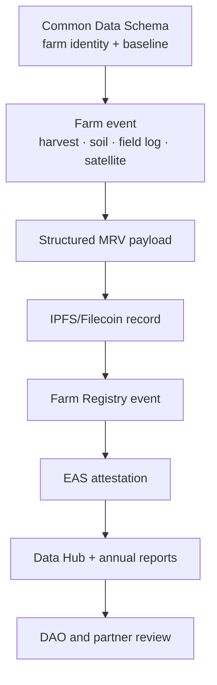

# The Common Data Schema is the farm record that enables Kokonut to scale.

Every Kokonut farm needs a shared baseline record before the network can fund, govern, verify, or compare it with other farms.

The **Common Data Schema** is that baseline. It is the minimum data contract between a farm and Kokonut Network: 13 required fields that describe the farm's location, budget, revenue model, governance, public goods allocation, local problem, proposed solution, and target market.

Without this schema, every farm becomes a one-off story. With it, DAO members, contributors, farm operators, grant reviewers, developers, AI agents, and the public can all inspect the same structured record.

<div style={{ display: "flex", gap: "12px", justifyContent: "center", flexWrap: "wrap", margin: "1.5rem 0 0.75rem" }}>
  <a href="#the-13-required-fields" style={{ display: "inline-flex", alignItems: "center", gap: "6px", background: "#009F4D", color: "#fff", padding: "10px 20px", borderRadius: "8px", fontWeight: "600", fontSize: "14px", textDecoration: "none" }}>
    See the 13 Fields →
  </a>

  <a href="#adelphi-reference-record" style={{ display: "inline-flex", alignItems: "center", gap: "6px", border: "1.5px solid #009F4D", color: "#009F4D", padding: "10px 20px", borderRadius: "8px", fontWeight: "600", fontSize: "14px", textDecoration: "none", background: "transparent" }}>
    See Adelphi Example
  </a>
</div>

<p style={{ textAlign: "center", fontSize: "13px", color: "#6b7280", marginTop: "0.25rem" }}>
  Use this page when registering a farm, drafting a farm funding proposal, building Farm Registry tools, reviewing DAO support, or connecting farm records to MRV evidence.
</p>

<div style={{ display: "grid", gridTemplateColumns: "repeat(auto-fit, minmax(130px, 1fr))", gap: "1px", background: "#e5e7eb", border: "1px solid #e5e7eb", borderRadius: "12px", overflow: "hidden", margin: "1.5rem 0" }}>
  <div style={{ background: "white", padding: "1rem", textAlign: "center" }}>
    <div style={{ fontSize: "1.4rem", fontWeight: "700", color: "#009F4D", lineHeight: 1 }}>13</div>
    <div style={{ fontSize: "0.72rem", color: "#6b7280", marginTop: "4px", fontWeight: "500" }}>required fields</div>
  </div>

  <div style={{ background: "white", padding: "1rem", textAlign: "center" }}>
    <div style={{ fontSize: "1.4rem", fontWeight: "700", color: "#009F4D", lineHeight: 1 }}>1</div>
    <div style={{ fontSize: "0.72rem", color: "#6b7280", marginTop: "4px", fontWeight: "500" }}>farm record</div>
  </div>

  <div style={{ background: "white", padding: "1rem", textAlign: "center" }}>
    <div style={{ fontSize: "1.4rem", fontWeight: "700", color: "#009F4D", lineHeight: 1 }}>5</div>
    <div style={{ fontSize: "0.72rem", color: "#6b7280", marginTop: "4px", fontWeight: "500" }}>system consumers</div>
  </div>

  <div style={{ background: "white", padding: "1rem", textAlign: "center" }}>
    <div style={{ fontSize: "1.4rem", fontWeight: "700", color: "#009F4D", lineHeight: 1 }}>MRV</div>
    <div style={{ fontSize: "0.72rem", color: "#6b7280", marginTop: "4px", fontWeight: "500" }}>evidence pipeline</div>
  </div>

  <div style={{ background: "white", padding: "1rem", textAlign: "center" }}>
    <div style={{ fontSize: "1.4rem", fontWeight: "700", color: "#009F4D", lineHeight: 1 }}>EAS</div>
    <div style={{ fontSize: "0.72rem", color: "#6b7280", marginTop: "4px", fontWeight: "500" }}>attestation anchor</div>
  </div>
</div>

<Warning>
  A farm with an incomplete schema record should not be treated as funding-ready. The schema is not just documentation; it is the baseline record that reviewers, APIs, dashboards, agents, and attestations depend on.
</Warning>

---

## Why the schema matters

The Common Data Schema turns a farm from an informal narrative into a structured, inspectable record.

| Without a common schema | With the Common Data Schema |
| --- | --- |
| Farm proposals are hard to compare | DAO members can compare farms by shared fields |
| Impact claims stay self-reported | MRV can attach evidence to a known farm record |
| Developers need custom logic per farm | APIs, dashboards, and agents can use the same structure |
| Governance decisions rely on long prose | Reviewers can inspect the budget, location, crops, governance, and public goods commitments quickly |
| Replication is difficult | New farms can reuse the same intake format |

The schema is the first layer of Kokonut's farm operating system. It does not prove impact on its own, but it makes impact evidence attachable to a consistent farm identity.

---

## What the schema powers

Once the 13 fields are populated, a single farm record can be used by multiple parts of Kokonut simultaneously.

| Consumer | How it uses the schema |
| --- | --- |
| DAO members | Review farm funding proposals and compare farms across location, budget, crop mix, governance, and public goods commitments. |
| Farm Registry API | Accepts and stores the farm record so other tools can query the same canonical data. |
| Kokonut Data Hub | Publicly displays the farm profile, metadata, harvest records, MRV events, and impact metrics. |
| AI agents | Query farm identity, location, crops, and governance context before forecasting, scoring, drafting, or monitoring. |
| EAS attestations | Anchor farm events to the correct`farm_id`, so evidence can be traced back to the farm record. |



<Note>
  The schema should be understood as the farm's identity layer. MRV then adds the evidence layer on top of it.
</Note>

---

## Who uses this page

<CardGroup cols={3}>
  <Card title="Farm operators" icon="seedling">
    Use the schema to prepare a farm record before requesting DAO support, registering the farm, or publishing it to the Data Hub.
  </Card>

  <Card title="DAO reviewers" icon="check-to-slot">
    Use the schema to assess whether a farm proposal provides sufficient comparable information to evaluate funding, governance, and risk.
  </Card>

  <Card title="Impact contributors" icon="magnifying-glass-chart">
    Use the schema to connect local problems, proposed solutions, public goods allocation, SDGs, and MRV commitments.
  </Card>

  <Card title="Developers" icon="code">
    Use the TypeScript interface and validation rules to build Farm Registry integrations, dashboards, agents, and import tools.
  </Card>

  <Card title="Grant reviewers" icon="clipboard-check">
    Use the schema to inspect whether a farm has a traceable funding source, measurable activity, and a public evidence path.
  </Card>

  <Card title="New farms" icon="map-location-dot">
    Use the Adelphi reference record as a concrete example before submitting your own farm intake.
  </Card>
</CardGroup>

---

## The 13 required fields

The schema is intentionally small. It captures only the minimum data needed to make a farm comparable, fundable, governable, and verifiable.

| Group | Field | Type | Required | What reviewers need to see |
| --- | --- | --- | --- | --- |
| Identity | Project Date | `Date` | Yes | Official Kokonut project start date in `YYYY-MM-DD` format. |
| Funding | Forecasted Budget | `Number` | Yes | Total estimated development budget in USD, with assumptions documented in the proposal. |
| Scope | Land Size | `Number` | Yes | Total land dedicated to agricultural activity, in square metres. |
| Identity | Project Location | `Coordinates` | Yes | Decimal latitude/longitude, plus region and country. |
| Funding | Source of Funding | `Text` | Yes | DAO proposal, grant, partner, or public goods funding source. |
| Production | Revenue Streams | `Multiselect` | Yes | Crop, product, or service revenue tags such as `lettuce`, `coconut`, or `poultry_eggs`. |
| Governance | Governance Mechanism | `Single Select` | Yes | How the farm will be governed: `moloch_dao`, `guilds`, `multisig`, or `cooperative`. |
| Governance | Token Allocation | `Richtext` | Yes | Narrative describing \$vKKN, Loot, operator share, DAO share, public goods share, or other governance logic. |
| Public goods | Public Goods Allocation | `Number` | Yes | Percentage of gross revenue allocated to public goods activities. Minimum Kokonut default: `10`. |
| Narrative | Project Summary | `Richtext` | Yes | Clear summary of location, land size, crop selection, forecast, governance, and impact logic. |
| Narrative | Local Problem | `Richtext` | Yes | The specific local problem the farm addresses. Name the place, people affected, and why it matters. |
| Narrative | Proposed Solution | `Richtext` | Yes | How the farm's production, infrastructure, education, jobs, or MRV workflow address the local problem. |
| Market | Target Market | `Multiselect` | Yes | Expected distribution channels such as `organic_markets`, `direct_community_sales`, or `local_supermarkets`. |

<Warning>
  Do not use generic placeholder text for `Local Problem`, `Proposed Solution`, or `Project Summary`. These fields explain why the farm deserves support, how it will be evaluated, and how its impact can be verified later.
</Warning>

---

## Field groups

### 1. Identity fields

These fields answer the questions: **Which farm is this, where is it, and when did it enter Kokonut?**

| Field | Validation guidance |
| --- | --- |
| Project Date | Use ISO 8601 format: `YYYY-MM-DD`. This should be the official Kokonut project registration/start date. |
| Project Location | Store coordinates in decimal latitude/longitude format. Include region and country for human readability. |

Example:

```json
{
  "project_date": "2024-01-15",
  "project_location": {
    "coordinates": "18.938879,-69.735003",
    "region": "Gonzalo, Sabana Grande de Boyá, Monte Plata",
    "country": "Dominican Republic"
  }
}
```

### 2. Scope and production fields

These fields answer: **What is the farm producing, and at what scale?**

| Field | Validation guidance |
| --- | --- |
| Land Size | Use square meters. If total land and agricultural area differ, include the agricultural area in the Project Summary. |
| Revenue Streams | Use lowercase underscore tags. Include crops, animal products, native plants, biochar, or other revenue sources. |
| Target Market | Use lowercase underscore tags for expected channels and add custom tags only when needed. |

Common `revenue_streams` values:

```text
lettuce · passion_fruit · coconut · poultry_eggs · biochar · indian_yam · tomato · broccoli · spinach · arugula · native_plants
```

Common `target_market` values:

```text
organic_markets · local_supermarkets · direct_community_sales · national_supermarkets · export
```

### 3. Funding and public goods fields

These fields answer: **What does the farm need, where did support come from, and what flows back to public goods?**

| Field | Validation guidance |
| --- | --- |
| Forecasted Budget | Use USD. Treat this as a planning estimate, not a guaranteed outcome or investment return. |
| Source of Funding | Include proposal numbers, grant names, or partner names wherever possible. |
| Public Goods Allocation | Use an integer percentage from 0 to 100. Kokonut's default minimum is 10%. |

<Note>
  Budget and revenue fields should distinguish forecasts from actuals. Forecasts help reviewers plan; actuals should be tracked through farm records, harvest logs, and MRV updates.
</Note>

### 4. Governance fields

These fields answer the questions: **Who governs the farm, and how are ownership, contributions, and public goods recognized?**

| Field | Accepted values or guidance |
| --- | --- |
| Governance Mechanism | `moloch_dao`, `guilds`, `multisig`, or `cooperative`. |
| Token Allocation | Explain how governance rights, Loot, operator shares, DAO shares, contributor recognition, or public goods allocations work. |

Governance values:

| Value | Use when... |
| --- | --- |
| `moloch_dao` | The farm is governed through the Kokonut Moloch DAO and DAO-approved funding proposals. |
| `guilds` | The farm or workstream is coordinated primarily through contribution-weighted Guild participation. |
| `multisig` | A defined group of signers manages execution or transitional governance. |
| `cooperative` | A traditional cooperative or local governance structure is the primary operating body. |

### 5. Narrative fields

These fields answer: **Why should this farm exist, and what problem does it solve?**

| Field | A good answer includes |
| --- | --- |
| Project Summary | Location, land size, farm type, production plan, governance model, funding source, and impact thesis. |
| Local Problem | Specific local economic, ecological, food, labor, gender, education, or infrastructure problem. |
| Proposed Solution | How farm operations, infrastructure, crops, community programs, MRV, and governance address the problem. |

These fields should be written clearly enough for a DAO member, grant reviewer, or local partner to understand without having to read the entire farm proposal.

---

## TypeScript interface

The canonical machine-readable representation of the Common Data Schema uses snake\_case fields.

```typescript
interface KokonutFarmRecord {
  // Identity
  project_date: string; // ISO 8601, e.g. "2024-01-15"
  project_location: {
    coordinates: string; // Decimal lat,lng, e.g. "18.938879,-69.735003"
    region: string; // Human-readable place name
    country: string; // Full country name
  };

  // Scope and production
  land_size: number; // Square metres
  revenue_streams: string[]; // e.g. ["lettuce", "coconut", "passion_fruit", "poultry_eggs"]
  target_market: string[]; // e.g. ["organic_markets", "local_supermarkets"]

  // Funding and public goods
  forecasted_budget: number; // USD
  source_of_funding: string; // e.g. "Kokonut DAO Proposal #12 / Public Nouns Proposal #69"
  public_goods_allocation: number; // Percentage 0–100

  // Governance
  governance_mechanism: "moloch_dao" | "guilds" | "multisig" | "cooperative";
  token_allocation: string; // Markdown-compatible rich text narrative

  // Narrative
  project_summary: string;
  local_problem: string;
  proposed_solution: string;
}
```

### JSON example

```json
{
  "project_date": "2024-01-15",
  "project_location": {
    "coordinates": "18.938879,-69.735003",
    "region": "Gonzalo, Sabana Grande de Boyá, Monte Plata",
    "country": "Dominican Republic"
  },
  "land_size": 15725,
  "revenue_streams": ["lettuce", "passion_fruit", "coconut", "poultry_eggs", "indian_yam", "biochar", "native_plants"],
  "target_market": ["organic_markets", "local_supermarkets", "direct_community_sales"],
  "forecasted_budget": 85000,
  "source_of_funding": "Kokonut DAO Proposal #12 / Public Nouns Proposal #69",
  "public_goods_allocation": 10,
  "governance_mechanism": "moloch_dao",
  "token_allocation": "70% DAO members · 20% farm operators · 10% public goods fund",
  "project_summary": "15,725 m² agro-ecological farm in Monte Plata, Dominican Republic.",
  "local_problem": "Economic hardship, food insecurity, environmental degradation, and gender inequality in the Monte Plata rural community.",
  "proposed_solution": "Regenerative agro-ecological production integrating soil restoration, biodiversity conservation, organic food production, community education, and public MRV."
}
```

---

## Adelphi reference record

[Adelphi](/ecosystem-wiki/kokonut-farms/adelphi/summary) is Kokonut Network's first live farm and the reference implementation for this schema.

| Field | Adelphi value |
| --- | --- |
| Project Date | `2024-01-15` |
| Forecasted Budget | `85000` USD |
| Land Size | `15725` m² |
| Project Location | `"18.938879,-69.735003"` · Gonzalo, Sabana Grande de Boyá, Monte Plata · Dominican Republic |
| Source of Funding | `"Kokonut DAO Proposal #12 / Public Nouns Proposal #69"` |
| Revenue Streams | `lettuce`, `passion_fruit`, `coconut`, `poultry_eggs`, `indian_yam`, `biochar`, `native_plants` |
| Governance Mechanism | `moloch_dao` |
| Token Allocation | 70% DAO members · 20% farm operators · 10% public goods fund |
| Public Goods Allocation | `10`% |
| Project Summary | 15,725 m² agro-ecological farm in Monte Plata, Dominican Republic, with organic vegetables, fruits, coconuts, public goods funding, and women-led operations. |
| Local Problem | Economic hardship, food insecurity, environmental degradation, and gender inequality in the Monte Plata rural community. |
| Proposed Solution | Regenerative agro-ecological production integrating soil restoration, biodiversity conservation, organic food production, and community education. |
| Target Market | `organic_markets`, `local_supermarkets`, `direct_community_sales` |

[Explore Adelphi live data →](https://hub.kokonut.network/projects/41)

---

## Validation checklist before a farm proposal

Before a farm submits a funding proposal, reviewers should be able to answer each question below.

| Check | Reviewer question |
| --- | --- |
| Identity | Can we identify the farm, location, start date, and operating context? |
| Scope | Do we know the land size, productive area, crop mix, and target market? |
| Budget | Is the forecasted budget specific enough to evaluate and to set milestones? |
| Funding source | Is the source of funding traceable to a grant, proposal, partner, or treasury request? |
| Governance | Is the governance mechanism clear enough to know who decides and who is accountable? |
| Token allocation | Are DAO members, operators, contributors, and public goods allocations explained? |
| Public goods | Is the public goods allocation percentage explicit? |
| Problem | Is the local problem specific, place-based, and relevant? |
| Solution | Does the proposed farm solution directly answer the stated problem? |
| MRV readiness | Can future farm events attach back to this record through `farm_id`? |

<Tip>
  A strong farm record is not necessarily long. It is specific, traceable, and structured enough for funding, operations, MRV, and governance to use the same source of truth.
</Tip>

---

## How the schema connects to MRV

The Common Data Schema defines the farm. MRV verifies what happens on the farm after registration.

| Schema layer | MRV dependency |
| --- | --- |
| `project_location` | Connects remote sensing, field logs, drone imagery, and satellite indices to the correct place. |
| `revenue_streams` | Helps match harvest records and production forecasts to the correct crops or products. |
| `governance_mechanism` | Determines who reviews evidence, approves changes, and responds to risks. |
| `source_of_funding` | Links evidence back to the proposal, grant, or DAO decision that funded the work. |
| `public_goods_allocation` | Let the network track whether farm revenue supports public goods commitments. |
| `local_problem` and `proposed_solution` | Provide the narrative baseline that SDG and impact reporting can evaluate over time. |



---

## Schema governance and backward compatibility

The Common Data Schema is a root data contract. Farm records, APIs, dashboards, AI agents, and attestations depend on these field names and types.

Changing the schema requires a **Framework Upgrade Proposal** because schema changes can affect live farms, MRV payloads, Data Hub queries, and agent behavior.

Any breaking change must include:

1. A migration plan for currently registered farms
2. A dual-write period where old and new formats are accepted
3. A cutover date after which the old format is no longer accepted
4. Documentation updates for farm operators, developers, and proposal authors
5. A passed DAO vote before the change becomes active

<Warning>
  Additive optional fields are lower-risk, but they still require documentation and governance review. Required field changes, field renames, or type changes should be treated as high sensitivity.
</Warning>

[Use the Framework Upgrade Proposal Template →](/ecosystem-wiki/the-kokonut-dao/proposal-templates#framework-upgrade-proposal)

---

## Common mistakes to avoid

| Mistake | Why does it create risk |
| --- | --- |
| Using vague location descriptions | Remote sensing, field logs, and farm events cannot reliably attach to the farm. |
| Treating forecasted budget as guaranteed performance | Forecasts are planning tools and must be refined against actuals. |
| Omitting the source of funding | Reviewers cannot trace the farm back to the proposal, grant, or treasury decision that supported it. |
| Writing generic local problems | The DAO cannot evaluate whether the proposed solution fits the community context. |
| Mixing \$vKKN, Loot, and Guild Points without explanation | Governance, capital, and contribution recognition become confusing. |
| Changing field names casually | APIs, agents, attestations, and dashboards may break. |

---

## Next steps

<CardGroup cols={2}>
  <Card title="Farm Funding Proposal Template" icon="seedling" href="/ecosystem-wiki/the-kokonut-dao/proposal-templates#farm-funding-proposal">
    Use the schema in a DAO-ready farm funding proposal, including budget, milestones, MRV commitments, and public goods allocation.
  </Card>

  <Card title="MRV Methodology" icon="magnifying-glass-chart" href="/ecosystem-wiki/kokonut-farms/measurement-reporting-and-verification">
    See how farm records become verifiable evidence through payloads, IPFS, Farm Registry events, EAS attestations, and the Data Hub.
  </Card>

  <Card title="Kokonut Framework Introduction" icon="scroll" href="/kokonut-framework/Introduction">
    Understand how this schema fits into Kokonut's larger system for comparable, fundable, governable, and verifiable farms.
  </Card>

  <Card title="Adelphi Summary" icon="seedling" href="/ecosystem-wiki/kokonut-farms/adelphi/summary">
    Review the first live Kokonut farm using the schema in practice.
  </Card>

  <Card title="Proposal Templates" icon="file-lines" href="/ecosystem-wiki/the-kokonut-dao/proposal-templates">
    Choose the right proposal type before requesting farm funding, Guild work, Framework changes, or partnerships.
  </Card>

  <Card title="Adelphi Data Hub" icon="chart-line" href="https://hub.kokonut.network/projects/41">
    Inspect the live reference farm record and its connected MRV and impact data.
  </Card>
</CardGroup>

<div style={{ display: "flex", gap: "12px", justifyContent: "center", flexWrap: "wrap", margin: "2rem 0 0.75rem" }}>
  <a href="/ecosystem-wiki/the-kokonut-dao/proposal-templates#farm-funding-proposal" style={{ display: "inline-flex", alignItems: "center", gap: "6px", background: "#009F4D", color: "#fff", padding: "10px 20px", borderRadius: "8px", fontWeight: "600", fontSize: "14px", textDecoration: "none" }}>
    Use the Farm Funding Template →
  </a>

  <a href="https://hub.kokonut.network/projects/41" style={{ display: "inline-flex", alignItems: "center", gap: "6px", border: "1.5px solid #009F4D", color: "#009F4D", padding: "10px 20px", borderRadius: "8px", fontWeight: "600", fontSize: "14px", textDecoration: "none", background: "transparent" }}>
    Explore Adelphi Data
  </a>
</div>