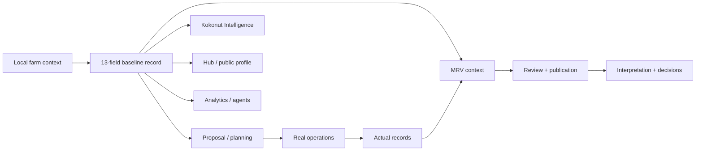
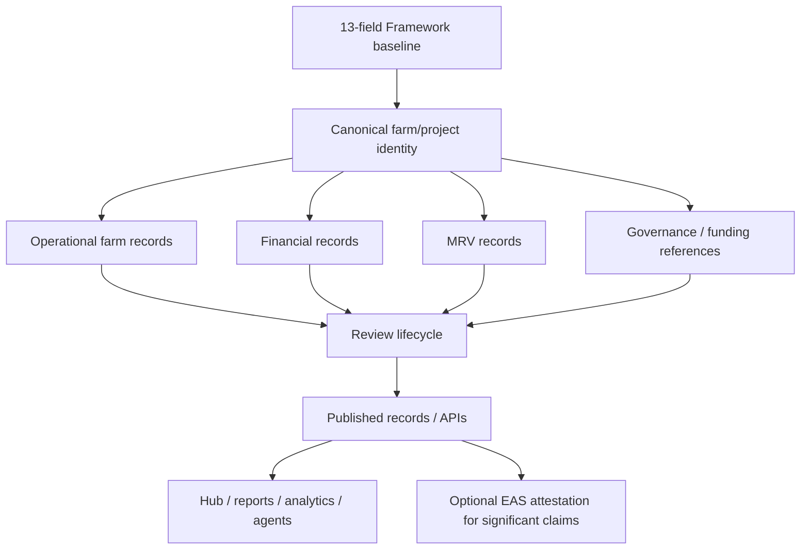

# The Common Data Schema gives each farm a compatible baseline record.

The Common Data Schema is the Framework's current **13-field farm descriptor**.

It gives Kokonut farms a shared structure for recording:

- identity and location;
- land scope;
- funding context;
- production and market assumptions;
- coordination / governance context;
- public-goods assumptions;
- the local problem and proposed intervention.

Its purpose is to make farm records easier to:

- compare;
- review;
- connect to proposals;
- ingest into data systems;
- link to MRV;
- publish through compatible interfaces;
- use in analytics and agent workflows.

It does **not** make a farm automatically:

- approved;
- funded;
- governed by the Moloch DAO;
- scientifically verified;
- investment-ready;
- profitable;
- compliant;
- impactful.

> **A common schema reduces ambiguity. It does not replace evidence, judgment, local authority, or review.**

<CardGroup cols={2}>
  <Card title="See the 13 fields" icon="database" href="#the-current-13-field-contract">
    Review the current compatibility-sensitive field names, types, and safer semantics.
  </Card>

  <Card title="Understand the Framework" icon="scroll" href="/kokonut-framework/Introduction">
    See why the schema is a shared baseline rather than a universal farm template.
  </Card>

  <Card title="Connect records to MRV" icon="magnifying-glass-chart" href="/ecosystem-wiki/kokonut-farms/measurement-reporting-and-verification">
    Follow the evidence lifecycle from source observation through review, publication, optional attestation, and interpretation.
  </Card>

  <Card title="Build against the schema" icon="code" href="/build-with-kokonut">
    Use the current field names when building integrations and preserve compatibility when shared primitives change.
  </Card>
</CardGroup>

<Info>
  **Required means structurally required in the current baseline contract.** It does not mean the value is automatically correct, current, evidence-backed, approved, or suitable for every downstream decision.
</Info>

---

## The schema in one sentence

> **Describe the farm consistently enough that different people and systems can refer to the same baseline without pretending the baseline is the whole farm.**


```mermaid
flowchart LR
    A["Local farm context"] --> B["13-field baseline record"]
    B --> C["Proposal / planning"]
    B --> D["Kokonut Intelligence"]
    B --> E["Hub / public profile"]
    B --> F["MRV context"]
    B --> G["Analytics / agents"]

    C --> H["Real operations"]
    H --> I["Actual records"]
    I --> F
    F --> J["Review + publication"]
    J --> K["Interpretation + decisions"]
```

The schema establishes the baseline.

Operational records establish what happened afterward.

---

## What the schema is — and what it is not

| The schema is | The schema is not |
| --- | --- |
| A shared baseline descriptor | A complete farm-management database |
| A compatibility contract | A funding approval |
| A structured intake record | A scientific methodology |
| Context for proposals and review | A substitute for farm due diligence |
| Context for MRV events | An MRV event itself |
| A stable set of field names for integrations | Proof that every field is current forever |
| A common comparison surface | Proof that two farms are directly comparable in every respect |
| A way to expose assumptions | A guarantee that assumptions will become actuals |

<Warning>
  **Do not collapse baseline data and operational evidence.** A farm can have a complete 13-field record while still lacking harvest actuals, audited economics, ecological baselines, work-quality evidence, approved economic agreements, or scientific validation.
</Warning>

---

## The current 13-field contract

The field names below are shared with the current builder documentation and should be treated as **compatibility-sensitive**.

| Group | Field | Current type | Semantic class | What it should communicate |
| --- | --- | --- | --- | --- |
| Identity | `project_date` | `string` | Documented date | A clearly defined project date, with the meaning of that date documented |
| Identity | `project_location` | object | Documented baseline | Coordinates + human-readable region/country, subject to appropriate privacy |
| Scope | `land_size` | `number` | Documented baseline | Land area in m², with the measurement basis made explicit |
| Scope | `revenue_streams` | `string[]` | Design / operating context | Planned or active products/services, without implying realized revenue |
| Scope | `target_market` | `string[]` | Market hypothesis | Intended channels unless actual buyer/market evidence exists |
| Funding | `forecasted_budget` | `number` | Forecast | Estimated development budget in USD |
| Funding | `source_of_funding` | `string` | Funding context | Proposal, grant, partner, treasury, or other funding references and status |
| Funding | `public_goods_allocation` | `number` | Economic assumption / arrangement | Percentage from 0–100; no universal Kokonut minimum should be inferred |
| Governance | `governance_mechanism` | `string` | Coordination context | Relevant decision / authorization structures, without implying one actor governs everything |
| Governance | `token_allocation` | `string` | Economic/governance narrative | Applicable token/economic arrangements, or an explicit statement that none applies |
| Narrative | `project_summary` | `string` | Context | Concise farm description and current thesis |
| Narrative | `local_problem` | `string` | Baseline / problem thesis | The place-specific problem the intervention is intended to address |
| Narrative | `proposed_solution` | `string` | Intervention thesis | What the farm proposes to do in response |

### The field names are stable; their interpretation still requires context

Some current fields are intentionally broad.

That creates compatibility, but also creates ambiguity that documentation must manage.

Examples:

- `project_date` does not itself distinguish registration date, project start, land-preparation start, or first production date;
- `land_size` does not itself distinguish total mapped area from productive/agricultural area;
- `source_of_funding` can contain proposed, approved, and received funding unless the supporting record clarifies status;
- `governance_mechanism` cannot fully express Kokonut's plural authority model in one scalar string;
- `token_allocation` may not apply to every farm;
- `public_goods_allocation` does not tell readers whether a percentage is merely modeled, formally approved, or already realized.

> **Until a future compatible schema version represents those distinctions explicitly, the surrounding evidence and narrative must make them visible.**

---

## Field-by-field guidance

### 1. `project_date`

Use ISO 8601:

```text
YYYY-MM-DD
```

The supporting record should state what the date means.

Examples:

- registration date;
- approved project start;
- operating start;
- another clearly defined milestone.

Do not silently change the meaning of `project_date` between farms.

---

### 2. `project_location`

Current shape:

```typescript
project_location: {
  coordinates: string;
  region: string;
  country: string;
}
```

Use decimal latitude/longitude when appropriate.

The human-readable region and country remain important because coordinates alone do not communicate:

- jurisdiction;
- community context;
- watershed / ecological context;
- local operating environment.

<Note>
  Exact coordinates can be operationally or socially sensitive in some contexts. The canonical governed record and the public rendering do not always need identical location precision. Privacy, consent, land-security, and partner requirements should be considered before publishing exact coordinates.
</Note>

---

### 3. `land_size`

Use square metres.

The critical requirement is to define **what area the number represents**.

For example:

- total mapped property;
- agricultural area;
- active production area;
- area under agreement.

Adelphi demonstrates why this matters:

| Adelphi reference | Documented value |
| --- | ---: |
| Total mapped area | **15,725 m²** |
| Agricultural area | **13,838 m²** |

A downstream system should therefore **not assume that `land_size` always means productive area**.

If more than one area matters, preserve the compatibility field and document the additional area in the supporting record until the schema evolves.

---

### 4. `revenue_streams`

Use stable machine-readable tags where possible.

Examples from current Kokonut farm documentation include:

```text
lettuce
passion_fruit
coconut
poultry_eggs
```

A revenue-stream tag can mean:

- planned production;
- active production;
- modeled revenue source;
- realized sales stream.

The 13-field schema does not currently encode that status.

Do not infer realized revenue from the presence of a tag.

---

### 5. `target_market`

This field describes intended market channels.

Examples can include:

```text
organic_markets
local_supermarkets
direct_community_sales
```

A target market is **not a buyer contract**.

Stronger market claims require evidence such as:

- signed agreements;
- purchase orders;
- invoices;
- realized sales;
- recurring buyer records.

---

### 6. `forecasted_budget`

Use USD in the current contract.

This is a **planning estimate**.

It should be traceable to a budget or proposal that explains:

- line items;
- quantities;
- assumptions;
- recipients/vendors where known;
- contingencies;
- milestones.

A forecasted budget is not:

- money already received;
- money already spent;
- a guaranteed project cost;
- a guaranteed return.

Actual spending belongs in operational financial records.

---

### 7. `source_of_funding`

Use this field to identify the relevant funding source or request.

Prefer references that can be inspected:

- proposal number;
- grant name;
- funding partner;
- treasury request;
- agreement reference.

Also distinguish the funding **status** in the supporting record:

- requested;
- approved;
- received;
- partially received;
- spent / disbursed.

For Adelphi, **Public Nouns Proposal #69** is corroborated across the current Knowledge Base as a major funding milestone.

The older schema example also named “Kokonut DAO Proposal #12,” but that reference is not corroborated elsewhere in the current repository and should not be repeated here as authoritative farm history.

---

### 8. `public_goods_allocation`

Current type:

```typescript
public_goods_allocation: number; // percentage 0–100
```

The schema does **not** establish a universal minimum percentage.

Use the percentage that applies to the specific farm's current scenario or approved arrangement.

If no allocation is planned, `0` is more truthful than inventing one.

If an allocation exists, supporting evidence should identify whether it is:

- a planning assumption;
- a proposal commitment;
- an approved agreement;
- a realized distribution.

<Warning>
  **Do not treat 10% as a universal Kokonut rule.** Adelphi's current farm model uses a 10% public-goods assumption, while other repository material contains a conflicting historical 40/40/20 allocation model. The authoritative economic arrangement still needs reconciliation.
</Warning>

---

### 9. `governance_mechanism`

The current builder interface defines this field as a **string**, not a closed enum.

That matters.

Older schema text presented:

- `moloch_dao`;
- `guilds`;
- `multisig`;
- `cooperative`;

as if exactly one value explained who governs the farm.

That does not match Kokonut's current authority model.

A farm can simultaneously involve:

- local operators for day-to-day agricultural execution;
- a legal owner / cooperative / operating entity;
- Moloch governance for shared treasury capital;
- Guilds for contributor coordination;
- a SAFE or multisig for defined execution;
- Framework/domain reviewers for shared methodology.

Use `governance_mechanism` as a **coordination-context summary**, not as a claim that one layer owns every decision.

Example:

```text
local_operator; moloch_capital_governance; guild_contribution_coordination
```

<Info>
  **Moloch governance can authorize shared capital without becoming the farm operator.** The schema should preserve that distinction.
</Info>

---

### 10. `token_allocation`

This legacy-compatible field is a narrative string.

It should describe only the token/economic arrangement that actually applies.

Possible contents include:

- applicable \$vKKN relationship;
- Loot recognition if relevant;
- another documented economic arrangement;
- `not_applicable` / “no farm-level token allocation” when no such allocation exists.

Do **not** use this field to imply:

- land title;
- ownership of individual trees;
- automatic farm revenue rights;
- automatic Guild Points;
- automatic Loot;
- farm-management authority.

The previous Adelphi example stated:

> 70% DAO members · 20% farm operators · 10% public goods fund

That split appears only on the old schema page and is not corroborated elsewhere in the current repository, so it should not be retained as an authoritative Adelphi value.

---

### 11. `project_summary`

Keep this concise enough to scan and specific enough to orient a reviewer.

A useful summary identifies:

- place;
- farm/operator context;
- land basis;
- production model;
- current Framework phase where relevant;
- funding context;
- major assumptions;
- evidence/publication surface.

Do not hide unresolved assumptions inside promotional language.

---

### 12. `local_problem`

This is a **problem thesis**, not proof that the farm solved the problem.

A strong entry defines:

- place;
- affected group(s);
- observed condition;
- available baseline evidence;
- why the problem matters to the proposed intervention.

Avoid vague claims such as:

> “The community needs sustainability.”

Prefer claims that can later be evaluated against actual evidence.

---

### 13. `proposed_solution`

This is an **intervention thesis**.

It should explain what the farm intends to do:

- agricultural production;
- infrastructure;
- regenerative practices;
- training;
- market development;
- evidence/MRV;
- public-goods activities.

It should not describe projected outcomes as if they already happened.

---

## Canonical TypeScript shape

The current builder documentation defines the shared interface as:

```typescript
interface KokonutFarmRecord {
  project_date: string;
  project_location: {
    coordinates: string;
    region: string;
    country: string;
  };
  land_size: number;
  revenue_streams: string[];
  target_market: string[];
  forecasted_budget: number;
  source_of_funding: string;
  public_goods_allocation: number;
  governance_mechanism: string;
  token_allocation: string;
  project_summary: string;
  local_problem: string;
  proposed_solution: string;
}
```

When building integrations, key against these field names unless an approved compatible migration says otherwise.

### Important: the 13 fields are not the whole record envelope

A production data system should usually know more than these 13 values.

Useful implementation metadata can include:

- stable farm/project ID;
- schema version;
- record lifecycle state;
- created / updated timestamps;
- source references;
- reviewer / publisher;
- evidence pointers;
- access/privacy classification.

Those are **implementation metadata recommendations**, not additional fields in the current 13-field Framework contract.

Do not silently add them to the canonical interface and call the result backward-compatible.

---

## Record quality has multiple levels

A farm record should not be treated as “good” merely because JSON validation passed.

| Quality level | Question |
| --- | --- |
| **Syntactically valid** | Are all current fields present with usable types? |
| **Semantically clear** | Does each field have an unambiguous meaning in this farm context? |
| **Source-linked** | Can material values be traced to proposals, maps, budgets, agreements, or operating records? |
| **Reviewed** | Has an authorized reviewer/process checked the record? |
| **Published** | Is the record available to approved downstream dashboards/APIs/reporting surfaces? |
| **Current** | Has changeable information been refreshed when reality changed? |

This aligns with Kokonut Intelligence's broader record lifecycle.

A `Verified` workflow state means internal authorized review.

It is **not** scientific certification or regulatory approval.

---

## How the schema connects to Kokonut Intelligence

The Common Data Schema defines a shared farm baseline.

[Kokonut Intelligence](/kokonut-intelligence) can operationalize that baseline alongside:

- harvests;
- expenses;
- sales;
- field notes;
- soil samples;
- MRV events;
- attestations;
- analytics;
- reports;
- agent logs.

The relationship is:


```mermaid
flowchart TD
    A["13-field Framework baseline"] --> B["Canonical farm/project identity"]
    B --> C["Operational farm records"]
    B --> D["Financial records"]
    B --> E["MRV records"]
    B --> F["Governance / funding references"]

    C --> G["Review lifecycle"]
    D --> G
    E --> G
    F --> G

    G --> H["Published records / APIs"]
    H --> I["Hub / reports / analytics / agents"]
    H --> J["Optional EAS attestation for significant claims"]
```

The schema helps systems refer to the same farm.

It does not require every operational record to live inside the 13-field object.

---

## How the schema connects to MRV

The baseline record gives MRV essential context.

| Baseline field | MRV / evidence use |
| --- | --- |
| `project_location` | Connects observations to the correct place |
| `land_size` | Provides area context; does not replace plot-level geometry |
| `revenue_streams` | Provides production context for later crop/product records |
| `source_of_funding` | Connects milestones to the funding context |
| `public_goods_allocation` | Defines an economic hypothesis/commitment that later transfer records can test |
| `local_problem` | Establishes the problem thesis |
| `proposed_solution` | Establishes the intervention thesis |

The current MRV sequence is:

> **observe → structure → review → publish → attest when useful → interpret**

Not:

> baseline schema → automatic impact proof

---

## Adelphi: use as a reference mapping, not a copy-paste record

Adelphi is the first live Framework reference implementation.

Some values are strongly corroborated across the current Knowledge Base.

Others on the old schema page were legacy examples that should not be repeated as current authoritative facts without a primary source.

| Schema area | Current safe Adelphi reference | Evidence status / caution |
| --- | --- | --- |
| Location | Gonzalo / Sabana Grande de Boyá area, Monte Plata, Dominican Republic | Documented context |
| Land | **15,725 m² total mapped; 13,838 m² agricultural** | Both are documented; `land_size` basis must be explicit |
| Funding source | **Public Nouns Proposal #69** | Corroborated major funding milestone |
| Production | Lettuce, passion fruit, coconut, poultry/eggs among documented/model streams | Planned/operating status should be checked against current Hub records |
| Governance context | Local founders/operators + shared Kokonut coordination/capital infrastructure | Do not reduce farm authority to `moloch_dao` |
| Public-goods allocation | **10% in current farm model** | Modeling assumption; conflicts with historical 40/40/20 docs |
| Token allocation | **Do not restate 70/20/10** | Old value is not corroborated elsewhere |
| Forecasted budget | **Do not restate $85,000 as authoritative here** | Old value appears only on the legacy schema page |
| Current actuals | Use the Kokonut Hub | Changeable operating state belongs in current published records |

<Card title="Inspect current Adelphi records" icon="chart-line" href="https://hub.kokonut.network/projects/41">
  Use the Hub for current published farm records rather than treating a static example in this schema page as a live database snapshot.
</Card>

---

## Example record shape

This example demonstrates structure and semantics.

It is **not an Adelphi claim**.

```json
{
  "project_date": "2026-01-15",
  "project_location": {
    "coordinates": "18.000000,-69.000000",
    "region": "Example Region",
    "country": "Dominican Republic"
  },
  "land_size": 10000,
  "revenue_streams": [
    "vegetables",
    "fruit",
    "poultry_eggs"
  ],
  "target_market": [
    "direct_community_sales",
    "local_markets"
  ],
  "forecasted_budget": 50000,
  "source_of_funding": "Example grant — requested; Example treasury proposal — draft",
  "public_goods_allocation": 0,
  "governance_mechanism": "local_operator; shared_capital_governance_if_approved",
  "token_allocation": "not_applicable",
  "project_summary": "Illustrative farm record used only to demonstrate the current schema shape.",
  "local_problem": "Example place-specific baseline problem supported by a separate source record.",
  "proposed_solution": "Example intervention thesis; outcomes are not yet claimed."
}
```

<Note>
  Placeholder/example values should never be copied into a live farm record merely to satisfy required fields.
</Note>

---

## Validation before downstream use

Different uses require different levels of confidence.

### Before proposal review

Confirm:

- [ ] all 13 fields are present;
- [ ] project date meaning is clear;
- [ ] land-area basis is clear;
- [ ] budget is labeled as forecast;
- [ ] funding references and status are traceable;
- [ ] market channels are not presented as buyer contracts;
- [ ] local operator authority is visible;
- [ ] governance/capital layers are not conflated;
- [ ] token/economic arrangements are not invented;
- [ ] public-goods percentage is farm-specific and its status is clear;
- [ ] problem and solution are place-specific;
- [ ] material assumptions link to supporting records.

### Before publication

Also confirm:

- [ ] sensitive location data is appropriate to publish;
- [ ] the record passed the applicable review workflow;
- [ ] forecasts and actuals are visibly separated;
- [ ] stale values were refreshed;
- [ ] public claims do not exceed the evidence;
- [ ] downstream systems know which schema version/contract they are consuming.

### Before cross-farm comparison

Also confirm that fields mean the same thing.

For example:

- total mapped land should not be compared directly with productive land;
- forecast budget should not be compared with actual spend;
- planned market channels should not be compared with realized buyers;
- modeled public-goods allocation should not be compared with actual transfers.

> **Comparable field names do not guarantee comparable semantics.**

---

## Schema governance and compatibility

The Common Data Schema is a shared primitive.

Changes can affect:

- farm intake;
- existing records;
- Kokonut Intelligence;
- Hub displays;
- proposal tooling;
- MRV joins;
- analytics;
- agents;
- partner integrations.

That means changes should be proportional to their risk.

| Change | Typical treatment |
| --- | --- |
| Documentation clarification with no semantic/type change | Normal documentation review |
| New optional extension outside the 13-field contract | Technical/domain review + compatibility note |
| Semantic change to an existing field | Issue + affected-reviewer analysis + migration plan |
| New required field | Breaking-change treatment |
| Field rename / removal | Breaking-change treatment |
| Type change | Breaking-change treatment |

### For material or breaking schema changes

Document:

1. the problem being solved;
2. current field behavior;
3. proposed new behavior;
4. affected farms and systems;
5. backward-compatibility impact;
6. migration strategy;
7. dual-read / dual-write period if needed;
8. validation/tests;
9. rollout and rollback plan;
10. documentation changes.

Then route the change through the current [Framework and Methodology Change Proposal](/ecosystem-wiki/the-kokonut-dao/proposal-templates#framework-and-methodology-change-proposal) process when the change is material enough to require formal Framework authorization.

<Info>
  **A Moloch vote is not automatically required for every schema change.** Treasury funding or a binding DAO-level action may require Moloch authorization, while technical/methodology compatibility belongs first with the affected Framework and domain reviewers.
</Info>

---

## Common mistakes

| Mistake | Better approach |
| --- | --- |
| “All 13 fields are filled, so the farm is funding-ready.” | Treat schema completeness as intake readiness only; conduct budget, operator, risk, legal, evidence, and proposal review separately |
| Treating `moloch_dao` as the farm's operating authority | Describe local operator authority separately from capital governance |
| Using a universal 10% public-goods rule | Record the farm-specific scenario or approved arrangement |
| Copying Adelphi's old 70/20/10 token example | Use the actual current agreement or `not_applicable` |
| Treating target markets as buyers | Separate market hypothesis from contracts and sales |
| Treating revenue streams as realized revenue | Connect actual sales to operational records |
| Using one `land_size` value without defining its basis | State whether it means mapped, agricultural, active-production, or another area |
| Publishing exact coordinates automatically | Evaluate privacy, consent, land-security, and disclosure requirements |
| Putting every farm event into the baseline record | Keep dynamic operations in operational/MRV records |
| Changing a field name without migration planning | Treat shared field names as compatibility-sensitive |

---

## Who should use the schema

<CardGroup cols={2}>
  <Card title="Farm operators" icon="tractor">
    Establish the shared baseline without surrendering local operating authority.
  </Card>

  <Card title="Proposal authors & capital reviewers" icon="file-signature">
    Use the record as structured context, then evaluate budget, milestones, risks, authority, and evidence separately.
  </Card>

  <Card title="Impact & MRV reviewers" icon="magnifying-glass-chart">
    Use the baseline to understand the problem/intervention context before evaluating operational evidence.
  </Card>

  <Card title="Developers" icon="code">
    Preserve current field names, separate baseline from operational events, and document migration when shared semantics change.
  </Card>

  <Card title="Kokonut Intelligence contributors" icon="database">
    Use the schema as farm/project baseline context inside a broader governed record lifecycle.
  </Card>

  <Card title="Future farm founders" icon="seedling">
    Reuse the structure, not Adelphi's economic, governance, species, or market assumptions.
  </Card>
</CardGroup>

---

## Continue through the Framework

<CardGroup cols={2}>
  <Card title="Framework Introduction" icon="scroll" href="/kokonut-framework/Introduction">
    Return to the interoperability model and the boundary between shared methodology and local implementation.
  </Card>

  <Card title="Pillars of Value" icon="square-poll-vertical" href="/kokonut-framework/framework-components/pillars-of-value">
    Ask what value is intended, who benefits, how much, what the farm contributes, what can fail, and what public goods are involved.
  </Card>

  <Card title="Farm Funding Proposal" icon="seedling" href="/ecosystem-wiki/the-kokonut-dao/proposal-templates#farm-funding-proposal">
    Turn the baseline record into a scoped capital request with budget, authority, milestones, evidence, and closeout.
  </Card>

  <Card title="MRV Methodology" icon="magnifying-glass-chart" href="/ecosystem-wiki/kokonut-farms/measurement-reporting-and-verification">
    See how dynamic farm activity becomes evidence after the baseline is established.
  </Card>

  <Card title="Kokonut Intelligence" icon="database" href="/kokonut-intelligence">
    See how farm baselines, operational records, review states, analytics, and attestations fit into active data infrastructure.
  </Card>

  <Card title="Build with Kokonut" icon="code" href="/build-with-kokonut">
    Use the shared data primitives without silently breaking compatibility.
  </Card>
</CardGroup>

> **A good farm schema does not tell the whole story. It makes the important parts of the story explicit enough that evidence, operations, governance, and software can refer to the same farm without inventing what the record does not say.**
