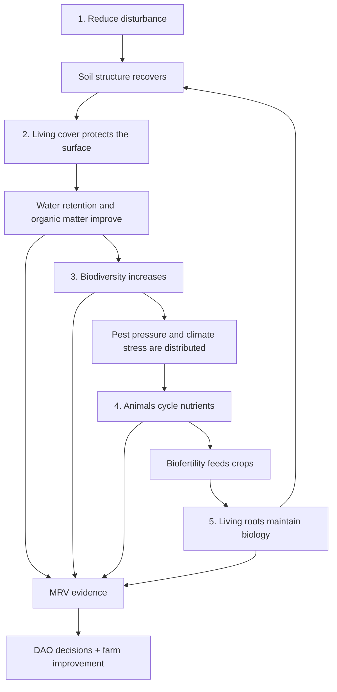
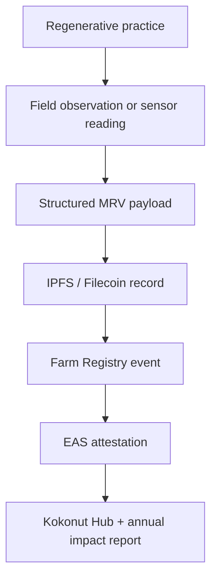

# The 5 Principles turn regenerative intent into farm practice.

The Kokonut Framework uses the **5 Principles of Regeneration** as the operating standard for every farm in the network. They are not a rigid recipe. They are a practical checklist for designing farms that improve soil, biodiversity, water retention, food production, and long-term community resilience.

Each farm can apply the principles differently depending on climate, soil, slope, crops, labor, livestock, and local market conditions. What matters is that each principle is addressed, documented, and measured.

<div style={{ display: "flex", gap: "12px", justifyContent: "center", flexWrap: "wrap", margin: "1.5rem 0 0.75rem" }}>
  <a href="#the-five-principles-at-a-glance" style={{ display: "inline-flex", alignItems: "center", gap: "6px", background: "#009F4D", color: "#fff", padding: "10px 20px", borderRadius: "8px", fontWeight: "600", fontSize: "14px", textDecoration: "none" }}>
    See the Five Principles →
  </a>

  <a href="/ecosystem-wiki/kokonut-farms/adelphi/crops-biodiversity-and-infrastructure" style={{ display: "inline-flex", alignItems: "center", gap: "6px", border: "1.5px solid #009F4D", color: "#009F4D", padding: "10px 20px", borderRadius: "8px", fontWeight: "600", fontSize: "14px", textDecoration: "none", background: "transparent" }}>
    See Them at Adelphi
  </a>
</div>

<p style={{ textAlign: "center", fontSize: "13px", color: "#6b7280", marginTop: "0.25rem" }}>
  Built for farm founders, DAO reviewers, agronomists, Impact Guild contributors, MRV builders, and community members evaluating whether a farm is truly regenerative.
</p>

<div style={{ display: "grid", gridTemplateColumns: "repeat(auto-fit, minmax(120px, 1fr))", gap: "1px", background: "#e5e7eb", border: "1px solid #e5e7eb", borderRadius: "12px", overflow: "hidden", margin: "1.5rem 0" }}>
  <div style={{ background: "white", padding: "1rem", textAlign: "center" }}>
    <div style={{ fontSize: "1.35rem", fontWeight: "700", color: "#009F4D", lineHeight: 1 }}>5</div>
    <div style={{ fontSize: "0.72rem", color: "#6b7280", marginTop: "4px", fontWeight: "500" }}>regeneration principles</div>
  </div>

  <div style={{ background: "white", padding: "1rem", textAlign: "center" }}>
    <div style={{ fontSize: "1.35rem", fontWeight: "700", color: "#009F4D", lineHeight: 1 }}>2</div>
    <div style={{ fontSize: "0.72rem", color: "#6b7280", marginTop: "4px", fontWeight: "500" }}>Adelphi syntropic plots</div>
  </div>

  <div style={{ background: "white", padding: "1rem", textAlign: "center" }}>
    <div style={{ fontSize: "1.35rem", fontWeight: "700", color: "#009F4D", lineHeight: 1 }}>110</div>
    <div style={{ fontSize: "0.72rem", color: "#6b7280", marginTop: "4px", fontWeight: "500" }}>free-range hens</div>
  </div>

  <div style={{ background: "white", padding: "1rem", textAlign: "center" }}>
    <div style={{ fontSize: "1.35rem", fontWeight: "700", color: "#009F4D", lineHeight: 1 }}>12+</div>
    <div style={{ fontSize: "0.72rem", color: "#6b7280", marginTop: "4px", fontWeight: "500" }}>at-risk species</div>
  </div>

  <div style={{ background: "white", padding: "1rem", textAlign: "center" }}>
    <div style={{ fontSize: "1.35rem", fontWeight: "700", color: "#009F4D", lineHeight: 1 }}>MRV</div>
    <div style={{ fontSize: "0.72rem", color: "#6b7280", marginTop: "4px", fontWeight: "500" }}>evidence layer</div>
  </div>
</div>

<Note>
  The principles are an operating standard, not a universal prescription. A tropical farm in the Dominican Republic will implement them differently than a temperate farm, a flatland farm, or a cattle-based operation. Kokonut evaluates whether each principle is addressed and evidenced, not whether every farm uses the same technique.
</Note>

---

## The five principles at a glance

| Principle | Core question | What reviewers should look for | Example evidence |
| --- | --- | --- | --- |
| 1 — Reduce soil disturbance | Is the farm protecting soil structure and biology? | No-till or low-disturbance practices, reduced synthetic inputs, biological fertility plan | Soil EC, field logs, input records, bed-preparation records |
| 2 — Keep soil covered | Is bare soil minimized across the year? | Living cover, mulch, cover crops, terracing, erosion control | Soil moisture, visual inspections, ground-cover records |
| 3 — Increase biodiversity | Is the farm becoming more diverse at the crop, tree, habitat, and microbial levels? | Multi-species planting, agroforestry, conservation nursery, crop rotation | Species count, satellite indices, Silvi records, biodiversity surveys |
| 4 — Integrate animals | Are animals part of nutrient cycling rather than separate from the farm system? | Poultry, grazing, manure processing, forage loops, pest management | Poultry records, manure/input logs, soil response data |
| 5 — Maintain living roots | Are perennial and long-cycle root systems active over time? | Coconut, passion fruit, native trees, perennial crops, compost/biofertilizers | Tree health, NDRE, GPS plant records, soil organic matter trends |

These principles work together. A farm with living cover but no biodiversity remains fragile. A farm with animals but no nutrient management can create waste problems. A farm with perennial trees but no MRV still struggles to prove progress.

---

## How the principles reinforce each other



The loop is the point. Regeneration is not one practice; it is a system of practices that creates better conditions over time.

---

## Principle 1 — Reduce synthetic and mechanical soil disturbance

**What it means:** protect soil structure, microbial life, fungal networks, and organic matter by reducing tillage, unnecessary mechanical disruption, and dependency on synthetic inputs.

**Why it matters:** soil is a living system. Mechanical disturbance can break soil aggregates and fungal networks. Synthetic input dependency can replace biological nutrient cycling with chemical substitution. Reducing disturbance gives soil biology time to rebuild.

**How Kokonut farms can apply it:**

- No-till or low-till bed preparation
- Direct seeding or transplanting with minimal disturbance
- On-site organic inputs instead of synthetic input dependency
- Biochar, compost, humic acids, organic urea, and other biological fertility sources
- Field logs that record soil preparation and input application

**At Adelphi:** bed preparation is designed around syntropic succession, manual biochar incorporation, cover cycling, and on-site inputs including bamboo biochar, humic acids, and organic urea.

**Measured by:** soil electrical conductivity, input logs, field observations, bed-preparation records, and changes in soil response over time.

---

## Principle 2 — Maintain year-round living cover

**What it means:** keep soil covered with living plants, mulch, or cover systems so the surface is not left exposed to rainfall impact, erosion, heat, and moisture loss.

**Why it matters:** bare soil loses water, organic matter, structure, and biological continuity. Living cover protects the surface while feeding soil life and reducing the risk of erosion.

**How Kokonut farms can apply it:**

- Cover crops between production cycles
- Permanent grass or vegetative cover on slopes and terraces
- Mulch from pruning and biomass cycling
- Multi-strata crop systems where one layer remains active while another is harvested
- Erosion-control logs and ground-cover inspections

**At Adelphi:** beard grass is maintained along terraced areas, while syntropic multi-strata planting helps preserve living cover above and below the soil surface across crop cycles.

**Measured by:** volumetric water content, field inspections, erosion observations, satellite imagery, and ground-cover records.

---

## Principle 3 — Increase biodiversity at every scale

**What it means:** design the farm to support diversity across crops, trees, animals, insects, microorganisms, and native species.

**Why it matters:** monocultures concentrate risk. Biodiversity spreads ecological load, supports pollinators and habitat, reduces pest fragility, and helps nutrient and water cycles become more resilient.

**How Kokonut farms can apply it:**

- Multi-cycle crops: short, medium, and long-cycle production
- Agroforestry and multi-strata planting
- Native species restoration
- On-site nursery propagation
- Crop rotation and intercropping
- Biodiversity surveys and species inventories

**At Adelphi:** biodiversity is implemented through short-cycle vegetables, medium-cycle passion fruit and Indian yams, long-cycle coconuts, native agroforestry species, and a nursery that propagates at-risk Dominican plant species for the farm and surrounding communities.

**Measured by:** species count, nursery inventory, GPS plant records, satellite NDVI/NDRE/MSAVI, field observations, and biodiversity surveys.

---

## Principle 4 — Integrate animals into production

**What it means:** include animals as part of the farm's nutrient cycle, pest balance, and production system rather than treating livestock as a separate operation.

**Why it matters:** Animals can transform forage and organic material into food, manure, and biological fertility. When managed well, they can reduce waste, support soil fertility, and diversify farm revenue.

**How Kokonut farms can apply it:**

- Free-range poultry systems
- Rotational grazing, where appropriate
- On-farm forage production
- Manure processing into compost, humic acids, or other biofertilizers
- Animal health and production records

**At Adelphi:** 110 free-range hens produce eggs and manure. The hens are fed with forage grown on-site, and their manure is processed into humic acids and organic urea for crop beds.

```text
Pangola grass → hens → eggs + manure → humic acids + organic urea → crop beds → healthier crops → more forage
```

**Measured by:** poultry records, egg production, manure-processing logs, forage use, soil EC, and crop response after biofertilizer application.

---

## Principle 5 — Protect and build living root systems

**What it means:** maintain living roots through perennial, long-cycle, and multi-year crops that keep feeding soil biology over time.

**Why it matters:** Roots are the interface between plants and soil. They anchor soil, feed microorganisms, support water pathways, and help the farm remain biologically active beyond a single crop cycle.

**How Kokonut farms can apply it:**

- Perennial crops such as coconut, cacao, fruit trees, and native trees
- Multi-year vines and agroforestry systems
- Deep-rooted species for structure and water access
- Compost and biofertilizers that support root-zone biology
- Individual plant tracking and health monitoring

**At Adelphi:** living root systems are supported by coconut trees, passion fruit vines, native agroforestry species, and biological inputs produced on-site.

| Perennial layer | Example at Adelphi | Root-system role | Evidence to track |
| --- | --- | --- | --- |
| Long-cycle trees | Coconut | Anchoring roots, canopy structure, and long-term production | Tree health, GPS records, harvest logs |
| Medium-cycle vines | Passion fruit | Multi-year root network and fruit production | Vine health, crop-cycle records |
| Native agroforestry | Dominican native species | Habitat, canopy diversity, soil structure | Nursery inventory, plant records, surveys |
| Ground/root support | Cover crops and grasses | Moisture retention, erosion control | Soil moisture, field observations |

**Measured by:** tree health, Silvi GPS records, NDRE, root-zone observations, soil health indicators, and long-term crop performance.

<Warning>
  Carbon, soil organic matter, biodiversity, and resilience outcomes should be treated as estimates until supported by methodology, measurements, reporting periods, and MRV evidence. The principles improve the conditions for regeneration, but they do not guarantee specific outcomes on their own.
</Warning>

---

## How Adelphi applies all five principles

| Principle | Adelphi implementation | Evidence pathway |
| --- | --- | --- |
| Reduce disturbance | Low-disturbance syntropic bed management; on-site biochar, humic acids, and organic urea | Field logs, input records, soil EC |
| Living cover | Beard grass, terraced edge cover, multi-strata canopy | Soil moisture, visual inspections, satellite vegetation indices |
| Biodiversity | Short, medium, and long-cycle crops; native agroforestry; at-risk species nursery | Species inventory, GPS plant records, biodiversity surveys |
| Animal integration | 110 hens, forage loop, manure-to-biofertilizer system | Poultry records, egg production, manure logs, soil response |
| Living roots | Coconut, passion fruit, native trees, perennial canopy species | Silvi records, tree health, NDRE, harvest logs |

[Explore Adelphi infrastructure →](/ecosystem-wiki/kokonut-farms/adelphi/crops-biodiversity-and-infrastructure)

---

## How the principles become evidence

The principles are only useful to the network when they can be observed, recorded, and compared. Kokonut's MRV workflow turns farm practices into structured evidence.

| Practice | What gets recorded | Why it matters |
| --- | --- | --- |
| Bed preparation and soil management | Field logs, input records, soil readings | Shows whether soil disturbance is reduced over time |
| Cover crops and ground cover | Soil moisture, field photos, satellite imagery | Shows whether the farm is protecting exposed soil |
| Biodiversity and nursery propagation | Species inventory, GPS plant records, surveys | Shows whether diversity is increasing or being maintained |
| Poultry and manure processing | Animal records, production records, biofertilizer logs | Shows whether animals support fertility and revenue |
| Perennial crop health | Tree/vine health, GPS records, NDRE, harvest logs | Shows whether living root systems are maintained |



[Read the MRV methodology →](/ecosystem-wiki/kokonut-farms/measurement-reporting-and-verification)

---

## How DAO reviewers should use this page

When reviewing a farm proposal, use the five principles as a practical due diligence filter.

| Reviewer question | Strong proposal evidence | Weak proposal signal |
| --- | --- | --- |
| Is soil disturbance addressed? | Clear low-disturbance plan, input strategy, soil monitoring | Vague promise to farm organically |
| Is a living cover planned? | Cover crop or ground-cover system tied to erosion/water goals | Bare soil between cycles with no mitigation |
| Is biodiversity designed into production? | Crop mix, agroforestry layers, native species plan | Single-crop revenue dependency |
| Are animals integrated responsibly? | Animal system tied to fertility, forage, records, and welfare | Livestock added without nutrient plan |
| Are living roots protected? | Perennial crop layer and long-term plant monitoring | Only short-cycle annual crops |
| Can it be verified? | MRV plan, data owner, reporting cadence, metrics | Impact claims without evidence pathway |

<Note>
  The five principles should inform farm design, proposal review, MRV planning, annual reporting, and Framework upgrades. They are not marketing language; they are operating requirements that must be adapted to each farm's real context.
</Note>

---

## What this does not guarantee

Implementing the principles improves the conditions for regeneration, but it does not remove risk.

| Risk | Why it still matters |
| --- | --- |
| Weather risk | Droughts, storms, flooding, and heat can still damage crops |
| Execution risk | Poor implementation can undermine even strong principles |
| Labor risk | Regenerative systems require trained and consistent operators |
| Market risk | Healthy crops still need buyers, logistics, and fair pricing |
| Data-quality risk | Weak field logs or sensor gaps reduce verification quality |
| Carbon-claim risk | Carbon outcomes require formal methodology and measurement before strong claims are made |

---

## Next steps

<CardGroup cols={2}>
  <Card title="Why Syntropic Farming" icon="seedling" href="/kokonut-framework/why-syntropic-farming">
    Understand the farming method Kokonut uses to integrate crops, trees, soil, animals, and succession into a single production system.
  </Card>

  <Card title="Methodology Positive Impact" icon="recycle" href="/kokonut-framework/framework-components/framework-features/methodology-positive-impact">
    See how regenerative practices connect to impact claims, circular systems, and MRV-backed evidence.
  </Card>

  <Card title="MRV — Measurement & Verification" icon="magnifying-glass-chart" href="/ecosystem-wiki/kokonut-farms/measurement-reporting-and-verification">
    Learn how soil, satellite, harvest, field, and biodiversity records become public evidence.
  </Card>

  <Card title="Adelphi Infrastructure" icon="puzzle" href="/ecosystem-wiki/kokonut-farms/adelphi/crops-biodiversity-and-infrastructure">
    See how the five principles are implemented through crops, biodiversity, poultry, biofertilizers, and farm infrastructure.
  </Card>

  <Card title="Common Data Schema" icon="database" href="/kokonut-framework/framework-components/common-data-schema">
    Use the farm record that helps DAO members, contributors, and agents compare farms consistently.
  </Card>

  <Card title="Proposal Templates" icon="file-lines" href="/ecosystem-wiki/the-kokonut-dao/proposal-templates">
    Turn a regenerative farm plan into a reviewable DAO proposal that includes evidence, a budget, risks, and success metrics.
  </Card>
</CardGroup>

<div style={{ display: "flex", gap: "12px", justifyContent: "center", flexWrap: "wrap", margin: "2rem 0 0.75rem" }}>
  <a href="/ecosystem-wiki/kokonut-farms/adelphi/crops-biodiversity-and-infrastructure" style={{ display: "inline-flex", alignItems: "center", gap: "6px", background: "#009F4D", color: "#fff", padding: "10px 20px", borderRadius: "8px", fontWeight: "600", fontSize: "14px", textDecoration: "none" }}>
    See the Principles at Adelphi →
  </a>

  <a href="/ecosystem-wiki/kokonut-farms/measurement-reporting-and-verification" style={{ display: "inline-flex", alignItems: "center", gap: "6px", border: "1.5px solid #009F4D", color: "#009F4D", padding: "10px 20px", borderRadius: "8px", fontWeight: "600", fontSize: "14px", textDecoration: "none", background: "transparent" }}>
    Read MRV Methodology
  </a>
</div>