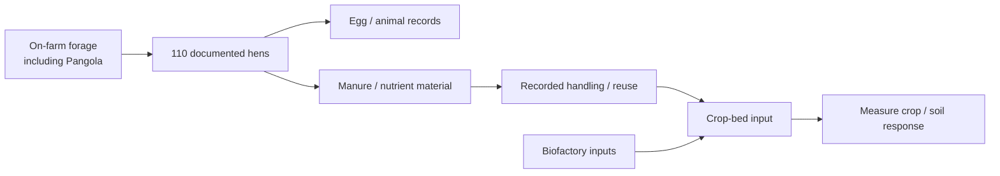
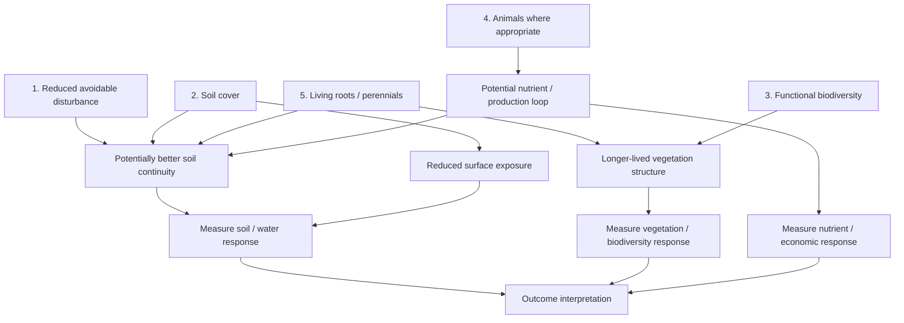

# The 5 Principles turn regenerative intent into reviewable farm practice.

The Kokonut Framework uses five regenerative-design principles to help farms make soil, vegetation, biodiversity, animals, and long-lived plant systems part of the operating plan.

They are:

1. **Reduce avoidable soil disturbance**
2. **Maintain soil cover**
3. **Increase functional biodiversity**
4. **Integrate animals where appropriate**
5. **Maintain living roots and perennial continuity**

The principles are meant to create **shared design questions**.

They are not:

- a certification;
- a universal farm recipe;
- a guarantee of soil improvement;
- proof of biodiversity restoration;
- a carbon methodology;
- a requirement that every farm use the same crops, animals, inputs, or techniques.

> **Principle → practice → observation → measurement → interpretation. Do not skip the middle steps.**

<CardGroup cols={2}>
  <Card title="See the agricultural rationale" icon="seedling" href="/kokonut-framework/why-syntropic-farming">
    Understand how succession, diversity, soil cover, living roots, biomass cycling, and local adaptation inform Kokonut's farm design.
  </Card>

  <Card title="See the principles at Adelphi" icon="puzzle" href="/ecosystem-wiki/kokonut-farms/adelphi/crops-biodiversity-and-infrastructure">
    Inspect the documented syntropic plots, soil-cover practices, nursery, poultry, biofactory, and evidence requirements at the first reference farm.
  </Card>

  <Card title="Connect practice to impact" icon="recycle" href="/kokonut-framework/framework-components/framework-features/methodology-positive-impact">
    Use the claim ladder: alignment → activity → measured outcome → impact interpretation.
  </Card>

  <Card title="Plan the evidence" icon="magnifying-glass-chart" href="/ecosystem-wiki/kokonut-farms/measurement-reporting-and-verification">
    See how farm observations become structured, reviewed, published, and appropriately interpreted.
  </Card>
</CardGroup>

<Info>
  **Interoperability, not uniformity.** A farm should explain how each principle applies to its local conditions. Where a principle is not appropriate — especially animal integration — the record should explain why rather than forcing a practice that does not fit the site.
</Info>

---

## The five principles at a glance

| Principle | Core design question | Example implementation | Evidence should distinguish |
| --- | --- | --- | --- |
| **1 — Reduce avoidable soil disturbance** | How will the farm protect soil structure and reduce unnecessary disruption? | Low-disturbance beds, careful input use, biological amendments | Practice record vs. measured soil response |
| **2 — Maintain soil cover** | How will exposed soil be minimized? | Living cover, mulch, crop residue, terraced-edge vegetation | Cover implementation vs. erosion/moisture outcome |
| **3 — Increase functional biodiversity** | How will multiple species/functions be designed into the farm? | Multi-species crops, agroforestry, nursery, habitat structure | Species/activity record vs. biodiversity condition |
| **4 — Integrate animals where appropriate** | Can animals contribute to production or nutrient cycling without creating new harm? | Poultry, forage, managed manure, grazing where suitable | Animal activity vs. nutrient/economic outcome |
| **5 — Maintain living roots & perennial continuity** | How will roots remain active beyond isolated short crop cycles? | Trees, vines, perennials, overlapping crop timelines | Plant survival/continuity vs. soil/ecological outcome |

The five principles work best as a **system of questions**.

They should not be rendered as a score where “5/5” means the farm is proven regenerative.

---

## A principle is not an outcome

The same evidence hierarchy applies to all five principles.

```mermaid
flowchart LR
    A["Design principle"] --> B["Locally adapted practice"]
    B --> C["Source observation"]
    C --> D["Measurement / actual"]
    D --> E["Review + publication"]
    E --> F["Bounded outcome interpretation"]
```

Example:

| Evidence level | Living-cover example |
| --- | --- |
| **Principle** | Maintain soil cover |
| **Practice** | Beard grass, mulch, or another cover system is established |
| **Observation** | Field record / photo documents cover at a defined place and date |
| **Measurement** | Ground-cover percentage, soil moisture, erosion observation, or comparable indicator |
| **Interpretation** | Evidence may support a claim about soil protection during the reporting period |

<Warning>
  **Do not report “the soil improved,” “biodiversity increased,” or “the farm became more resilient” solely because a principle was implemented.** Those are outcome or impact interpretations and require appropriate evidence.
</Warning>

---

## How the principles relate to syntropic farming

Syntropic farming is a major design influence for Kokonut, but the five principles are intentionally more portable than one syntropic configuration.

| Syntropic idea | Framework abstraction |
| --- | --- |
| Succession | Plan crops and management across time |
| Multi-strata planting | Increase functional diversity and perennial structure |
| Continuous vegetation | Maintain soil cover and living roots |
| Biomass cycling | Reduce waste and support locally appropriate nutrient loops |
| Active pruning/management | Adapt the system as conditions change |
| Mixed species/functions | Increase functional biodiversity |

This allows another farm to remain compatible with the Framework without reproducing Adelphi's:

- species mix;
- two syntropic plots;
- poultry system;
- nursery;
- exact inputs;
- market plan;
- infrastructure layout.

[Read Why Syntropic Farming →](/kokonut-framework/why-syntropic-farming)

---

# Principle 1 — Reduce avoidable soil disturbance

## Core question

> **How will the farm protect soil structure and biology while still doing the field preparation required for production?**

“Reduce disturbance” does not mean:

- never use machinery;
- never prepare a bed;
- never amend soil;
- reject every synthetic input categorically.

The principle asks whether disturbance and input dependency are **intentional, justified, monitored, and reduced where practical**.

### Possible practices

- low- or reduced-tillage preparation;
- shallow/transplant-focused bed preparation;
- permanent or semi-permanent beds;
- targeted rather than blanket disturbance;
- biomass/mulch retention;
- compost or locally appropriate biological amendments;
- biochar where appropriate;
- input records that make substitution visible.

### What to record

| Evidence | Why it matters |
| --- | --- |
| Bed-preparation method | Shows what kind of disturbance occurred |
| Dates / plot | Makes comparisons possible |
| Input type and quantity | Separates practice from vague “organic” language |
| Machinery / labor method | Shows intensity and operating trade-offs |
| Pre/post field observations | Creates context for later soil measurements |
| Soil indicators where appropriate | Helps test whether the intended response occurred |

### Stronger claims need stronger evidence

| Claim | Additional evidence |
| --- | --- |
| Disturbance was reduced | Comparable operating records across periods or methods |
| External-input dependency decreased | Procurement/application records |
| Soil condition improved | Baseline + repeated soil measurements |
| Soil carbon increased | A fit-for-purpose carbon methodology, sampling plan, period, uncertainty, and review |

### Adelphi reference

Current repository materials document at Adelphi:

- syntropic bed management;
- bamboo-derived biochar;
- biological-input production/use;
- soil probes / field observations;
- prepared crop beds;
- organic-matter cycling.

These establish **implemented practices and measurement capability**.

They do not by themselves establish that soil fertility, soil carbon, or water retention has measurably improved.

---

# Principle 2 — Maintain soil cover

## Core question

> **How will the farm minimize unnecessary exposed soil across seasons and crop transitions?**

Cover can come from:

- living vegetation;
- cover crops;
- mulch;
- crop residues;
- grasses;
- overlapping crop layers;
- perennial canopy / understory;
- other locally appropriate systems.

### Why the principle exists

Soil cover can influence conditions related to:

- surface exposure;
- rainfall impact;
- evaporation;
- heat;
- erosion;
- organic-matter inputs;
- root continuity.

The mechanism is plausible.

The outcome still has to be observed or measured.

### Useful evidence

- geotagged field photos;
- ground-cover percentage;
- plot notes;
- satellite/drone imagery;
- soil moisture;
- erosion observations;
- crop/cover calendar;
- intervention dates.

### Adelphi reference

Adelphi documentation includes:

- vegetative cover along terraced edges;
- **beard grass**;
- multi-layer syntropic vegetation;
- crop and infrastructure layouts.

The current farm page describes the intended purpose as reducing bare soil and supporting erosion management.

That is an appropriate **activity / mechanism claim**.

A stronger conclusion about reduced erosion or improved moisture retention needs comparable measurements across time.

---

# Principle 3 — Increase functional biodiversity

## Core question

> **How will diversity contribute useful ecological or productive functions rather than existing only as a species count?**

Functional diversity can exist across:

- crop species;
- tree species;
- growth strata;
- crop timing;
- habitat structure;
- forage;
- pollinator resources;
- nursery propagation;
- animals;
- soil biology.

### Possible design strategies

- multi-species cropping;
- intercropping;
- agroforestry;
- crop succession;
- native-species propagation;
- nursery development;
- habitat features;
- perennial + annual combinations;
- diversified production timelines.

### Evidence ladder

| Evidence maturity | Example |
| --- | --- |
| **Inventory** | Which species are present or planned? |
| **Implementation** | What was planted, propagated, or maintained? |
| **Spatial evidence** | Where does it exist? |
| **Survival / continuity** | Did it persist? |
| **Repeated biodiversity evidence** | Did abundance, richness, habitat use, or another defined indicator change? |
| **Interpretation** | What can reasonably be concluded about biodiversity condition? |

### Remote sensing

NDVI, NDRE, ReCI, MSAVI, and other vegetation indices can support vegetation monitoring.

They do **not** directly measure:

- species richness;
- threatened-species recovery;
- pollinator abundance;
- habitat quality;
- biodiversity restoration.

### Adelphi reference

Current repository materials document:

- **two syntropic plots**;
- multi-cycle crop systems;
- agroforestry;
- nursery propagation;
- **12+ native or at-risk species** identified in the nursery/agroforestry system.

<Warning>
  Conservation categories such as **native**, **at-risk**, **endangered**, and **critically threatened** are not interchangeable. External conservation claims should verify status species-by-species against an authoritative source.
</Warning>

The safe current claim is:

> **Adelphi implements multi-species and nursery/agroforestry practices relevant to biodiversity objectives.**

Not:

> “Adelphi has restored biodiversity.”

---

# Principle 4 — Integrate animals where appropriate

## Core question

> **Can animals contribute useful production, nutrient, vegetation, or farm-system functions without creating disproportionate welfare, feed, disease, nutrient, or management risks?**

Animal integration is the principle most likely to require a clear **not-applicable** path.

A farm should not add livestock merely to satisfy a checklist.

### Potential functions

- eggs / milk / meat or other food production;
- manure / nutrient cycling;
- forage use;
- vegetation management;
- diversified farm income;
- pest interactions where appropriate.

### Risks to plan for

- animal welfare;
- disease / biosecurity;
- feed dependency;
- nutrient overload;
- soil compaction;
- water contamination;
- labor burden;
- mortality;
- market dependency.

### Evidence to collect

| Area | Example records |
| --- | --- |
| Animals | Count, health, mortality, production |
| Feed | Purchased feed, on-farm forage, quantities where feasible |
| Manure | Collection, handling, application, processing |
| Welfare | Housing, water, health interventions, operating procedures |
| Economics | Feed cost, production, sales, losses |
| Soil / nutrient response | Application logs + appropriate field/soil measurements |

### Adelphi reference

Adelphi documents:

- **110 free-range laying hens**;
- on-farm forage including **Pangola grass**;
- egg production as part of the farm model;
- manure as part of the nutrient-flow concept;
- a biofactory producing biological inputs such as biochar, humic-acid preparations, organic urea, and related amendments.

The older Framework page presented this as a completed causal chain:

> Pangola grass → hens → manure → biological inputs → healthier crops → more forage

The individual components are documented.

The full performance of the loop still needs operating records.

A safer model is:

```mermaid
flowchart LR
    A["On-farm forage<br/>including Pangola"] --> B["110 documented hens"]
    B --> C["Egg / animal records"]
    B --> D["Manure / nutrient material"]
    D --> E["Recorded handling / reuse"]
    E --> F["Crop-bed input"]
    F --> G["Measure crop / soil response"]

    H["Biofactory inputs"] --> F
```

> **Record the loop first. Claim the benefit only after the response is measured.**

---

# Principle 5 — Maintain living roots and perennial continuity

## Core question

> **How will the farm maintain active root systems and longer-lived vegetation across more of the year?**

Short-cycle crops can be useful and economically important.

The principle asks whether the overall farm design also creates continuity beyond isolated planting/harvest resets.

### Possible practices

- perennial crops;
- fruit / timber / native trees;
- vines;
- overlapping crop cycles;
- living ground cover;
- multi-strata systems;
- agroforestry;
- staggered planting;
- managed fallow with living vegetation where appropriate.

### What to observe

- plant inventory;
- survival;
- health;
- phenology;
- replacement;
- canopy development;
- ground/root continuity;
- harvest;
- field interventions.

### What not to infer automatically

Living roots can support mechanisms related to:

- soil structure;
- microbial interactions;
- water movement;
- biomass;
- erosion control.

But root presence alone does not prove:

- higher soil organic matter;
- greater carbon sequestration;
- improved infiltration;
- improved crop resilience.

Those require their own measurements.

### Adelphi reference

Adelphi's documented longer-lived layers include:

- coconut;
- passion fruit;
- agroforestry species;
- nursery-derived perennial/native species;
- vegetative cover within the broader farm system.

Useful evidence can include:

- Silvi / GPS plant records;
- plant survival;
- crop-cycle records;
- field observations;
- harvest actuals;
- remote-sensing trends where methodologically appropriate.

NDRE or another vegetation index can provide **derived vegetation information**.

It is not a direct measurement of root condition.

---

## How the five principles reinforce one another

The principles can support one another, but the relationships should be written as **hypotheses and mechanisms**, not automatic outcomes.

```mermaid
flowchart TD
    A["1. Reduced avoidable disturbance"] --> B["Potentially better soil continuity"]
    C["2. Soil cover"] --> B
    D["5. Living roots / perennials"] --> B

    C --> E["Reduced surface exposure"]
    D --> F["Longer-lived vegetation structure"]
    G["3. Functional biodiversity"] --> F

    H["4. Animals where appropriate"] --> I["Potential nutrient / production loop"]
    I --> B

    B --> J["Measure soil / water response"]
    E --> J
    F --> K["Measure vegetation / biodiversity response"]
    I --> L["Measure nutrient / economic response"]

    J --> M["Outcome interpretation"]
    K --> M
    L --> M
```

The key word is **potentially**.

A farm can implement several mutually reinforcing practices and still experience:

- drought;
- disease;
- erosion;
- nutrient problems;
- poor establishment;
- labor constraints;
- weak markets;
- failed management.

That is why actual records matter.

---

## The five principles and the Positive Impact claim ladder

| Principle stage | Positive Impact level |
| --- | --- |
| The farm says the principle matters | **Alignment** |
| The practice is implemented | **Activity** |
| A relevant change is recorded | **Measured outcome** |
| Evidence supports a bounded regenerative conclusion | **Impact interpretation** |

Example:

> “Adelphi uses biochar” = **activity**

is not equivalent to:

> “Adelphi's soil improved because of biochar” = **impact interpretation**

The second statement requires:

- baseline;
- application record;
- comparable measurement;
- reporting period;
- method;
- contribution context;
- uncertainty;
- review.

[Read the Positive Impact Methodology →](/kokonut-framework/framework-components/framework-features/methodology-positive-impact)

---

## How the principles become MRV evidence

The principles create **questions for evidence collection**.

They do not define one mandatory technology pipeline.

| Principle | Source observations | Possible measurements / actuals | Potential interpretation |
| --- | --- | --- | --- |
| Reduce disturbance | Bed prep, machinery/input logs | Disturbance frequency, input quantities, soil indicators | Whether disturbance/input dependency changed |
| Soil cover | Photos, field observations, crop calendar | Ground-cover %, moisture, erosion observations | Whether surface protection improved |
| Biodiversity | Inventory, planting, nursery, GPS | Survival, repeated survey, habitat/vegetation indicators | Whether defined biodiversity conditions changed |
| Animals | Count, feed, health, manure, production | Egg/output actuals, feed cost, manure reuse, soil response | Whether integration contributed useful farm functions |
| Living roots | Plant records, phenology, crop continuity | Survival, canopy/vegetation indicators, harvests | Whether perennial continuity supported defined outcomes |

The durable MRV sequence remains:

> **observe → structure → review → publish → attest when useful → interpret**

Not every record needs:

- IPFS;
- Filecoin;
- EAS;
- on-chain publication.

Those tools can be used when durable provenance matters.

[Read the MRV Methodology →](/ecosystem-wiki/kokonut-farms/measurement-reporting-and-verification)

---

## A principle-review worksheet

For each principle, reviewers should ask:

| Field | Question |
| --- | --- |
| **Applicability** | Does the principle apply here? If not, why not? |
| **Local context** | What climate, soil, slope, water, labor, market, or regulatory conditions matter? |
| **Practice** | What exactly will be implemented? |
| **Operator** | Who is responsible for execution? |
| **Timing** | When and for how long? |
| **Baseline** | What condition exists before the intervention? |
| **Evidence** | What will be observed or measured? |
| **Method** | How will measurement be performed? |
| **Risk** | What can fail or create unintended harm? |
| **Actual** | What happened during the reporting period? |
| **Interpretation** | What conclusion does the evidence support — and not support? |
| **Next change** | What should the farm modify based on the evidence? |

This is more useful than asking:

> “Did the farm check Principle 1, 2, 3, 4, and 5?”

---

## How Adelphi currently maps to the principles

| Principle | Documented Adelphi implementation | Strong current claim | Stronger outcome still needs |
| --- | --- | --- | --- |
| **Reduce disturbance** | Syntropic bed management, biochar, biological inputs, organic-matter cycling | Relevant practices are documented | Repeated soil/input evidence |
| **Maintain cover** | Beard grass / terraced-edge vegetation + multi-layer planting | Cover/erosion-management practices are documented | Repeated cover, moisture, erosion evidence |
| **Functional biodiversity** | Two syntropic plots, multi-cycle crops, agroforestry, nursery, 12+ native/at-risk species in repository materials | Diverse production/propagation practices are documented | Verified conservation status + repeated biodiversity evidence |
| **Animals where appropriate** | 110 free-range laying hens, on-farm forage, manure/nutrient-flow design | Poultry integration is documented | Longitudinal feed, nutrient, welfare, production, soil/economic evidence |
| **Living roots / perennial continuity** | Coconut, passion fruit, agroforestry species, vegetative cover | Longer-lived vegetation layers are documented | Survival, plant-health, soil/water, production evidence over time |

<Info>
  Adelphi is the first live reference implementation of the principles. It is **not** the universal template for how every future Kokonut farm should satisfy them.
</Info>

---

## What reviewers should avoid

| Avoid | Use instead |
| --- | --- |
| “This farm follows all five principles, therefore it is regenerative.” | “The farm implements these practices; outcome claims remain evidence-dependent.” |
| “No-till means the soil recovered.” | Record disturbance and measure soil condition over time. |
| “Cover crops improved water retention.” | Compare moisture / infiltration evidence before making the outcome claim. |
| “More species means biodiversity was restored.” | Use species/habitat-specific repeated evidence. |
| “Every farm needs animals.” | Document animal integration where appropriate, or explain why it is not applicable. |
| “Poultry manure makes the system circular.” | Record material flows and measure dependency/cost/nutrient outcomes. |
| “Perennial roots sequester carbon.” | Use a carbon methodology before quantifying carbon. |
| “NDVI/NDRE proves regeneration.” | Treat vegetation indices as derived indicators requiring context. |
| “EAS verifies the ecological outcome.” | Use EAS for provenance; evaluate ecological evidence separately. |
| “DAO funding validates the farm design.” | Treat treasury authorization and agronomic review as separate decisions. |

---

## Farm review is not one authority

Different reviewers can use the principles for different questions.

<CardGroup cols={2}>
  <Card title="Farm operators" icon="tractor">
    Choose locally appropriate practices and adjust them using real field performance.
  </Card>

  <Card title="Agronomy reviewers" icon="microscope">
    Evaluate mechanisms, methods, timing, inputs, plant systems, animal integration, and agronomic risks.
  </Card>

  <Card title="Impact & MRV reviewers" icon="magnifying-glass-chart">
    Check baselines, evidence quality, claim class, reporting period, and whether outcomes are overstated.
  </Card>

  <Card title="Capital governance participants" icon="building-columns">
    Use the principle review as one input into funding decisions without treating treasury voting as agronomic authority.
  </Card>

  <Card title="Guilds & contributors" icon="users">
    Turn evidence gaps into bounded field, research, data, documentation, or implementation work.
  </Card>

  <Card title="Developers & agents" icon="code">
    Preserve the difference between practice records, measurements, review states, and impact interpretations in software.
  </Card>
</CardGroup>

---

## Current maturity

| Surface | Status | Interpretation |
| --- | --- | --- |
| **5 Principles of Regeneration** | **Active Framework methodology** | Shared regenerative-design questions |
| **Local implementation** | **Farm-specific** | Techniques depend on site/operator conditions |
| **Adelphi application** | **Documented implementation** | Strongest current reference example |
| **Soil outcome claims** | **Evidence-dependent** | Require baselines/repeated measurements for stronger conclusions |
| **Biodiversity outcome claims** | **Evidence-dependent** | Require species/habitat-specific longitudinal evidence |
| **Animal integration** | **Conditional principle** | Apply where appropriate; do not force livestock into unsuitable systems |
| **Carbon / climate conclusions** | **Methodology-dependent** | Principles alone do not quantify or certify carbon |
| **Cross-farm comparison** | **Developing** | Terra Viva and future farms will test portability across contexts |

---

## Continue through the Framework

<CardGroup cols={2}>
  <Card title="Why Syntropic Farming" icon="seedling" href="/kokonut-framework/why-syntropic-farming">
    See the ecological design language that informs these five portable Framework principles.
  </Card>

  <Card title="Positive Impact Methodology" icon="recycle" href="/kokonut-framework/framework-components/framework-features/methodology-positive-impact">
    Move from principle and practice into measured outcomes and bounded interpretations.
  </Card>

  <Card title="Pillars of Value" icon="square-poll-vertical" href="/kokonut-framework/framework-components/pillars-of-value">
    Add WHAT, WHO, HOW MUCH, CONTRIBUTION, RISK, and PUBLIC GOODS to the analysis.
  </Card>

  <Card title="MRV Methodology" icon="magnifying-glass-chart" href="/ecosystem-wiki/kokonut-farms/measurement-reporting-and-verification">
    Design the evidence lifecycle around the material claims created by each principle.
  </Card>

  <Card title="Adelphi Infrastructure" icon="puzzle" href="/ecosystem-wiki/kokonut-farms/adelphi/crops-biodiversity-and-infrastructure">
    Inspect the current physical implementation and evidence boundaries at the reference farm.
  </Card>

  <Card title="Framework Introduction" icon="scroll" href="/kokonut-framework/Introduction">
    Return to the full interoperability model and the boundary between shared methodology and local authority.
  </Card>
</CardGroup>

> **The five principles are valuable because they make regenerative intent operational. Their credibility comes later, when farms document what they actually did and measure what actually changed.**
