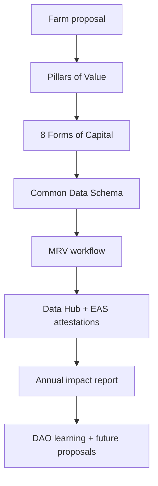
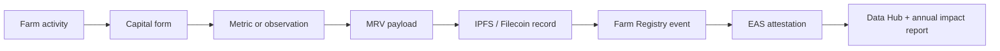

# The 8 Forms of Capital help Kokonut measure what money alone cannot see.

A regenerative farm creates more than revenue. It can restore soil, strengthen local relationships, train people, preserve culture, build public knowledge, produce food, and create infrastructure that continues to serve the community after the harvest is sold.

Kokonut uses the **8 Forms of Capital** as a value-accounting lens for farm proposals, annual impact reports, MRV workflows, and DAO review. The goal is simple: make every form of value visible enough to discuss, fund, improve, and verify.

  <a href="#the-eight-forms" style={{ display: "inline-flex", alignItems: "center", gap: "6px", background: "#009F4D", color: "#fff", padding: "10px 20px", borderRadius: "8px", fontWeight: "600", fontSize: "14px", textDecoration: "none" }}>
    See the 8 Forms →
  </a>

  <a href="#how-value-becomes-evidence" style={{ display: "inline-flex", alignItems: "center", gap: "6px", border: "1.5px solid #009F4D", color: "#009F4D", padding: "10px 20px", borderRadius: "8px", fontWeight: "600", fontSize: "14px", textDecoration: "none", background: "transparent" }}>
    See How Value Is Verified
  </a>

  Use this page when reviewing farm proposals, writing annual impact reports, or translating farm activity into MRV evidence.

---

## Why this matters

Most agricultural finance sees farms through one narrow lens: money in, money out. Kokonut needs a broader lens because regenerative farms are designed to compound multiple kinds of value at once.

| Without the 8 Forms | With the 8 Forms |
| --- | --- |
| A farm is judged mostly by revenue. | A farm is assessed across ecological, economic, social, cultural, and knowledge value. |
| Public goods are treated as side effects. | Public goods become part of the value model. |
| Impact claims stay vague. | Claims are tied to evidence, metrics, and reporting cycles. |
| DAO reviewers only see the budget. | DAO reviewers can compare risks, benefits, and community outcomes. |
| Replication is difficult. | New farms can learn from comparable value records. |

<Note>
  The 8 Forms do not replace financial analysis. They expand it. A farm still needs budgets, revenue assumptions, execution capacity, and risk controls — but those are not the only forms of value that matter.
</Note>

---

## Where this fits in the Kokonut Framework

The relationship is:

| Framework element | Job |
| --- | --- |
| **Pillars of Value** | Define what the DAO should evaluate. |
| **8 Forms of Capital** | Define how value is categorized and measured. |
| **Common Data Schema** | Captures the baseline farm record needed for comparison. |
| **MRV workflow** | Turns farm activity into structured evidence. |
| **Annual impact report** | Summarizes what changed across the year. |

---

## The eight forms

| Capital form | Plain meaning | Kokonut question |
| --- | --- | --- |
| **Natural** | Soil, water, biodiversity, vegetation, carbon, and ecosystem health | Is the land becoming healthier over time? |
| **Financial** | Revenue, treasury, funding, costs, and public goods allocation | Can the farm sustain operations and distribute value responsibly? |
| **Social** | Trust, relationships, coordination, participation, and community networks | Is the farm strengthening local and network relationships? |
| **Human** | Skills, knowledge, safety, training, and leadership capacity | Are people gaining the capability to operate and replicate regeneration? |
| **Material** | Infrastructure, tools, equipment, built assets, and physical systems | Does the farm have the physical base to keep working? |
| **Intellectual** | Data, documentation, methods, open-source tools, and research | Is the network learning in a way others can reuse? |
| **Cultural** | Stories, traditions, local identity, land memory, and heritage species | Is the farm preserving and renewing cultural connection to land? |
| **Health** | Food quality, worker wellbeing, community nutrition, and safe conditions | Is the farm supporting healthier people and safer work? |

---

## 1. Natural Capital

Natural Capital is the ecological foundation of the farm: soil health, water retention, biodiversity, vegetation, habitat, and ecosystem resilience.

**How Kokonut farms build it**

- Use syntropic planting, cover crops, perennial roots, biodiversity corridors, and the propagation of native species.
- Reduce dependency on synthetic inputs by producing organic amendments and bio-inputs on-site.
- Monitor vegetation health, soil conditions, biodiversity changes, and land-use patterns over time.

**Adelphi example**

Adelphi uses syntropic plots, a biodiversity nursery, at-risk species propagation, biochar, vegetative cover, and satellite vegetation monitoring to make Natural Capital visible.

**Evidence to track**

| Evidence | Possible source |
| --- | --- |
| Soil moisture, temperature, and electrical conductivity | Ground sensors or field measurements |
| Vegetation health | NDVI, NDRE, MSAVI, satellite analysis |
| Species count and nursery inventory | Field logs, Silvi records, biodiversity surveys |
| Cover crop and living-root continuity | Farm observations and geospatial records |
| Biochar and organic input use | Biofactory logs and MRV events |

<Warning>
  Carbon and biodiversity outcomes should be treated as estimates until supported by a clear methodology, measurement period, and MRV evidence.
</Warning>

---

## 2. Financial Capital

Financial Capital is the monetary layer that lets farms operate, pay people, maintain infrastructure, reinvest, and support public goods.

**How Kokonut farms build it**

- Use DAO-governed capital allocation instead of opaque grant or loan dependency.
- Track crop revenue, egg production, treasury movement, public goods allocations, and operating costs.
- Route funding decisions through proposals, community review, and on-chain execution.

**Adelphi example**

Adelphi’s forecast includes short-cycle crops, medium-cycle crops, long-cycle coconut production, and poultry as recurring production streams. The allocation of public goods is modeled as 10% of gross revenue once revenue is realized.

**Evidence to track**

| Evidence | Possible source |
| --- | --- |
| Revenue by crop and cycle | Harvest records, sales records, Data Hub |
| Treasury inflows and outflows | DAO records, Gnosis Chain, Safe transactions |
| Public goods allocation | Proposal reports, impact reports, and accounting records |
| Budget vs. actuals | Farm operations reports |
| Forecast revisions | Harvest forecast updates and MRV actuals |

<Note>
  Forecasts are planning tools, not guaranteed outcomes. Financial Capital should separate projected revenue from verified actuals.
</Note>

---

## 3. Social Capital

Social Capital is the trust and coordination capacity around the farm: local relationships, contributor networks, governance participation, and community engagement.

**How Kokonut farms build it**

- Create community programs, workshops, open documentation, and local participation pathways.
- Use Guilds to coordinate contributions across technology, impact, governance, communications, finance, and partnerships.
- Track participation, relationships, and contribution records over time.

**Adelphi example**

Adelphi connects Yanny and Neury’s local land stewardship with nearby communities, weekend programming, educational visits, and Kokonut’s broader contributor network.

**Evidence to track**

| Evidence | Possible source |
| --- | --- |
| Community events held | Event logs and attendance records |
| Workshop participation | Training records and surveys |
| Guild contribution records | Charmverse, Guild Points, proposal histories |
| Community feedback | Interviews and annual surveys |
| Local stakeholder relationships | Partnership records and farm reports |

---

## 4. Human Capital

Human Capital is the capability of people: skills, training, safety, leadership, and practical knowledge.

**How Kokonut farms build it**

- Train farm teams in syntropic farming, bio-input production, soil management, poultry systems, data collection, and market strategy.
- Build repeatable training materials that new farms can reuse.
- Improve local capacity to operate regenerative systems without forever relying on external experts.

**Adelphi example**

Adelphi’s gazebo functions as a training and community education space for agroecology, native species, biochar, poultry management, and farm operations.

**Evidence to track**

| Evidence | Possible source |
| --- | --- |
| Training sessions completed | Attendance logs |
| Skills gained | Pre/post assessments |
| Safety practices | Farm safety records |
| Mentorship activity | Training reports |
| Follow-on community activity | Participant follow-up surveys |

---

## 5. Material Capital

Material Capital is the physical infrastructure that enables the farm to operate: land improvements, tools, buildings, water systems, nursery facilities, poultry infrastructure, and monitoring equipment.

**How Kokonut farms build it**

- Fund critical farm infrastructure through transparent proposals.
- Track construction, maintenance, utilization, and upgrades across development phases.
- Connect infrastructure to production, education, MRV, and community benefit.

**Adelphi example**

Adelphi includes production beds, syntropic plots, nursery and biofactory infrastructure, a poultry system, an education gazebo, mapped farm zones, and geospatial monitoring.

**Evidence to track**

| Evidence | Possible source |
| --- | --- |
| Infrastructure completion | Milestone reports and photos |
| Facility utilization | Event logs, production records |
| Maintenance needs | Operations reports |
| Equipment status | Inventory records |
| Infrastructure-linked outputs | Harvests, eggs, seedlings, trainings |

---

## 6. Intellectual Capital

Intellectual Capital is the knowledge that helps the network improve: data, documentation, methodologies, open-source code, agent workflows, research, and lessons learned.

**How Kokonut farms build it**

- Publish documentation, farm data, MRV workflows, schema updates, proposal templates, and operational lessons.
- Build open-source tools that future farms can reuse.
- Use AI agents and the Intelligence Layer to help coordinate reporting, forecasting, verification, and learning.

**Adelphi example**

Adelphi is the reference implementation for the Kokonut Framework: farm data, forecasts, infrastructure records, MRV events, and lessons learned from Adelphi inform future farm replication.

**Evidence to track**

| Evidence | Possible source |
| --- | --- |
| Documentation improvements | GitHub commits and pull requests |
| Farm data published | Data Hub records and API usage |
| MRV events generated | Registry events and EAS attestations |
| Agent workflows deployed | Agent logs and tool documentation |
| Framework reuse | New farm onboarding records |

---

## 7. Cultural Capital

Cultural Capital is the value carried by stories, traditions, local identity, land memory, heritage crops, and intergenerational knowledge.

**How Kokonut farms build it**

- Document founder stories, local history, and community relationships.
- Preserve native species and heritage crops.
- Create programs that reconnect children, elders, farmers, and contributors to land-based knowledge.

**Adelphi example**

Adelphi’s story begins with Yanny and Neury Hernández returning to land connected to family memory, then turning that land into a regenerative farm and community learning space.

**Evidence to track**

| Evidence | Possible source |
| --- | --- |
| Founder and community stories | Public documentation |
| Heritage species preserved | Nursery inventory and field logs |
| Seedlings distributed | Distribution records |
| Cultural events or programs | Attendance logs and photos |
| Local knowledge documented | Interviews and reports |

---

## 8. Health Capital

Health Capital is the well-being of people connected to the farm: workers, consumers, families, nearby communities, and contributors.

**How Kokonut farms build it**

- Produce food through organic and regenerative practices.
- Improve access to fresh local produce and protein.
- Maintain safe working conditions and training for farm activities.
- Track health-related claims carefully and avoid unsupported medical or nutrition claims.

**Adelphi example**

Adelphi produces vegetables, fruits, and eggs through a system designed around soil health, biodiversity, poultry integration, and reduced dependence on synthetic inputs.

**Evidence to track**

| Evidence | Possible source |
| --- | --- |
| Food produced locally | Harvest and sales records |
| Egg production | Poultry records |
| Worker safety | Incident reports and safety logs |
| Community food access | Distribution and sales records |
| Health-related outcomes | Surveys or third-party analysis, when available |

<Warning>
  Health claims require caution. Kokonut can document food access, production methods, and safety practices, but should avoid claiming superior nutrition or medical outcomes unless supported by testing and credible methodology.
</Warning>

---

## How value becomes evidence

The 8 Forms are only useful if each claim can be connected to evidence. Kokonut uses the MRV workflow to move from farm activity to public records.

| Capital form | Example claim | Evidence standard |
| --- | --- | --- |
| Natural | Soil and biodiversity are improving | Soil data, field logs, satellite indices, species records |
| Financial | Farm revenue supports operations and public goods | Sales records, treasury transactions, budget reports |
| Social | Community participation is increasing | Event attendance, surveys, Guild contribution records |
| Human | Training increases local capacity | Workshop logs, skills assessments, mentorship records |
| Material | Infrastructure improves production capacity | Build milestones, usage records, maintenance reports |
| Intellectual | Knowledge is reusable by future farms | Documentation, open-source activity, API/data usage |
| Cultural | Heritage species and stories are preserved | Nursery records, story documentation, seedling distribution |
| Health | Local food access improves | Harvest records, distribution data, safety logs |

---

## How DAO reviewers can use the 8 Forms

When reviewing a proposal, ask:

| Question | Why it matters |
| --- | --- |
| Which forms of capital does this proposal affect? | Prevents the DAO from only reviewing the budget. |
| Which claims are estimates, and which are already measured? | Reduces overclaiming and greenwashing risk. |
| What evidence will be collected? | Connects the proposal to MRV. |
| Who is responsible for reporting? | Makes accountability clear. |
| How will results be published? | Ensures value is legible to the network. |
| What could fail? | Keeps risk visible before funds are allocated. |

<Note>
  A strong proposal does not need to maximize all eight forms at once. It should be clear about which forms it affects, how those effects will be measured, and what evidence will be available after execution.
</Note>

---

## What this framework does not guarantee

The 8 Forms make value easier to see, but they do not remove risk.

| Risk | What to do about it |
| --- | --- |
| Agricultural risk | Track weather, crop cycles, pest pressure, soil health, and execution milestones. |
| Market risk | Separate projected revenue from actual sales and update forecasts after each cycle. |
| Governance risk | Require clear proposals, accountability, reporting, and community review. |
| Data-quality risk | Define who collects data, when it is collected, and how it is verified. |
| Carbon-claim risk | Treat climate benefits as co-benefits until methodology and verification support stronger claims. |
| Health-claim risk | Avoid medical or nutrition claims unless supported by testing and credible evidence. |

---

## Next steps

<CardGroup cols={2}>
  <Card title="Pillars of Value" icon="square-poll-vertical" href="/kokonut-framework/framework-components/pillars-of-value">
    Understand the DAO's six evaluation questions before applying the 8 Forms as measurement categories.
  </Card>

  <Card title="Common Data Schema" icon="database" href="/kokonut-framework/framework-components/common-data-schema">
    See the farm record that makes farms comparable, fundable, governable, and verifiable.
  </Card>

  <Card title="MRV Methodology" icon="magnifying-glass-chart" href="/ecosystem-wiki/kokonut-farms/measurement-reporting-and-verification">
    Learn how farm activity becomes structured evidence, public records, and annual impact reporting.
  </Card>

  <Card title="Adelphi Farm Summary" icon="seedling" href="/ecosystem-wiki/kokonut-farms/adelphi/summary">
    See the first Kokonut farm where the Framework is being applied on real land.
  </Card>

  <Card title="Proposal Templates" icon="file-signature" href="/ecosystem-wiki/the-kokonut-dao/proposal-templates">
    Use the 8 Forms to write clearer farm funding, bounty, Framework upgrade, or partnership proposals.
  </Card>

  <Card title="Positive Impact Methodology" icon="arrows-spin" href="/kokonut-framework/framework-components/framework-features/methodology-positive-impact">
    See how farm practices create circular impact loops that can be measured and improved.
  </Card>
</CardGroup>