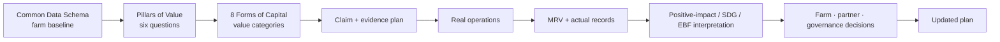
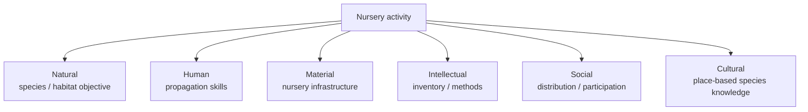
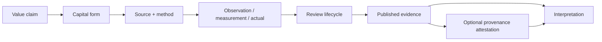

# The 8 Forms of Capital help Kokonut see value without pretending every kind of value is the same.

A regenerative farm can create, protect, use, or degrade many kinds of value at the same time.

Some of that value is financial.

Some is ecological.

Some exists in:

- relationships;
- skills;
- infrastructure;
- knowledge;
- culture;
- health and safety.

Kokonut uses the **8 Forms of Capital** to organize those different value domains:

1. **Natural Capital**
2. **Financial Capital**
3. **Social Capital**
4. **Human Capital**
5. **Material Capital**
6. **Intellectual Capital**
7. **Cultural Capital**
8. **Health Capital**

The purpose is not to convert them into one universal number.

> **The 8 Forms classify value. Evidence describes what happened inside each category.**

<CardGroup cols={2}>
  <Card title="Start with the Pillars of Value" icon="square-poll-vertical" href="/kokonut-framework/framework-components/pillars-of-value">
    Use WHAT, WHO, HOW MUCH, CONTRIBUTION, RISK, and PUBLIC GOODS to structure the questions before categorizing the value.
  </Card>

  <Card title="Connect value to evidence" icon="magnifying-glass-chart" href="/ecosystem-wiki/kokonut-farms/measurement-reporting-and-verification">
    Match every material capital claim to the appropriate source, measurement, reporting period, review, and limitations.
  </Card>

  <Card title="Interpret positive impact carefully" icon="recycle" href="/kokonut-framework/framework-components/framework-features/methodology-positive-impact">
    Move from alignment and activity to measured outcomes before making stronger impact interpretations.
  </Card>

  <Card title="See Adelphi as a reference" icon="seedling" href="/ecosystem-wiki/kokonut-farms/adelphi/summary">
    Inspect which forms are represented by documented assets, activities, forecasts, and still-developing outcome evidence.
  </Card>
</CardGroup>

<Warning>
  **The eight forms are not interchangeable units.** One hectare of habitat, one dollar of revenue, one training session, one community relationship, and one health outcome cannot be added together into a scientifically meaningful “total capital” score without a separately defined methodology.
</Warning>

---

## The eight forms in one view

| Form | What it helps organize | Example evidence | Common overclaim to avoid |
| --- | --- | --- | --- |
| **Natural** | Land, soil, water, vegetation, biodiversity, ecological condition | Soil/field records, vegetation indicators, species/survival records | “A regenerative practice means nature improved” |
| **Financial** | Budgets, revenue, costs, treasury, liquidity, allocations | Forecasts, sales, expenses, treasury/accounting records | “Projected revenue is realized value” |
| **Social** | Relationships, participation, coordination, trust, networks | Participation, partnership, contribution, feedback records | “Attendance means stronger social cohesion” |
| **Human** | Skills, knowledge, leadership, capability, safety competence | Training, assessment, role, mentorship records | “Training delivered means capability increased” |
| **Material** | Physical assets and operating infrastructure | Asset, build, maintenance, utilization records | “Infrastructure exists, therefore it creates value” |
| **Intellectual** | Data, methods, documentation, research, software, reusable learning | Git history, datasets, schemas, reports, reuse records | “Published information is automatically useful or correct” |
| **Cultural** | Stories, identity, land memory, traditions, heritage knowledge | Oral histories, documentation, participation, species/crop records | “A story or heritage label proves cultural benefit” |
| **Health** | Worker safety, food access, wellbeing-related conditions | Safety, incident, food production/distribution, appropriate health evidence | “Regenerative food automatically produces medical outcomes” |

<Info>
  A single activity can affect several forms at once. That does not mean the same activity should be counted repeatedly as eight separate impacts.
</Info>

---

## What the 8 Forms do — and what they do not

| They can help | They cannot do automatically |
| --- | --- |
| Make non-financial value visible in planning | Prove that value was actually created |
| Organize different kinds of evidence | Convert unlike outcomes into one valid unit |
| Reveal trade-offs across domains | Decide which trade-off is ethically correct |
| Improve proposal and report structure | Determine whether funding should be approved |
| Support multi-period learning | Guarantee comparability across farms |
| Expose value that budgets miss | Replace financial analysis |
| Show where public value may exist | Prove a public good was delivered |
| Give software a consistent classification vocabulary | Allow AI to autonomously certify impact |

The forms are most useful when they make a decision **harder to oversimplify**.

---

## Where the 8 Forms sit in the Framework

```mermaid
flowchart LR
    A["Common Data Schema<br/>farm baseline"] --> B["Pillars of Value<br/>six questions"]
    B --> C["8 Forms of Capital<br/>value categories"]
    C --> D["Claim + evidence plan"]
    D --> E["Real operations"]
    E --> F["MRV + actual records"]
    F --> G["Positive-impact / SDG / EBF interpretation"]
    G --> H["Farm · partner · governance decisions"]
    H --> I["Updated plan"]
```

| Framework element | Role |
| --- | --- |
| **Common Data Schema** | Establishes compatible baseline context |
| **Pillars of Value** | Structures the questions |
| **8 Forms of Capital** | Categorizes the value being discussed |
| **5 Principles of Regeneration** | Describes regenerative design/practice |
| **MRV** | Connects claims to observations, measurements, review, and publication |
| **Positive Impact Methodology** | Defines when evidence can support stronger interpretations |
| **SDGs / EBF / CRISP** | Add development, ecological-benefit, and risk lenses |
| **Kokonut Intelligence** | Implements data lifecycle, analytics, reporting, and attestation infrastructure |

> **Pillars = inquiry structure. 8 Forms = value categories. MRV = evidence. Interpretation comes later.**

---

## Capital is a useful metaphor — not permission to financialize everything

The word **capital** is useful because it highlights that farms depend on assets and capacities beyond cash.

But Kokonut should not imply that every form:

- has a market price;
- should be tokenized;
- should be privately owned;
- can be traded;
- can be substituted for another;
- should be optimized only for financial return.

For example:

- natural value can be damaged even while financial revenue rises;
- cultural value may be important even when it has no market price;
- worker health should not be treated as a tradable offset against higher production;
- open knowledge can create public value without being monetized;
- stronger infrastructure can increase dependency if maintenance capacity is missing.

The Framework should make those tensions visible rather than compressing them into one score.

---

# The eight forms

## 1. Natural Capital

### What it organizes

Natural Capital covers the ecological systems and conditions on which the farm depends.

Examples include:

- soil;
- water;
- vegetation;
- habitat;
- species;
- biodiversity;
- biomass;
- ecological condition;
- land-cover patterns.

### Useful planning questions

- What ecological assets or conditions matter to this farm?
- What is the baseline?
- What practices are intended to protect or improve them?
- What could degrade them?
- Which indicators are direct measurements versus derived proxies?
- Over what period would change reasonably be observable?

### Evidence can include

| Evidence class | Examples |
| --- | --- |
| **Baseline** | Soil observations, mapped land, species inventory, vegetation condition |
| **Activity** | Biochar application, cover establishment, planting, nursery propagation |
| **Measurement** | Soil moisture/EC/temperature, survival, ground cover, defined biodiversity observations |
| **Derived indicator** | NDVI, NDRE, ReCI, MSAVI |
| **Interpretation** | Bounded soil, vegetation, habitat, or biodiversity conclusion |

### Important boundary

A farm can implement:

- syntropic plots;
- biochar;
- cover vegetation;
- native-species propagation;

without yet proving that:

- soil health improved;
- biodiversity was restored;
- carbon increased;
- resilience improved.

Those are stronger claims.

### Adelphi reference

Current repository materials document:

- two syntropic plots;
- bamboo-derived biochar practices;
- vegetative cover / beard grass;
- nursery and agroforestry activity;
- 12+ native or at-risk species identified in repository materials;
- remote-sensing and ground-observation capability.

These establish **natural-capital-relevant assets and activities**.

Longitudinal ecological outcomes remain evidence-dependent.

---

## 2. Financial Capital

### What it organizes

Financial Capital covers monetary resources and financial operating capacity.

Examples include:

- budgets;
- grants;
- treasury funding;
- sales;
- revenue;
- expenses;
- liquidity;
- maintenance funding;
- public-goods allocations;
- reserves where applicable.

### Separate financial states

| State | Example |
| --- | --- |
| **Forecast** | Expected crop revenue |
| **Approved** | Budget/proposal authorized |
| **Received** | Funds actually received |
| **Spent** | Actual expenditure |
| **Earned** | Realized sales/revenue |
| **Allocated** | Amount designated for a purpose |
| **Transferred** | Money actually moved |
| **Used** | Funds actually spent by/for the intended beneficiary or activity |

These are not interchangeable.

### Evidence can include

- budget;
- approved proposal;
- bank/treasury/accounting records;
- invoices;
- harvest/sales records;
- realized prices;
- expense records;
- variance analysis;
- public-goods transfer/use records.

### Adelphi reference

Adelphi has documented funding history and a crop-production financial forecast.

The current crop model projects roughly **$149,110.87/year in gross crop revenue** at modeled steady-state performance.

The current farm model also uses a **10% public-goods allocation assumption**.

Both are forecasts/model assumptions until realized records exist.

<Warning>
  The repository also contains a conflicting historical 40/40/20 allocation model. Do not treat either percentage as a universal Framework rule or as a realized distribution without authoritative farm-specific records.
</Warning>

Financial Capital does not replace profitability, liquidity, cash-flow, budget, or risk analysis.

---

## 3. Social Capital

### What it organizes

Social Capital covers relationships and coordination capacity among people and organizations.

Examples include:

- local relationships;
- trust;
- participation;
- partnerships;
- contributor networks;
- cooperation;
- governance participation;
- coordination pathways.

### Evidence can include

- event participation;
- recurring participation;
- partnership records;
- contribution records;
- meeting / coordination records;
- stakeholder feedback;
- retention;
- conflict / grievance records where appropriate;
- repeated collaboration.

### Attendance is not the same as social capital

A workshop with 40 attendees proves attendance.

It does not automatically prove:

- increased trust;
- stronger community cohesion;
- durable collaboration;
- reduced conflict;
- improved local agency.

Those require additional evidence.

### Adelphi reference

Adelphi connects:

- local founders/operators;
- workers;
- nearby community participation;
- training/community infrastructure;
- Kokonut contributors;
- funding/coordination partners.

The safe claim is that **coordination relationships and participation pathways exist**.

Their depth, durability, distribution, and effect should be evaluated separately.

---

## 4. Human Capital

### What it organizes

Human Capital covers people's capabilities.

Examples include:

- skills;
- practical knowledge;
- leadership;
- operational competence;
- agronomic knowledge;
- data/MRV capability;
- safety competence;
- mentoring.

### Activity is not capability

| Claim level | Example |
| --- | --- |
| **Activity** | A training session occurred |
| **Participation** | A person attended |
| **Learning evidence** | Knowledge/skill assessment changed |
| **Applied capability** | Participant later performs the task competently |
| **Durable capacity** | Capability persists and can be transferred/mentored |

### Evidence can include

- curriculum;
- attendance;
- pre/post assessment;
- competency demonstration;
- role progression;
- mentorship;
- repeat performance;
- safety training;
- operator review.

### Adelphi reference

Adelphi documents a training/community gazebo and farm activities that can support learning around:

- agroecology;
- syntropic systems;
- nursery work;
- biological inputs;
- poultry;
- farm operations;
- evidence/data collection.

That establishes **training capacity and activity**.

It does not by itself prove long-term skill gain or livelihood improvement.

---

## 5. Material Capital

### What it organizes

Material Capital covers the physical systems required to operate.

Examples include:

- farm infrastructure;
- water systems;
- tools;
- buildings;
- nursery facilities;
- poultry infrastructure;
- roads/access;
- storage;
- monitoring equipment;
- energy systems.

### Existence is not performance

Infrastructure can be:

- planned;
- under construction;
- completed;
- operational;
- partially operational;
- underused;
- degraded;
- awaiting maintenance.

Those states matter.

### Evidence can include

| Evidence | Question |
| --- | --- |
| Build / procurement record | Was the asset created or acquired? |
| Acceptance record | Was it delivered to specification? |
| Operating record | Is it actually being used? |
| Utilization | How much / how often is it used? |
| Maintenance | Is it being kept functional? |
| Failure / downtime | Where is capacity being lost? |
| Output linkage | What production or service depends on it? |

### Adelphi reference

Current documentation includes:

- production beds;
- syntropic plots;
- nursery;
- biofactory;
- poultry infrastructure;
- training/community gazebo;
- irrigation/water infrastructure;
- mapped farm zones and related operating infrastructure.

These are documented physical assets/capabilities.

Their value should be evaluated through **condition, use, maintenance, and output**, not only construction.

---

## 6. Intellectual Capital

### What it organizes

Intellectual Capital covers reusable information and knowledge artifacts.

Examples include:

- farm data;
- documentation;
- schemas;
- methodologies;
- research;
- reports;
- code;
- APIs;
- open-source tools;
- lessons learned;
- agent workflows.

### Publication is not the same as reuse

Evidence can progress through:

| Stage | Example |
| --- | --- |
| **Created** | A dataset, page, method, or code artifact exists |
| **Reviewed** | The artifact passed an appropriate review |
| **Published** | Others can access it |
| **Used** | Another workflow or person consumes it |
| **Reused** | Another farm/project adopts or adapts it |
| **Improved** | Feedback changes the shared method/tool |

### Adelphi reference

Adelphi contributes to Intellectual Capital because it generates a live reference context for:

- Framework methods;
- farm records;
- forecasts;
- MRV practices;
- infrastructure documentation;
- farm-data workflows;
- lessons that can inform later farms.

That does not mean every Adelphi-specific choice is automatically reusable elsewhere.

> **Replication value comes from learning which parts transfer and which parts require local adaptation.**

---

## 7. Cultural Capital

### What it organizes

Cultural Capital covers meaning, identity, memory, tradition, and place-based knowledge.

Examples include:

- founder/community stories;
- relationship to land;
- local agricultural knowledge;
- heritage practices;
- cultural uses of species/crops;
- intergenerational knowledge;
- identity connected to place.

### Cultural value should not be invented from outside

A farm team or documentation contributor should not label something:

- culturally important;
- traditional;
- heritage;
- sacred;
- community-owned;

without appropriate local grounding.

### Evidence can include

- first-person histories;
- interviews;
- local documentation;
- community participation;
- archival records where appropriate;
- species/crop history;
- repeated cultural programming;
- consented storytelling.

### Adelphi reference

Adelphi's documented background includes Yanny and Neury Hernández and their relationship to family land and local place.

That supports a **documented place/founder story**.

Stronger claims about community-wide cultural preservation should require broader local evidence rather than being inferred from the founders' story alone.

[Read the Adelphi background story →](/ecosystem-wiki/kokonut-farms/adelphi/background-story)

---

## 8. Health Capital

### What it organizes

Health Capital covers health- and safety-related conditions connected to farm work and farm outputs.

Examples include:

- worker safety;
- occupational conditions;
- safe water/handling where relevant;
- food availability/access;
- food-production records;
- wellbeing-related program evidence;
- documented health outcomes when an appropriate methodology exists.

### Separate food production from health outcome

| Claim | Evidence needed |
| --- | --- |
| Food was produced | Harvest/production record |
| Food was sold/distributed locally | Sales/distribution record |
| Access improved | Population, affordability/access, distribution, reporting period |
| Nutrition improved | Appropriate nutrition evidence/methodology |
| Medical outcome improved | Appropriate clinical/public-health evidence |

### Adelphi reference

Adelphi documents production systems for:

- vegetables;
- fruit;
- coconut;
- eggs.

It also has worker/farm operating contexts where safety evidence matters.

The safe claims concern:

- food production;
- distribution/sales when recorded;
- safety practices when documented.

Do not infer superior nutrition, disease reduction, or medical benefit from the regenerative label.

---

## Forms can overlap without being double-counted

One intervention can create several plausible value pathways.

Example: a nursery.

```mermaid
flowchart TD
    A["Nursery activity"] --> B["Natural<br/>species / habitat objective"]
    A --> C["Human<br/>propagation skills"]
    A --> D["Material<br/>nursery infrastructure"]
    A --> E["Intellectual<br/>inventory / methods"]
    A --> F["Social<br/>distribution / participation"]
    A --> G["Cultural<br/>place-based species knowledge"]
```

That does not mean:

> “one nursery = six impacts”

Each claim needs its own:

- boundary;
- stakeholder;
- metric or qualitative evidence;
- reporting period;
- source;
- limitations.

<Info>
  **Multi-capital is not multi-counting.** Tag one activity to several relevant forms when useful, but evaluate each claimed outcome independently.
</Info>

---

## Trade-offs matter

The eight forms are useful partly because they expose situations where one form improves while another may weaken.

| Example | Possible gain | Possible cost / risk |
| --- | --- | --- |
| Expand production area | Financial / Material | Natural if habitat or soil is degraded |
| Buy more machinery | Material / Financial efficiency | Financial cost, soil disturbance, dependency |
| Publish precise farm data | Intellectual / Social transparency | Privacy, cultural, security, or governance risk |
| Add livestock | Financial / Natural nutrient-loop potential | Health, welfare, water, feed, soil risks |
| Maximize short-cycle crops | Financial near-term | Natural/perennial continuity if system becomes simplified |
| Volunteer-heavy model | Social participation | Human/Financial risk if labor is uncompensated or unsustainable |

The Framework should not hide those tensions.

The Pillars of Value — especially **WHO, CONTRIBUTION, and RISK** — help examine them.

---

## Measurement should match the form

Not every form should be measured with money.

Not every form should even be reduced to a single numeric indicator.

| Form | Quantitative examples | Qualitative / contextual examples |
| --- | --- | --- |
| Natural | survival %, ground cover %, soil readings | field condition, habitat observations |
| Financial | revenue, expense, cash, variance | funding restrictions, liquidity context |
| Social | participation/retention counts | trust, relationship quality, stakeholder feedback |
| Human | completion/assessment results | demonstrated competence, mentoring quality |
| Material | asset count, uptime, utilization | condition, suitability, maintenance context |
| Intellectual | publications, API usage, reuse count | method quality, applicability, lessons |
| Cultural | participation, documented artifacts | meaning, narrative, local significance |
| Health | incidents, safety training, access counts | wellbeing/safety context; clinical claims require proper methods |

> **Choose the metric because it fits the claim — not because it makes a dashboard easier to score.**

---

## Evidence maturity applies to every form

The Positive Impact Methodology's claim ladder still applies.

| Maturity | Capital example |
| --- | --- |
| **Alignment** | The proposal says a training program will build Human Capital |
| **Activity** | Training occurred |
| **Measured outcome** | Skill/competency evidence changed |
| **Impact interpretation** | Evidence supports a bounded conclusion about capability over the reporting period |

Another example:

| Maturity | Natural Capital |
| --- | --- |
| **Alignment** | Farm design includes biodiversity objectives |
| **Activity** | Nursery/agroforestry planting occurred |
| **Measured outcome** | Survival or another biodiversity indicator was measured |
| **Impact interpretation** | Evidence supports a bounded ecological conclusion |

The label “Natural Capital” does not make the last step automatic.

---

## How value becomes evidence

The old version of this page used one mandatory technical path:

> activity → MRV payload → IPFS/Filecoin → Farm Registry → EAS → Hub/report

That is no longer the Framework standard.

Different claims need different evidence paths.

The durable sequence is:

> **claim → source record → measurement/observation → review → publish when appropriate → attest when useful → interpret**

```mermaid
flowchart LR
    A["Value claim"] --> B["Capital form"]
    B --> C["Source + method"]
    C --> D["Observation / measurement / actual"]
    D --> E["Review lifecycle"]
    E --> F["Published evidence"]
    F --> G["Interpretation"]

    F --> H["Optional provenance attestation"]
    H --> G
```

EAS, IPFS, Filecoin, or another durable-public infrastructure layer can be useful.

They are not required for every capital record.

And they do not make the underlying claim scientifically true.

---

## A reusable capital-claim record

For any material claim, capture:

| Field | Question |
| --- | --- |
| **Primary capital form** | Which of the eight forms is the main category? |
| **Secondary forms** | Which other forms are relevant without double-counting? |
| **Claim** | What exactly is asserted? |
| **Claim level** | Alignment, activity, measured outcome, or impact interpretation? |
| **WHO / boundary** | Who or what is affected? |
| **Baseline** | What was the starting condition? |
| **Metric / evidence** | What will be measured, counted, observed, or documented? |
| **Method** | How? |
| **Reporting period** | When? |
| **Actual vs. forecast** | Is the value observed or modeled? |
| **Source** | Which record/dataset? |
| **Reviewer** | Who reviews it? |
| **Risk / trade-off** | Which other capital forms could weaken? |
| **Evidence status** | Draft, submitted, reviewed/verified, published? |
| **Next evidence** | What would strengthen or falsify the claim? |

This keeps a capital classification connected to a real evidence requirement.

---

## Adelphi: eight forms with evidence boundaries

Adelphi can illustrate all eight forms without claiming that all eight have already improved.

| Form | Current documented basis | Safe current interpretation | Stronger evidence still needed |
| --- | --- | --- | --- |
| **Natural** | Syntropic plots, cover practices, biochar, nursery/agroforestry, species records | Ecological practices/assets are present | Longitudinal soil/biodiversity/water outcomes |
| **Financial** | Funding history + crop/revenue forecast + public-goods model | Financial planning/coordination exists | Realized revenue, costs, cash flow, transfers |
| **Social** | Local operators, workers, community/training infrastructure, contributor/partner relationships | Coordination and participation pathways exist | Durable trust, distribution, community outcomes |
| **Human** | Training/community space and operating knowledge activities | Training capacity/activity exists | Skill gain, applied competence, long-term capability |
| **Material** | Beds, poultry, nursery, biofactory, gazebo, irrigation/water and farm infrastructure | Physical operating capacity exists | Utilization, condition, maintenance, output linkage |
| **Intellectual** | Framework/MRV/data/docs learning from a live farm | Adelphi generates reusable learning artifacts | Evidence of reuse/adaptation by additional farms |
| **Cultural** | Documented founders' relationship to family land/place | Place/founder narrative is documented | Broader community cultural-preservation evidence |
| **Health** | Food production + farm/work context | Food and safety-related activities can be documented | Food-access, nutrition, worker-health, medical outcomes where claimed |

<Warning>
  **“All eight forms are represented” is not the same as “all eight forms improved.”** Presence, activity, measured outcome, and impact interpretation are different evidence levels.
</Warning>

---

## How different readers should use the 8 Forms

<CardGroup cols={2}>
  <Card title="Farm operators" icon="tractor">
    Identify which forms the farm depends on and which trade-offs need to be managed during real operations.
  </Card>

  <Card title="Impact & research reviewers" icon="microscope">
    Match each capital claim to its own method, evidence quality, reporting period, uncertainty, and appropriate conclusion.
  </Card>

  <Card title="Capital governance participants" icon="building-columns">
    Look beyond the budget while keeping treasury authorization separate from impact validation and local farm authority.
  </Card>

  <Card title="Guilds & contributors" icon="users">
    Identify missing work across data, agronomy, training, infrastructure, research, documentation, community, and review.
  </Card>

  <Card title="Partners & grant reviewers" icon="file-signature">
    See which forms are targeted, which are evidenced, where trade-offs exist, and what remains an assumption.
  </Card>

  <Card title="Developers & agents" icon="code">
    Treat the forms as classification metadata; do not infer a universal score or convert one form into another without an explicit methodology.
  </Card>
</CardGroup>

---

## Common failure modes

| Failure mode | Better practice |
| --- | --- |
| “The farm created value across all eight forms.” | State which forms have alignment, activity, measured outcomes, or interpreted impact |
| “Natural Capital increased because syntropic practices were used.” | Measure the defined ecological outcome |
| “The training built Human Capital.” | Separate training activity from demonstrated learning/capability |
| “More events mean stronger Social Capital.” | Evaluate relationship quality, continuity, participation, trust, and distribution |
| “Infrastructure completion equals Material Capital impact.” | Track condition, utilization, maintenance, and output linkage |
| “Open-source publication means Intellectual Capital was created.” | Track review, use, reuse, adaptation, and improvement |
| “Founder history proves Cultural Capital increased.” | Preserve the story; make broader cultural claims only with broader local evidence |
| “Regenerative food improves health.” | Document food production/access; use appropriate health methodology for health outcomes |
| “All forms can be summed into one score.” | Keep unlike values distinct unless a transparent, fit-for-purpose methodology explicitly defines aggregation |
| “EAS verifies the capital claim.” | EAS can support provenance; evidence and methodology support the claim |
| “A DAO can vote that a capital outcome exists.” | Governance can authorize action/funding; it cannot make unsupported evidence true |

---

## Relationship to public goods

Public goods can appear in several forms.

Examples:

| Public-good activity | Possible forms |
| --- | --- |
| Open-source farm-data tooling | Intellectual + Social |
| Public training materials | Human + Intellectual |
| Community training | Human + Social |
| Native-species propagation/distribution | Natural + Social + potentially Cultural |
| Public evidence infrastructure | Intellectual + Social |
| Shared community facility | Material + Social |
| Place-based story archive | Cultural + Intellectual |

But the public-good claim still needs:

- access conditions;
- beneficiary/use evidence;
- funding;
- delivery;
- maintenance;
- limitations.

A public-goods allocation percentage is **Financial Capital**.

The public good itself may belong primarily to another form.

---

## Current maturity

| Surface | Status | Interpretation |
| --- | --- | --- |
| **8 Forms of Capital** | **Active Framework methodology** | Shared value-classification vocabulary |
| **Pillars relationship** | **Active** | Pillars ask the questions; Forms categorize the value |
| **MRV relationship** | **Active and evolving** | Evidence must be appropriate to the specific claim/form |
| **Adelphi mapping** | **Reference implementation** | All eight forms can be discussed; outcome maturity varies by form |
| **Cross-form aggregation** | **Not a default Framework method** | Do not create one total score without an explicit methodology |
| **Cross-farm comparison** | **Developing** | Requires consistent claim semantics, periods, boundaries, and evidence |
| **Automated capital classification** | **Decision support / developing** | Software/agents may classify/draft; review remains necessary |
| **Capital tokenization / pricing** | **Not implied by this framework** | Classification does not create ownership, price, or a tradable asset |

---

## Continue through the Framework

<CardGroup cols={2}>
  <Card title="Pillars of Value" icon="square-poll-vertical" href="/kokonut-framework/framework-components/pillars-of-value">
    Structure WHAT, WHO, HOW MUCH, CONTRIBUTION, RISK, and PUBLIC GOODS before classifying the value.
  </Card>

  <Card title="Positive Impact Methodology" icon="recycle" href="/kokonut-framework/framework-components/framework-features/methodology-positive-impact">
    Separate alignment, activity, measured outcome, and impact interpretation for every capital claim.
  </Card>

  <Card title="5 Principles of Regeneration" icon="hand-holding-seedling" href="/kokonut-framework/framework-components/framework-features/5-principles-of-regeneration">
    See the regenerative design practices that can create testable value hypotheses.
  </Card>

  <Card title="MRV Methodology" icon="magnifying-glass-chart" href="/ecosystem-wiki/kokonut-farms/measurement-reporting-and-verification">
    Connect capital claims to the source records and evidence lifecycle that support them.
  </Card>

  <Card title="Ecological Impact Frameworks" icon="leaf" href="/kokonut-framework/framework-add-ons/ecological-impact-frameworks">
    See how EBF and CRISP can interpret ecological and risk evidence without replacing the underlying records.
  </Card>

  <Card title="Adelphi Overview" icon="seedling" href="/ecosystem-wiki/kokonut-farms/adelphi/summary">
    Review the first live reference farm and distinguish physical assets, activities, forecasts, actuals, and evidence maturity.
  </Card>
</CardGroup>

> **The 8 Forms are useful when they stop one kind of value from hiding another — while still respecting that ecological condition, money, relationships, skills, infrastructure, knowledge, culture, and health each require their own evidence and their own limits.**
