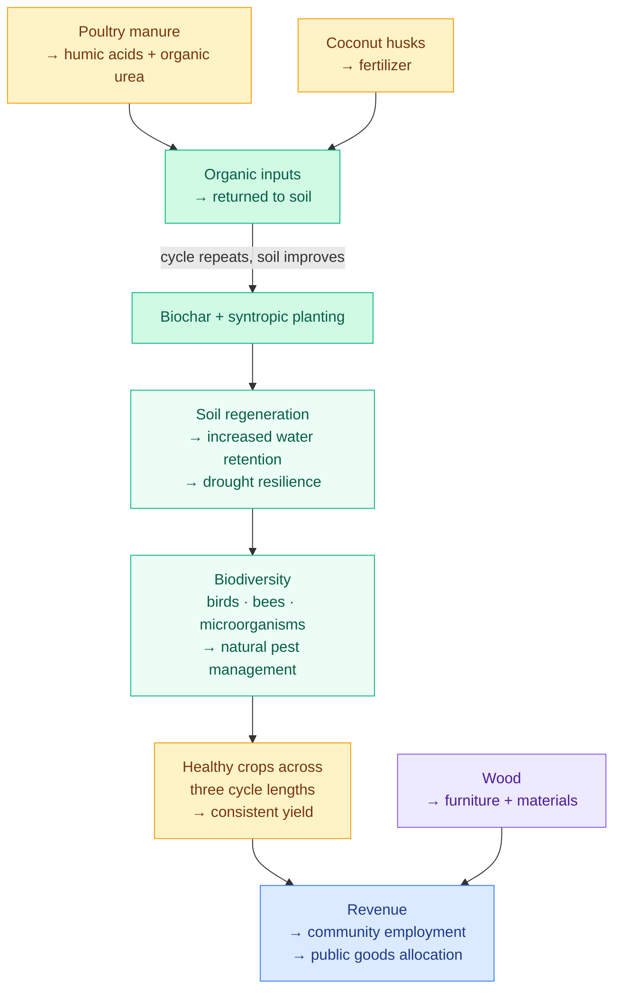

Fertile land absorbs far more atmospheric CO₂ than degraded land — storing it as carbon in the soil, reducing its atmospheric concentration, producing purer air, and creating the habitat conditions necessary for biodiversity. This single observation is the foundation of the Kokonut methodology: a farming system that improves the land it uses, rather than depleting it.

The [syntropic farming](/kokonut-framework/why-syntropic-farming) methodology that Kokonut builds on is not a collection of isolated techniques. It is a **circular system** — where each practice feeds the next, soil improvement enables greater yield, yield enables greater community benefit, and community benefit creates the economic incentive to continue restoring the land.

---

## The circular farming system

Every element of the Kokonut methodology connects to a cycle that becomes more productive — not less — with each passing season.



```text
Biochar + syntropic planting
          │
          ▼
Soil regeneration → increased water retention → drought resilience
          │
          ▼
Biodiversity: birds, bees, microorganisms → natural pest management
          │
          ▼
Healthy crops across three cycle lengths → consistent yield
          │
          ▼
Revenue → community employment + public goods allocation
          │
          ▼
Poultry manure → humic acids + organic urea → back to soil
          │
          ▼
Coconut husks → fertilizer · Wood → furniture + materials
          │
          └──────────────────────────────────────────────────►
                          Cycle repeats, soil improves
```

At [Adelphi](/ecosystem-wiki/kokonut-farms/adelphi/summary), this cycle is live: biochar from on-site bamboo feeds soil regeneration, which feeds multi-strata crop yields, which feed community employment and the public goods fund, while 110 free-range hens produce manure processed into humic acids that return to the beds. Nothing leaves the system as waste. Everything becomes an input to the next stage.

---

## Syntropic methodology — positive impact highlights

### 1. Zero soil degradation — the land improves every cycle

Conventional monoculture depletes soil organic matter with each harvest cycle, requiring ever-increasing synthetic inputs to maintain yield. The syntropic methodology inverts this: coconut husks are processed into on-site fertilizer; harvested wood becomes furniture and construction materials; biochar produced from farm-boundary bamboo is incorporated into all crop beds.

The result — documented via electrical conductivity and volumetric water content readings in the [MRV ground sensing stack](/ecosystem-wiki/kokonut-farms/measurement-reporting-and-verification) — is soil that improves in nutrient retention, water holding capacity, and microbial activity with each cycle rather than declining. Biochar addition alone provides an estimated **18% boost** to the farm's baseline carbon sequestration rate.

### 2. Living ecosystem, not a production monoculture

Kokonut farms are home to thousands of birds, bees, and microorganisms. Instead of depleting environmental resources through pesticide use and monoculture simplification, the syntropic multi-strata structure creates habitat — multiple vertical canopy layers that support pollinator populations, soil microbial communities, and wildlife corridors.

At [Adelphi](/ecosystem-wiki/kokonut-farms/adelphi/crops-biodiversity-and-infrastructure), this is active and documented: **12\+ endangered native species** are propagated in the on-site nursery and distributed free to neighboring communities. Vegetation health across the farm is tracked via satellite NDVI, NDRE, and MSAVI indices on each Sentinel overpass cycle. Water quality improvement flows from reduced runoff — cover crops and syntropic root systems prevent topsoil erosion that would otherwise carry sediment and agricultural residues into local waterways.

### 3. Regenerative model that promotes community quality of life

The syntropic farming methodology is not an extractive model that captures community surplus for distant shareholders. It is explicitly designed to embed economic benefit within the community that tends the land:

- **7 full-time positions** supported at Adelphi
- **~\$149,110 projected annual gross revenue** distributed within Monte Plata
- **~\$14,911/yr (10%)** allocated to public goods: community workshops, free native seedlings, the education gazebo, and weekend programs for children and the elderly The cooperative structure — through the [Kokonut DAO](/ecosystem-wiki/the-kokonut-dao/dao-layers) — ensures that farm revenue flows to the community that operates the farm, not through corporate supply chains that extract it before it arrives.

### 4. Community ownership of the production model

Kokonut farms operate under a model where the community is an integral part of the project, directly benefiting from its outputs. This means creating decent employment for families in the region, generating training and skill-building opportunities through the agro-ecological education programs, and treating the farm as a community asset rather than a private investment.

At Adelphi, this is embodied in the women-led founding structure — Yanny and Neury Hernández own and operate the farm, make all governance decisions, and design the community programs. The [Kokonut Manifesto's](/ecosystem-wiki/kokonut-101/manifesto) principle that community should always be prioritized over capital is enacted here at the operational level, not just the governance level.

### 5. Verified investment oversight — real-time, per-harvest, and annual

Farm data is not self-reported without verification. The Kokonut MRV stack produces three tiers of impact evidence that anyone can access:

- **Real-time:** All farm data flows to [hub.kokonut.network](https://hub.kokonut.network) — harvest records, MRV events, and impact metrics updated continuously
- **Per-harvest:** Crop cycle records document actual yield vs. projected, logged via the Atlantis App and anchored as EAS attestations on-chain
- **Annual:** EBF Framework impact report across Environmental, Economic, Social, and Sustainability dimensions — published and linked to on-chain attestation UIDs on Gnosis Chain

---

## Eco-friendly agriculture features

### Following Global Climate Goals

Kokonut Framework farms align with the United Nations Sustainable Development Goals — specifically SDGs 1, 2, 5, 8, and 15 — and contribute to Paris Agreement climate targets through active carbon sequestration. The methodology is not carbon-neutral: it is carbon-positive. Regenerative agriculture practices at Kokonut farms sequester an estimated **0.4–1.2 metric tons of CO₂ equivalent per acre per year**, with biochar application adding an additional ~18% to that baseline.

### Circular Farming System

The circular system means zero waste at the farm level — every output of one process becomes the input to another. Poultry manure → humic acids and organic urea → crop beds → forage for hens. Coconut husks → fertilizer. Bamboo from farm boundaries → biochar. Pruned syntropic species → biomass that builds soil organic matter. The farm is a closed-loop system where external inputs approach zero after establishment — reducing input costs, eliminating synthetic residues, and making the farm economically resilient to supply chain disruptions.

### Local Production, Land Use & Biodiversity

Kokonut farms produce food where it is consumed, employ people where they live, and restore the biodiversity of the land they use. Local production reduces food miles, supply chain intermediaries, and cold chain energy costs. Local employment keeps revenue within the community. Biodiversity restoration — through multi-strata planting, the native species nursery, and the elimination of pesticide use — improves ecosystem services (pollination, water filtration, carbon storage) that benefit the entire region, not just the farm.

### Water, Carbon & Energy

**Water:** The syntropic methodology's soil organic matter building dramatically increases water retention — measured via volumetric water content probes in the MRV ground sensing stack. Cover crops prevent runoff. The terraced terrain at Adelphi, managed with beard grass, prevents topsoil erosion during heavy rainfall. The result is lower irrigation requirement and improved watershed health downstream.

**Carbon:** Soil carbon sequestration is tracked and reported annually. Biochar provides long-duration carbon storage (centuries, not years). Agroforestry carbon in woody biomass above ground compounds over the farm's 20-year production horizon.

**Energy:** No-till and syntropic planting dramatically reduce the energy consumption associated with conventional tillage operations. On-site production of all fertility inputs (biochar, humic acids, organic urea) eliminates the embedded energy cost of synthetic fertilizer supply chains.

---

## Advantages of regenerative agriculture — at Adelphi

Each of the six standard advantages of regenerative agriculture is demonstrated and measured at Adelphi:

| **Advantage** | **How it works** | **At Adelphi** |
| --- | --- | --- |
| **Organic soil rebuilding** | Biochar, cover crops, compost cycling, and syntropic root systems build soil organic matter continuously | Biochar from on-site bamboo applied across all crop beds; poultry manure processed into humic acids and organic urea |
| **CO₂ absorption** | Healthy soil with high microbial activity converts atmospheric CO₂ into stable humus | 0.4–1.2 t CO₂e/acre/yr \+ ~18% biochar boost; tracked via satellite NDVI and annual soil tests |
| **Reduced tillage emissions** | No-till and syntropic planting eliminate CO₂ released by mechanical soil disturbance | Zero mechanical tillage — all bed preparation done through syntropic species succession and manual biochar application |
| **Soil erosion prevention** | Cover crops, terracing, and root systems prevent topsoil loss during rainfall events | Beard grass ground cover system along all terraced edges; syntropic deep root systems anchor slope stability |
| **Groundwater protection** | Eliminating synthetic pesticide and fertilizer runoff protects the water table and downstream waterways | 100% organic fertility inputs; zero synthetic pesticide use; reduced runoff via cover crop interception |
| **Reduced input costs** | On-site production of all fertility inputs eliminates synthetic fertilizer and pesticide procurement costs | All biochar, humic acids, and organic urea produced on-site from farm-sourced materials — zero external input cost after establishment |

---

## How methodology impact is measured and verified

The claims on this page are not assertions — they are tracked through the Kokonut [MRV stack](/ecosystem-wiki/kokonut-farms/measurement-reporting-and-verification) and anchored as on-chain EAS attestations:

- **Soil health:** Electrical conductivity and volumetric water content measured continuously by ground probes
- **Vegetation health:** NDVI, NDRE, MSAVI indices from Landsat 8 and Sentinel satellite imagery on each overpass
- **Carbon sequestration:** Calculated from vegetation index performance and soil organic matter test data; reported in the annual EBF impact report
- **Biodiversity:** Quarterly species surveys; per-plant health records via Silvi GPS tracking
- **Community impact:** Employment records, training participation counts, public goods distribution amounts — published to the [Data Hub](https://hub.kokonut.network/projects/41) Every annual impact report is anchored as an EAS attestation on Gnosis Chain — making Adelphi's methodology impact not just claimed, but cryptographically verifiable.

---

<CardGroup cols={2}>
  <Card title="Why Syntropic Farming" icon="seedling" href="/kokonut-framework/why-syntropic-farming">
    The argument for choosing syntropic farming — why this methodology is the right foundation for the Kokonut Framework.
  </Card>

  <Card title="5 Principles of Regeneration" icon="hand-holding-seedling" href="/kokonut-framework/framework-components/framework-features/5-principles-of-regeneration">
    The operational principles — cover crops, no-till, animal integration, perennial crops, and compost cycling — that produce the impacts described on this page.
  </Card>

  <Card title="MRV — Measurement & Verification" icon="magnifying-glass-chart" href="/ecosystem-wiki/kokonut-farms/measurement-reporting-and-verification">
    The full measurement stack — how satellite indices, soil probes, and community analytics turn methodology impact claims into verified, on-chain records.
  </Card>

  <Card title="Ecological Impact Frameworks" icon="leaf-heart" href="/kokonut-framework/framework-add-ons/ecological-impact-frameworks">
    EBF and CRISP — the external standards Kokonut uses to report and risk-assess the ecological impacts documented on this page.
  </Card>
</CardGroup>