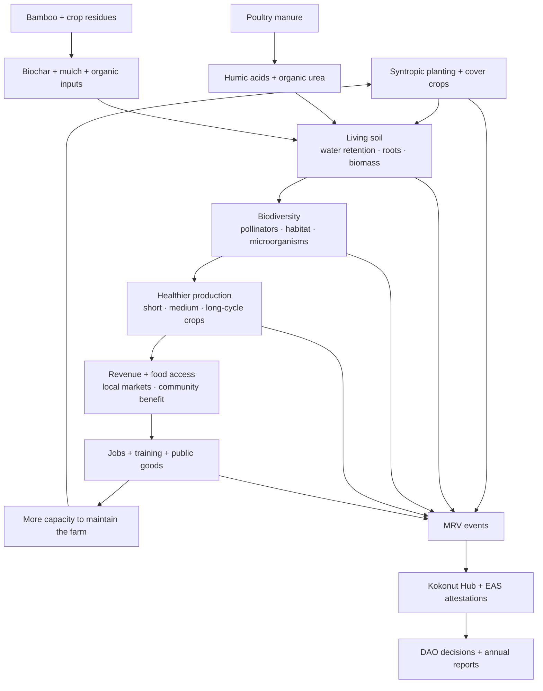
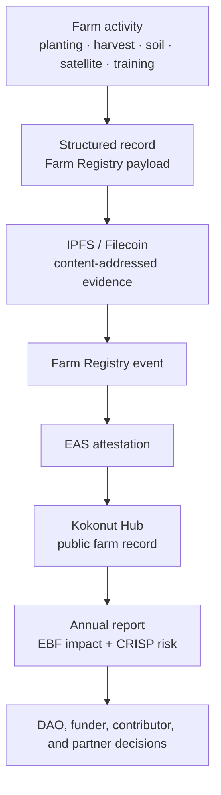

# Positive impact only matters when it can be measured.

Kokonut's methodology is built around a simple idea: a farm should improve the land and community it depends on, not deplete them.

That means positive impact cannot remain a slogan. It must be connected to specific practices, specific evidence, and a clear verification workflow that lets DAO members, farm operators, contributors, funders, researchers, and local communities inspect what is actually happening.

  <a href="#impact-loop" style={{ display: "inline-flex", alignItems: "center", gap: "6px", background: "#009F4D", color: "#fff", padding: "10px 20px", borderRadius: "8px", fontWeight: "600", fontSize: "14px", textDecoration: "none" }}>
    See the Impact Loop →
  </a>

  <a href="/ecosystem-wiki/kokonut-farms/measurement-reporting-and-verification" style={{ display: "inline-flex", alignItems: "center", gap: "6px", border: "1.5px solid #009F4D", color: "#009F4D", padding: "10px 20px", borderRadius: "8px", fontWeight: "600", fontSize: "14px", textDecoration: "none", background: "transparent" }}>
    Read MRV Methodology
  </a>

  Built for farm founders, DAO reviewers, Impact Guild contributors, grant reviewers, regenerative agriculture practitioners, and anyone evaluating Kokonut's impact claims.

  

    
5

    
regeneration principles

  

  

    
MRV

    
evidence workflow

  

  

    
EAS

    
public attestations

  

  

    
EBF

    
annual reporting

  

  

    
Adelphi

    
live reference farm

  

<Warning>
  This page describes Kokonut's impact methodology and the evidence needed to support positive-impact claims. It should not be used as a carbon-credit methodology, investment guarantee, yield guarantee, or certified environmental audit unless the relevant farm data has been verified through the MRV workflow and in accordance with the applicable reporting standards.
</Warning>

---

## What does positive impact mean in Kokonut

Positive impact means a farm can show evidence that its operations are improving ecological, economic, and community conditions over time.

| Impact area | What Kokonut wants to improve | Evidence needed |
| --- | --- | --- |
| Soil | Organic matter, water retention, nutrient cycling, and biological activity | Soil observations, moisture data, electrical conductivity, field logs, input records |
| Biodiversity | Species diversity, habitat, pollinator support, and native species propagation | Species inventory, geospatial records, nursery logs, satellite vegetation indices |
| Food production | Crop diversity, harvest reliability, and local food access | Planting records, crop cycle logs, harvest records, market/distribution records |
| Community value | Jobs, training, public goods, local ownership, skill-building | Payroll or role records, event attendance, public goods allocation, contributor reports |
| Governance trust | Clear decisions, transparent funding, public accountability | Proposal records, DAO votes, Data Hub records, EAS attestations, annual reports |

<Note>
  In Kokonut, positive impact is not one metric. It is a relationship between regenerative practice, local benefit, and verifiable evidence.
</Note>

---

## Impact loop

The methodology works as a circular farm system. Each practice should feed another part of the farm instead of becoming waste, dependency, or extraction.

The loop is useful only if each stage can be observed. That is why the methodology connects directly to [Measurement, Reporting, and Verification](/ecosystem-wiki/kokonut-farms/measurement-reporting-and-verification).

---

## The five positive-impact pathways

<CardGroup cols={2}>
  <Card title="1. Soil regeneration" icon="seedling">
    Cover crops, living roots, compost, biochar, manure processing, and reduced disturbance are used to build soil function rather than degrade it after each harvest.
  </Card>

  <Card title="2. Biodiversity restoration" icon="leaf">
    Multi-strata planting, native species propagation, nursery work, pollinator habitat, and reduced synthetic inputs make biodiversity part of the production system.
  </Card>

  <Card title="3. Circular input use" icon="arrows-rotate">
    Poultry manure, bamboo, coconut husks, crop residues, pruning biomass, and other farm outputs are turned back into fertility, mulch, feed, or materials.
  </Card>

  <Card title="4. Community value" icon="people-group">
    The farm is designed to create local jobs, training opportunities, food access, public goods funding, and community participation, rather than extracting value from the land.
  </Card>

  <Card title="5. Verifiable reporting" icon="stamp">
    Impact claims are connected to Data Hub records, field logs, MRV payloads, IPFS records, EAS attestations, and annual reporting workflows.
  </Card>

  <Card title="Ongoing improvement" icon="chart-line">
    Positive impact is not a one-time status. It should improve as the farm learns from field data, crop cycles, DAO review, and community feedback.
  </Card>
</CardGroup>

---

## From practice to evidence

| Farm practice | Positive-impact claim | Verification pathway |
| --- | --- | --- |
| Cover crops and living roots | Soil is protected, and erosion risk is reduced | Field photos, plot logs, vegetation indices, erosion observations |
| Biochar and composted inputs | Soil fertility and water retention are being improved | Input records, soil observations, moisture data, and annual reporting |
| Multi-strata syntropic planting | Biodiversity and production resilience are improving | Geospatial plant records, crop diversity logs, satellite NDVI/NDRE/MSAVI |
| Poultry integration | Waste becomes fertility and daily food production | Hen records, egg records, manure-processing logs, farm input records |
| Native species nursery | At-risk and native species are being propagated | Nursery inventory, distribution records, GPS/per-plant records |
| Education and training | Knowledge is spreading beyond the farm | Workshop records, attendance, community reports, contributor logs |
| Public goods allocation | Revenue supports local and ecosystem benefits | Treasury records, proposal reports, and public goods allocation logs |

This structure reduces the risk of greenwashing because every claim must ultimately point to a record.

---

## What should be measured?

The methodology becomes credible when it creates repeated observations across time.

| Category | Example indicators | Why it matters |
| --- | --- | --- |
| Soil and water | Soil moisture, electrical conductivity, soil temperature, and field observations | Shows whether the land is becoming more resilient and easier to manage |
| Vegetation | NDVI, NDRE, ReCI, MSAVI, canopy development, ground cover | Shows plant health, cover, and ecological trend over time |
| Biodiversity | Species inventory, native species propagation, pollinator observations | Shows whether the farm is becoming more diverse and habitat-rich |
| Production | Crop cycle records, harvest volume, loss rate, revenue, market channel | Shows whether regenerative practices are supporting real production |
| Community | Jobs, training, public goods allocation, events, and local participation | Shows whether value is reaching people around the farm |
| Governance | Proposals, funding decisions, milestones, reports, attestations | Shows whether capital and decisions are accountable |

<Info>
  Climate and carbon outcomes should be treated as co-benefits until supported by appropriate methodology, soil data, vegetation data, reporting periods, and verification. Estimates can help with planning, but they should not be presented as certified carbon credits or guaranteed sequestration.
</Info>

---

## In practice: Adelphi

[Adelphi](/ecosystem-wiki/kokonut-farms/adelphi/summary) is Kokonut's live reference farm for this methodology.

The farm system includes syntropic crop beds, agroforestry species, native species propagation, a nursery and biofactory, free-range poultry, training infrastructure, geospatial monitoring, and public MRV records.

| Methodology element | Adelphi implementation |
| --- | --- |
| Syntropic planting | Two dedicated syntropic plots and multi-cycle crop planning |
| Soil regeneration | Bamboo biochar, cover crops, humic acids, organic urea, and reduced synthetic dependency |
| Biodiversity | 12\+ at-risk species, native species nursery, agroforestry species, and pollinator habitat |
| Circularity | Poultry manure returns to crop beds; bamboo and crop residues become soil inputs |
| Community benefit | Jobs, education gazebo, weekend programming, free native seedlings, local food production |
| MRV | Field logs, satellite indices, farm data records, Kokonut Hub, and EAS attestations |

[Explore Adelphi's infrastructure →](/ecosystem-wiki/kokonut-farms/adelphi/crops-biodiversity-and-infrastructure)

---

## How does a positive impact become a public record

Kokonut's MRV workflow turns farm activity into evidence that can be inspected and used.

This is the difference between an impact claim and a verifiable impact claim.

---

## What this methodology does not guarantee

Positive-impact methodology improves the conditions for regeneration, but it does not remove risk.

| Risk | Why it still matters |
| --- | --- |
| Weather risk | Drought, storms, heat, rainfall timing, and local climate conditions can affect outcomes |
| Execution risk | Practices only work if the farm team implements them consistently and records them accurately |
| Market risk | Revenue depends on price, demand, distribution, certification, and buyer relationships |
| Data-quality risk | Bad data can make good work hard to verify, or weak claims look stronger than they are |
| Carbon-claim risk | Carbon language requires methodology, measurement, reporting periods, and verification |
| Governance risk | DAO funding and reporting depend on clear proposals, accountability, and follow-through |

<Warning>
  Do not treat this methodology as proof by itself. Treat it as the operating logic for producing evidence that can later be reviewed, verified, and improved.
</Warning>

---

## How to use this page

<CardGroup cols={2}>
  <Card title="For farm founders" icon="tractor">
    Use this methodology to design farm operations that generate both production and evidence from the beginning.
  </Card>

  <Card title="For DAO reviewers" icon="scale-balanced">
    Use it to evaluate whether a farm proposal has credible regenerative practices and a realistic verification path.
  </Card>

  <Card title="For Impact Guild contributors" icon="magnifying-glass-chart">
    Use it to decide what data to request, what claims to verify, and where evidence is still missing.
  </Card>

  <Card title="For grant reviewers and partners" icon="handshake">
    Use it to understand how Kokonut connects regenerative practice to public reporting and accountability.
  </Card>
</CardGroup>

---

## Next steps

<CardGroup cols={2}>
  <Card title="Why Syntropic Farming" icon="seedling" href="/kokonut-framework/why-syntropic-farming">
    The agricultural logic behind the positive-impact methodology.
  </Card>

  <Card title="5 Principles of Regeneration" icon="hand-holding-seedling" href="/kokonut-framework/framework-components/framework-features/5-principles-of-regeneration">
    The operating principles behind soil cover, biodiversity, animal integration, perennial systems, and organic inputs.
  </Card>

  <Card title="MRV Methodology" icon="magnifying-glass-chart" href="/ecosystem-wiki/kokonut-farms/measurement-reporting-and-verification">
    How farm activity becomes structured evidence, IPFS records, EAS attestations, and public reporting.
  </Card>

  <Card title="Adelphi Infrastructure" icon="puzzle" href="/ecosystem-wiki/kokonut-farms/adelphi/crops-biodiversity-and-infrastructure">
    The live farm infrastructure that produces crops, biodiversity, poultry, soil, and MRV evidence.
  </Card>

  <Card title="Pillars of Value" icon="columns-3" href="/kokonut-framework/framework-components/pillars-of-value">
    How the DAO evaluates whether a farm creates value worth funding.
  </Card>

  <Card title="Ecological Impact Frameworks" icon="leaf-heart" href="/kokonut-framework/framework-add-ons/ecological-impact-frameworks">
    EBF and CRISP — the external impact and risk frameworks Kokonut uses for reporting.
  </Card>
</CardGroup>

  <a href="/ecosystem-wiki/kokonut-farms/measurement-reporting-and-verification" style={{ display: "inline-flex", alignItems: "center", gap: "6px", background: "#009F4D", color: "#fff", padding: "10px 20px", borderRadius: "8px", fontWeight: "600", fontSize: "14px", textDecoration: "none" }}>
    Read MRV Methodology →
  </a>

  <a href="https://hub.kokonut.network/projects/41" style={{ display: "inline-flex", alignItems: "center", gap: "6px", border: "1.5px solid #009F4D", color: "#009F4D", padding: "10px 20px", borderRadius: "8px", fontWeight: "600", fontSize: "14px", textDecoration: "none", background: "transparent" }}>
    Explore Adelphi Data
  </a>

