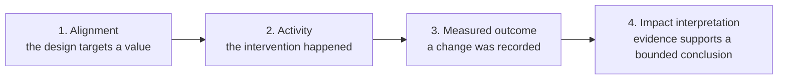
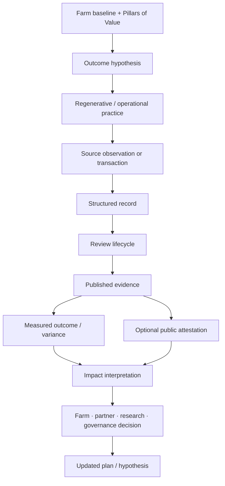
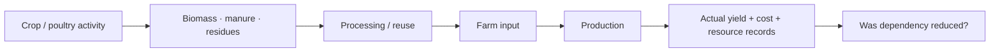

# Positive impact is an interpretation earned by evidence — not a label attached to a practice.

Kokonut farms are designed to create useful ecological, economic, social, and public value.

That intention matters.

It is not enough.

A farm can:

- use syntropic practices;
- plant native species;
- apply biochar;
- create jobs;
- host training;
- publish records;
- receive funding;
- create an EAS attestation;

and still need more evidence before claiming that soil health, biodiversity, livelihoods, food access, climate outcomes, or community well-being **improved because of the intervention**.

The Positive Impact Methodology exists to keep those stages separate.

> **Design for positive change → document the activity → measure what changed → review the evidence → interpret the outcome with its limits visible.**

<CardGroup cols={2}>
  <Card title="Start with the Pillars of Value" icon="square-poll-vertical" href="/kokonut-framework/framework-components/pillars-of-value">
    Define WHAT, WHO, HOW MUCH, CONTRIBUTION, RISK, and PUBLIC GOODS before making stronger value claims.
  </Card>

  <Card title="Ground the farm practice" icon="hand-holding-seedling" href="/kokonut-framework/framework-components/framework-features/5-principles-of-regeneration">
    Use the five regeneration principles to describe the operating practices without treating them as outcomes.
  </Card>

  <Card title="Follow the evidence lifecycle" icon="magnifying-glass-chart" href="/ecosystem-wiki/kokonut-farms/measurement-reporting-and-verification">
    See how observations become structured records, review, publication, optional attestations, and interpretation.
  </Card>

  <Card title="See the method at Adelphi" icon="seedling" href="/ecosystem-wiki/kokonut-farms/adelphi/sustainable-development-goals">
    Review which current farm claims are documented state, forecast, activity, measured outcome, or still only interpretation hypotheses.
  </Card>
</CardGroup>

<Warning>
  **This is not a carbon-credit methodology, ecological certification, social-impact audit, investment model, or guarantee of positive outcomes.** Where an external standard or regulated claim requires a specific methodology, verifier, sampling protocol, legal process, or assurance provider, that requirement remains separate.
</Warning>

---

## The impact claim ladder

The methodology uses four levels.

```mermaid
flowchart LR
    A["1. Alignment<br/>the design targets a value"] --> B["2. Activity<br/>the intervention happened"]
    B --> C["3. Measured outcome<br/>a change was recorded"]
    C --> D["4. Impact interpretation<br/>evidence supports a bounded conclusion"]
```

| Level | Question | Example | What is still missing |
| --- | --- | --- | --- |
| **1 — Alignment** | What positive change is the design intended to support? | Syntropic design is intended to support soil cover and biological diversity | No proof the activity occurred or produced the intended change |
| **2 — Activity** | What intervention actually happened? | Ground cover was maintained; biochar was applied; seedlings were propagated | Outcome still needs measurement |
| **3 — Measured outcome** | What changed during a defined period? | Ground-cover percentage increased; a harvest quantity was recorded; seedling survival was measured | Causality, durability, distribution, and broader impact may remain uncertain |
| **4 — Impact interpretation** | What does the evidence reasonably support? | Evidence supports a bounded conclusion about land condition, production, work, learning, or public benefit | Interpretation must still preserve limitations and alternative explanations |

<Info>
  Most overclaiming happens when documentation jumps directly from **alignment or activity** to **impact interpretation**.
</Info>

---

## Positive impact in Kokonut

Within this Framework, **positive impact** means:

> **A documented intervention is associated with a beneficial change that has been measured over a defined boundary and period, reviewed using an appropriate method, and interpreted with contribution, risk, uncertainty, and alternative explanations visible.**

That definition has several consequences.

A positive-impact statement should normally be able to answer:

- **WHAT** changed?
- **WHO** or what experienced the change?
- **HOW MUCH** changed, over what period?
- What did the intervention **CONTRIBUTE**?
- What **RISK**, uncertainty, bias, or downside remains?
- Did any **PUBLIC GOODS** or shared value actually reach beyond the immediate private transaction?
- What source record supports the statement?
- What baseline or comparison exists?
- Who reviewed the record?
- Is the conclusion broader than the evidence?

If those questions cannot yet be answered, use a narrower claim.

---

## The methodology in one flow

```mermaid
flowchart TD
    A["Farm baseline + Pillars of Value"] --> B["Outcome hypothesis"]
    B --> C["Regenerative / operational practice"]
    C --> D["Source observation or transaction"]
    D --> E["Structured record"]
    E --> F["Review lifecycle"]
    F --> G["Published evidence"]
    G --> H["Measured outcome / variance"]
    H --> I["Impact interpretation"]
    I --> J["Farm · partner · research · governance decision"]
    J --> K["Updated plan / hypothesis"]

    G --> L["Optional public attestation"]
    L --> I
```

The public attestation is intentionally **not** placed between the record and scientific truth.

It can improve provenance.

It does not determine the interpretation.

---

## Five operational pathways

The Framework currently groups positive-impact work into five practical pathways.

These are **pathways for intervention and evidence**, not automatically achieved outcomes.

<CardGroup cols={2}>
  <Card title="1. Soil & land condition" icon="seedling">
    Soil cover, living roots, reduced disturbance, biological inputs, biomass management, water handling, and related land practices.
  </Card>

  <Card title="2. Biodiversity & habitat" icon="leaf">
    Multi-species systems, agroforestry, nursery propagation, habitat structure, species records, and biodiversity-oriented management.
  </Card>

  <Card title="3. Production & resource cycling" icon="arrows-rotate">
    Crop and poultry production, biomass reuse, manure/nutrient loops, input substitution, harvests, losses, and resource-flow efficiency.
  </Card>

  <Card title="4. People & community value" icon="users">
    Work, skills, training, food production, local participation, public-benefit activities, and the distribution of value and risk.
  </Card>

  <Card title="5. Evidence, learning & accountability" icon="magnifying-glass-chart">
    Baselines, operational records, review states, publication, optional attestations, reports, variance analysis, and method improvement.
  </Card>

  <Card title="Continuous improvement" icon="chart-line">
    Actual results should be allowed to change the farm plan, forecast, risk register, evidence design, and future claims.
  </Card>
</CardGroup>

---

## 1. Soil & land condition

### Intervention examples

- maintain living or biomass cover;
- reduce unnecessary mechanical disturbance;
- retain living roots;
- apply compost, biochar, manure-derived or other biological inputs;
- manage erosion;
- improve irrigation or water handling;
- maintain perennial structure.

### Safe activity-level claims

- “Biochar was applied to the documented plot.”
- “Ground cover was maintained during the reporting period.”
- “The farm reduced a documented category of external input.”
- “The plot is managed using reduced-disturbance practices.”

### Stronger outcome claims require evidence

| Stronger claim | Useful evidence |
| --- | --- |
| Soil moisture improved | Baseline + repeated moisture measurements with comparable method/context |
| Erosion risk decreased | Before/after observations, cover measurement, runoff/erosion indicators |
| Soil fertility improved | Defined soil indicators, repeated testing, input context |
| External-input dependency decreased | Procurement and application records across comparable periods |
| Soil carbon increased | Appropriate carbon methodology, baseline, sampling, boundary, period, uncertainty, review |

<Warning>
  **Biochar, compost, cover crops, or syntropic design do not by themselves establish soil restoration or carbon sequestration.**
</Warning>

---

## 2. Biodiversity & habitat

### Intervention examples

- multi-species planting;
- agroforestry;
- native or at-risk species propagation;
- nursery operations;
- habitat structure;
- reduced bare soil;
- pollinator-oriented planting;
- survival and distribution programs.

### Evidence can progress from simple to stronger

| Evidence stage | Example |
| --- | --- |
| **Inventory** | Species / seedling list |
| **Implementation** | Planting, propagation, or distribution record |
| **Spatial evidence** | Plot, GPS, imagery, habitat location |
| **Repeated outcome** | Survival, abundance, repeat survey, habitat-use observation |
| **Interpretation** | Bounded conclusion about biodiversity or habitat condition |

Remote-sensing indices such as NDVI, NDRE, ReCI, and MSAVI can help describe vegetation patterns.

They do not directly prove biodiversity restoration.

### Conservation-status caution

Repository materials use terms such as:

- native;
- at-risk;
- endangered;
- critically threatened.

Those terms should not be treated as interchangeable.

External biodiversity reporting should verify conservation status **species by species** against the appropriate authoritative source.

---

## 3. Production & resource cycling

A regenerative farm still has to operate as a farm.

Positive-impact methodology should therefore include:

- planted area and quantity;
- harvest;
- losses/rejections;
- realized selling price;
- inputs;
- labor;
- water;
- transport;
- recurring costs;
- resource reuse;
- waste/material flows.

### Circularity is a hypothesis until the loop is recorded

For example:

```mermaid
flowchart LR
    A["Crop / poultry activity"] --> B["Biomass · manure · residues"]
    B --> C["Processing / reuse"]
    C --> D["Farm input"]
    D --> E["Production"]
    E --> F["Actual yield + cost + resource records"]
    F --> G["Was dependency reduced?"]
```

A farm can intend to create a circular loop without fully closing it.

To claim that a practice reduced dependency or improved efficiency, compare:

- external inputs before/after;
- internally reused materials;
- labor required;
- cost;
- yield/quality;
- losses;
- any new risks created.

### Forecast remains separate from actual

> **A modeled crop yield, price, or revenue is not a positive-impact outcome.**

Use actual harvest and financial records to test the production hypothesis.

---

## 4. People & community value

Community value cannot be inferred from good intentions.

### Activity-level evidence can include

- job/role records;
- training sessions;
- attendance;
- public-space use;
- seedling distribution;
- food sales/distribution;
- partnership activity;
- open documentation;
- public-benefit expenditures.

### Stronger claims require stronger evidence

| Claim | Additional evidence needed |
| --- | --- |
| “Jobs were created” | Role, dates, status, responsible employer/operator |
| “Decent work improved” | Compensation, safety, duration, working conditions, worker evidence |
| “Training increased skills” | Participation plus learning/competency evidence |
| “Food access improved” | Distribution, affordability/access, target population, period |
| “Poverty decreased” | Household/income/beneficiary evidence appropriate to the claim |
| “Gender equality improved” | Participation, income, decision power, opportunity, distribution data beyond women-led ownership |
| “Public goods were delivered” | Approved arrangement, actual delivery/transfer, use/access records |

<Info>
  **Women-led ownership is a documented characteristic. It is not by itself evidence that wider gender inequality decreased.**
</Info>

---

## 5. Evidence, learning & accountability

This pathway makes the other four more inspectable.

It includes:

- source records;
- provenance;
- timestamps;
- methods;
- reviewers;
- lifecycle status;
- publication;
- evidence pointers;
- reports;
- optional attestations;
- forecast-vs-actual variance;
- revised assumptions.

The durable MRV sequence is:

> **observe → structure → review → publish → attest when useful → interpret**

Not every record needs:

- IPFS;
- Filecoin;
- EAS;
- an on-chain transaction.

Use those tools when durable public provenance materially improves the claim or governance process.

---

## Evidence maturity

A positive-impact methodology needs more than a single “verified / not verified” flag.

| Evidence maturity | Meaning |
| --- | --- |
| **Planned** | Method or evidence is defined before execution |
| **Observed** | A source event, condition, or transaction was recorded |
| **Measured** | A quantity or defined indicator was captured |
| **Reviewed** | An authorized reviewer/process checked the record |
| **Published** | The record can be used in governed downstream surfaces |
| **Attested** | A signed provenance statement exists where useful |
| **Interpreted** | A method/context supports a bounded conclusion |

<Note>
  Kokonut Intelligence's internal **Verified** workflow state belongs inside **Reviewed** here. It means authorized internal review, not scientific certification, regulatory approval, third-party audit, or environmental-credit eligibility.
</Note>

---

## Minimum impact-claim packet

For a material positive-impact statement, record at least:

| Field | Requirement |
| --- | --- |
| **Claim** | What exactly is being asserted? |
| **Claim level** | Alignment, activity, measured outcome, or impact interpretation? |
| **Farm / boundary** | Which farm, plot, stakeholder group, ecosystem, or system? |
| **Baseline** | What was the starting condition when relevant? |
| **Intervention** | What action is hypothesized to contribute? |
| **Metric / indicator** | What was observed or measured? |
| **Method** | How was it measured/calculated? |
| **Reporting period** | What dates does it cover? |
| **Actual / forecast** | Is this real observed performance or a model? |
| **Source** | What record or dataset supports it? |
| **Record status** | Draft, submitted, verified/rejected, published? |
| **Reviewer** | Who or what authorized the review? |
| **Contribution context** | What else may have caused the outcome? |
| **Risk / uncertainty** | What can weaken or reverse the interpretation? |
| **Evidence pointer** | Hub record, dataset, file, CID, attestation, report? |
| **Next evidence** | What would strengthen or falsify the claim? |

This packet can support:

- SDG interpretation;
- Pillars of Value analysis;
- 8 Forms of Capital reporting;
- EBF / CRISP work;
- grants;
- partner reports;
- research;
- governance review.

---

## Contribution and causality

Positive impact is stronger than documenting that an activity happened.

A credible interpretation asks:

- What was the baseline?
- What changed?
- Did the intervention occur before the change?
- Were measurements comparable?
- What other factors changed?
- What role did weather play?
- What role did markets, partners, policy, or community activity play?
- Would some change likely have happened anyway?
- Is the conclusion local to this plot/group/period, or being generalized too far?

This does not require pretending every farm study is a randomized experiment.

It does require matching the **strength of the language to the strength of the evidence**.

### Example

Too strong:

> “Syntropic farming restored Adelphi's biodiversity.”

Better at activity level:

> “Adelphi operates two documented syntropic plots and maintains nursery/agroforestry species relevant to biodiversity objectives.”

Potential stronger future interpretation:

> “Across **[defined plots]** from **[baseline period]** to **[reporting period]**, **[defined biodiversity indicator]** changed by **[measured amount]** under **[documented management]**. The interpretation is limited by **[weather / sampling / comparison / attribution constraints]**.”

---

## Risk belongs inside the impact claim

An impact claim can weaken or reverse.

Examples:

| Impact area | Persistence / reversal risk |
| --- | --- |
| Soil | Later disturbance, erosion, drought, input changes |
| Biodiversity | Mortality, habitat change, invasive pressure, management change |
| Jobs | Seasonality, funding loss, farm economics |
| Training | No retention or practical use of skills |
| Public goods | Funding assumptions fail; program stops |
| Open data | Stale, incomplete, inaccessible, or privacy-inappropriate records |
| Carbon | Reversal, boundary, permanence, leakage, methodology failure |

That is why the Pillars include **RISK**.

> **A positive outcome with high reversal risk should not be reported as if it were permanent.**

---

## Interpretation layers

Kokonut uses several frameworks that can sit **above** the evidence.

| Layer | Function | Does not automatically provide |
| --- | --- | --- |
| **Pillars of Value** | Structures WHAT, WHO, HOW MUCH, CONTRIBUTION, RISK, PUBLIC GOODS | Impact score or funding verdict |
| **8 Forms of Capital** | Categorizes types of value | Common unit of measurement |
| **SDGs** | Maps evidence to development goals | UN certification or proof of contribution |
| **EBF** | Organizes ecological-benefit interpretation | External ecological certification |
| **CRISP** | Supports risk analysis | Elimination of project risk |
| **Impact Calculator** | Structures scenario/evidence readiness | Measured outcomes |
| **Kokonut Intelligence** | Stores, reviews, analyzes, reports, and supports attestations | Replacement for methodology |

These layers should consume evidence.

They should not manufacture it.

---

## Public records and attestations

### Publication

A published record means the record is usable in the relevant downstream surface.

It does not mean the record is independently certified.

### EAS

An EAS attestation can help establish:

- who signed;
- when;
- schema;
- reference/evidence pointer;
- claim provenance.

It cannot establish by itself:

- that the measurement was methodologically sound;
- that the source was truthful;
- that causality was demonstrated;
- that a carbon quantity is valid;
- that biodiversity improved;
- that an SDG outcome occurred.

### IPFS / Filecoin

Content-addressed storage can help preserve evidence artifacts.

It is not required for every record.

And content addressing proves file identity/integrity—not the truth of the file's contents.

---

## Adelphi: current positive-impact evidence map

Adelphi is Kokonut's first live reference implementation for this methodology.

It is useful precisely because its current evidence is **mixed in maturity**.

| Area | Strong current claim | Current class | Stronger interpretation still needs |
| --- | --- | --- | --- |
| Farm status | Adelphi is a live women-led regenerative farm | Documented state | Current Hub records for changeable details |
| Land | 15,725 m² total mapped; 13,838 m² agricultural | Documented state | Stable spatial definitions across future comparisons |
| Work | Seven jobs are documented | Documented state | Role type, duration, compensation, safety, worker outcomes |
| Poultry | 110 hens are documented | Documented state | Actual longitudinal egg/health/feed/economic records |
| Syntropic system | Two syntropic plots are documented | Implemented practice | Repeated soil, vegetation, biodiversity, production outcomes |
| Biochar | Bamboo-derived biochar practice is documented | Implemented practice | Application records + repeated soil/carbon evidence |
| Nursery | Native/at-risk propagation is documented | Implemented practice | Verified species status, survival, distribution, repeat biodiversity evidence |
| Remote sensing | NDVI, NDRE, ReCI, MSAVI are available methods | Derived indicators / capability | Defined baseline, comparable periods, field interpretation |
| Crop economics | Crop production/revenue values are modeled | Forecast | Harvest, price, sales, cost actuals |
| Public goods | Training/community/nursery/open-evidence activities are documented or planned; 10% appears in current farm model | Activity + forecast assumption | Approved arrangement, actual transfers/delivery, beneficiary/use records |
| SDG 1/2/5/8/15 | Relevant to the farm design and documented activity | Alignment + activity | Outcome evidence appropriate to each SDG |
| Climate | Biochar/agroforestry/soil practices are climate-relevant | Co-benefit hypothesis | Carbon methodology, baseline, measurements, uncertainty, review |

<Warning>
  **Adelphi demonstrates an integrated implementation and evidence system. It does not yet prove universal replication, biodiversity restoration, poverty reduction, verified carbon sequestration, guaranteed economics, or every higher-level impact claim associated with regenerative agriculture.**
</Warning>

<CardGroup cols={2}>
  <Card title="Adelphi SDG evidence" icon="recycle" href="/ecosystem-wiki/kokonut-farms/adelphi/sustainable-development-goals">
    Inspect the current alignment → activity → outcome → impact boundaries for the five primary SDGs.
  </Card>

  <Card title="Physical farm systems" icon="puzzle" href="/ecosystem-wiki/kokonut-farms/adelphi/crops-biodiversity-and-infrastructure">
    See the documented plots, crops, poultry, nursery, biofactory, infrastructure, and ecological evidence needs.
  </Card>

  <Card title="Forecast vs. actuals" icon="calculator" href="/ecosystem-wiki/kokonut-farms/adelphi/crops-and-harvest-forecast">
    Review which production and economic values remain model assumptions.
  </Card>

  <Card title="Published farm records" icon="chart-line" href="https://hub.kokonut.network/projects/41">
    Use the Hub for current published farm/project data rather than treating static methodology pages as live state.
  </Card>
</CardGroup>

---

## Positive-impact reporting cadence

Impact should be interpreted over reporting periods, not as a permanent farm badge.

A periodic review should reconcile:

1. baseline;
2. planned intervention;
3. what was actually implemented;
4. actual production / finance / work / ecology records;
5. data quality and missing evidence;
6. risk events;
7. forecast variance;
8. stakeholder distribution;
9. Pillars of Value;
10. SDG / EBF / CRISP interpretation where appropriate;
11. unresolved uncertainty;
12. next-period evidence plan.

### A report should distinguish

- **documented state**;
- **forecast / target**;
- **implemented activity**;
- **measurement / actual**;
- **derived indicator**;
- **reviewed / published record**;
- **attestation**;
- **impact interpretation**.

Do not compress them into one “impact achieved” column.

---

## What software and AI can do

Kokonut Intelligence and AI agents can support the methodology by:

- checking record completeness;
- classifying claim/evidence maturity;
- comparing forecast vs. actual;
- calculating documented indicators;
- flagging missing baselines;
- identifying stale records;
- assembling evidence packets;
- drafting Pillars / SDG / EBF interpretations;
- surfacing contradictory claims;
- routing records for review.

They should not independently:

- certify positive impact;
- declare regulatory compliance;
- validate carbon-credit eligibility;
- decide scientific causality;
- conceal uncertainty;
- rewrite failed outcomes as successful ones;
- publish high-impact conclusions without the required human/domain review.

<Info>
  **Automation should make evidence easier to inspect—not make weak claims easier to scale.**
</Info>

---

## Common failure modes

| Failure mode | Better practice |
| --- | --- |
| “The farm uses regenerative practices, therefore it has positive impact.” | Report the practices first; measure outcomes separately |
| “The record is Verified, so the science is verified.” | Treat Verified as internal workflow review only |
| “EAS proves the claim.” | Use EAS for provenance; evaluate the underlying method/evidence separately |
| “The dashboard shows it, so it is current.” | Check source, record status, reporting period, freshness |
| “NDVI increased, therefore biodiversity improved.” | Treat NDVI as a vegetation indicator; use biodiversity-specific evidence for biodiversity claims |
| “Seven jobs means poverty decreased.” | Report seven documented jobs; measure livelihood outcomes separately |
| “Women-led means gender equality improved.” | Report women-led ownership/operation; measure broader outcomes separately |
| “Biochar means carbon sequestration was verified.” | Use the applicable carbon methodology before quantifying/crediting carbon |
| “10% public goods means 10% was distributed.” | Separate modeled, approved, transferred, and used amounts |
| “The DAO funded it, so impact was validated.” | Funding authorization and impact evidence are different |
| “The farm improved because the intervention existed.” | Examine baseline, timing, alternative explanations, and contribution |
| “One successful farm proves the Framework scales.” | Treat Terra Viva and future farms as additional replication tests |

---

## Current maturity

| Surface | Status | Interpretation |
| --- | --- | --- |
| **Positive-impact methodology** | **Active and evolving** | Current Framework method for moving from intervention to bounded interpretation |
| **Claim ladder** | **Active methodology** | Alignment → activity → measured outcome → impact interpretation |
| **Adelphi implementation** | **Live reference** | Strongest current integrated farm example |
| **Adelphi outcome evidence** | **Mixed maturity** | Some documented states/activities; stronger longitudinal outcomes remain evidence-dependent |
| **MRV** | **Active and evolving** | Evidence methodology supporting impact claims |
| **Kokonut Intelligence** | **Active infrastructure** | Data lifecycle, analytics, reports, and attestation support |
| **EAS on Celo** | **Live infrastructure** | Provenance capability; individual claim quality remains evidence-dependent |
| **EBF / CRISP** | **Interpretation / decision support** | Do not equal external certification |
| **SDG interpretation** | **Active and evolving** | Evidence-aware claim ladder; not independent certification |
| **Automated impact interpretation** | **Decision support / developing** | Requires review; not an autonomous verification authority |
| **Cross-farm impact comparison** | **Developing** | Needs consistent semantics, baselines, periods, methods, and multi-farm evidence |

---

## How different readers should use this methodology

<CardGroup cols={2}>
  <Card title="Farm operators" icon="tractor">
    Design practices and records together, then let actual performance change the next operating decision.
  </Card>

  <Card title="Impact & research reviewers" icon="microscope">
    Match claim strength to evidence strength, examine baseline/contribution/risk, and preserve methodological limits.
  </Card>

  <Card title="Capital governance participants" icon="building-columns">
    Use impact hypotheses and evidence when reviewing funding without treating treasury authorization as impact validation.
  </Card>

  <Card title="Guilds & contributors" icon="users">
    Turn evidence gaps into bounded research, documentation, MRV, data, and operational work.
  </Card>

  <Card title="Partners & grant reviewers" icon="file-signature">
    Trace material claims to source records, reporting periods, methods, reviewers, and unresolved uncertainty.
  </Card>

  <Card title="Developers & agent builders" icon="code">
    Build tools that preserve claim classes, provenance, review states, uncertainty, and the boundary between data and interpretation.
  </Card>
</CardGroup>

---

## Continue through the Framework

<CardGroup cols={2}>
  <Card title="Pillars of Value" icon="square-poll-vertical" href="/kokonut-framework/framework-components/pillars-of-value">
    Structure WHAT, WHO, HOW MUCH, CONTRIBUTION, RISK, and PUBLIC GOODS before interpreting value.
  </Card>

  <Card title="5 Principles of Regeneration" icon="hand-holding-seedling" href="/kokonut-framework/framework-components/framework-features/5-principles-of-regeneration">
    See the operating practices that can create testable regenerative hypotheses.
  </Card>

  <Card title="8 Forms of Capital" icon="water" href="/kokonut-framework/framework-components/framework-features/8-forms-of-capital">
    Categorize forms of value without treating them as interchangeable measurement units.
  </Card>

  <Card title="SDG Methodology" icon="recycle" href="/kokonut-framework/framework-features/Sustainable-Development-Goals">
    Map evidence to development goals without turning alignment into verified impact.
  </Card>

  <Card title="Ecological Impact Frameworks" icon="leaf" href="/kokonut-framework/framework-add-ons/ecological-impact-frameworks">
    Use EBF and CRISP as interpretation/risk tools above the evidence layer.
  </Card>

  <Card title="MRV Methodology" icon="magnifying-glass-chart" href="/ecosystem-wiki/kokonut-farms/measurement-reporting-and-verification">
    Follow the underlying evidence lifecycle from observation to publication and interpretation.
  </Card>
</CardGroup>

> **Positive impact becomes credible when the documentation is willing to say not only what improved, but what was measured, for whom, over what period, compared with what baseline, through which intervention, with which risks, and with what still unknown.**
