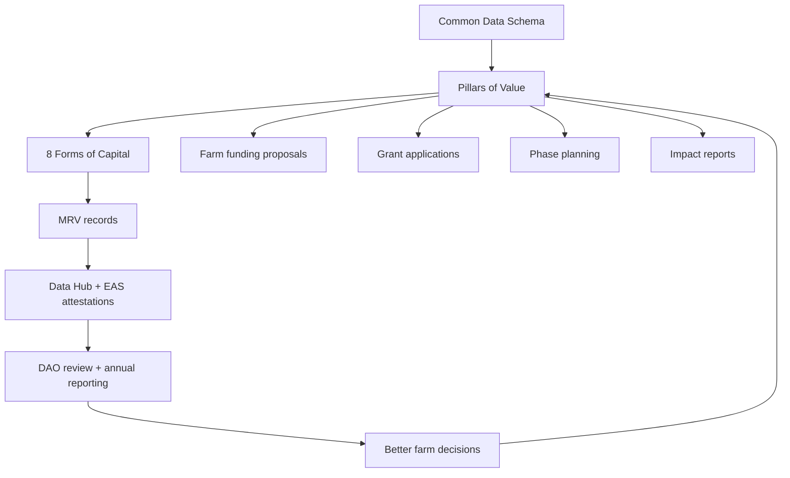

# The Pillars of Value help the DAO decide what is worth funding.

A farm proposal can look promising on paper and still fail to create durable community value. The **Pillars of Value** are Kokonut's evaluation lens for separating short-term financial return from deeper, lasting value.

They help DAO members, Guild Stewards, grant reviewers, farm operators, and contributors answer one question before funding, operating, or reporting on a farm:

> Does this farm create genuine value for people, land, governance, and public goods — or only revenue for funders?

  <a href="#the-six-pillars" style={{ display: "inline-flex", alignItems: "center", gap: "6px", background: "#009F4D", color: "#fff", padding: "10px 20px", borderRadius: "8px", fontWeight: "600", fontSize: "14px", textDecoration: "none" }}>
    See the Six Pillars →
  </a>

  <a href="#proposal-readiness-check" style={{ display: "inline-flex", alignItems: "center", gap: "6px", border: "1.5px solid #009F4D", color: "#009F4D", padding: "10px 20px", borderRadius: "8px", fontWeight: "600", fontSize: "14px", textDecoration: "none", background: "transparent" }}>
    Check Proposal Readiness
  </a>

  Use this page when reviewing farm proposals, preparing a Kokonut Development Proposal, writing grants, or translating farm activity into annual impact reports.

  

    
6

    
value questions

  

  

    
13

    
schema fields

  

  

    
8

    
forms of capital

  

  

    
MRV

    
evidence layer

  

  

    
DAO

    
review process

  

<Warning>
  The Pillars of Value are an evaluation framework, not a guarantee of financial return, carbon credit issuance, farm performance, or funding approval. A farm still needs complete data, clear budgets, realistic assumptions, local execution capacity, and MRV evidence.
</Warning>

---

## What the pillars do

The pillars convert a farm story into a reviewable case for community funding.

| Without the pillars | With the pillars |
| --- | --- |
| A proposal says the farm will “help the community.” | The proposal names who benefits, how much, and how outcomes will be measured. |
| Revenue is treated as the main proof of value. | Revenue is evaluated alongside ecology, jobs, training, public goods, and risk. |
| Risks are minimized or hidden. | Risks are documented before funding and tied to mitigation plans. |
| Impact is described after the fact. | Impact categories are defined at the time of proposal and tracked through MRV. |
| Each farm is a one-off story. | Farms become comparable through shared schema fields, pillars, and capital forms. |

<Note>
  The Common Data Schema provides the farm record. The Pillars of Value interpret that record. The 8 Forms of Capital help measure the value created. MRV turns operational activity into evidence.
</Note>

---

## When the pillars are applied

| Moment | How the pillars are used | Main reviewer |
| --- | --- | --- |
| Farm discovery | Decide whether a farm is worth deeper review | Farm operator, Impact Guild |
| Proposal drafting | Structure the value case for a Kokonut Development Proposal | Proposal author, Guild Stewards |
| DAO review | Help members evaluate whether treasury support is justified | DAO members |
| Phase I planning | Convert the approved thesis into baseline data and diagnostics | Farm team, Impact Guild |
| Operations | Track whether the farm is delivering what it promised | Farm operators, contributors |
| Annual reporting | Translate farm activity into impact reporting and EBF-style evidence | Impact Guild, MRV contributors |
| Grant applications | Explain value creation to external partners and grant reviewers | Governance, Finance, Partnerships |

---

## The six pillars

| Pillar | Core question | What reviewers need to see | Main schema connection |
| --- | --- | --- | --- |
| **WHAT** | What value is the farm designed to create? | Clear objectives, crop mix, ecological goals, community outcomes | `project_summary`, `revenue_streams` |
| **WHO** | Who benefits directly and indirectly? | Operators, workers, neighbors, markets, DAO members, future farms | `target_market`, `local_problem` |
| **HOW MUCH** | At what scale will value be created? | Quantified land, jobs, revenue, public goods, training, biodiversity, harvests | `land_size`, `forecasted_budget`, `public_goods_allocation` |
| **CONTRIBUTION** | What tangible contributions does the farm add? | Ecological, economic, social, cultural, governance, and knowledge outputs | `proposed_solution` |
| **RISK** | What could fail, and how will it be mitigated? | Agronomic, climate, market, governance, operational, data, and financial risks | Risk assessment, CRISP, EBF, milestones |
| **PUBLIC GOODS** | What community benefit is built into the model? | Allocation percentage, activities, beneficiaries, reporting path | `public_goods_allocation` |

---

## 1. WHAT — objective, goals, and benefits

**Core question:** What is the farm trying to produce, restore, teach, or prove?

This pillar establishes the farm's reason for existing beyond financial return. A strong answer explains what agricultural, ecological, economic, and community outcomes the farm is designed to produce.

### A strong WHAT answer includes

- Crop mix and why it fits the land, climate, community, and market
- Ecological restoration goals such as soil regeneration, biodiversity, water retention, or native species propagation
- Community development goals such as jobs, food access, training, or local ownership
- Development phase and expected timeline
- How the farm supports the Kokonut mission

### Adelphi example

Adelphi establishes a **15,725 m² regenerative agro-ecological production model** in Monte Plata, Dominican Republic. It combines short-cycle lettuce, medium-cycle passion fruit, long-cycle coconut, native species conservation, organic education, and market access into one working farm system.

[See Adelphi Summary →](/ecosystem-wiki/kokonut-farms/adelphi/summary)

---

## 2. WHO — direct and indirect beneficiaries

**Core question:** Who is affected if the farm succeeds?

This pillar maps the full circle of stakeholders: not only farm founders and investors, but workers, neighboring communities, market customers, learners, DAO members, local ecosystems, and future farms that will reuse the methodology.

### Beneficiary categories to document

| Beneficiary | What to document |
| --- | --- |
| Farm operators | Founders, managers, ownership, responsibilities, and income model |
| Workers | Jobs created, training, wages, safety, continuity |
| Local community | Nearby families, children, elders, schools, visitors, partner organizations |
| Market customers | Buyers, local consumers, organic markets, supermarkets, and restaurants |
| DAO members | Governance rights, exposure, reporting rights, treasury implications |
| Future farms | Lessons, reusable data, templates, MRV records, methodology improvements |
| Ecosystems | Soil, water, biodiversity, local species, carbon co-benefits |

### Adelphi example

Adelphi directly supports Yanny and Neury Hernández, seven community jobs, and the batey and Haty communities near Gonzalo. Indirect beneficiaries include Monte Plata organic market customers, DAO members, neighboring communities receiving native seedlings, and future Kokonut farms that learn from Adelphi's implementation.

---

## 3. HOW MUCH — quantitative impact

**Core question:** At what scale will the farm create value?

This pillar turns broad impact claims into numbers. A proposal that says “we will create jobs” or “restore land” is not enough; reviewers need measurable baselines, forecast assumptions, and actuals that can be tracked over time.

### Metrics to quantify

| Metric | Why it matters | Evidence source |
| --- | --- | --- |
| Land under management | Shows physical scope | Common Data Schema, GPS records |
| Agricultural area | Shows a productive area | Farm mapping, Silvi, Data Hub |
| Jobs | Shows livelihood impact | Payroll, field logs, and DAO reports |
| Projected revenue | Shows financial viability | Harvest forecast, market assumptions |
| Public goods allocation | Shows community commitment | Proposal, revenue records, reports |
| Training participants | Shows human capital growth | Attendance logs, event reports |
| Species conserved | Shows biodiversity contribution | Nursery inventory, field records |
| Harvests | Shows production reality | Kokonut Hub, MRV events |
| Climate co-benefits | Shows possible carbon/soil value | Soil tests, vegetation indices, methodology |

<Warning>
  Forecasts are planning assumptions. They should be compared against actual harvests, sales, costs, weather conditions, and MRV records before being treated as performance claims.
</Warning>

### Adelphi example

Current Adelphi planning metrics include a total area of 15,725 m², 13,838 m² of agricultural area, 7 jobs, 110 hens producing about 100 eggs per day, 12\+ at-risk native species, and projected annual gross revenue based on crop forecasts.

[Read the harvest forecast →](/ecosystem-wiki/kokonut-farms/adelphi/crops-and-harvest-forecast)

---

## 4. CONTRIBUTION — tangible ecosystem contributions

**Core question:** What does the farm add that would not exist without it?

Contribution captures value that does not always appear on a balance sheet: ecological restoration, community learning, cultural continuity, shared tools, local infrastructure, open data, and governance capacity.

### Contribution categories

| Category | Examples |
| --- | --- |
| Ecological | Soil regeneration, biodiversity restoration, watershed protection, and native species propagation |
| Economic | Jobs, local market development, diversified income, and reduced input dependency |
| Social | Community workshops, gathering spaces, educational programs, and knowledge transfer |
| Cultural | Native food varieties, land stewardship stories, and intergenerational learning |
| Governance | Community-owned agriculture, transparent funding, DAO reporting, proposal accountability |
| Knowledge | Farm records, open-source documentation, MRV data, implementation lessons |

### Adelphi example

Adelphi contributes biochar soil regeneration, free native seedling distribution, community workshops, weekend education programs, a women-led farm governance story, and a reference implementation for future Kokonut farms.

---

## 5. RISK — risks and mitigation

**Core question:** What could fail, and what has the farm designed to reduce that risk?

A strong proposal does not hide uncertainty. It identifies risks early and provides reviewers with a practical mitigation plan.

| Risk category | What can go wrong | Mitigation examples |
| --- | --- | --- |
| Agronomic | Crop failure, pests, disease, and low soil fertility | Crop diversity, syntropic design, soil monitoring, bioinputs |
| Climate | Drought, flooding, storms, and heat stress | Soil cover, water retention, resilient crop selection, monitoring |
| Market | Lower prices, weak demand, buyer concentration | Multiple revenue streams, local sales, organic channels |
| Operational | Key-person dependency, labor gaps, training gaps | Guild support, documentation, training, phased milestones |
| Financial | Revenue shortfall, cost overruns, liquidity constraints | Milestone-gated funding, conservative forecasts, transparent reporting |
| Governance | Proposal delays, unclear accountability, and weak reporting | Required proposal fields, DAO review, Guild oversight |
| Data quality | Incomplete records, weak MRV, unverifiable claims | Farm Registry payloads, Data Hub, EAS attestations, field logs |

<Note>
  CRISP and EBF can support risk and impact assessment, but farms should avoid treating carbon or ecological claims as verified until the methodology, field data, and reporting process support them.
</Note>

### Adelphi example

Adelphi's risks include delayed long-cycle coconut revenue, weather variability, certification timelines, market access, and execution complexity. Its mitigations include short-cycle lettuce revenue, multi-crop diversification, syntropic soil cover, on-site bioinputs, poultry integration, and public MRV records.

---

## 6. PUBLIC GOODS — community benefit allocation

**Core question:** What community benefit is built into the revenue model?

Kokonut farms should not treat public benefit as an afterthought. The public goods pillar documents which community activities are funded, who they serve, and how they are reported.

### Public goods funding can support

- Community workshops and agro-ecological training
- Free native and endangered seedling distribution
- Endangered species nursery operations
- Educational programs for children, elders, and nearby communities
- Maintenance of shared community spaces
- Environmental restoration beyond the farm boundary
- Open documentation, data, and methodology improvements

### Adelphi example

Adelphi allocates **10% of gross revenue** toward public goods, including workshops, native species distribution, education programs, the gazebo, and biodiversity nursery operations. These activities should be reported separately from commercial revenue and tied to the Data Hub or annual impact reporting.

---

## How the pillars connect to the Framework

| Framework component | Role |
| --- | --- |
| Common Data Schema | Provides the required farm record and baseline data |
| Pillars of Value | Interprets whether the farm creates broad, durable value |
| 8 Forms of Capital | Measures value across natural, financial, social, human, material, intellectual, cultural, and health capital |
| MRV workflow | Turns activity into structured evidence and public records |
| DAO governance | Decides whether the value case justifies funding, execution, or continued support |

---

## Relationship to the 8 Forms of Capital

The Pillars of Value define **what** to evaluate. The 8 Forms of Capital define **how** to measure the value that appears across a farm system.

| Pillar | Capital forms are most often involved |
| --- | --- |
| WHAT | Natural, Financial, Material, Health |
| WHO | Social, Human, Cultural, Health |
| HOW MUCH | Financial, Material, Natural, Human |
| CONTRIBUTION | Natural, Social, Human, Cultural, Intellectual |
| RISK | All capital forms, depending on exposure |
| PUBLIC GOODS | Social, Human, Cultural, Natural, Intellectual |

[Read the 8 Forms of Capital →](/kokonut-framework/framework-components/framework-features/8-forms-of-capital)

---

## Proposal readiness check

A farm is not ready for a DAO funding proposal until it can answer every pillar with enough specificity for review.

| Readiness question | Ready when... |
| --- | --- |
| WHAT is clear? | The farm explains what it will produce, restore, teach, or prove. |
| WHO is clear? | Direct and indirect beneficiaries are named. |
| HOW MUCH is clear? | Land, jobs, revenue, public goods, and impact baselines are quantified. |
| Is the contribution clear? | The farm explains what it adds beyond private revenue. |
| Is RISK clear? | Risks are named with practical mitigations. |
| Are public goods clear? | Allocation percentage, activities, beneficiaries, and the reporting process are defined. |
| Is the evidence path clear? | The proposal explains how progress will be tracked through MRV, Data Hub, reports, or attestations. |
| Is accountability clear? | Responsible people, Guilds, milestones, and reporting duties are named. |

<Warning>
  If any pillar is vague, the proposal should remain in drafting. A weak pillar is usually a sign that the farm needs more discovery, budgeting, stakeholder mapping, or MRV planning before asking the DAO for support.
</Warning>

---

## Common weak answers and stronger alternatives

| Weak answer | Stronger answer |
| --- | --- |
| “The farm will help the community.” | “The farm will create seven jobs, host monthly workshops, distribute native seedlings, and allocate 10% of gross revenue to public goods.” |
| “We will grow organic food.” | “The crop plan includes short-cycle lettuce, medium-cycle passion fruit, long-cycle coconut, and free-range eggs with harvest records published to the Data Hub.” |
| “The farm will restore nature.” | “Restoration will be tracked through soil monitoring, ground cover, biodiversity inventory, and vegetation indices.” |
| “Risks are low.” | “Primary risks are weather, certification delays, market access, and long-cycle payback; each has a mitigation plan.” |
| “Impact will be reported.” | “Farm activity will be logged as structured records, connected to MRV events, and included in annual impact reporting.” |

---

## Next steps

<CardGroup cols={2}>
  <Card title="Common Data Schema" icon="database" href="/kokonut-framework/framework-components/common-data-schema">
    The 13 fields every farm needs before it can be funded, governed, verified, or compared.
  </Card>

  <Card title="8 Forms of Capital" icon="water" href="/kokonut-framework/framework-components/framework-features/8-forms-of-capital">
    The measurement framework that turns broad value into capital-level metrics.
  </Card>

  <Card title="MRV Methodology" icon="magnifying-glass-chart" href="/ecosystem-wiki/kokonut-farms/measurement-reporting-and-verification">
    How farm activity becomes structured evidence, public records, and impact reports.
  </Card>

  <Card title="Proposal Templates" icon="file-signature" href="/ecosystem-wiki/the-kokonut-dao/proposal-templates">
    Use the Farm Funding template to turn these six pillars into a reviewable DAO proposal.
  </Card>

  <Card title="Adelphi Farm Summary" icon="seedling" href="/ecosystem-wiki/kokonut-farms/adelphi/summary">
    See how the pillars show up in Kokonut's first live farm implementation.
  </Card>

  <Card title="Ecological Impact Frameworks" icon="leaf-heart" href="/kokonut-framework/framework-add-ons/ecological-impact-frameworks">
    Explore CRISP and EBF as supporting frameworks for risk and impact reporting.
  </Card>
</CardGroup>

  <a href="/ecosystem-wiki/the-kokonut-dao/proposal-templates#farm-funding-proposal" style={{ display: "inline-flex", alignItems: "center", gap: "6px", background: "#009F4D", color: "#fff", padding: "10px 20px", borderRadius: "8px", fontWeight: "600", fontSize: "14px", textDecoration: "none" }}>
    Draft a Farm Funding Proposal →
  </a>

  <a href="/ecosystem-wiki/kokonut-farms/adelphi/summary" style={{ display: "inline-flex", alignItems: "center", gap: "6px", border: "1.5px solid #009F4D", color: "#009F4D", padding: "10px 20px", borderRadius: "8px", fontWeight: "600", fontSize: "14px", textDecoration: "none", background: "transparent" }}>
    See Adelphi Example
  </a>

