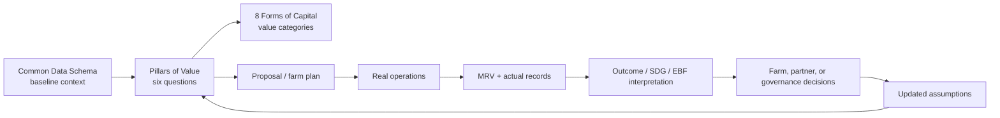

# The Pillars of Value help Kokonut ask better questions before making stronger claims.

The **Pillars of Value** are six questions:

1. **WHAT** — What value is the farm trying to create?
2. **WHO** — Who experiences that value, cost, or risk?
3. **HOW MUCH** — At what scale, depth, duration, and confidence?
4. **CONTRIBUTION** — What does the intervention add?
5. **RISK** — What could prevent, reduce, reverse, or distort the intended value?
6. **PUBLIC GOODS** — What value extends beyond the immediate private transaction?

They can improve:

- farm planning;
- proposal drafting;
- domain review;
- grant applications;
- MRV design;
- reporting;
- forecast-vs-actual analysis;
- cross-farm learning.

They do **not** produce a funding verdict or impact score by themselves.

> **The pillars structure the questions. Evidence determines how confidently those questions can be answered.**

<CardGroup cols={2}>
  <Card title="Start from the farm baseline" icon="database" href="/kokonut-framework/framework-components/common-data-schema">
    Use the 13-field Common Data Schema to establish compatible farm context before applying the six value questions.
  </Card>

  <Card title="Categorize the forms of value" icon="water" href="/kokonut-framework/framework-components/framework-features/8-forms-of-capital">
    Use the 8 Forms of Capital to organize natural, financial, social, human, material, intellectual, cultural, and health value.
  </Card>

  <Card title="Plan the evidence" icon="magnifying-glass-chart" href="/ecosystem-wiki/kokonut-farms/measurement-reporting-and-verification">
    Connect material claims to observations, measurements, review, publication, and appropriate interpretation.
  </Card>

  <Card title="Use the right authority" icon="file-signature" href="/ecosystem-wiki/the-kokonut-dao/proposal-templates">
    Apply the pillars to a proposal when a proposal is actually the correct decision path.
  </Card>
</CardGroup>

<Warning>
  **A well-written value case is not evidence that the value was created.** Keep objectives, forecasts, implemented activities, measured outcomes, and impact interpretations in separate claim classes.
</Warning>

---

## The six pillars in one view

| Pillar | Core question | Typical planning output | Stronger evidence later |
| --- | --- | --- | --- |
| **WHAT** | What value is intended? | Objectives, outputs, outcome hypotheses | Operational records, measurements, outcome evidence |
| **WHO** | Who is affected? | Stakeholder / beneficiary map | Participation, role, distribution, survey, transaction, or beneficiary records |
| **HOW MUCH** | What scale and duration are expected? | Baselines, targets, forecasts, reporting periods | Actual quantities, repeated measurements, variance analysis |
| **CONTRIBUTION** | What does the intervention add? | Intervention logic and plausible pathway | Before/after, comparison, attribution/context evidence where appropriate |
| **RISK** | What could go wrong or create harm? | Risk register, mitigations, owners, triggers | Incident, variance, quality, audit, field, market, and monitoring records |
| **PUBLIC GOODS** | What value extends beyond direct private exchange? | Public-benefit activities, access model, funding assumption | Actual allocation, delivery, use, access, beneficiary, or open-resource records |

<Info>
  The pillars are **not six independent scores**. They work together. “How much?” is weak without “who?”; “public goods” is weak without evidence of delivery; “contribution” is weak if risk and alternative explanations are ignored.
</Info>

---

## What the Pillars of Value do — and what they do not

| They can help | They cannot decide automatically |
| --- | --- |
| Make a farm thesis more explicit | Whether a farm deserves funding |
| Identify who may benefit or bear risk | Whether beneficiaries actually experienced the intended outcome |
| Turn vague goals into measurable questions | Whether a forecast will be achieved |
| Expose assumptions and evidence gaps | Whether an ecological claim is scientifically valid |
| Structure risk discussion | Whether all risks have been captured |
| Clarify proposed public benefit | Whether a public good was actually delivered |
| Make reports easier to compare | Whether two farms are equivalent |
| Improve governance inputs | What the final governance decision should be |

A farm can answer every pillar clearly and still be:

- too expensive;
- poorly timed;
- operationally weak;
- legally unresolved;
- evidence-poor;
- exposed to unacceptable risk.

The pillars improve **decision quality**.

They do not replace the decision process.

---

## Where the pillars sit in the Framework


```mermaid
flowchart LR
    A["Common Data Schema<br/>baseline context"] --> B["Pillars of Value<br/>six questions"]
    B --> C["8 Forms of Capital<br/>value categories"]
    B --> D["Proposal / farm plan"]
    D --> E["Real operations"]
    E --> F["MRV + actual records"]
    F --> G["Outcome / SDG / EBF interpretation"]
    G --> H["Farm, partner, or governance decisions"]
    H --> I["Updated assumptions"]
    I --> B
```

| Framework layer | Role |
| --- | --- |
| **Common Data Schema** | Establishes a compatible farm baseline |
| **Pillars of Value** | Structures the value questions |
| **8 Forms of Capital** | Categorizes the forms of value being discussed |
| **5 Principles of Regeneration** | Grounds regenerative practice in operational design |
| **MRV** | Defines how observations and claims become reviewable evidence |
| **SDGs / EBF / CRISP** | Add interpretation and reporting lenses |
| **Kokonut Intelligence** | Implements data, lifecycle, analytics, reporting, and attestation infrastructure |
| **Governance / farm authority** | Makes scoped decisions using the relevant evidence and expertise |

<Note>
  The Pillars of Value can inform a Moloch funding decision, but they are not owned by Moloch and are useful outside DAO voting: local farm planning, Guild review, grants, partner reporting, research, and retrospective learning can all use them.
</Note>

---

# The six pillars

## 1. WHAT — define the value being pursued

**Core question:** What is the farm, workstream, or intervention trying to create, protect, improve, or make possible?

A strong WHAT answer separates at least three things:

| Layer | Example |
| --- | --- |
| **Output / activity** | Build a nursery; plant syntropic plots; operate a training space |
| **Outcome hypothesis** | More seedlings survive; soil remains covered; participants gain useful skills |
| **Higher-level impact interpretation** | Biodiversity, soil condition, livelihood capacity, or food access improves |

The first layer can often be documented quickly.

The later layers require stronger evidence.

### Useful WHAT prompts

- What production system is being created?
- What physical infrastructure is being built?
- What ecological condition is intended to improve?
- What economic capacity is intended to improve?
- What knowledge, training, or coordination capacity is intended to improve?
- Which claims are direct outputs versus outcome hypotheses?
- What is intentionally **out of scope**?

### Evidence discipline

Avoid:

> “The farm restores biodiversity.”

Prefer at the planning stage:

> “The farm will implement native/at-risk species propagation and agroforestry practices. Biodiversity outcomes will require baseline and repeated evidence.”

---

## 2. WHO — identify who experiences the value, cost, or risk

**Core question:** Who is directly or indirectly affected?

WHO should not be reduced to a generic list of “beneficiaries.”

Different stakeholders can have different relationships to the same intervention.

| Stakeholder role | Questions to ask |
| --- | --- |
| **Local operators / founders** | What authority, responsibilities, income exposure, and risk do they carry? |
| **Workers** | What roles, compensation, safety, continuity, and learning opportunities exist? |
| **Customers / buyers** | What product, service, quality, price, or access do they receive? |
| **Community participants** | What activity do they actually access or use? |
| **Contributors / Guilds** | What work, review, or reusable knowledge do they provide? |
| **Capital participants** | What governance or treasury exposure applies without implying farm ownership? |
| **Partners / funders** | What commitments, reporting, or restrictions apply? |
| **Future farms** | What methods, data, code, or lessons are reusable? |
| **Ecological systems** | What land, habitat, soil, water, or species are within the claim boundary? |

### WHO requires distribution, not just totals

“Seven jobs” is useful.

It does not answer:

- which roles;
- full-time or part-time;
- for how long;
- compensation;
- safety;
- who received the opportunity;
- whether conditions changed for those people.

> **A total can describe scale without describing distribution or quality.**

---

## 3. HOW MUCH — define scale, depth, duration, and confidence

**Core question:** How much value is expected or observed, for how long, and with what evidence quality?

HOW MUCH should distinguish:

- baseline;
- target;
- forecast;
- actual;
- variance;
- reporting period.

### Quantities that may matter

| Area | Examples |
| --- | --- |
| Land | mapped area, agricultural area, plot area |
| Production | planted quantity, harvest, losses, saleable production |
| Finance | budget, actual spend, gross revenue, cost, price |
| Work | role count, hours, duration, compensation |
| Training | sessions, participants, completion, repeat participation |
| Public goods | modeled share, approved share, actual transfer, actual use |
| Ecology | ground cover, soil readings, vegetation indicators, survival, species records |
| Time | crop cycle, reporting period, duration of observed change |

### Forecast and actual must remain separate

For Adelphi:

- **15,725 m²** total mapped area is a documented reference;
- **13,838 m²** agricultural area is a documented reference;
- **7 jobs** are documented;
- **110 hens** are documented;
- **~100 eggs/day** is a planning estimate;
- crop production and gross revenue figures on the forecast page are forecasts;
- the 10% public-goods figure is a current farm-model assumption, not a realized transfer.

[Review the Adelphi forecast model →](/ecosystem-wiki/kokonut-farms/adelphi/crops-and-harvest-forecast)

<Warning>
  **HOW MUCH is not “put a number on everything.”** False precision is worse than a clearly labeled unknown. Use ranges, confidence, assumptions, and evidence status where exact values are not justified.
</Warning>

---

## 4. CONTRIBUTION — identify what the intervention adds

**Core question:** What does this intervention add to the observed or expected change?

Within Kokonut, CONTRIBUTION includes value the farm or workstream adds through:

- ecological practice;
- productive capacity;
- local infrastructure;
- jobs and skills;
- coordination;
- open data;
- documentation;
- reusable methods;
- public-benefit activities.

But contribution should not be confused with automatic causal attribution.

### A stronger contribution analysis asks

- What existed before the intervention?
- What exactly did the farm or program add?
- Which other actors or conditions contributed?
- What would likely have happened anyway?
- Is the claimed change directly observed or only plausible?
- Which part of the result can reasonably be associated with this intervention?
- What remains uncertain?

### Example

Weak:

> “The nursery restored local biodiversity.”

Stronger:

> “The nursery propagated documented native/at-risk species. Survival, distribution, habitat use, and longitudinal biodiversity outcomes require additional evidence before a restoration claim is made.”

<Info>
  **Contribution is not ownership of the outcome.** Farms operate inside communities, markets, ecosystems, weather, policy, and partner networks. Strong analysis should acknowledge other causes rather than assigning every observed change to Kokonut.
</Info>

---

## 5. RISK — make uncertainty visible before it becomes a surprise

**Core question:** What could prevent the intended value, reduce it, reverse it, or create unintended harm?

Risk is not a disclaimer section added after the proposal is finished.

It changes:

- assumptions;
- milestones;
- budgets;
- evidence plans;
- operating decisions;
- governance decisions.

### Risk register

| Risk category | Example | Useful response |
| --- | --- | --- |
| **Agronomic** | Pest, disease, crop loss, establishment failure | Diversification, monitoring, response plan, loss records |
| **Climate / water** | Drought, flooding, heat, storm damage | Water planning, soil cover, contingency, weather/context records |
| **Market** | Price change, buyer loss, weak demand | Multiple channels, sensitivity analysis, actual sales data |
| **Operational** | Labor gaps, maintenance failure, key-person dependency | Roles, training, procedures, redundancy, maintenance records |
| **Financial** | Cost overrun, delayed revenue, liquidity pressure | Milestones, contingency, actual-vs-budget tracking |
| **Governance / authority** | Wrong decision routed to wrong actor | Explicit authority boundaries and escalation |
| **Data quality** | Missing, stale, inconsistent, biased records | Validation, reviewer, provenance, lifecycle state |
| **Claim / methodology** | Evidence does not support the stated outcome | Narrower claim, better baseline, qualified review |
| **Privacy / social** | Sensitive data or participation exposed improperly | Consent, access controls, selective disclosure |
| **Technology** | Integration, schema, wallet, or automation failure | Compatibility, testing, rollback, human review |

### Risk should have an owner and signal

For material risks, document:

- description;
- probability or uncertainty;
- consequence;
- mitigation;
- responsible owner;
- early-warning indicator;
- escalation path;
- residual risk.

CRISP and EBF can support parts of the analysis, but they do not eliminate the need for farm-specific judgment.

---

## 6. PUBLIC GOODS — identify value that extends beyond the private transaction

**Core question:** What useful value is accessible beyond the immediate commercial exchange, and how will it be sustained and evidenced?

PUBLIC GOODS can include things such as:

- open documentation;
- open-source software;
- reusable methodology;
- public evidence infrastructure;
- community learning resources;
- training or education;
- shared spaces;
- seedling distribution;
- ecological restoration beyond a private production benefit;
- shared datasets where publication is appropriate.

It should not be reduced to a single revenue percentage.

### Public-goods questions

1. What public or shared benefit is intended?
2. Who can access or use it?
3. Is access open, targeted, conditional, or time-bound?
4. Who funds it?
5. Is funding modeled, approved, or already transferred?
6. Who delivers it?
7. What evidence shows delivery?
8. How is maintenance or continuation handled?
9. What private benefit also exists?
10. What risks could prevent access or delivery?

### Allocation is one mechanism — not the definition

The Common Data Schema currently includes:

```text
public_goods_allocation
```

That field can record a farm-specific percentage.

It does not mean every public good must be funded from revenue.

And it does not establish a universal Kokonut percentage.

<Warning>
  **Do not present Adelphi's 10% model assumption as a Framework rule.** The repository also contains a conflicting historical 40/40/20 model. Use the current approved farm-specific arrangement once reconciled, and distinguish modeled allocation from actual transfers.
</Warning>

---

## Evidence classes for every pillar

Each pillar can contain statements at different maturity levels.

| Evidence class | Example |
| --- | --- |
| **Baseline / documented state** | Adelphi has 13,838 m² documented agricultural area |
| **Forecast / target** | A crop model projects a future harvest or gross-revenue scenario |
| **Implemented activity** | A syntropic plot, nursery, training session, or biochar application occurred |
| **Measurement / actual** | A harvest quantity, sale, soil reading, attendance record, or payment was recorded |
| **Reviewed / published record** | The record passed the applicable lifecycle and is usable downstream |
| **Interpretation** | Evidence supports an SDG, capital, ecological, or public-benefit conclusion |

Do not turn a lower class into a higher class through wording alone.

> **The pillar tells you what question to ask; the evidence class tells you how strongly you can answer it.**

---

## Pillar worksheet for proposals, plans, and reports

For each material value claim, capture:

| Field | Question |
| --- | --- |
| **Pillar** | WHAT, WHO, HOW MUCH, CONTRIBUTION, RISK, or PUBLIC GOODS? |
| **Claim** | What exactly is being asserted? |
| **Claim class** | Baseline, forecast, activity, measurement/actual, published record, interpretation? |
| **Stakeholder / boundary** | Who or what is inside the claim? |
| **Baseline** | What was the starting condition, if relevant? |
| **Metric / indicator** | What will be counted, measured, or observed? |
| **Reporting period** | What dates does the claim cover? |
| **Source** | Which record or dataset supports it? |
| **Reviewer / owner** | Who records, reviews, or is accountable for it? |
| **Risk / limitation** | What could make the claim incomplete or misleading? |
| **Status** | Draft, submitted, verified/rejected, published? |
| **Next evidence** | What would make the claim stronger? |

This structure works for:

- a farm funding proposal;
- a grant;
- a partner report;
- annual farm review;
- SDG reporting;
- EBF / CRISP analysis;
- internal operational learning.

---

## Relationship to the 8 Forms of Capital

The six Pillars and the eight Forms answer different questions.

> **Pillars = inquiry structure. Forms of Capital = value categories.**

| Pillar | Forms of capital that may be relevant |
| --- | --- |
| **WHAT** | Any form, depending on the intended value |
| **WHO** | Social, Human, Cultural, Health, Financial, Natural |
| **HOW MUCH** | Any form with a defensible metric or qualitative evidence |
| **CONTRIBUTION** | Any form where the intervention adds capacity, condition, or access |
| **RISK** | Any form exposed to loss, degradation, capture, or non-delivery |
| **PUBLIC GOODS** | Often Social, Human, Intellectual, Cultural, Natural; not limited to these |

The 8 Forms should not be treated as a unit-conversion system.

Natural, financial, cultural, and health value are not automatically interchangeable.

[Read the 8 Forms of Capital →](/kokonut-framework/framework-components/framework-features/8-forms-of-capital)

---

## Relationship to the Common Data Schema

The Common Data Schema gives the pillars shared context, but no one-to-one mapping is complete.

| Pillar | Useful schema context | What still sits outside the 13-field baseline |
| --- | --- | --- |
| **WHAT** | `project_summary`, `revenue_streams`, `proposed_solution` | Outcome definitions, operating plan, evidence |
| **WHO** | `target_market`, `local_problem` | Workers, operators, participant records, distribution |
| **HOW MUCH** | `land_size`, `forecasted_budget`, `public_goods_allocation` | Actuals, reporting periods, baselines, quality |
| **CONTRIBUTION** | `proposed_solution` | Before/after, other contributors, causal uncertainty |
| **RISK** | Context across all fields | Risk register, triggers, mitigation, residual risk |
| **PUBLIC GOODS** | `public_goods_allocation` | Activities, access, actual transfers, delivery evidence |

<Note>
  Schema completeness does not mean pillar completeness. The baseline record is deliberately small; the pillar analysis can point to supporting records outside the 13-field object.
</Note>

---

## Using the pillars in a farm funding proposal

The pillars can make a proposal more reviewable, but they are not a separate approval test.

A proposal is stronger when reviewers can see:

- what is being requested;
- which value claims are forecasts;
- who holds operating authority;
- who may benefit or bear risk;
- what budget and milestones apply;
- what evidence will be collected;
- what can change without renewed authorization;
- how delivery will be accepted and closed out.

### Readiness levels

| Level | Meaning |
| --- | --- |
| **Draft** | Important pillar questions are still unanswered |
| **Reviewable** | Material claims, assumptions, risks, authority, and evidence plans are visible |
| **Authorizable** | The correct authority has enough information to decide within its scope |
| **Executed** | Any required treasury/on-chain/off-chain action occurred |
| **Delivered** | The real-world work happened |
| **Closed** | Acceptance, evidence, variance, and unresolved issues are documented |

> **A passed proposal is not proof that the underlying value case became true.**

[Use the Farm Funding Proposal →](/ecosystem-wiki/the-kokonut-dao/proposal-templates#farm-funding-proposal)

---

## Adelphi as a worked reference — with evidence boundaries

Adelphi can illustrate the pillars without pretending every intended benefit is already an achieved outcome.

| Pillar | Safe current reference | Boundary |
| --- | --- | --- |
| **WHAT** | Live women-led regenerative farm with crops, poultry, nursery, syntropic plots, training/evidence infrastructure | Stronger ecological/social outcomes still require evidence |
| **WHO** | Yanny and Neury Hernández are documented founders/operators; seven jobs are documented | Broader household/community beneficiary outcomes should not be inferred |
| **HOW MUCH** | 15,725 m² total mapped; 13,838 m² agricultural; 7 jobs; 110 hens | Egg, crop, revenue, and public-goods values include forecasts/assumptions |
| **CONTRIBUTION** | Adelphi adds farm infrastructure, production systems, documented regenerative practices, data, and Framework learning | Do not assign every observed social/ecological change solely to Adelphi |
| **RISK** | Long-cycle timing, market, weather, operations, data, economics, and evidence quality remain relevant | Mitigation reduces risk; it does not eliminate it |
| **PUBLIC GOODS** | Training/community infrastructure, nursery/seedling work, open documentation/evidence can support public benefit | 10% remains a farm-model assumption; realized delivery requires records |

<CardGroup cols={2}>
  <Card title="Adelphi Overview" icon="seedling" href="/ecosystem-wiki/kokonut-farms/adelphi/summary">
    See the documented farm state, local operators, Framework status, forecasts, and evidence boundaries.
  </Card>

  <Card title="Adelphi SDG Evidence" icon="recycle" href="/ecosystem-wiki/kokonut-farms/adelphi/sustainable-development-goals">
    See how alignment, activity, measured outcome, and impact interpretation are kept separate.
  </Card>

  <Card title="Forecast vs. actual" icon="calculator" href="/ecosystem-wiki/kokonut-farms/adelphi/crops-and-harvest-forecast">
    Inspect which production and economic values are still planning assumptions.
  </Card>

  <Card title="Current published records" icon="chart-line" href="https://hub.kokonut.network/projects/41">
    Use the Kokonut Hub when changeable farm state matters.
  </Card>
</CardGroup>

---

## Common failure modes

| Failure mode | Better practice |
| --- | --- |
| “This project scores highly on all six pillars.” | Describe the material questions, evidence, uncertainty, and trade-offs instead of inventing an overall score |
| “The DAO approved it, therefore it creates value.” | Treat authorization as permission, not proof of outcome |
| “Seven jobs means poverty reduction.” | Report the documented roles; stronger livelihood claims require income/household evidence |
| “Women-led means gender inequality decreased.” | Report women-led ownership/operation; measure broader gender outcomes separately |
| “Syntropic means biodiversity was restored.” | Report the practice; measure biodiversity condition over time |
| “10% goes to public goods.” | State whether 10% is modeled, approved, or actually transferred |
| “The 8 Forms measure all value.” | Use them as categories; select evidence appropriate to each claim |
| “EAS proves the impact.” | EAS can support provenance; methodology and evidence determine the claim |
| “A public dashboard is automatically current.” | Check record status, reporting period, source, and freshness |
| “Every benefit belongs to Kokonut.” | Acknowledge operators, partners, ecosystem conditions, community actors, and other causes |

---

## How different readers should use the pillars

<CardGroup cols={2}>
  <Card title="Farm operators" icon="tractor">
    Clarify what the farm is trying to achieve while keeping operational decisions grounded in local conditions and actual performance.
  </Card>

  <Card title="Capital governance participants" icon="building-columns">
    Use the six questions to improve funding decisions without treating them as an automatic score or overriding local farm authority.
  </Card>

  <Card title="Guilds & contributors" icon="users">
    Identify missing evidence, bounded work, domain-review needs, and reusable improvements.
  </Card>

  <Card title="Impact & research reviewers" icon="magnifying-glass-chart">
    Trace each material claim to baseline, metric, reporting period, source, limitations, and appropriate interpretation.
  </Card>

  <Card title="Partners & grant reviewers" icon="file-signature">
    Understand assumptions, stakeholder distribution, risk, evidence maturity, and public-benefit delivery.
  </Card>

  <Card title="Developers & agents" icon="code">
    Use the pillars to structure analysis, but keep machine-generated interpretations as drafts until the appropriate review occurs.
  </Card>
</CardGroup>

---

## Current maturity

| Surface | Status | Interpretation |
| --- | --- | --- |
| **Six Pillars of Value** | **Active Framework methodology** | Shared questions for value analysis |
| **Common Data Schema connection** | **Active** | Provides baseline context, not a complete pillar dataset |
| **8 Forms connection** | **Active analytical relationship** | Categories of value, not universal measurement units |
| **Proposal use** | **Active** | Improves decision inputs; does not determine approval |
| **MRV connection** | **Active and evolving** | Material claims should point to evidence appropriate to their class |
| **Automated Pillars interpretation** | **Decision support / developing** | Agent or software outputs should remain reviewable drafts rather than autonomous impact judgments |
| **Cross-farm comparison** | **Developing** | Requires consistent semantics, reporting periods, and evidence across more than one farm |

---

## Continue through the Framework

<CardGroup cols={2}>
  <Card title="Common Data Schema" icon="database" href="/kokonut-framework/framework-components/common-data-schema">
    Establish the farm baseline before applying the six value questions.
  </Card>

  <Card title="8 Forms of Capital" icon="water" href="/kokonut-framework/framework-components/framework-features/8-forms-of-capital">
    Organize the different forms of value that appear in the pillar analysis.
  </Card>

  <Card title="Positive-impact Methodology" icon="chart-line" href="/kokonut-framework/framework-components/framework-features/methodology-positive-impact">
    Connect farm practices and evidence to appropriately bounded impact interpretations.
  </Card>

  <Card title="MRV Methodology" icon="magnifying-glass-chart" href="/ecosystem-wiki/kokonut-farms/measurement-reporting-and-verification">
    See how source observations become structured records, review, publication, optional attestations, and interpretation.
  </Card>

  <Card title="Impact Calculator" icon="calculator" href="/kokonut-framework/impact-calculator">
    Use scenario assumptions to plan SDG and evidence needs without manufacturing an impact score.
  </Card>

  <Card title="Proposal Templates" icon="file-signature" href="/ecosystem-wiki/the-kokonut-dao/proposal-templates">
    Apply the pillars inside the correct proposal type when formal authorization is actually required.
  </Card>
</CardGroup>

> **The Pillars of Value are most useful when they make a claim harder to oversimplify: what, who, how much, what the intervention adds, what could fail, and what value genuinely reaches beyond the private transaction.**
