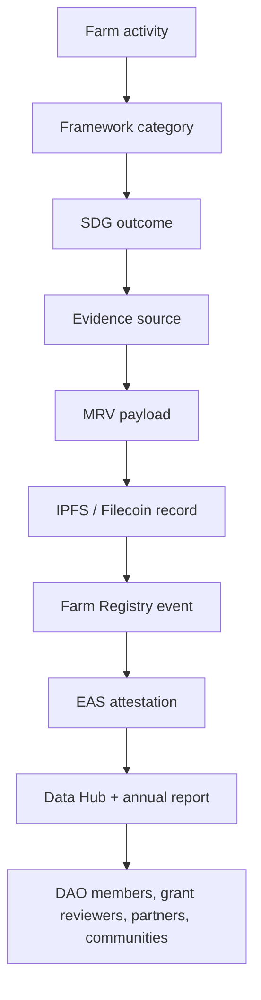

# Kokonut uses the SDGs as an evidence map, not a marketing label.

The Kokonut Framework maps community-owned regenerative farms to the United Nations Sustainable Development Goals so DAO members, grant reviewers, partners, researchers, and local communities can understand what a farm is trying to improve — and what evidence is needed to support each claim.

Kokonut does **not** treat every SDG claim as equally mature. Some outcomes are directly produced by every Kokonut Framework farm and can be tracked through farm records, MRV workflows, and annual reporting. Others are real potential co-benefits, but depend on location, scale, maturity, methodology, and data quality.

  <a href="#sdg-map" style={{ display: "inline-flex", alignItems: "center", gap: "6px", background: "#009F4D", color: "#fff", padding: "10px 20px", borderRadius: "8px", fontWeight: "600", fontSize: "14px", textDecoration: "none" }}>
    See the SDG Map →
  </a>

  <a href="/ecosystem-wiki/kokonut-farms/adelphi/sustainable-development-goals" style={{ display: "inline-flex", alignItems: "center", gap: "6px", border: "1.5px solid #009F4D", color: "#009F4D", padding: "10px 20px", borderRadius: "8px", fontWeight: "600", fontSize: "14px", textDecoration: "none", background: "transparent" }}>
    See Adelphi Evidence
  </a>

  Use this page when writing proposals, preparing grant reports, evaluating farm impact, or deciding which claims need MRV evidence.

---

## SDG contribution at a glance

| Tier | SDGs | Evidence maturity | How to report it |
| --- | --- | --- | --- |
| **Primary SDGs** | 1, 2, 5, 8, 15 | Directly connected to Kokonut's farm model and measurable through farm operations | Report with farm records, MRV events, annual impact reporting, and Data Hub references |
| **Secondary SDGs** | 3, 4, 6, 7, 9, 10, 11, 12, 13, 14, 16, 17 | Conditional or indirect; it depends on farm maturity, location, partners, and methodology | Report as co-benefits unless evidence is strong enough for direct claims |

<Warning>
  SDG alignment is not the same as verified impact. A farm can align with an SDG through its design, but it should only claim verified contribution when the activity, metric, evidence source, and reporting period are clear.
</Warning>

---

## How SDG claims become evidence

The evidence standard is simple: every SDG claim should answer **what happened, where it happened, who benefited, how it was measured, and where the record can be inspected**.

[Read the MRV methodology →](/ecosystem-wiki/kokonut-farms/measurement-reporting-and-verification)

---

## Where SDGs fit inside the Kokonut Framework

<CardGroup cols={3}>
  <Card title="Framework" icon="diagram-project">
    Defines the farm model, baseline data, development phases, regeneration principles, and value categories.
  </Card>

  <Card title="8 Forms of Capital" icon="water">
    Translates farm activity into natural, financial, social, human, material, intellectual, cultural, and health value.
  </Card>

  <Card title="MRV" icon="magnifying-glass-chart">
    Turns farm activity into structured evidence, public records, attestations, and annual impact reports.
  </Card>
</CardGroup>

| Framework layer | Role in SDG reporting |
| --- | --- |
| **Common Data Schema** | Captures the baseline farm record: land, location, crops, governance, funding, market, and public goods commitments |
| **Pillars of Value** | Helps DAO reviewers evaluate what the farm is trying to create, who benefits, how much, and what risks exist |
| **8 Forms of Capital** | Categorizes value beyond revenue, so SDG claims are not reduced to money alone |
| **5 Principles of Regeneration** | Grounds environmental SDG claims in practical farm methods |
| **MRV workflow** | Converts farm activity into evidence that can be inspected and reported |

---

## SDG map

| SDG | Kokonut relationship | Evidence maturity |
| --- | --- | --- |
| **SDG 1 — No Poverty** | Jobs, income resilience, public goods allocation, farm revenue circulation | Primary |
| **SDG 2 — Zero Hunger** | Diversified local food production, harvests, eggs, resilient crop cycles | Primary |
| **SDG 3 — Good Health and Well-being** | Access to fresh food, nature, community programming, reduced synthetic input exposure | Secondary |
| **SDG 4 — Quality Education** | Farm workshops, open-source documentation, regenerative agriculture training | Secondary |
| **SDG 5 — Gender Equality** | Women-led ownership and governance participation where implemented | Primary |
| **SDG 6 — Clean Water and Sanitation** | Soil cover, erosion control, runoff reduction, watershed health | Secondary |
| **SDG 7 — Affordable and Clean Energy** | Reduced synthetic-input dependence and potential future renewable systems | Secondary |
| **SDG 8 — Decent Work and Economic Growth** | Farm jobs, skills, local enterprise, regenerative work pathways | Primary |
| **SDG 9 — Industry, Innovation and Infrastructure** | Farm Registry, Data Hub, AI agents, open MRV infrastructure | Secondary |
| **SDG 10 — Reduced Inequalities** | Contribution paths, Guilds, local participation, public goods allocation | Secondary |
| **SDG 11 — Sustainable Cities and Communities** | Community hubs, food access, educational spaces, resilient local systems | Secondary |
| **SDG 12 — Responsible Consumption and Production** | Organic inputs, closed-loop fertility, local markets, waste reduction | Secondary |
| **SDG 13 — Climate Action** | Biochar, agroforestry, vegetation health, soil regeneration, resilience | Secondary / climate co-benefit |
| **SDG 14 — Life Below Water** | Reduced runoff and possible watershed-to-coast benefits where relevant | Secondary |
| **SDG 15 — Life on Land** | Biodiversity, agroforestry, living roots, erosion control, nursery propagation | Primary |
| **SDG 16 — Peace, Justice and Strong Institutions** | Transparent DAO governance, proposal processes, public records | Secondary |
| **SDG 17 — Partnerships for the Goals** | Public goods funders, MRV partners, open-source collaborators, local partnerships | Secondary |

<Note>
  The five primary SDGs are the baseline for Kokonut Framework farms. Secondary SDGs can become stronger over time, but only when the farm collects the right evidence and reports it consistently.
</Note>

---

## Primary SDGs

### SDG 1 — No Poverty

Kokonut farms contribute to poverty reduction by creating productive local assets: jobs, skills, farm revenue, public goods funding, and community-owned infrastructure.

| What to measure | Evidence source |
| --- | --- |
| Jobs created or supported | Employment records, role descriptions, payroll, or compensation records |
| Farm revenue | Sales records, harvest reports, Data Hub entries |
| Public goods allocation | DAO proposal, treasury record, farm revenue report |
| Local income resilience | Annual impact report, community interviews, and household income assessments where available |

**Claim standard:** Do not claim poverty reduction only because a farm exists. Show the job records, revenue activity, public goods allocation, and who benefited.

---

### SDG 2 — Zero Hunger

Kokonut farms contribute to food security by producing a variety of crops across short, medium, long, and continuous cycles.

| What to measure | Evidence source |
| --- | --- |
| Crop production | Harvest records, crop cycle logs, yield reports |
| Food diversity | Species lists, crop plans, harvest categories |
| Local distribution | Sales records, distribution records, buyer/community records |
| Resilience of production | Crop cycle performance across seasons, losses, and actuals vs. forecast |

**Claim standard:** Report food production through actual harvests and distribution records, not only crop plans.

---

### SDG 5 — Gender Equality

Kokonut farms contribute to gender equality when ownership, leadership, training, decision-making, and work opportunities are accessible and documented.

| What to measure | Evidence source |
| --- | --- |
| Ownership and leadership | Operator records, governance records, founder/team documentation |
| Decision-making participation | Meeting notes, DAO proposals, and role assignments |
| Training access | Workshop attendance, training logs, participant records |
| Economic participation | Employment records, compensation records, and contribution records |

**Claim standard:** Gender equality claims should be tied to real leadership, participation, and benefit-sharing data.

---

### SDG 8 — Decent Work and Economic Growth

Kokonut farms contribute to decent work by creating regenerative agriculture roles, skill-building pathways, and locally rooted economic activity.

| What to measure | Evidence source |
| --- | --- |
| Number of jobs | Employment records and role descriptions |
| Quality of work | Compensation, safety practices, training, continuity, and role progression |
| Skills developed | Training logs, workshop records, and certifications were available |
| Local economic activity | Farm revenue, supplier records, market records, and public goods allocation |

**Claim standard:** Count jobs carefully, distinguish full-time, part-time, seasonal, and bounty-based work, and do not treat projected work as actual employment.

---

### SDG 15 — Life on Land

Kokonut farms contribute to terrestrial ecosystem health through agroforestry, biodiversity, living roots, soil protection, erosion control, nursery propagation, and ecological monitoring.

| What to measure | Evidence source |
| --- | --- |
| Biodiversity | Species inventory, nursery logs, field observations |
| Vegetation health | Satellite indices such as NDVI, NDRE, and MSAVI, where available |
| Soil condition | Soil observations, soil tests, organic matter, moisture, and EC readings were available |
| Erosion and land cover | Ground cover records, drone imagery, field logs, photos |
| Regenerative practices | Biochar records, syntropic plot logs, crop rotation, and planting records |

**Claim standard:** Life-on-land claims should be connected to species records, soil/vegetation evidence, and observable land-management practices.

---

## Secondary SDGs and co-benefits

Secondary SDGs are not less important. They are simply more dependent on farm maturity, implementation depth, and verification quality.

| SDG | How Kokonut may contribute | What would make the claim stronger |
| --- | --- | --- |
| **3 — Good Health and Well-being** | Fresh food access, community gathering, nature exposure | Distribution records, health partner data, program attendance, nutrition methodology |
| **4 — Quality Education** | Farm workshops, open documentation, training programs | Attendance logs, curriculum, learning outcomes, participant feedback |
| **6 — Clean Water and Sanitation** | Erosion control, runoff reduction, soil cover | Water testing, runoff monitoring, watershed data |
| **7 — Affordable and Clean Energy** | Reduced synthetic-input dependence, possible renewable systems | Energy baseline, renewable system deployment records, fuel/input reduction data |
| **9 — Industry, Innovation and Infrastructure** | Farm Registry, Data Hub, AI agents, open-source MRV | API usage, uptime, integrations, developer documentation, third-party use |
| **10 — Reduced Inequalities** | Contribution paths, Guild Points, local access, public goods allocation | Participation records, contribution records, benefit distribution data |
| **11 — Sustainable Cities and Communities** | Community hub, education space, local resilience | Event records, local service records, community feedback |
| **12 — Responsible Consumption and Production** | Organic inputs, closed-loop fertility, waste reduction | Input logs, waste records, certification status, buyer/distribution records |
| **13 — Climate Action** | Biochar, agroforestry, soil building, vegetation resilience | Carbon methodology, soil data, biomass data, reporting period, third-party review |
| **14 — Life Below Water** | Reduced runoff and land-sea awareness where watersheds connect to coast | Water quality, watershed mapping, coastal partner records |
| **16 — Peace, Justice and Strong Institutions** | Transparent DAO governance, proposal records, on-chain attestations | Governance records, proposal outcomes, dispute logs, auditability |
| **17 — Partnerships for the Goals** | Public goods funders, MRV partners, local partners, open-source collaborators | Partnership agreements, deliverables, joint reports, contribution records |

<Warning>
  Climate and carbon claims require a higher evidence standard. Biochar, agroforestry, and syntropic farming can provide climate co-benefits, but carbon outcomes should not be treated as verified carbon credits without a methodology, measurement, a reporting period, and verification.
</Warning>

---

## In practice: Adelphi

Adelphi is Kokonut's current reference farm for SDG evidence. It focuses on five primary SDGs:

| SDG | Adelphi evidence direction |
| --- | --- |
| **SDG 1 — No Poverty** | Jobs, farm revenue forecast and actuals, public goods allocation |
| **SDG 2 — Zero Hunger** | Crop cycles, harvest records, egg production, and local food distribution |
| **SDG 5 — Gender Equality** | Women-led ownership, management, and community leadership |
| **SDG 8 — Decent Work** | Seven documented roles, training, farm operations, and regenerative skills |
| **SDG 15 — Life on Land** | Biodiversity nursery, syntropic plots, vegetation monitoring, and soil practices |

[See Adelphi's SDG evidence page →](/ecosystem-wiki/kokonut-farms/adelphi/sustainable-development-goals)

---

## How to use this page

<CardGroup cols={2}>
  <Card title="For proposal authors" icon="file-pen">
    Use the primary SDGs to define your farm's core impact claims, then list which evidence will be collected during operations.
  </Card>

  <Card title="For DAO reviewers" icon="scale-balanced">
    Ask whether each SDG claim has a metric, baseline, evidence source, responsible reporter, and reporting period.
  </Card>

  <Card title="For grant reviewers" icon="hand-holding-dollar">
    Treat the primary SDG map as the baseline due diligence structure and inspect the farm's Data Hub, proposal, and annual reports.
  </Card>

  <Card title="For farm operators" icon="tractor">
    Use this page as a reporting checklist: activities only become impact claims when they are documented and reviewed.
  </Card>
</CardGroup>

---

## SDG claim checklist

Before publishing an SDG claim, make sure it answers:

| Question | Why it matters |
| --- | --- |
| What activity created the outcome? | Prevents vague sustainability language |
| Which SDG and target does it support? | Keeps the claim specific |
| Is it primary or secondary? | Prevents overstating co-benefits |
| What metric will be tracked? | Makes progress measurable |
| What is the baseline? | Shows what changed |
| What evidence source supports it? | Makes the claim inspectable |
| Who is responsible for reporting? | Creates accountability |
| How often is it updated? | Keeps the record alive |
| Is it a forecast or an actual? | Prevents projections from being treated as results |
| What could invalidate the claim? | Makes risks visible |

---

## Next steps

<CardGroup cols={2}>
  <Card title="Adelphi SDG Evidence" icon="recycle" href="/ecosystem-wiki/kokonut-farms/adelphi/sustainable-development-goals">
    See how the five primary SDGs are mapped to live farm activity, evidence sources, and annual reporting.
  </Card>

  <Card title="MRV Methodology" icon="magnifying-glass-chart" href="/ecosystem-wiki/kokonut-farms/measurement-reporting-and-verification">
    Learn how farm records become public evidence through MRV payloads, IPFS/Filecoin, Farm Registry events, and EAS attestations.
  </Card>

  <Card title="8 Forms of Capital" icon="water" href="/kokonut-framework/framework-components/framework-features/8-forms-of-capital">
    Understand how Kokonut measures value beyond revenue across natural, financial, social, human, material, intellectual, cultural, and health capital.
  </Card>

  <Card title="Positive Impact Methodology" icon="leaf-heart" href="/kokonut-framework/framework-components/framework-features/methodology-positive-impact">
    See how regenerative practices create reinforcing impact loops and what evidence is needed before making strong claims.
  </Card>

  <Card title="Impact Calculator" icon="calculator" href="/kokonut-framework/impact-calculator">
    Estimate potential SDG contribution before converting assumptions into proposal requirements and MRV evidence.
  </Card>

  <Card title="Proposal Templates" icon="file-lines" href="/ecosystem-wiki/the-kokonut-dao/proposal-templates">
    Use the SDG map to write stronger farm funding proposals with clear evidence commitments.
  </Card>
</CardGroup>