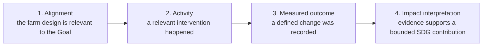
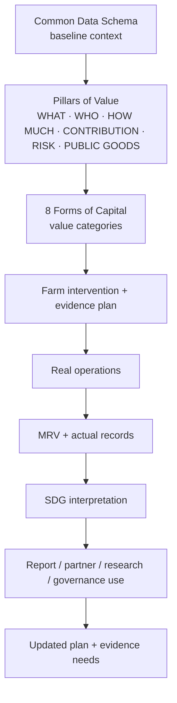
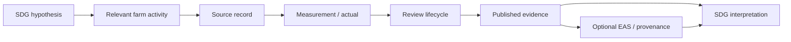

# The SDGs help Kokonut organize development claims — they do not create the evidence.

The Sustainable Development Goals give Kokonut a shared language for asking how farm activity may relate to:

- livelihoods;
- food;
- gender;
- work;
- land;
- education;
- water;
- climate;
- infrastructure;
- partnerships;
- other development priorities.

That makes the SDGs useful for:

- farm planning;
- grant applications;
- partner reporting;
- MRV design;
- annual review;
- research;
- public communication.

But an SDG label is **not** an outcome.

> **Use the SDGs to organize the claim. Use farm evidence to determine how strong the claim can be.**

<CardGroup cols={2}>
  <Card title="See Adelphi's SDG evidence" icon="seedling" href="/ecosystem-wiki/kokonut-farms/adelphi/sustainable-development-goals">
    Inspect the current five-goal reference set and the evidence boundaries behind each Adelphi claim.
  </Card>

  <Card title="Use the Positive Impact claim ladder" icon="recycle" href="/kokonut-framework/framework-components/framework-features/methodology-positive-impact">
    Separate alignment, activity, measured outcome, and impact interpretation before reporting SDG contribution.
  </Card>

  <Card title="Plan the evidence" icon="magnifying-glass-chart" href="/ecosystem-wiki/kokonut-farms/measurement-reporting-and-verification">
    Connect SDG claims to source records, methods, reporting periods, review, publication, and limitations.
  </Card>

  <Card title="Model a scenario" icon="calculator" href="/kokonut-framework/impact-calculator">
    Explore SDG relevance and evidence readiness without generating a verified impact score.
  </Card>
</CardGroup>

<Warning>
  **SDG alignment does not mean UN endorsement, certification, verified contribution, or achievement of a Goal.** A farm should report only the level of claim its evidence supports.
</Warning>

---

## The SDG claim ladder

Kokonut uses the same four-level claim ladder across SDG reporting.

```mermaid
flowchart LR
    A["1. Alignment<br/>the farm design is relevant to the Goal"] --> B["2. Activity<br/>a relevant intervention happened"]
    B --> C["3. Measured outcome<br/>a defined change was recorded"]
    C --> D["4. Impact interpretation<br/>evidence supports a bounded SDG contribution"]
```

| Level | What it means | Example | What it does not prove |
| --- | --- | --- | --- |
| **Alignment** | The farm design relates to an SDG | A farm plans diversified food production | Food security improved |
| **Activity** | A relevant intervention occurred | Crops were planted or a training was delivered | The development outcome changed |
| **Measured outcome** | A defined result was recorded | A harvest, job, skill assessment, or ecological indicator was measured | The farm caused the broader SDG outcome |
| **Impact interpretation** | Evidence and context support a bounded conclusion | Food access improved for a defined group during a defined period | Universal or permanent achievement of the Goal |

<Info>
  Most SDG overclaiming happens when documentation jumps from **alignment or activity** directly to **impact interpretation**.
</Info>

---

## The current five-goal reference set

Kokonut's current documentation and calculator emphasize five SDGs because they are the strongest recurring fit with **Adelphi**, the first live reference farm:

- **SDG 1 — No Poverty**
- **SDG 2 — Zero Hunger**
- **SDG 5 — Gender Equality**
- **SDG 8 — Decent Work and Economic Growth**
- **SDG 15 — Life on Land**

These five are useful as a **reference reporting set**.

They are not mandatory outcomes for every future farm.

A future farm may:

- have strong evidence for only some of the five;
- add a different SDG because its local intervention genuinely supports it;
- omit a Goal when the relationship is weak;
- strengthen or downgrade a Goal as actual evidence changes.

> **The Framework standard is evidence relevance, not checkbox coverage.**

### SDG 13 remains a climate co-benefit in the current reference model

Biochar, agroforestry, perennial vegetation, soil-management practices, and reduced bare soil can all be climate-relevant.

That does not create a quantified climate result.

Until an appropriate carbon/climate methodology is operationalized with:

- baseline;
- boundary;
- reporting period;
- measurements;
- uncertainty;
- permanence/reversal treatment where relevant;
- qualified review;

**SDG 13 — Climate Action** should remain a secondary climate co-benefit rather than a verified carbon claim.

---

## Primary, contextual, and inactive are reporting states — not permanent labels

The old page divided all 17 Goals into permanent “primary” and “secondary” tiers.

A more useful approach is to classify SDGs **per farm and reporting period**.

| Reporting state | Meaning |
| --- | --- |
| **Reference priority** | Part of the current Kokonut/Adelphi reporting set and materially relevant to the project |
| **Contextual / conditional** | Relevant only if the farm has the corresponding intervention and evidence |
| **Inactive / not claimed** | The farm should not claim this Goal in the current period |
| **Under review** | Relationship appears plausible but the boundary, method, or evidence is not yet strong enough |

This avoids treating every Goal as something every farm must “cover.”

---

## The 17-SDG Framework map

The full map remains useful as a **screening and interpretation tool**.

It should not be read as a statement that every Kokonut farm contributes to all 17 Goals.

| SDG | Possible Kokonut relevance | Evidence boundary |
| --- | --- | --- |
| **1 — No Poverty** | Work, productive assets, realized income, public-benefit flows | Jobs/revenue alone do not prove poverty reduction |
| **2 — Zero Hunger** | Food production, harvest, distribution, affordability/access | Crop plans do not prove improved food security |
| **3 — Good Health and Well-being** | Worker safety, food access, health-related programming | Regenerative production does not prove nutrition or medical outcomes |
| **4 — Quality Education** | Training, demonstrations, open learning resources | Attendance does not prove learning |
| **5 — Gender Equality** | Women-led ownership/management, participation, opportunity, benefit sharing | Women-led status alone does not prove reduced gender inequality |
| **6 — Clean Water and Sanitation** | Water-management, runoff, erosion, water quality where relevant | Soil cover alone does not prove watershed improvement |
| **7 — Affordable and Clean Energy** | Renewable-energy systems or documented energy transition where implemented | Reduced fertilizer/input use is not itself a clean-energy outcome |
| **8 — Decent Work and Economic Growth** | Jobs, work quality, skills, realized economic activity | Job count alone does not prove decent work |
| **9 — Industry, Innovation and Infrastructure** | Farm infrastructure, data systems, open technical infrastructure | Technology deployment alone does not prove broad industrial development |
| **10 — Reduced Inequalities** | Access, participation, distribution, contribution pathways | Open participation does not prove inequality decreased |
| **11 — Sustainable Cities and Communities** | Local food systems, community spaces, resilience where applicable | Rural farm activity is not automatically an SDG 11 outcome |
| **12 — Responsible Consumption and Production** | Input/resource records, waste reduction, reuse, procurement, production practices | “Closed loop” language requires material-flow evidence |
| **13 — Climate Action** | Climate-relevant practices, carbon/soil/biomass evidence where methodology exists | No quantified climate claim without a fit-for-purpose methodology |
| **14 — Life Below Water** | Watershed-to-coast effects where a relevant hydrological connection exists | A terrestrial farm should not claim SDG 14 without water/coastal evidence |
| **15 — Life on Land** | Soil, vegetation, habitat, biodiversity, agroforestry, nursery work | Practices do not automatically prove ecological recovery |
| **16 — Peace, Justice and Strong Institutions** | Transparent governance, dispute handling, auditability where the claim is relevant | On-chain records alone do not prove institutional quality |
| **17 — Partnerships for the Goals** | Formal collaboration, shared delivery, funding, research, open-source coordination | A partner logo or informal relationship does not prove partnership outcomes |

<Note>
  The Framework can screen all 17 Goals. A farm report should activate only the Goals for which the project can define a credible relationship and evidence plan.
</Note>

---

## Where SDGs sit inside the Kokonut Framework

```mermaid
flowchart TD
    A["Common Data Schema<br/>baseline context"] --> B["Pillars of Value<br/>WHAT · WHO · HOW MUCH · CONTRIBUTION · RISK · PUBLIC GOODS"]
    B --> C["8 Forms of Capital<br/>value categories"]
    C --> D["Farm intervention + evidence plan"]
    D --> E["Real operations"]
    E --> F["MRV + actual records"]
    F --> G["SDG interpretation"]
    G --> H["Report / partner / research / governance use"]
    H --> I["Updated plan + evidence needs"]
```

| Framework layer | Role in SDG work |
| --- | --- |
| **Common Data Schema** | Establishes the farm baseline and planning context |
| **Pillars of Value** | Defines what, who, scale, contribution, risk, and public benefit |
| **8 Forms of Capital** | Categorizes the type of value under discussion |
| **5 Principles of Regeneration** | Describes regenerative design/practice |
| **Positive Impact Methodology** | Defines the claim ladder and interpretation boundary |
| **MRV** | Connects claims to observations, measurements, actuals, review, and publication |
| **SDGs** | Map reviewed evidence into a recognized development-goal lens |
| **Kokonut Intelligence** | Supports data lifecycle, analytics, reporting, and optional provenance infrastructure |

The SDG layer sits **after the evidence**, not before it.

---

## How SDG evidence should flow

The durable evidence sequence is:

> **claim hypothesis → source record → observation / measurement / actual → review → publication when appropriate → optional attestation → SDG interpretation**

```mermaid
flowchart LR
    A["SDG hypothesis"] --> B["Relevant farm activity"]
    B --> C["Source record"]
    C --> D["Measurement / actual"]
    D --> E["Review lifecycle"]
    E --> F["Published evidence"]
    F --> G["SDG interpretation"]

    F --> H["Optional EAS / provenance"]
    H --> G
```

Not every SDG record requires:

- IPFS;
- Filecoin;
- EAS;
- an on-chain event.

Those technologies can help with provenance and durable evidence references.

They do not establish the development outcome by themselves.

---

# The current five reference SDGs

## SDG 1 — No Poverty

### Relevant Kokonut pathways

A farm may connect to SDG 1 through:

- paid work;
- productive assets;
- realized farm income;
- operator income;
- public-benefit transfers;
- livelihood capacity.

### Claim progression

| Level | Example |
| --- | --- |
| **Alignment** | The farm is intended to create local economic opportunity |
| **Activity** | Worker roles exist; production infrastructure is operating |
| **Measured outcome** | Compensation, realized revenue, transfers, or beneficiary income changes are recorded |
| **Impact interpretation** | Evidence supports a bounded livelihood/poverty conclusion for a defined group and period |

### Evidence can include

- role/employment records;
- compensation/payroll;
- realized sales/revenue;
- operator income where appropriate;
- public-goods transfers/use;
- beneficiary/household evidence when making poverty claims.

<Warning>
  **Jobs, forecast revenue, productive assets, or a public-goods percentage do not by themselves prove poverty reduction.**
</Warning>

---

## SDG 2 — Zero Hunger

### Relevant Kokonut pathways

A farm may connect to SDG 2 through:

- food production;
- harvest;
- distribution;
- affordability/access;
- production continuity;
- diversified crop/food systems.

### Claim progression

| Level | Example |
| --- | --- |
| **Alignment** | Food production is part of the farm design |
| **Activity** | Crops were planted; poultry/food-production systems operate |
| **Measured outcome** | Harvest, losses, sales, distribution, and/or access are recorded |
| **Impact interpretation** | Evidence supports a bounded food-access or food-security conclusion |

### Evidence can include

- harvest actuals;
- crop/product records;
- egg/animal-production records;
- losses;
- sales;
- distribution;
- affordability/access;
- target-population evidence where making food-security claims.

> **Production capacity is not the same as improved food security.**

---

## SDG 5 — Gender Equality

### Relevant Kokonut pathways

A farm may connect to SDG 5 through:

- ownership;
- management;
- decision-making;
- paid work;
- training;
- contributor access;
- income and benefit sharing.

### Claim progression

| Level | Example |
| --- | --- |
| **Alignment** | The project intends to expand women's participation or leadership |
| **Activity / documented state** | Women hold documented founder, owner, operator, management, or contributor roles |
| **Measured outcome** | Participation, compensation, income, opportunity, or decision-power changes are recorded |
| **Impact interpretation** | Evidence supports a bounded gender-equity conclusion |

### Adelphi boundary

Adelphi has one of the clearest **documented-state** relationships:

> **Adelphi is founded, owned, and operated by Yanny and Neury Hernández.**

That is meaningful evidence of women-led ownership/operation.

It is not by itself evidence that:

- local gender inequality declined;
- women across the community gained income;
- decision power changed beyond the founders;
- broader structural inequality was reduced.

---

## SDG 8 — Decent Work and Economic Growth

### Relevant Kokonut pathways

A farm may connect to SDG 8 through:

- employment;
- work quality;
- safety;
- skills;
- continuity;
- local enterprise;
- realized economic activity.

### Claim progression

| Level | Example |
| --- | --- |
| **Alignment** | The farm intends to create locally rooted work |
| **Activity / documented state** | Worker roles exist; training and operations occur |
| **Measured outcome** | Compensation, duration, safety, retention, skill, and realized economic records exist |
| **Impact interpretation** | Evidence supports a bounded decent-work or economic-development conclusion |

### Evidence can include

- role type;
- start/end dates;
- full-time / part-time / seasonal status;
- compensation;
- safety records;
- training;
- retention;
- skill progression;
- realized revenue;
- local supplier/market records where relevant.

<Info>
  **A job count is not a decent-work assessment.** The quality, conditions, duration, safety, and compensation of work matter.
</Info>

---

## SDG 15 — Life on Land

### Relevant Kokonut pathways

A farm may connect to SDG 15 through:

- agroforestry;
- vegetation;
- soil protection;
- habitat;
- biodiversity;
- nursery propagation;
- native/at-risk species work;
- erosion/land-cover management.

### Claim progression

| Level | Example |
| --- | --- |
| **Alignment** | The farm is designed around regenerative land management |
| **Activity** | Syntropic plots, nursery work, biochar, ground cover, or agroforestry are implemented |
| **Measured outcome** | Soil, vegetation, survival, habitat, species, or land-condition indicators are recorded |
| **Impact interpretation** | Evidence supports a bounded terrestrial-ecosystem conclusion |

### Evidence can include

- species inventory;
- nursery records;
- planting/survival;
- field observations;
- soil measurements;
- ground-cover records;
- erosion observations;
- remote-sensing indices;
- repeat biodiversity/habitat surveys.

<Warning>
  **NDVI, NDRE, ReCI, MSAVI, species counts, biochar, or syntropic practices do not by themselves prove biodiversity restoration, soil recovery, or reduced land degradation.**
</Warning>

---

## Contextual SDGs: activate them only when the intervention is real

The remaining SDGs can be relevant, but the relationship should be earned project by project.

| SDG | Potential pathway | Evidence that strengthens the relationship |
| --- | --- | --- |
| **3 — Good Health and Well-being** | Worker safety, food access, wellbeing program | Safety/incident records, distribution/access evidence, appropriate health methodology |
| **4 — Quality Education** | Training, demonstrations, open learning | Curriculum, attendance, learning assessment, applied capability |
| **6 — Clean Water and Sanitation** | Water quality, runoff, watershed management | Water sampling, runoff/erosion monitoring, water-use/watershed records |
| **7 — Affordable and Clean Energy** | Solar/renewable energy, fuel/electricity transition | Energy baseline, generation, consumption, avoided fossil energy where methodologically justified |
| **9 — Industry, Innovation and Infrastructure** | Farm/data infrastructure, open technology, APIs | Operational assets, uptime, use, integrations, external reuse |
| **10 — Reduced Inequalities** | Access, distribution, participation, opportunity | Participant/beneficiary distribution, compensation/access and outcome evidence |
| **11 — Sustainable Cities and Communities** | Food/community/resilience systems where urban/community context supports the claim | Local-service, food-access, resilience, community-use evidence |
| **12 — Responsible Consumption and Production** | Input substitution, reuse, material flows, waste reduction | Procurement, input, waste, reuse, production, certification records |
| **13 — Climate Action** | Carbon/soil/biomass/resilience practices where methodology exists | Climate methodology, baseline, measurements, uncertainty, reporting period, review |
| **14 — Life Below Water** | Watershed/coastal effects where the farm has a relevant hydrological pathway | Water-quality, watershed, downstream/coastal evidence |
| **16 — Peace, Justice and Strong Institutions** | Transparency, governance process, grievance/dispute mechanisms where relevant | Decision records, participation, dispute/audit evidence |
| **17 — Partnerships for the Goals** | Formal delivery partnerships, research, funding, open-source collaboration | Agreements, responsibilities, deliverables, contribution records, joint outputs |

### Do not force a relationship

Examples:

- A farm without renewable-energy infrastructure should not claim SDG 7 because it uses less synthetic fertilizer.
- A terrestrial inland farm should not claim SDG 14 merely because runoff exists in theory.
- A public GitHub repository does not automatically establish SDG 9.
- An on-chain governance process does not automatically establish SDG 16.
- Listing a funder or collaborator does not by itself establish SDG 17 outcomes.

---

## Goal-level alignment and target-level claims are different

An SDG is broad.

Individual SDG **targets and indicators** are more specific.

A report should not cite a specific target merely because the project is generally aligned with the Goal.

Before using target-level language, document:

1. the exact target being referenced;
2. why the intervention is relevant to that target;
3. the farm/project boundary;
4. the metric or evidence;
5. reporting period;
6. limitations;
7. whether the statement is alignment, activity, measured outcome, or impact interpretation.

> **Goal-level relevance is not automatic target-level evidence.**

---

## How the Pillars and 8 Forms strengthen an SDG claim

The SDGs tell the reader **which development lens** is being used.

The Pillars and 8 Forms help prevent that lens from becoming vague.

### Pillars

For any SDG claim, ask:

- **WHAT** changed?
- **WHO** experienced it?
- **HOW MUCH** changed and for how long?
- What did the intervention **CONTRIBUTE**?
- What **RISK** or uncertainty remains?
- What **PUBLIC GOODS** were actually delivered, if relevant?

### 8 Forms of Capital

Use the 8 Forms to categorize the underlying value without treating them as interchangeable units.

Examples:

| SDG | Likely capital forms |
| --- | --- |
| SDG 1 | Financial, Human, Social |
| SDG 2 | Natural, Financial, Material, Health |
| SDG 5 | Social, Human, Financial, Cultural |
| SDG 8 | Human, Financial, Social, Health |
| SDG 15 | Natural, Material, Intellectual |

A single record can be relevant to multiple lenses.

That does not make it multiple independent impacts.

---

## A reusable SDG-claim record

For any material SDG statement, capture:

| Field | Question |
| --- | --- |
| **SDG** | Which Goal is being referenced? |
| **Target, if used** | Which exact target? |
| **Claim** | What exactly is being asserted? |
| **Claim level** | Alignment, activity, measured outcome, or impact interpretation? |
| **Farm / boundary** | Which farm, plot, group, community, or system? |
| **WHO** | Who or what is affected? |
| **Baseline** | What was the starting condition, where relevant? |
| **Intervention** | What action is relevant to the Goal? |
| **Metric / evidence** | What is observed, counted, or measured? |
| **Method** | How was the metric produced? |
| **Reporting period** | What dates does the claim cover? |
| **Actual vs. forecast** | Is it observed performance or modeled? |
| **Source** | Which record/dataset supports it? |
| **Review status** | Draft, submitted, reviewed/verified, published? |
| **Reviewer** | Who performed the applicable review? |
| **Contribution context** | What other actors or conditions may explain the outcome? |
| **Risk / uncertainty** | What can weaken or reverse the claim? |
| **Evidence pointer** | Hub record, file, dataset, CID, attestation, report? |
| **Next evidence** | What would strengthen or falsify the claim? |

This record is more useful than attaching an SDG icon to a proposal.

---

## Adelphi: the current reference map

Adelphi currently uses five primary SDGs as its **reference reporting set**.

| SDG | Strong current Adelphi claim | Current evidence class | Stronger claim still needs |
| --- | --- | --- | --- |
| **1 — No Poverty** | Seven jobs are documented; farm revenue/public-goods flows are modeled | Documented state + forecast | Compensation/income, realized revenue, actual allocations, beneficiary/household evidence |
| **2 — Zero Hunger** | Diversified food-production capacity across crops and poultry is documented | Implemented system + forecast | Harvest actuals, sales/distribution, affordability/access evidence |
| **5 — Gender Equality** | The farm is founded, owned, and operated by Yanny and Neury Hernández | Documented state | Broader participation, opportunity, compensation, income, decision-power and benefit-sharing evidence |
| **8 — Decent Work** | Seven jobs are documented and multiple skill/work domains exist | Documented state + program intent | Role type, duration, compensation, safety, retention, skill evidence |
| **15 — Life on Land** | Syntropic plots, nursery, biochar, ground cover, agroforestry and monitoring are documented | Implemented practice + measurement capability | Repeated soil, vegetation, biodiversity, survival, habitat and land-condition evidence |

### Secondary/contextual Adelphi relationships

Current documentation also identifies plausible contextual relationships including:

- **SDG 4 — Quality Education**
- **SDG 12 — Responsible Consumption and Production**
- **SDG 13 — Climate Action**
- **SDG 17 — Partnerships for the Goals**

Those should remain contextual until the corresponding evidence matures.

[Read the detailed Adelphi SDG evidence map →](/ecosystem-wiki/kokonut-farms/adelphi/sustainable-development-goals)

---

## What the calculator can and cannot do

The [Impact Calculator](/kokonut-framework/impact-calculator) uses the five current reference SDGs to help a user:

- screen relevance;
- identify scenario activities;
- identify evidence gaps;
- plan records.

It can reach:

- alignment;
- planning/activity signal;
- evidence readiness.

It cannot generate:

- measured outcomes;
- verified SDG contribution;
- poverty reduction;
- food-security improvement;
- gender-equity improvement;
- decent-work certification;
- biodiversity restoration;
- quantified carbon impact.

Its statuses are planning tools.

---

## SDG reporting over time

An SDG report should be a **periodic evidence reconciliation**, not a permanent badge.

For each reporting period, review:

1. which SDGs are active;
2. which moved from alignment to activity;
3. which have measured outcomes;
4. which support an impact interpretation;
5. which forecasts were replaced with actuals;
6. which claims weakened or failed;
7. which evidence is missing;
8. which risks materialized;
9. which stakeholders received benefits or costs;
10. which Goals should be added, downgraded, or removed in the next period.

<Info>
  **An SDG can move backward in reporting maturity.** Stale data, failed interventions, changing conditions, weak evidence, or a revised methodology can require a claim to be narrowed.
</Info>

---

## Example: stronger SDG wording

### Too broad

> “The farm advances SDG 2 by improving food security.”

### Better at activity level

> “The farm operates a diversified food-production system relevant to SDG 2. Harvest and distribution outcomes are reported separately.”

### Better with measured outcome

> “During **[reporting period]**, the farm recorded **[actual harvest quantity]** of **[product]**, with **[quantity]** sold or distributed through **[channel]**.”

### Stronger interpretation only when supported

> “For **[defined population]** during **[reporting period]**, **[defined food-access indicator]** changed from **[baseline]** to **[outcome]** alongside the documented farm intervention. The interpretation is limited by **[material limitations / other contributing factors]**.”

The language should become stronger only as the evidence becomes stronger.

---

## Common failure modes

| Failure mode | Better practice |
| --- | --- |
| “This farm contributes to all 17 SDGs.” | Activate only Goals with a credible intervention/evidence relationship |
| “The five reference SDGs apply automatically to every farm.” | Treat them as the current Adelphi/reference set; assess each future farm independently |
| “SDG alignment means verified contribution.” | Use the four-level claim ladder |
| “Seven jobs means SDG 1 was achieved.” | Report jobs; measure livelihood/poverty outcomes separately |
| “Food production means hunger decreased.” | Measure harvest, distribution, access, affordability, and target population |
| “Women-led means gender inequality decreased.” | Preserve women-led evidence; measure broader gender outcomes separately |
| “A job count proves decent work.” | Measure work quality, compensation, safety, continuity, and worker evidence |
| “Syntropic/biochar/nursery means SDG 15 impact.” | Measure soil, vegetation, biodiversity, habitat, and land condition |
| “Biochar/agroforestry means SDG 13 carbon impact.” | Use an appropriate climate/carbon methodology |
| “Reduced inputs means SDG 7.” | Require an actual energy pathway for clean-energy claims |
| “DAO transparency proves SDG 16.” | Use institutional/governance outcome evidence appropriate to the claim |
| “A partnership logo proves SDG 17.” | Document responsibilities, delivery, contributions, and joint outputs |
| “EAS verifies the SDG outcome.” | Use EAS for provenance; evidence/methodology support the outcome |
| “A dashboard value is current by definition.” | Check source, lifecycle state, reporting period, and freshness |

---

## How different readers should use the SDG layer

<CardGroup cols={2}>
  <Card title="Farm operators" icon="tractor">
    Choose only the Goals that match the farm's real intervention and collect evidence as part of operations rather than after-the-fact marketing.
  </Card>

  <Card title="Impact & research reviewers" icon="microscope">
    Check claim level, baseline, method, reporting period, stakeholder boundary, contribution context, uncertainty, and whether the SDG language exceeds the evidence.
  </Card>

  <Card title="Capital governance participants" icon="building-columns">
    Use SDG relevance as one decision input without treating an SDG label as proof of impact or as a substitute for budget, risk, authority, and execution review.
  </Card>

  <Card title="Guilds & contributors" icon="users">
    Turn missing SDG evidence into bounded work across research, data, agronomy, documentation, community, finance, and review.
  </Card>

  <Card title="Partners & grant reviewers" icon="file-signature">
    Trace each development claim to a defined intervention, actual evidence, reporting period, limitations, and responsible reviewer.
  </Card>

  <Card title="Developers & agents" icon="code">
    Treat SDG mappings as structured interpretations with evidence pointers and maturity states—not as autonomous impact scores.
  </Card>
</CardGroup>

---

## Current maturity

| Surface | Status | Interpretation |
| --- | --- | --- |
| **17-SDG screening map** | **Active Framework methodology** | All Goals can be screened for relevance |
| **Five-goal reference set** | **Active for Adelphi/current calculator** | SDG 1, 2, 5, 8, 15; not mandatory verified outcomes for every farm |
| **SDG 13 climate treatment** | **Secondary co-benefit** | Stronger climate/carbon claims remain methodology-dependent |
| **Adelphi SDG mapping** | **Active reference implementation** | Evidence maturity differs by Goal |
| **Target-level reporting** | **Evidence-dependent** | Specific targets require explicit mapping and supporting evidence |
| **SDG outcome verification** | **Methodology/evidence-dependent** | SDG labels themselves do not verify outcomes |
| **Cross-farm SDG comparison** | **Developing** | Requires consistent boundaries, metrics, periods, semantics, and evidence |
| **Automated SDG classification** | **Decision support / developing** | Agents/software may screen and draft; appropriate review remains required |

---

## Continue through the Framework

<CardGroup cols={2}>
  <Card title="Adelphi SDG Evidence" icon="recycle" href="/ecosystem-wiki/kokonut-farms/adelphi/sustainable-development-goals">
    See the current five-goal reference set mapped to documented state, activity, evidence requirements, and claims that remain unverified.
  </Card>

  <Card title="Positive Impact Methodology" icon="chart-line" href="/kokonut-framework/framework-components/framework-features/methodology-positive-impact">
    Apply alignment → activity → measured outcome → impact interpretation consistently across SDG claims.
  </Card>

  <Card title="Pillars of Value" icon="square-poll-vertical" href="/kokonut-framework/framework-components/pillars-of-value">
    Add WHAT, WHO, HOW MUCH, CONTRIBUTION, RISK, and PUBLIC GOODS to each development claim.
  </Card>

  <Card title="8 Forms of Capital" icon="water" href="/kokonut-framework/framework-components/framework-features/8-forms-of-capital">
    Categorize the underlying value without reducing unlike outcomes to one score.
  </Card>

  <Card title="MRV Methodology" icon="magnifying-glass-chart" href="/ecosystem-wiki/kokonut-farms/measurement-reporting-and-verification">
    Connect SDG interpretations to governed source records and the evidence lifecycle.
  </Card>

  <Card title="Impact Calculator" icon="calculator" href="/kokonut-framework/impact-calculator">
    Use the current five-goal reference set for scenario planning and evidence readiness—not verified impact scoring.
  </Card>
</CardGroup>

> **The SDGs are most useful when they tell Kokonut what evidence to collect, what language is justified, and what still cannot be claimed.**
