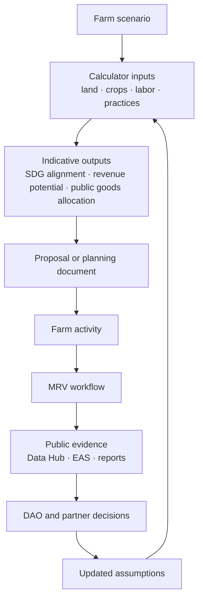
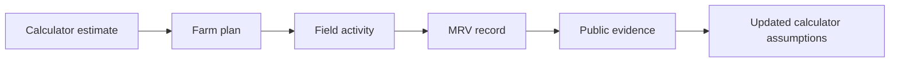

# Estimate farm impact before you make claims.

The Kokonut Impact Calculator helps farm founders, DAO members, grant reviewers, contributors, and partners explore how a regenerative farm scenario may translate into SDG alignment, revenue potential, public goods allocation, and evidence requirements.

Use it as a **planning tool**, not as certified proof. The calculator helps you ask better questions; Kokonut's MRV workflow is what turns farm activity into verifiable evidence.

  <a href="#calculator" style={{ display: "inline-flex", alignItems: "center", gap: "6px", background: "#009F4D", color: "#fff", padding: "10px 20px", borderRadius: "8px", fontWeight: "600", fontSize: "14px", textDecoration: "none" }}>
    Use the Calculator →
  </a>

  <a href="/ecosystem-wiki/kokonut-farms/measurement-reporting-and-verification" style={{ display: "inline-flex", alignItems: "center", gap: "6px", border: "1.5px solid #009F4D", color: "#009F4D", padding: "10px 20px", borderRadius: "8px", fontWeight: "600", fontSize: "14px", textDecoration: "none", background: "transparent" }}>
    Read MRV Methodology
  </a>

  Built for scenario design, proposal drafting, farm planning, public goods reporting, and impact review.

<Warning>
  Calculator outputs are indicative estimates. They are not financial advice, investment returns, certified carbon credits, audited SDG outcomes, or guaranteed farm results. Actual performance depends on land conditions, weather, execution, crop survival, market prices, governance, and data quality.
</Warning>

---

## What this calculator helps you do

| User | What you can use it for | Best next step |
| --- | --- | --- |
| Farm founder | Estimate how land size, crops, labor, and practices affect the impact story. | Convert the scenario into a farm proposal |
| DAO member | Review whether a proposal's impact assumptions are directionally reasonable. | Compare scenario outputs with MRV evidence |
| Grant reviewer | Understand how a farm connects to SDGs and public goods | Inspect the Data Hub and reports |
| Impact contributor | Identify what data needs to be measured, reported, and verified | Help improve MRV workflows |
| Developer or agent builder | See which assumptions become useful inputs for scoring or simulation | Connect calculator logic to structured farm records |

<Note>
  The calculator is most useful when paired with the [Common Data Schema](/kokonut-framework/framework-components/common-data-schema), [MRV Methodology](/ecosystem-wiki/kokonut-farms/measurement-reporting-and-verification), and a live farm reference such as [Adelphi](/ecosystem-wiki/kokonut-farms/adelphi/summary).
</Note>

---

## How the calculator fits into Kokonut

The calculator sits **before** verification. It helps estimate what might happen if a farm follows certain assumptions. MRV then checks what actually happened.

---

## Calculator

<iframe
  src="https://wasalo.github.io/Kokonut-Public-Site/kokonut-framework/sdg-calculator.html"
  title="Kokonut SDG Impact Calculator"
  width="100%"
  height="920"
  style={{
  border: 0,
  borderRadius: "12px",
  overflow: "hidden"
}}
/>

<Tip>
  Start by loading the Adelphi baseline if available, then adjust land size, crop mix, worker count, and regenerative practices to compare a new farm scenario against Kokonut's first live reference farm.
</Tip>

---

## What the calculator estimates

| Output | What it means | What verifies it later |
| --- | --- | --- |
| SDG alignment | A directional view of how the farm may contribute to selected SDGs | Field records, harvest data, employment records, training logs, SDG reporting |
| Revenue potential | Estimated production value based on crop and area assumptions | Actual harvest records, sales records, buyer agreements, Data Hub entries |
| Public goods allocation | Estimated portion of farm value that may support public goods | DAO proposal terms, treasury records, allocation reports |
| Job signal | Approximate employment or work-creation potential | Payroll records, role logs, contributor records, and local reporting |
| Climate co-benefit | A planning signal for soil, biomass, and carbon-related potential | Soil data, vegetation indices, biochar records, methodology-specific MRV |
| Verification needs | The evidence required before claims should be used publicly | MRV payloads, IPFS records, EAS attestations, annual reports |

---

## What the calculator does not prove

The calculator does **not** prove that a farm has already produced an impact.

It does not certify:

- carbon credits or carbon removals
- guaranteed crop yield
- guaranteed revenue
- investment returns
- Final SDG achievement
- legal compliance
- organic certification
- farm success

It creates a structured starting point for discussion, proposal review, and evidence planning.

---

## How assumptions should be handled

| Assumption type | Safe use | Risk if overstated |
| --- | --- | --- |
| Land size | Use for planning production capacity | Land may not all be usable or irrigated |
| Crop mix | Use to compare short, medium, and long-cycle revenue potential | Crop survival, disease, pests, and weather can change outcomes |
| Revenue rates | Use as scenario assumptions, preferably from Adelphi forecast data | Market prices and buyer access can change quickly |
| Public goods share | Use only if the farm proposal commits to it | Allocation is not real until governed and reported |
| Jobs | Use as a planning signal | Actual employment depends on budget, season, and operations |
| Carbon or climate | Treat it as a co-benefit until the methodology and MRV support it | Unsupported carbon claims can become greenwashing |
| SDG scores | Use to guide measurement priorities | SDG alignment is not the same as verified impact |

<Warning>
  SDG 13 should be treated as a climate co-benefit unless a farm has a complete carbon methodology, baseline, monitoring plan, and verification workflow. Kokonut should avoid presenting carbon as a guaranteed result before evidence exists.
</Warning>

---

## How every number should become evidence

The calculator becomes useful when its assumptions are converted into measurable events.

| Calculator input or output | Evidence to collect | Where it belongs |
| --- | --- | --- |
| Farm area | Polygon, GPS boundaries, land-use map | Common Data Schema and Data Hub |
| Crop mix | Planting records, crop cycle logs, density assumptions | Farm Registry and harvest forecast |
| Harvest estimates | Harvest logs, sales records, loss rates, and photos | Data Hub and annual reports |
| Labor or jobs | Role records, payroll notes, contributor logs | DAO reports and SDG reporting |
| Biochar or soil practices | Input logs, soil readings, and field observations | MRV payloads |
| Vegetation health | NDVI, NDRE, ReCI, MSAVI, drone imagery | MRV and Data Hub |
| Public goods allocation | Proposal terms, treasury transfers, and reporting | DAO governance and public reports |

This is the intended relationship:

---

## Recommended workflow

<Steps>
  <Step title="Start with the calculator">
    Create a rough scenario using land size, crop mix, workers, and regenerative practices.
  </Step>
  <Step title="Write down the assumptions">
    Record which numbers are based on Adelphi, which are local estimates, and which still need validation.
  </Step>
  <Step title="Map assumptions to the Common Data Schema">
    Turn the scenario into a comparable farm record that includes location, land size, funding needs, crops, governance, public goods allocation, and market assumptions.
  </Step>
  <Step title="Define MRV requirements">
    Decide which soil, satellite, harvest, field, and financial records will be needed before the farm can make public impact claims.
  </Step>
  <Step title="Compare estimates against actuals">
    Once the farm is active, update projections using live Data Hub records, MRV events, and annual reports.
  </Step>
</Steps>

---

## How to read the result

| If the calculator shows... | Interpret it as... | Do next |
| --- | --- | --- |
| High SDG alignment | A strong planning hypothesis | Identify evidence needed for each SDG |
| High revenue potential | A promising economic scenario | Verify prices, buyers, crop cycles, and loss rates |
| High public goods allocation | A possible community benefit | Confirm it through DAO proposal terms |
| Strong climate co-benefit | A reason to collect better ecological data | Do not claim carbon impact until verified |
| Low score in one category | A design gap | Adjust crop mix, labor plan, training, or MRV scope |

---

## Related pages

<CardGroup cols={2}>
  <Card title="Common Data Schema" icon="database" href="/kokonut-framework/framework-components/common-data-schema">
    The 13-field farm record makes calculator assumptions comparable across farms.
  </Card>

  <Card title="MRV Methodology" icon="magnifying-glass-chart" href="/ecosystem-wiki/kokonut-farms/measurement-reporting-and-verification">
    How estimates become public evidence through structured payloads, IPFS records, EAS attestations, and reports.
  </Card>

  <Card title="Adelphi SDG Alignment" icon="recycle" href="/ecosystem-wiki/kokonut-farms/adelphi/sustainable-development-goals">
    How Kokonut's first live farm maps farm activity to SDG evidence.
  </Card>

  <Card title="Crops & Harvest Forecast" icon="dragon" href="/ecosystem-wiki/kokonut-farms/adelphi/crops-and-harvest-forecast">
    The crop and revenue assumptions behind Adelphi's forecast model.
  </Card>

  <Card title="Proposal Templates" icon="file-pen" href="/ecosystem-wiki/the-kokonut-dao/proposal-templates">
    Turn a calculator scenario into a DAO-readable funding, bounty, partnership, or framework proposal.
  </Card>

  <Card title="Open Collaboration" icon="hands-helping" href="/ecosystem-wiki/open-collaboration-invitation">
    Help improve calculators, farm data models, MRV workflows, and impact reporting.
  </Card>
</CardGroup>

  <a href="#calculator" style={{ display: "inline-flex", alignItems: "center", gap: "6px", background: "#009F4D", color: "#fff", padding: "10px 20px", borderRadius: "8px", fontWeight: "600", fontSize: "14px", textDecoration: "none" }}>
    Run Another Scenario →
  </a>

  <a href="/ecosystem-wiki/kokonut-farms/measurement-reporting-and-verification" style={{ display: "inline-flex", alignItems: "center", gap: "6px", border: "1.5px solid #009F4D", color: "#009F4D", padding: "10px 20px", borderRadius: "8px", fontWeight: "600", fontSize: "14px", textDecoration: "none", background: "transparent" }}>
    Plan the Evidence
  </a>

