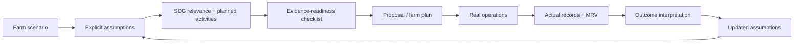

# Model the scenario. Do not score the impact.

The Kokonut Impact Calculator helps farm founders, contributors, capital-governance participants, reviewers, and partners turn a farm idea into a **structured planning scenario**.

It is designed to answer questions such as:

- Which of Kokonut's primary SDGs are relevant to this farm design?
- Which activities are actually represented in the scenario?
- Which evidence would be needed before stronger claims are made?
- What gross-revenue assumption is the plan using?
- If the farm proposes a public-goods allocation, what amount would that assumption imply?
- Which parts of the scenario are still forecasts rather than actual records?

The calculator does **not** generate verified impact.

> **Its job is to organize assumptions and evidence gaps — not to turn planning inputs into scientific, financial, or social outcomes.**

<CardGroup cols={2}>
  <Card title="Use the calculator" icon="calculator" href="#calculator">
    Build a custom scenario or load the Adelphi reference assumptions.
  </Card>

  <Card title="Understand the SDG method" icon="chart-network" href="/kokonut-framework/framework-features/Sustainable-Development-Goals">
    See how Kokonut separates SDG alignment, activity, measured outcome, and impact interpretation.
  </Card>

  <Card title="See Adelphi's SDG evidence" icon="seedling" href="/ecosystem-wiki/kokonut-farms/adelphi/sustainable-development-goals">
    Compare a planning scenario with the evidence boundaries used for the live reference farm.
  </Card>

  <Card title="Plan the evidence" icon="magnifying-glass-chart" href="/ecosystem-wiki/kokonut-farms/measurement-reporting-and-verification">
    Turn scenario assumptions into source records, review states, publications, and appropriate interpretations.
  </Card>
</CardGroup>

<Warning>
  **Calculator outputs are planning artifacts.** They are not audited SDG outcomes, certified carbon claims, investment returns, guaranteed yields, regulatory findings, employment verification, or proof that a farm created a public benefit.
</Warning>

---

## What changed in this version

The calculator previously generated several values from hidden heuristic formulas.

This revision removes the outputs that looked more authoritative than the underlying evidence justified.

| Previous behavior | Revised behavior |
| --- | --- |
| Revenue was inferred from land area and crop type | **Gross annual revenue is now a user-supplied forecast assumption** |
| Public goods were fixed at 10% | **Public-goods share is a user-selected scenario input** |
| Carbon tonnage was calculated from land/crop multipliers | **No carbon quantity is generated without a carbon methodology** |
| Primary SDGs received numeric “impact scores” | **Each SDG receives a planning status based on scenario activities and evidence planning** |
| MRV increased impact scores | **MRV readiness is treated as evidence infrastructure, not impact** |
| Women-led status generated a high SDG 5 score | **Women-led status creates a relevant activity signal; broader gender outcomes still require evidence** |

<Info>
  The redesign favors **transparent assumptions over false precision**. A calculator can help structure a hypothesis; it should not manufacture an outcome that belongs to field evidence.
</Info>

---

## How the calculator fits into the Framework

```mermaid
flowchart LR
    A["Farm scenario"] --> B["Explicit assumptions"]
    B --> C["SDG relevance + planned activities"]
    C --> D["Evidence-readiness checklist"]
    D --> E["Proposal / farm plan"]
    E --> F["Real operations"]
    F --> G["Actual records + MRV"]
    G --> H["Outcome interpretation"]
    H --> I["Updated assumptions"]
    I --> B
```

The calculator intentionally stops **before outcome verification**.

It can help prepare the farm plan and evidence requirements.

The farm, MRV records, and later analysis determine what actually happened.

---

## Calculator

<iframe
  src="https://wasalo.github.io/Kokonut-Public-Site/kokonut-framework/sdg-calculator.html"
  title="Kokonut Scenario and SDG Evidence Calculator"
  width="100%"
  height="1280"
  style={{
    border: 0,
    borderRadius: "16px",
    overflow: "hidden"
  }}
/>

<Tip>
  Use **Load Adelphi reference** to inspect the documented planning baseline, then change one assumption at a time. The Adelphi revenue figure and 10% public-goods share remain forecast/model assumptions rather than realized economic outcomes.
</Tip>

---

## Inputs are assumptions, not facts

The calculator separates farm-design assumptions from evidence planning.

### Scenario assumptions

| Input | What it represents | What it does not prove |
| --- | --- | --- |
| **Agricultural area** | Land area used in the scenario | Usability, title, irrigation, or production capacity |
| **Worker roles** | Planned or documented number of roles | Full-time status, compensation quality, continuity, or poverty reduction |
| **Gross annual revenue forecast** | A user-supplied planning figure | Realized sales, profit, operator income, or distributable cash |
| **Public-goods share** | A proposed allocation percentage | An approved or realized transfer |
| **Crop system** | Production-design category | Yield, survival, profitability, or resilience |
| **Farm context** | Rural, peri-urban, or urban planning context | Community outcomes |
| **Women-led** | Ownership/management characteristic in the scenario | Broader gender-equity outcomes |
| **Organic pathway** | Organic practices or certification pathway is part of the plan | Completed certification |
| **Biochar / soil practices** | Soil-management intervention is planned | Soil improvement or carbon quantity |
| **Nursery / biodiversity** | Propagation or biodiversity work is planned | Biodiversity restoration |
| **Training** | Education or skills activity is planned | Learning outcomes or livelihood improvement |
| **MRV-ready** | The project plans structured records and review | Scientific validation or impact |

### Evidence-readiness inputs

The calculator also asks whether the scenario has or plans records for:

- land / site;
- jobs and roles;
- compensation / work quality;
- harvest and distribution;
- ownership / leadership;
- ecological baseline;
- public-goods transfers.

These checks affect **evidence readiness**, not the claimed magnitude of impact.

---

## What the calculator returns

| Output | Meaning |
| --- | --- |
| **Gross revenue scenario** | The annual forecast value entered by the user |
| **Public-goods scenario** | Gross revenue forecast × user-selected allocation percentage |
| **Worker roles** | The scenario's planned/documented role count |
| **Evidence readiness** | Count of evidence categories the user says are available or planned |
| **Primary SDG planning status** | Whether the scenario represents a relevant activity and whether an evidence plan exists |
| **Climate co-benefit note** | Whether climate-related practices appear relevant; no carbon quantity is calculated |
| **Evidence gaps** | Records that should be added before stronger claims are made |

The calculator does **not** rank farms or decide that one farm is “more impactful” than another.

---

## The SDG claim ladder

The revised calculator follows the same claim ladder as the Framework and Adelphi SDG pages.

| Level | Meaning | Can the calculator reach it? |
| --- | --- | --- |
| **Alignment** | The farm design is relevant to the SDG | **Yes** |
| **Activity** | A relevant intervention is planned or documented | **Yes — as a planning/activity signal** |
| **Measured outcome** | A real change was recorded during operations | **No — requires actual farm evidence** |
| **Impact interpretation** | Evidence supports a higher-level SDG contribution | **No — requires methodology, context, and review** |

> **A calculator should not jump from design inputs directly to impact.**

---

## Primary SDGs in the calculator

The tool focuses on the same five primary SDGs used in the current Kokonut Framework.

| SDG | Scenario signals | Evidence that strengthens the claim |
| --- | --- | --- |
| **SDG 1 — No Poverty** | Worker roles, economic activity, proposed public-goods allocation | Role/compensation records, realized revenue, allocation records, beneficiary evidence |
| **SDG 2 — Zero Hunger** | Food-production system | Harvest actuals, sales/distribution records, food-access evidence |
| **SDG 5 — Gender Equality** | Women-led ownership or management | Leadership records, participation, opportunity, income and benefit-sharing evidence |
| **SDG 8 — Decent Work and Economic Growth** | Worker roles, training, economic activity | Role type, compensation, safety, training, continuity, realized revenue |
| **SDG 15 — Life on Land** | Syntropic design, nursery, soil/biochar practices | Baselines, repeated soil/vegetation/biodiversity records, survival and land-condition evidence |

### SDG 13 — Climate Action

SDG 13 remains a **secondary climate co-benefit**.

The calculator can identify that climate-relevant practices are present.

It does **not** calculate t CO₂e.

A quantified climate claim requires an appropriate methodology, baseline, reporting period, measurements, uncertainty treatment, and review.

---

## Adelphi reference scenario

The calculator's Adelphi button loads a **reference planning scenario**, not a live farm snapshot.

Current reference inputs are:

| Input | Reference value | Status |
| --- | ---: | --- |
| Agricultural area | **13,838 m²** | Documented reference |
| Worker roles | **7** | Documented jobs; role type/quality requires additional records |
| Gross annual crop revenue | **~$149,111** | Steady-state forecast |
| Public-goods share | **10%** | Current farm-model assumption |
| Crop system | Syntropic / mixed multi-cycle | Production design |
| Women-led | Yes | Documented founders/operators |
| Organic pathway | Yes | Certification/pathway context; not treated as completed certification |
| Biochar / soil practices | Yes | Documented practice |
| Nursery / biodiversity | Yes | Documented practice |
| Training | Yes | Documented infrastructure/program intent |
| MRV-ready | Yes | Active evidence infrastructure |

<Warning>
  The repository also contains a conflicting historical **40% operators / 40% public goods / 20% Kokonut Network** allocation. The calculator therefore treats **10% only as the current Adelphi modeling assumption**, not as a universal Framework rule or authoritative realized distribution.
</Warning>

[Review the Adelphi forecast →](/ecosystem-wiki/kokonut-farms/adelphi/crops-and-harvest-forecast)

---

## Public goods are configurable by design

The Framework's PUBLIC GOODS pillar asks:

- what benefit is being funded?
- who benefits?
- how is it financed?
- how will it be reported?

It does **not** require every farm to use one allocation percentage.

The calculator therefore uses:

> **public-goods scenario = user-entered gross revenue forecast × user-selected allocation share**

That output remains a forecast until the applicable farm agreement, governance decision, revenue actual, and transfer record exist.

---

## Climate outputs deliberately avoid false precision

The previous calculator estimated carbon tonnage from land area and crop-system multipliers.

This version removes that calculation.

Why?

Because a defensible carbon quantity can depend on:

- baseline;
- carbon pools;
- species and biomass;
- soil sampling;
- biochar production/application method;
- additionality;
- permanence;
- leakage;
- uncertainty;
- reporting period;
- methodology;
- verification requirements.

The calculator can still say:

> **“This scenario contains climate-relevant practices; plan the required evidence.”**

It should not convert a checkbox into carbon tonnes.

---

## How assumptions become evidence

| Scenario assumption | Actual evidence to collect | Stronger interpretation only after |
| --- | --- | --- |
| Agricultural area | Polygon, land-use map, site/operating-right record | Area and use are verified for the reporting period |
| Worker roles | Role records, dates, compensation, safety, continuity | Work quality and beneficiary evidence exist |
| Revenue forecast | Harvests, sales, prices, losses, costs | Realized economics can be compared with forecast |
| Public-goods share | Approved arrangement + transfer records | Beneficiaries and use of funds are documented |
| Crop system | Planting and harvest records | Production actuals exist |
| Women-led | Ownership/leadership records | Broader gender outcomes have participant-level evidence |
| Biochar / soil practices | Production/application logs + soil observations | Repeated measurements support a soil/climate interpretation |
| Nursery / biodiversity | Inventory, provenance, survival, repeat surveys | Longitudinal ecological evidence exists |
| Training | Attendance, curriculum, participant records | Learning or livelihood outcomes are measured |
| MRV-ready | Record lifecycle, source provenance, reviewers, publication | Claims can be traced to governed evidence |

---

## Recommended workflow

<Steps>
  <Step title="1. Build the scenario" icon="calculator" iconType="regular">
    Enter the farm's land, worker roles, economic assumptions, crop system, practices, and current evidence plan.
  </Step>

  <Step title="2. Read the SDG statuses as hypotheses" icon="chart-network" iconType="regular">
    Use the statuses to identify which primary SDGs are relevant and which evidence categories are still missing.
  </Step>

  <Step title="3. Move assumptions into the farm record" icon="database" iconType="regular">
    Use the [Common Data Schema](/kokonut-framework/framework-components/common-data-schema) to record the farm context consistently.
  </Step>

  <Step title="4. Put explicit assumptions in the proposal" icon="file-pen" iconType="regular">
    Label revenue, public goods, production, and impact expectations as forecasts where they are not yet actual.
  </Step>

  <Step title="5. Define the MRV plan" icon="magnifying-glass-chart" iconType="regular">
    Decide who records, reviews, publishes, and interprets the evidence needed for each material claim.
  </Step>

  <Step title="6. Replace forecasts with actuals over time" icon="arrows-rotate" iconType="regular">
    Compare the planning scenario with harvest, revenue, labor, ecological, and public-goods records as operations mature.
  </Step>
</Steps>

---

## What this calculator should never be used to claim

<CardGroup cols={2}>
  <Card title="Not an impact certification" icon="magnifying-glass-chart">
    Scenario status is not external assurance or scientific verification.
  </Card>

  <Card title="Not an investment model" icon="coins">
    Revenue forecasts are user assumptions and do not represent returns.
  </Card>

  <Card title="Not a carbon calculator" icon="calculator">
    Climate-relevant practices do not become quantified carbon without a methodology.
  </Card>

  <Card title="Not a farm ranking" icon="scale-balanced">
    The tool does not score one farm as socially or ecologically superior to another.
  </Card>

  <Card title="Not a public-goods rule" icon="users">
    The allocation percentage is scenario-specific, not a universal Kokonut requirement.
  </Card>

  <Card title="Not a substitute for actuals" icon="database">
    Once real farm records exist, they should replace planning assumptions wherever possible.
  </Card>
</CardGroup>

---

## Related pages

<CardGroup cols={2}>
  <Card title="Sustainable Development Goals" icon="chart-network" href="/kokonut-framework/framework-features/Sustainable-Development-Goals">
    The Framework's evidence-aware SDG methodology.
  </Card>

  <Card title="Adelphi SDG Evidence" icon="seedling" href="/ecosystem-wiki/kokonut-farms/adelphi/sustainable-development-goals">
    See how alignment, activity, measured outcome, and impact interpretation are separated at the reference farm.
  </Card>

  <Card title="Common Data Schema" icon="database" href="/kokonut-framework/framework-components/common-data-schema">
    Move scenario assumptions into the shared farm record.
  </Card>

  <Card title="MRV Methodology" icon="magnifying-glass-chart" href="/ecosystem-wiki/kokonut-farms/measurement-reporting-and-verification">
    Turn operational activity into traceable evidence without confusing attestations with scientific truth.
  </Card>

  <Card title="Adelphi Forecast" icon="calculator" href="/ecosystem-wiki/kokonut-farms/adelphi/crops-and-harvest-forecast">
    Review the assumptions behind the reference revenue scenario.
  </Card>

  <Card title="Pillars of Value" icon="square-poll-vertical" href="/kokonut-framework/framework-components/pillars-of-value">
    Evaluate WHAT, WHO, HOW MUCH, CONTRIBUTION, RISK, and PUBLIC GOODS without reducing impact to a single score.
  </Card>
</CardGroup>

> **A useful impact calculator does not manufacture impact. It makes assumptions explicit enough that real operations and real evidence can later confirm, reject, or improve them.**
