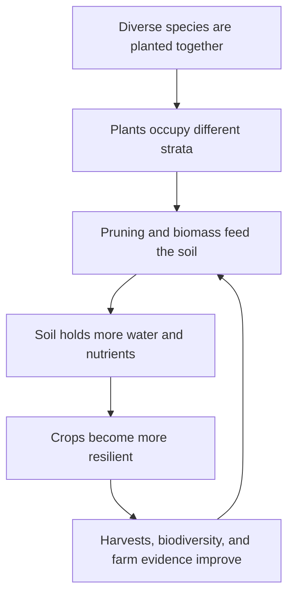
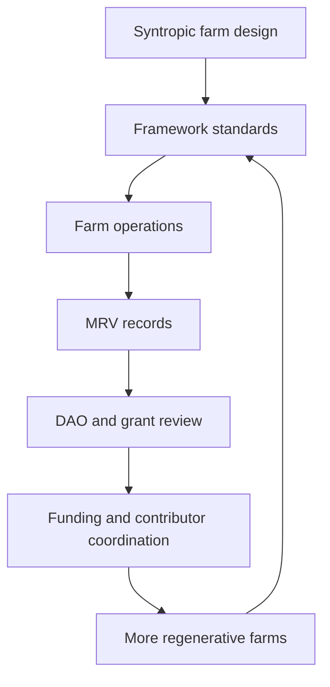

# Syntropic farming makes regeneration practical.

Kokonut Network uses syntropic farming because it turns a farm into a living system: crops, trees, soil, water, animals, biodiversity, labor, and community value reinforce each other over time.

Instead of treating land as something to extract from, syntropic farming designs farms to behave more like forests: diverse, layered, adaptive, and increasingly fertile as they mature.

<div style={{ display: "flex", gap: "12px", justifyContent: "center", flexWrap: "wrap", margin: "1.5rem 0 0.75rem" }}>
  <a href="#how-syntropic-farming-works" style={{ display: "inline-flex", alignItems: "center", gap: "6px", background: "#009F4D", color: "#fff", padding: "10px 20px", borderRadius: "8px", fontWeight: "600", fontSize: "14px", textDecoration: "none" }}>
    See How It Works →
  </a>

  <a href="/ecosystem-wiki/kokonut-farms/adelphi/crops-biodiversity-and-infrastructure" style={{ display: "inline-flex", alignItems: "center", gap: "6px", border: "1.5px solid #009F4D", color: "#009F4D", padding: "10px 20px", borderRadius: "8px", fontWeight: "600", fontSize: "14px", textDecoration: "none", background: "transparent" }}>
    See It at Adelphi
  </a>
</div>

<p style={{ textAlign: "center", fontSize: "13px", color: "#6b7280", marginTop: "0.25rem" }}>
  Built for farm founders, DAO members, contributors, regenerative agriculture practitioners, impact reviewers, and anyone trying to understand why Kokonut farms are designed this way.
</p>

<div style={{ display: "grid", gridTemplateColumns: "repeat(auto-fit, minmax(130px, 1fr))", gap: "1px", background: "#e5e7eb", border: "1px solid #e5e7eb", borderRadius: "12px", overflow: "hidden", margin: "1.5rem 0" }}>
  <div style={{ background: "white", padding: "1rem", textAlign: "center" }}>
    <div style={{ fontSize: "1.35rem", fontWeight: "700", color: "#009F4D", lineHeight: 1 }}>4</div>
    <div style={{ fontSize: "0.72rem", color: "#6b7280", marginTop: "4px", fontWeight: "500" }}>vertical strata</div>
  </div>

  <div style={{ background: "white", padding: "1rem", textAlign: "center" }}>
    <div style={{ fontSize: "1.35rem", fontWeight: "700", color: "#009F4D", lineHeight: 1 }}>5</div>
    <div style={{ fontSize: "0.72rem", color: "#6b7280", marginTop: "4px", fontWeight: "500" }}>regeneration principles</div>
  </div>

  <div style={{ background: "white", padding: "1rem", textAlign: "center" }}>
    <div style={{ fontSize: "1.35rem", fontWeight: "700", color: "#009F4D", lineHeight: 1 }}>2</div>
    <div style={{ fontSize: "0.72rem", color: "#6b7280", marginTop: "4px", fontWeight: "500" }}>Adelphi syntropic plots</div>
  </div>

  <div style={{ background: "white", padding: "1rem", textAlign: "center" }}>
    <div style={{ fontSize: "1.35rem", fontWeight: "700", color: "#009F4D", lineHeight: 1 }}>12+</div>
    <div style={{ fontSize: "0.72rem", color: "#6b7280", marginTop: "4px", fontWeight: "500" }}>at-risk species</div>
  </div>

  <div style={{ background: "white", padding: "1rem", textAlign: "center" }}>
    <div style={{ fontSize: "1.35rem", fontWeight: "700", color: "#009F4D", lineHeight: 1 }}>MRV</div>
    <div style={{ fontSize: "0.72rem", color: "#6b7280", marginTop: "4px", fontWeight: "500" }}>impact evidence</div>
  </div>
</div>

<Note>
  Syntropic farming is the agricultural method within the [Kokonut Framework](/kokonut-framework/Introduction). The Framework turns that method into a repeatable system for onboarding farms, structuring operations, measuring impact, and helping DAO members compare real projects.
</Note>

---

## How syntropic farming works

Syntropic farming is a regenerative agriculture method associated with Swiss-Brazilian farmer Ernst Götsch. The core idea is simple: productive farms can be designed to mimic the logic of forests.

A forest does not rely on a single species, a single harvest, or external chemical inputs to stay alive. It layers species vertically, cycles biomass, protects soil, captures water, creates habitat, and becomes more complex over time.

Syntropic farming applies that logic to food production.

| Stratum | Example species | Function |
| --- | --- | --- |
| High canopy | Coconut, timber trees, long-cycle species | Shade, biomass, roots, long-term value |
| Medium canopy | Passion fruit, banana, cacao, fruit trees | Fruit production, habitat, vertical diversity |
| Low canopy | Indian yams, shrubs, nitrogen-fixing species | Food, soil support, and biological interactions |
| Ground cover | Lettuce, tomatoes, legumes, and beard grass | Soil protection, moisture retention, erosion control |

The farm is designed as a succession system. Different species grow at different rates, occupy different layers, and support one another through shade, pruning, mulch, root activity, and nutrient cycling.



---

## What it replaces

Syntropic farming replaces the extraction logic of industrial monoculture.

| Industrial monoculture | Syntropic farming |
| --- | --- |
| One dominant crop | Multiple crops and species in one system |
| Synthetic fertilizers and pesticides | Organic inputs, biomass cycling, compost, biochar, and biological processes |
| Bare soil between cycles | Continuous ground cover and living roots |
| Soil fertility declines over time | Soil fertility is designed to improve over time |
| Revenue depends on one crop cycle | Revenue can come from short, medium, long, and continuous production streams |
| Biodiversity is treated as a threat | Biodiversity is part of the productivity mechanism |

This matters because Kokonut is not only trying to fund farms. It is trying to fund farms that can become long-term community assets.

---

## Why Kokonut builds on syntropic farming

<CardGroup cols={2}>
  <Card title="It creates multiple production timelines" icon="timeline">
    Short-cycle crops, medium-cycle fruits, long-cycle trees, and animal systems can all produce value on different timelines.
  </Card>

  <Card title="It reduces input dependency" icon="arrows-rotate">
    Biomass, compost, biochar, poultry manure, humic acids, and organic inputs reduce reliance on external synthetic inputs.
  </Card>

  <Card title="It protects the soil" icon="mountain-sun">
    Ground cover, roots, mulch, and organic matter keep soil protected instead of exposed between harvests.
  </Card>

  <Card title="It supports water resilience" icon="droplet">
    Healthier soils generally retain moisture better and help farms respond to both drought and heavy rainfall.
  </Card>

  <Card title="It makes biodiversity useful" icon="leaf">
    Biodiversity is not decorative. It supports pollination, habitat, fertility, pest balance, and long-term ecological resilience.
  </Card>

  <Card title="It can be measured" icon="satellite-dish">
    Vegetation health, soil observations, crop records, field activities, and impact metrics can flow into Kokonut's MRV workflow.
  </Card>
</CardGroup>

<Warning>
  Syntropic farming improves the conditions for resilience and regeneration, but it does not remove agricultural risk. Weather, pests, labor, irrigation, execution, markets, and data quality still matter. Kokonut uses MRV to track outcomes rather than asking readers to blindly trust claims.
</Warning>

---

## In practice: Adelphi

Adelphi is Kokonut's first live syntropic farm in Monte Plata, Dominican Republic. It turns this methodology into a real operating system with crop beds, syntropic plots, a nursery, a biofactory, poultry, training space, biodiversity work, and public MRV.

| Syntropic principle | How Adelphi applies it |
| --- | --- |
| Multi-strata design | Short-cycle vegetables, medium-cycle fruits, long-cycle coconut, native species, and ground cover systems |
| Diversified revenue | Lettuce, passion fruit, coconut, eggs, and future market channels instead of a single-crop dependency |
| Closed-loop fertility | Bamboo biochar, poultry manure, humic acids, organic urea, forage, and crop residues |
| Biodiversity conservation | Nursery propagation and agroforestry species, including 12\+ at-risk or native species |
| Animal integration | 110 free-range hens contribute eggs, manure, ground activity, and nutrient cycling |
| Education and replication | A training gazebo and farm layout support workshops, community learning, and future farm replication |
| MRV evidence | Farm data, harvest records, satellite indices, field logs, and impact metrics can be inspected through the Kokonut Hub |

[Explore Adelphi's farm system →](/ecosystem-wiki/kokonut-farms/adelphi/crops-biodiversity-and-infrastructure)

---

## How syntropic farming becomes a verifiable impact

Kokonut does not want regenerative agriculture to remain a beautiful story with no evidence. Syntropic farming becomes useful to DAO members, grant reviewers, researchers, builders, and communities when farm activity becomes inspectable data.

The MRV workflow turns farm activity into public evidence:

```text
Farm activity → structured payload → IPFS record → Farm Registry event → EAS attestation → public Data Hub → annual impact report
```

| What happens on the farm | What can be measured or reported |
| --- | --- |
| Crop planting and harvests | Crop type, volume, dates, yield, and revenue assumptions vs. actuals |
| Vegetation growth | Satellite indices such as NDVI, NDRE, and MSAVI |
| Soil and water practices | Moisture, soil observations, input use, cover crop activity, and field notes |
| Biodiversity work | Species planted, nursery propagation, per-plant records, and habitat improvements |
| Poultry integration | Egg production, manure use, forage, and nutrient cycling |
| Community education | Workshops, attendance, training activity, and local participation |

[Read the MRV methodology →](/ecosystem-wiki/kokonut-farms/measurement-reporting-and-verification)

---

## Why this matters for the Kokonut Framework

The Kokonut Framework needs farms that are comparable, fundable, governable, and verifiable. Syntropic farming gives the Framework a regenerative operating method that can be adapted across different sites.



| Framework need | Why syntropic farming helps |
| --- | --- |
| Comparable farms | Similar principles can be applied across different lands, crops, and communities |
| Fundable proposals | Farm plans can explain production cycles, infrastructure needs, and measurable outputs |
| Governable decisions | DAO members can review farm operations against shared regenerative standards |
| Verifiable claims | Farm activity can be measured through MRV instead of being treated as self-reported marketing |
| Replication | Lessons from Adelphi can inform future farms without forcing every farm to be identical |

---

## What to read next

<CardGroup cols={2}>
  <Card title="5 Principles of Regeneration" icon="hand-holding-seedling" href="/kokonut-framework/framework-components/framework-features/5-principles-of-regeneration">
    The operational principles derived from Kokonut's regenerative farming approach.
  </Card>

  <Card title="Adelphi Crops, Biodiversity & Infrastructure" icon="puzzle" href="/ecosystem-wiki/kokonut-farms/adelphi/crops-biodiversity-and-infrastructure">
    The live farm system where syntropic farming is being implemented and tracked.
  </Card>

  <Card title="MRV — Measurement & Verification" icon="magnifying-glass-chart" href="/ecosystem-wiki/kokonut-farms/measurement-reporting-and-verification">
    How farm activity becomes public evidence for DAO members, researchers, and contributors.
  </Card>

  <Card title="Kokonut Framework Introduction" icon="seedling" href="/kokonut-framework/Introduction">
    How syntropic farming fits into the broader system for farm onboarding, governance, and replication.
  </Card>
</CardGroup>

<div style={{ display: "flex", gap: "12px", justifyContent: "center", flexWrap: "wrap", margin: "2rem 0 0.75rem" }}>
  <a href="/ecosystem-wiki/kokonut-farms/adelphi/crops-biodiversity-and-infrastructure" style={{ display: "inline-flex", alignItems: "center", gap: "6px", background: "#009F4D", color: "#fff", padding: "10px 20px", borderRadius: "8px", fontWeight: "600", fontSize: "14px", textDecoration: "none" }}>
    See It at Adelphi →
  </a>

  <a href="https://hub.kokonut.network/projects/41" style={{ display: "inline-flex", alignItems: "center", gap: "6px", border: "1.5px solid #009F4D", color: "#009F4D", padding: "10px 20px", borderRadius: "8px", fontWeight: "600", fontSize: "14px", textDecoration: "none", background: "transparent" }}>
    Explore Live Farm Data
  </a>
</div>