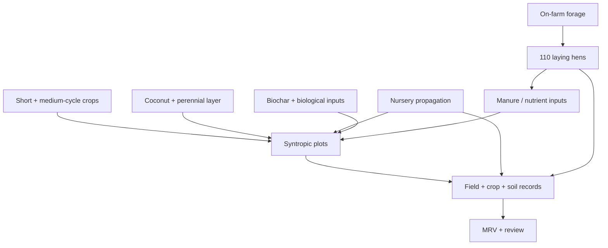
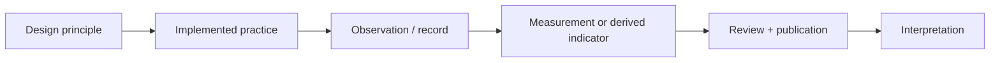
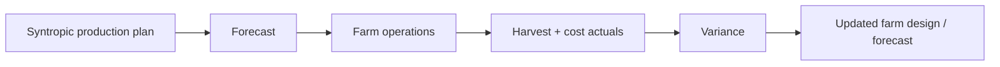

# Syntropic farming gives Kokonut a practical design language for regeneration.

Kokonut uses syntropic farming as a major agricultural influence because it offers a way to think about farms as **dynamic, multi-layered biological systems** rather than isolated crop cycles.

The useful ideas are not “copy this exact farm design.”

They are:

- work with ecological succession;
- combine species with different functions and timelines;
- keep soil protected;
- maintain living roots and perennial structure;
- recycle biomass and nutrients;
- use diversity deliberately;
- adapt management as the system changes.

Those ideas fit Kokonut's broader Framework because they can be translated into **farm design, operating practices, records, and measurable questions**.

> **Syntropic farming is a design approach. Regeneration is an outcome claim that still needs evidence.**

<CardGroup cols={2}>
  <Card title="See the shared regeneration principles" icon="hand-holding-seedling" href="/kokonut-framework/framework-components/framework-features/5-principles-of-regeneration">
    Review the five Framework principles that translate regenerative intent into farm-design and operating questions.
  </Card>

  <Card title="See Adelphi's physical systems" icon="seedling" href="/ecosystem-wiki/kokonut-farms/adelphi/crops-biodiversity-and-infrastructure">
    Inspect the documented syntropic plots, crops, nursery, poultry, biochar, ground cover, and evidence requirements.
  </Card>

  <Card title="Understand the Framework" icon="scroll" href="/kokonut-framework/Introduction">
    See how agricultural methodology fits alongside the Common Data Schema, development phases, MRV, value frameworks, and local farm authority.
  </Card>

  <Card title="Understand the evidence layer" icon="magnifying-glass-chart" href="/ecosystem-wiki/kokonut-farms/measurement-reporting-and-verification">
    See how implemented practices become observations, measurements, reviewed records, and impact interpretations.
  </Card>
</CardGroup>

<Info>
  **Kokonut does not require every farm to reproduce Adelphi's species mix, plot geometry, poultry system, or market plan.** Syntropic principles should be adapted to local climate, soil, water, labor, culture, regulation, operator knowledge, and market conditions.
</Info>

---

## Syntropic farming in one sentence

> **Design production around succession, diversity, vertical structure, continuous soil cover, living roots, and biomass cycling so agricultural management works with ecological processes instead of relying on a single crop cycle.**

The forest analogy is useful because forests illustrate:

- multiple vegetation layers;
- continuous biomass production;
- nutrient cycling;
- changing species roles over time;
- living soil and roots;
- structural diversity.

But a productive farm is not literally an unmanaged forest.

Farm operators still make deliberate decisions about:

- species;
- spacing;
- pruning;
- harvest;
- access;
- irrigation;
- fertility;
- pests;
- labor;
- markets;
- infrastructure.

Syntropic design therefore combines ecological logic with active management.

---

## The core design ideas

| Design idea | Practical meaning | What should be observed |
| --- | --- | --- |
| **Succession** | Species and functions change as the system matures | Planting dates, survival, replacement, canopy development, crop transitions |
| **Stratification** | Plants occupy different vertical layers | Plot design, canopy structure, species placement, shading interactions |
| **Diversity** | Multiple species and functions are intentionally combined | Species inventory, crop mix, nursery records, field observations |
| **Soil cover** | Bare soil is minimized through living plants or biomass | Ground-cover observations, imagery, moisture, erosion indicators |
| **Living roots** | Root systems remain active across more of the year | Perennial survival, crop continuity, root-zone observations |
| **Biomass cycling** | Pruning, residues, manure, compost, and other materials are reused | Input logs, pruning records, biochar/compost/manure records |
| **Perennial structure** | Long-lived trees and plants create continuity | Tree inventory, health, phenology, survival, harvest records |
| **Adaptive management** | Operators change management as conditions change | Field notes, interventions, reasons for changes, outcomes |

These ideas are useful because they generate **testable operating questions**.

They do not guarantee the answer.

---

## How syntropic design relates to the 5 Principles of Regeneration

Kokonut's [5 Principles of Regeneration](/kokonut-framework/framework-components/framework-features/5-principles-of-regeneration) are the Framework's more portable operating abstraction.

Syntropic farming helps explain **why** those principles matter.

| Framework principle | Syntropic connection |
| --- | --- |
| **Reduce synthetic and mechanical soil disturbance** | Protect soil biology and rely more on biological cycling and careful management |
| **Maintain year-round living cover** | Keep the soil protected through vegetation, mulch, residues, and overlapping crop timelines |
| **Increase biodiversity** | Combine crops, trees, habitat, and functional species rather than depending on one biological layer |
| **Integrate animals** | Connect animal production and nutrient cycling where locally appropriate |
| **Protect and build living root systems** | Maintain perennial and overlapping root activity across crop cycles |

<Note>
  The five principles are broader than one syntropic recipe. A farm can apply the principles differently from Adelphi while remaining compatible with the Kokonut Framework.
</Note>

---

## What Kokonut borrows — and what remains local

| Shared design logic | Farm-specific decision |
| --- | --- |
| Use diversity intentionally | Which species are appropriate |
| Protect soil | Which cover system works locally |
| Maintain living roots | Which annual/perennial mix is viable |
| Build vertical structure | Which strata and spacing fit the site |
| Cycle biomass | Which residues and inputs are available |
| Integrate animals where useful | Whether livestock is appropriate at all |
| Plan across time | Which crop timelines match the market |
| Record interventions | Which tools and workflows fit the operator |

This is the same principle established in the Framework Introduction:

> **interoperability, not uniformity**

The network benefits from shared questions and compatible evidence.

The farm benefits from keeping local judgment close to the land.

---

## Production across multiple timelines

One reason syntropic design is useful for Kokonut is that it can combine productive systems with different maturity periods.

A farm may contain:

| Timeline | Example role |
| --- | --- |
| **Short cycle** | Vegetables and fast-turnover crops |
| **Medium cycle** | Vines, fruits, roots, and crops that require longer establishment |
| **Long cycle** | Coconut, fruit trees, timber or other perennial species |
| **Continuous / recurring** | Eggs, nursery propagation, biomass, forage, repeated harvest systems |

This can diversify the farm's production calendar.

It does **not** automatically diversify income successfully.

Economic performance still depends on:

- survival;
- yield;
- losses;
- quality;
- labor;
- market access;
- realized prices;
- recurring costs;
- infrastructure;
- timing.

[Review Adelphi's forecast assumptions →](/ecosystem-wiki/kokonut-farms/adelphi/crops-and-harvest-forecast)

---

## Syntropic design can reduce some dependencies — but should not be oversold

Kokonut documentation includes practices such as:

- biomass reuse;
- composting;
- bamboo-derived biochar;
- poultry manure;
- humic-acid preparations;
- organic urea preparations;
- ground cover;
- on-farm forage.

These practices can support strategies that **reduce dependence on some externally purchased inputs**.

The actual degree of substitution should be measured.

For example:

| Claim | Evidence needed |
| --- | --- |
| External fertilizer purchases declined | Procurement and input records over comparable periods |
| On-farm forage displaced purchased feed | Feed and forage records |
| Biochar reduced input cost | Application records + cost comparison |
| Soil fertility improved | Defined soil indicators over time |
| Yield improved | Comparable harvest records and context |

<Warning>
  **A closed-loop intention is not the same as a closed-loop result.** Input substitution, soil response, yield, and cost effects should be measured rather than inferred from the presence of regenerative practices.
</Warning>

---

## Soil protection and water resilience

Syntropic systems typically emphasize:

- living cover;
- mulch and biomass;
- root continuity;
- reduced exposure of bare soil;
- layered vegetation.

These can improve conditions associated with:

- reduced surface exposure;
- better infiltration;
- lower evaporation;
- erosion control;
- moisture retention.

But stronger claims require evidence.

A credible soil or water claim should define:

1. baseline condition;
2. intervention;
3. plot or location;
4. reporting period;
5. measurement method;
6. comparison;
7. uncertainty and limitations.

> **The Framework should document the practice first and strengthen the outcome claim only when repeated evidence supports it.**

---

## Biodiversity should be treated as a system property, not a slogan

Syntropic systems intentionally use more biological diversity than a single-crop design.

That can include:

- production crops;
- perennial trees;
- ground-cover species;
- nursery species;
- forage;
- habitat;
- beneficial organisms;
- animals.

Diversity can support multiple functions.

But “more species” is not automatically equivalent to:

- restored biodiversity;
- improved habitat quality;
- lower pest pressure;
- greater ecological resilience;
- conservation success.

Those are higher-level interpretations.

Useful biodiversity evidence can include:

- species inventory;
- provenance;
- survival;
- spatial records;
- repeat surveys;
- habitat observations;
- pollinator or wildlife records;
- authoritative conservation status where relevant.

---

## Animal integration is optional and management-dependent

Animal integration is one of Kokonut's five regeneration principles, but implementation should fit the local system.

Animals can potentially contribute:

- food production;
- manure;
- forage cycling;
- vegetation management;
- nutrient loops;
- farm revenue.

Poor integration can also create:

- nutrient excess;
- animal-welfare problems;
- soil damage;
- feed dependency;
- disease risk;
- management burden.

The relevant question is not:

> “Does this farm have animals?”

It is:

> **“Are animals integrated in a way that supports the farm system and is documented well enough to evaluate?”**

---

## Adelphi: the current syntropic reference implementation

Adelphi provides Kokonut's clearest documented example of these ideas in practice.

Current repository materials document:

<CardGroup cols={2}>
  <Card title="2 syntropic plots" icon="seedling">
    Two dedicated plots are documented for syntropic implementation.
  </Card>

  <Card title="110 hens" icon="egg">
    The current farm documentation records 110 free-range laying hens in the poultry system.
  </Card>

  <Card title="12+ documented species" icon="leaf">
    Repository materials identify 12+ native or at-risk species across the nursery and agroforestry system.
  </Card>

  <Card title="Nursery + biofactory" icon="flask">
    Propagation and biological-input production are documented as part of the farm infrastructure.
  </Card>
</CardGroup>

### Documented system relationships

```mermaid
flowchart TD
    CROPS["Short + medium-cycle crops"] --> SYNTROPIC["Syntropic plots"]
    TREES["Coconut + perennial layer"] --> SYNTROPIC
    NURSERY["Nursery propagation"] --> SYNTROPIC
    FORAGE["On-farm forage"] --> HENS["110 laying hens"]
    HENS --> MANURE["Manure / nutrient inputs"]
    BIO["Biochar + biological inputs"] --> SYNTROPIC
    MANURE --> SYNTROPIC
    SYNTROPIC --> RECORDS["Field + crop + soil records"]
    NURSERY --> RECORDS
    HENS --> RECORDS
    RECORDS --> MRV["MRV + review"]
```

This diagram describes the **intended and documented operating relationships**.

It should not be read as proof that every ecological or economic loop is fully closed or that every intended benefit has already been measured.

---

## Conservation-status language needs care

Adelphi documentation includes native and at-risk species in the nursery and agroforestry system.

Across the repository, older materials use terms such as:

- native;
- at-risk;
- endangered;
- critically threatened.

Those are not interchangeable.

<Warning>
  **Conservation status should be verified species by species against an authoritative source before external reporting.** The Framework can record the nursery inventory without turning every historical status label into an independently validated conservation claim.
</Warning>

---

## From practice to evidence

A syntropic practice becomes more useful to Kokonut when its implementation and outcomes can be separated.

```mermaid
flowchart LR
    A["Design principle"] --> B["Implemented practice"]
    B --> C["Observation / record"]
    C --> D["Measurement or derived indicator"]
    D --> E["Review + publication"]
    E --> F["Interpretation"]
```

Example:

| Evidence level | Soil-cover example |
| --- | --- |
| **Design principle** | Protect the soil |
| **Implemented practice** | Living cover / mulch maintained |
| **Observation** | Field record + geotagged photo |
| **Measurement** | Ground-cover percentage, moisture, erosion observation |
| **Review** | Record checked and published |
| **Interpretation** | Evidence may support a defined soil-protection claim |

This is more credible than treating “syntropic” as a certification label.

---

## How MRV should treat syntropic farming

The Framework's MRV model does not ask:

> “Is this farm syntropic — yes or no?”

It asks what actually happened.

Useful MRV can record:

- planting;
- species;
- plot;
- timing;
- ground cover;
- pruning;
- biomass;
- inputs;
- poultry;
- harvests;
- losses;
- soil observations;
- vegetation indicators;
- nursery propagation;
- field notes.

The durable evidence sequence is:

> **observe → structure → review → publish → attest when useful → interpret**

Not every record needs IPFS or an EAS transaction.

And an EAS attestation does not prove that the syntropic practice caused a measured ecological outcome.

[Read the MRV methodology →](/ecosystem-wiki/kokonut-farms/measurement-reporting-and-verification)

---

## What remote sensing can and cannot tell us

Remote-sensing indicators such as:

- NDVI;
- NDRE;
- ReCI;
- MSAVI;

can help observe vegetation patterns over time.

They are **derived indicators**.

They do not directly measure:

- biodiversity;
- soil carbon;
- crop revenue;
- ecological-credit eligibility;
- farm resilience.

Interpretation depends on:

- sensor;
- resolution;
- cloud;
- season;
- crop;
- canopy;
- baseline;
- land-management context.

Remote sensing is therefore one evidence layer among several.

---

## Syntropic farming and farm economics

Syntropic design can create a diversified production structure.

That structure still needs financial evidence.

### Forecast

A farm can model:

- crop quantities;
- harvest frequency;
- survival/loss rates;
- prices;
- maturity periods;
- costs.

### Actual

The operating farm should later record:

- planted quantity;
- survival;
- harvest volume;
- realized selling price;
- rejected/lost product;
- labor;
- inputs;
- transport;
- other costs.

```mermaid
flowchart LR
    A["Syntropic production plan"] --> B["Forecast"]
    B --> C["Farm operations"]
    C --> D["Harvest + cost actuals"]
    D --> E["Variance"]
    E --> F["Updated farm design / forecast"]
```

The objective is not to prove the initial design was right.

It is to improve future decisions with actual farm performance.

---

## Why syntropic farming fits the Kokonut Framework

| Framework need | How syntropic design helps | Boundary |
| --- | --- | --- |
| **Local adaptation** | Species and management can respond to the site | Shared principles should not become a rigid recipe |
| **Multiple timelines** | Short, medium, long, and recurring production can coexist | Diversification does not guarantee profitability |
| **Regenerative practice** | Soil cover, roots, diversity, biomass, and perennials can be designed into operations | Practices do not prove outcomes |
| **Evidence** | Field interventions generate recordable events | More data does not automatically mean better evidence |
| **Learning** | Actual outcomes can change future designs | One farm does not establish universal causality |
| **Replication** | Principles can travel more easily than exact crop plans | Future farms still require local design and review |

> **Syntropic farming is valuable to Kokonut because it offers transferable design logic without requiring copy-paste agriculture.**

---

## What Kokonut should not claim from the label alone

<CardGroup cols={2}>
  <Card title="Not automatic soil restoration" icon="mountain-sun">
    Soil outcomes require baselines, repeated measurements, and context.
  </Card>

  <Card title="Not automatic biodiversity recovery" icon="leaf">
    Species diversity and nursery activity can support a claim, but recovery requires stronger longitudinal evidence.
  </Card>

  <Card title="Not automatic carbon credits" icon="calculator">
    Regenerative practice, biochar, trees, or vegetation indices do not create certified credits by themselves.
  </Card>

  <Card title="Not guaranteed yield" icon="basket-shopping">
    Multi-strata design cannot eliminate weather, pest, labor, irrigation, or market risk.
  </Card>

  <Card title="Not guaranteed lower costs" icon="coins">
    Input substitution and labor requirements have to be measured in actual farm accounts.
  </Card>

  <Card title="Not a universal farm template" icon="map">
    Species, animals, infrastructure, markets, and management should adapt to the site and operators.
  </Card>
</CardGroup>

---

## Current maturity

| Surface | Status | What that means |
| --- | --- | --- |
| **Syntropic methodology in the Framework** | **Active methodology** | Used as a major agricultural design influence |
| **5 Principles of Regeneration** | **Active Framework abstraction** | More portable than one site-specific syntropic recipe |
| **Adelphi syntropic plots** | **Documented implementation** | Two dedicated plots are currently documented |
| **Adelphi poultry integration** | **Documented implementation** | 110 hens are documented; current records should supersede static counts |
| **Nursery / agroforestry diversity** | **Documented implementation** | 12+ native or at-risk species are identified in repository materials; conservation status needs authoritative verification |
| **Ecological outcomes** | **Evidence-dependent** | Stronger claims require baselines, methods, reporting periods, and review |
| **Cross-farm replication** | **Not yet established** | Terra Viva is entering Phase I as the next major Framework replication test |

---

## How different readers should use this page

<CardGroup cols={2}>
  <Card title="Farm operators" icon="tractor">
    Use syntropic ideas as design questions, then adapt them to local ecology, labor, infrastructure, and market realities.
  </Card>

  <Card title="Agronomists & reviewers" icon="microscope">
    Review the mechanism, implementation, baseline, measurement method, and uncertainty behind stronger claims.
  </Card>

  <Card title="Capital governance participants" icon="building-columns">
    Use the design to understand the farm plan without treating a syntropic label as proof of economics or impact.
  </Card>

  <Card title="Impact contributors" icon="magnifying-glass-chart">
    Keep practices, observations, measurements, attestations, and interpretations in separate evidence classes.
  </Card>

  <Card title="Developers" icon="code">
    Build around structured farm records and evidence rather than encoding “syntropic” as a binary quality score.
  </Card>

  <Card title="Future farm founders" icon="seedling">
    Reuse the principles that travel; redesign the parts that depend on site, people, crops, markets, and regulation.
  </Card>
</CardGroup>

---

## Continue through the Framework

<CardGroup cols={2}>
  <Card title="5 Principles of Regeneration" icon="hand-holding-seedling" href="/kokonut-framework/framework-components/framework-features/5-principles-of-regeneration">
    See the portable operating principles that turn regenerative intent into reviewable farm-design questions.
  </Card>

  <Card title="Crops, Biodiversity & Infrastructure" icon="puzzle" href="/ecosystem-wiki/kokonut-farms/adelphi/crops-biodiversity-and-infrastructure">
    Inspect the documented physical implementation at Adelphi and the evidence needed for stronger claims.
  </Card>

  <Card title="MRV Methodology" icon="magnifying-glass-chart" href="/ecosystem-wiki/kokonut-farms/measurement-reporting-and-verification">
    Follow the evidence lifecycle from source observation to review, publication, optional attestation, and interpretation.
  </Card>

  <Card title="Framework Introduction" icon="scroll" href="/kokonut-framework/Introduction">
    Return to the full Framework map: schema, phases, value methods, evidence, local authority, and replication learning.
  </Card>

  <Card title="Adelphi Forecast" icon="calculator" href="/ecosystem-wiki/kokonut-farms/adelphi/crops-and-harvest-forecast">
    See how production assumptions are separated from harvest and revenue actuals.
  </Card>

  <Card title="Ecological Impact Frameworks" icon="leaf" href="/kokonut-framework/framework-add-ons/ecological-impact-frameworks">
    See how ecological-benefit and risk tools can interpret evidence without creating certification by themselves.
  </Card>
</CardGroup>

> **The strongest reason to use syntropic farming is not that the label proves regeneration. It is that the design creates concrete practices and relationships that can be operated, observed, measured, reviewed, and improved.**
