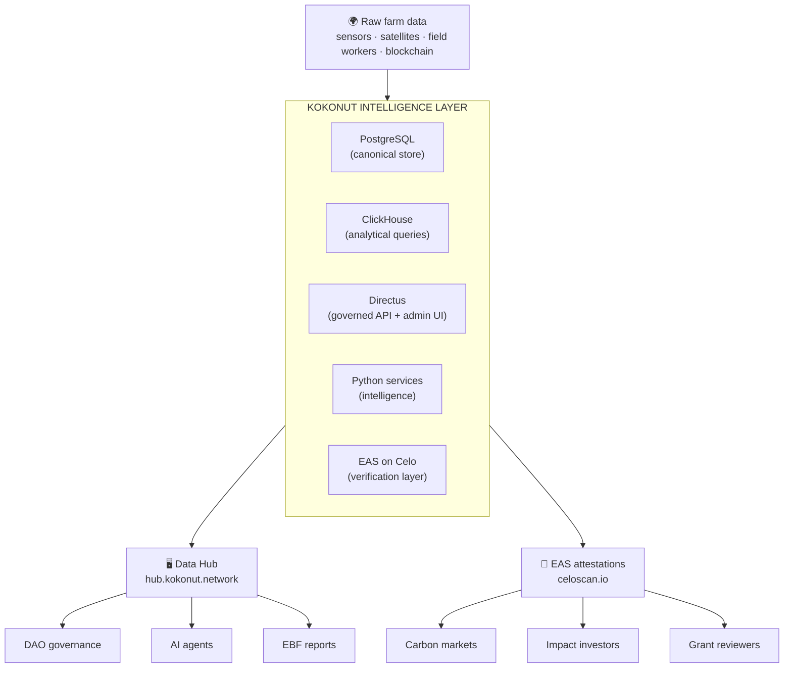
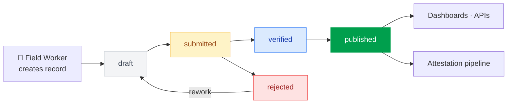

Every number you see on the [Adelphi Data Hub](https://hub.kokonut.network/projects/41), every MRV attestation anchored on-chain, every EBF impact report, and every farm score the DAO uses to evaluate funding proposals flows through one system: the **Kokonut Intelligence Layer**.

The Intelligence Layer is the canonical data backbone of the Kokonut Network — the infrastructure that sits between raw farm data (soil probes, satellite imagery, field worker logs) and the systems that consume it (the DAO, impact investors, carbon markets, AI agents). Where the rest of this documentation describes what Kokonut measures and why, this page describes how that measurement is implemented, stored, processed, and verified.



**Repository:** [`wasalo/Kokonut-Intelligence`](https://github.com/wasalo/Kokonut-Intelligence) · Apache-2.0

---

## Architecture

The Intelligence Layer is a six-layer stack, each layer optimized for a distinct role:

| **Layer** | **Technology** | **Role** |
| --- | --- | --- |
| **Canonical core** | PostgreSQL 14 \+ PostGIS 3.4 \+ Directus 11.17 | Schema authority, REST/GraphQL API, role-based permissions, data entry UI, workflow engine |
| **Analytics** | ClickHouse 25.3 | Time-series analysis, high-volume event queries, sensor aggregations, dual-write target for all operational events |
| **BI** | Metabase | Internal operational dashboards, aggregate reporting, ad-hoc analysis |
| **Intelligence** | Python services | Farm scoring, revenue forecasting, ecological analytics, opportunity mapping |
| **Verification** | EAS on Celo \+ offchain signed claims | On-chain attestations for MRV, impact, financial, harvest, and compliance records |
| **Blockchain** | RPC \+ Subgraphs \+ Foundry | On-chain data ingestion (wallet activity, attestations), KokonutResolver smart contract |

<Note>
  **Chain clarification — Gnosis vs. Celo:** The Kokonut Network operates across two chains for different purposes. [Gnosis Chain](/build-with-kokonut#deployed-smart-contracts) hosts the Moloch DAO governance contracts — \$vKKN tokens, the treasury, and proposal execution. **Celo** hosts the EAS attestation contracts for farm data verification — MRV claims, impact records, harvest proofs, and compliance audits. These are complementary, not competing: governance capital lives on Gnosis; verifiable farm evidence lives on Celo.
</Note>

---

## How it connects to the Kokonut stack

The Intelligence Layer is the implementation behind the concepts documented elsewhere in this Knowledge Base:

| **What the KB describes** | **What the Intelligence Layer implements** |
| --- | --- |
| [Common Data Schema](/kokonut-framework/framework-components/common-data-schema) — 13 fields every farm populates | `farm_registry_record` table in PostgreSQL; `services/registry/` validates and stores the schema |
| [MRV three-tier sensing stack](/ecosystem-wiki/kokonut-farms/measurement-reporting-and-verification) | `remote_sensing_observation`, `sensor_reading`, and community-entered records in Directus, dual-written to ClickHouse |
| [EAS attestations](/build-with-kokonut#eas-attestation-schema) | 5 registered schemas on Celo mainnet via the `KokonutResolver` attester-gating contract |
| [Data Hub](https://hub.kokonut.network/projects/41) — live farm data | Powered by Directus API \+ ClickHouse analytical layer |
| [EBF annual impact reports](/kokonut-framework/framework-add-ons/ecological-impact-frameworks) | Generated by `services/analytics/ecology.py` and `services/fortune500/` with hash-verified snapshots |
| [CRISP risk scoring](/kokonut-framework/framework-add-ons/ecological-impact-frameworks) | Embedded in the Governance (15%) and Ecological (25%) pillars of the Fortune 500 Farm Score |
| [8 Forms of Capital](/kokonut-framework/framework-components/framework-features/8-forms-of-capital) | Mapped to the 17 computed metrics engine: Natural→soil carbon delta; Financial→NOI; Social→governance events; Intellectual→metric definitions |
| [AI Agents](/kokonut-x-ai-agents) | `agent_identity`, `agent_capability_manifest`, and `agent_task` tables; MCP integration with scoped tokens; agent action audit logging |

---

## Capabilities

### Multi-source data ingestion

The ingestion layer pulls operational, environmental, and financial data from six source categories and dual-writes to both PostgreSQL (operational truth) and ClickHouse (analytical performance):

<Tabs>
  <Tab title="Environmental">
    | **Source** | **Service** | **Data** |
    | --- | --- | --- |
    | OpenWeatherMap API | `services/ingestion/weather.py` | Temperature, precipitation, humidity, wind, cloud cover → `weather_observation` |
    | Sentinel-2, Landsat, drone, MODIS | `services/ingestion/remote_sensing.py` | NDVI, NDRE, EVI, SAVI, canopy cover → `remote_sensing_observation` |
    | IoT soil probes | `services/ingestion/sensor_ingester.py` | Soil moisture, temperature, humidity, rainfall, pH with quality flagging → `sensor_reading` |
    | Anomaly detection | `services/ingestion/anomaly_detector.py` | Threshold-based alerts → `sensor_alert` \+ automatic MRV claims |
    | All sensor data flows to ClickHouse `sensor_readings` for time-series analysis alongside PostgreSQL storage. |  |  |
  </Tab>
  <Tab title="Financial & Market">
    | **Source** | **Service** | **Data** |
    | --- | --- | --- |
    | World Bank Pink Sheet | `services/ingestion/market_data.py` | Coffee, cocoa, palm oil, rice, maize, sugar, tea, banana benchmark prices → `price_observation` |
    | Farm operations (Directus) | Direct entry via admin UI | Activities, harvests, expenses, sales, losses, labor → structured operational records |
    | Auto-calculations | Directus lifecycle hooks | NOI, loss rate, operating margin, net amount, labor cost computed on data change |
  </Tab>
  <Tab title="Web3 & Attestations">
    | **Source** | **Service** | **Data** |
    | --- | --- | --- |
    | Ethereum, Optimism, Base, Arbitrum, Celo RPC | `services/ingestion/rpc_indexer.py` | Wallet balances, transfers, contract interactions → `wallet_activity_event` |
    | EAS GraphQL API (Celo, Optimism, Base) | `services/ingestion/eas_indexer.py` | Onchain and offchain attestation records → `attestation_record` \+ `attestation_schema` |
    | Kokonut DAO (Gnosis Chain) | Subgraph (planned) | Proposals, votes, treasury inflows/outflows, member activity |
  </Tab>
</Tabs>

### Farm Registry and MRV canonical store

The Intelligence Layer is the canonical implementation of the [Kokonut Common Data Schema](/kokonut-framework/framework-components/common-data-schema). Every farm that joins the network creates a `farm_registry_record` in PostgreSQL — all 13 required fields validated against the schema before the record is accepted.

MRV data from the [three-tier sensing stack](/ecosystem-wiki/kokonut-farms/measurement-reporting-and-verification) flows into the Intelligence Layer as `mrv_event` records, each linked to the farm registry entry via `farm_id`:

```python
# Print a Common Data Schema example
python3 -m services.registry --example-farm-record
 
# Prepare EAS attestation metadata from an MRV event
python3 -m services.attestation \
  --subject-type mrv_event \
  --subject-id UUID \
  --event-type mrv_submission \
  --payload-file payload.json
```

Every operational record — harvest, expense, soil observation, MRV event — follows the same governed lifecycle before it becomes eligible for attestation or dashboard publication:



### Fortune 500 Farm Scoring

The most significant new intelligence capability not covered elsewhere in the Knowledge Base. Every farm registered in the Intelligence Layer receives a **Fortune 500 Farm Score** — a weighted composite metric that ranks farm performance across four pillars, calibrated for institutional audiences including carbon markets, impact investors, and DAO funding committees.

| **Pillar** | **Weight** | **Metrics included** |
| --- | --- | --- |
| **Financial** | 45% | NOI, operating margin, revenue per hectare, loss rate, cost per hectare |
| **Ecological** | 25% | NDVI average, soil organic matter, remote sensing data completeness |
| **Governance** | 15% | EAS attestation count, governance events, treasury events, metric definition completeness |
| **Growth** | 15% | Yield improvement trend, revenue growth rate, data completeness over time |

**Score tiers:**

| **Tier** | **Score range** | **What it means** |
| --- | --- | --- |
| 🏆 Platinum | 800–1000 | Institutional-grade — eligible for carbon credit programs and TradFi leverage instruments |
| 🥇 Gold | 600–799 | Strong performer — attractive to impact investors, eligible for DAO expansion proposals |
| 🥈 Silver | 400–599 | Established operations — MRV baseline complete, improvement trajectory confirmed |
| 🥉 Bronze | 200–399 | Early production — Phase II complete, first annual EBF report published |
| 🌱 Developing | 0–199 | Phase I or early Phase II — building the MRV record that subsequent tiers require |

The CRISP carbon delivery risk factors from the [Ecological Impact Frameworks](/kokonut-framework/framework-add-ons/ecological-impact-frameworks) page are embedded in the Ecological and Governance pillars — a farm's CRISP assessment directly influences its score.

```python
# Score a specific farm
python3 -m services.fortune500.cli --location-id <location-id>
 
# Rank all registered farms
python3 -m services.fortune500.cli --all
```

### Ecological analytics

The ecological analytics service computes soil and biodiversity performance from the MRV data record — producing the verifiable numbers that appear in EBF annual reports:

- **Soil carbon delta:** Latest − baseline soil organic carbon in tonnes per hectare. The quantifiable sequestration output that carbon credit programs require.
- **Biodiversity index:** Shannon diversity index (H') — measures both species richness and distribution evenness. A farm with 10 species evenly distributed scores higher than one dominated by a single species, even with the same species count.
- **NDVI vegetation index trends:** Time-series analysis from the remote sensing record, showing vegetation health improvement or degradation across seasons.
- **Water resilience scoring:** Rainfall pattern analysis, drought event frequency, and soil moisture retention trends.
- **Intervention impact tracking:** Before/after comparison for specific practices — biochar application, cover crop establishment, animal integration — isolating the measurable impact of each intervention.

```python
# NDVI vegetation index trends over time
python3 -m services.analytics --ndvi-trends --location-id UUID
 
# Shannon biodiversity index analysis
python3 -m services.analytics --crop-diversity --location-id UUID
 
# Soil carbon delta (baseline vs. latest)
python3 -m services.analytics --ecology --location-id UUID
 
# Intervention impact — before/after biochar application
python3 -m services.analytics --intervention-impact --location-id UUID
```

### Revenue Multiplier Opportunity Map

A 10-dimension analysis that identifies and quantifies the largest revenue uplift opportunities for each farm — giving farm operators and DAO members a structured basis for prioritizing next investments. Each dimension is scored with a USD impact estimate and confidence level:

| **Dimension** | **What it identifies** |
| --- | --- |
| 1. Crop mix optimization | Revenue gain from adjusting which crops occupy which plots |
| 2. Loss-rate reduction | Revenue recovered if post-harvest loss rates hit the benchmark |
| 3. Buyer / channel selection | Premium available from switching to higher-value distribution channels |
| 4. Value-added processing | Revenue from processing raw outputs (coconut oil, dried fruit, biochar) rather than selling fresh |
| 5. Web3-funded replication | Revenue from a DAO-funded adjacent plot using the same Framework |
| 6. Bioinput production | Revenue from selling surplus biochar, humic acids, or organic inputs to neighboring farms |
| 7. Public-goods funding loops | Grant and public goods revenue unlocked by verified impact attestations |
| 8. Ecological verification | Carbon credit and biodiversity credit revenue from verified ecological data |
| 9. Partner sponsorship | Sponsorship revenue from buyers, funders, or vendors with brand alignment |
| 10. Regional farm clusters | Revenue from coordinated multi-farm operations sharing logistics and market access |

```python
# Run the full Revenue Multiplier analysis for a farm
python3 -m services.revenue_multiplier.cli --location-id UUID
 
# Focus on a specific dimension
python3 -m services.revenue_multiplier.cli --location-id UUID --dimension ecological_verification
```

### Revenue forecasting

Monte Carlo simulation-based time-series projections across revenue, NOI, yield, and cash flow — with configurable confidence intervals (70%–95%) and per-cycle outputs that connect directly to the [Crops & Harvest Forecast](/ecosystem-wiki/kokonut-farms/adelphi/crops-and-harvest-forecast) methodology:

- Scenario-based projections (optimistic / base / conservative) with sensitivity analysis
- Carbon sequestration estimation in both tonnes CO₂e and USD value
- Biodiversity credit value from species observation counts
- Retained value projection from historical reinvestment rates

```python
# Run 12-month forecast with 2000 Monte Carlo simulations
python3 -m services.forecast.cli \
  --location-id <location-id> \
  --months 12 \
  --simulations 2000
```

### Governed metrics engine

50\+ version-controlled metric definitions, computed on-demand or in batch, with source lineage stored per result:

| **Metric** | **Calculator** | **Description** |
| --- | --- | --- |
| Crop NOI | Auto (Directus hook) | Net revenue minus direct costs minus allocated shared costs |
| Loss Rate | Auto (Directus hook) | Loss amount as percentage of total harvest |
| Operating Margin | Auto (Directus hook) | NOI as percentage of net revenue |
| Soil Carbon Delta | `soil_carbon_delta` | Latest − baseline soil organic carbon (tonnes/ha) |
| Biodiversity Delta | `biodiversity_delta` | Species count change \+ Shannon index delta |
| Attestation Coverage | `attestation_coverage` | Published attestations ÷ eligible records × 100 |
| Value Flowed | `value_flowed` | Sum of verified, non-excluded value flow events (USD) |
| Wallet Retention | `wallet_retention` | Percentage of wallets active in both measurement periods |

```python
# Compute all metrics for a location
python3 -m services.metrics --compute --all --location-id UUID
 
# Compute all metrics for all registered farms
python3 -m services.metrics --compute --all-locations
 
# List all registered metric definitions
python3 -m services.metrics --list
```

---

## EAS attestation layer — Celo

The Intelligence Layer's verification layer is built on [Ethereum Attestation Service (EAS)](https://docs.attest.sh/) deployed on **Celo mainnet** — not Gnosis Chain, which hosts the Moloch DAO governance contracts. Celo provides low-cost, EVM-compatible attestations optimized for the high-frequency farm verification use case.

### Deployed contracts on Celo

| **Contract** | **Address** | **Explorer** |
| --- | --- | --- |
| **EAS v1.3.0** | [`0x72E1d8ccf5299fb36fEfD8CC4394B8ef7e98Af92`](https://celoscan.io/address/0x72E1d8ccf5299fb36fEfD8CC4394B8ef7e98Af92) | celoscan.io |
| **SchemaRegistry** | [`0x5ece93bE4BDCF293Ed61FA78698B594F2135AF34`](https://celoscan.io/address/0x5ece93bE4BDCF293Ed61FA78698B594F2135AF34) | celoscan.io |
| **KokonutResolver** | [`0x6E1502c7a14b45aba5FC420dC92C1E3b38BD79Ad`](https://celoscan.io/address/0x6E1502c7a14b45aba5FC420dC92C1E3b38BD79Ad) | celoscan.io |

The `KokonutResolver` is a custom attester-gating smart contract — only wallets authorized by the Kokonut multisig can create attestations. Resolver ownership has been transferred to the Kokonut multisig: `0x03779B674CbCBfc0B801c4cAc9DFaC8aACbbD5c5`.

**Authorized attesters:**

- Deployer wallet: `0x3394C45b5938127EB56603A6051dF26CFAF08C26`
- Kokonut multisig: `0x03779B674CbCBfc0B801c4cAc9DFaC8aACbbD5c5`

### Registered schemas

Five schemas are registered on Celo, each covering a distinct farm verification domain:

| **Schema** | **UID** | **Use case** |
| --- | --- | --- |
| `kokonut-mrv` | [`0x93af67b8197dda513fa968e597e1c9a2c0d0607d656659f153dc1b065a100e54`](https://celoscan.io/address/0x5ece93bE4BDCF293Ed61FA78698B594F2135AF34) | MRV claims — location, crop, quantity, evidence CID |
| `kokonut-impact` | [`0xb99bb4b2a55218b8f4df1f0bd4c39400711809f13ef5d150d2903648c6590dfe`](https://celoscan.io/address/0x5ece93bE4BDCF293Ed61FA78698B594F2135AF34) | Environmental impact — soil carbon, biodiversity index, NDVI |
| `kokonut-financial` | [`0x75b42beb85dd852134dfaff3de41b8dc361ed0cb2bf93ce3009c8ec082de905b`](https://celoscan.io/address/0x5ece93bE4BDCF293Ed61FA78698B594F2135AF34) | Financial summaries — NOI, revenue, costs, Fortune 500 score |
| `kokonut-harvest` | [`0xb359f9756e3cb3597e4048dccae2842083359906fbae8dc8c0e9af8ac1b3ccff`](https://celoscan.io/address/0x5ece93bE4BDCF293Ed61FA78698B594F2135AF34) | Harvest verification — quantity, quality grade, date, operator |
| `kokonut-compliance` | [`0x59632edcf1d04be0c2dcfd572282bbd4dac518e7a92872ec45ade29876ef95f5`](https://celoscan.io/address/0x5ece93bE4BDCF293Ed61FA78698B594F2135AF34) | Partner compliance — audit trails, contractual adherence |

### Onchain and offchain attestations

The Intelligence Layer supports two attestation modes depending on frequency and cost requirements:

**Onchain attestations** — for high-stakes, permanent records (annual EBF reports, certified harvest milestones, Fortune 500 score snapshots):

```python
# Create an onchain MRV attestation on Celo
python3 -m services.attestation.cli attest \
  --schema 0x93af67b8197dda513fa968e597e1c9a2c0d0607d656659f153dc1b065a100e54 \
  --recipient 0xRECIPIENT \
  --data '[{"name":"locationId","type":"string","value":"adelphi"}]' \
  --chain celo
```

**Offchain attestations (EIP-712 signed)** — for high-frequency workflows (per-harvest records, weekly soil probe summaries, community field observation logs) where gas cost would make onchain attestation prohibitive:

```python
# Create a gasless offchain attestation
python3 -m services.attestation.cli offchain-attest \
  --schema 0x93af67b8197dda513fa968e597e1c9a2c0d0607d656659f153dc1b065a100e54 \
  --recipient 0xRECIPIENT \
  --data '[{"name":"locationId","type":"string","value":"adelphi"}]' \
  --chain celo
```

**Private data** — for sensitive financial records or partner-specific information, the Intelligence Layer stores offchain data with onchain hashes only, with selective disclosure support and full ZK proof capability as a future layer.

---

## Roles and access

Six roles govern data entry, approval, and analysis across all farm records:

| **Role** | **Access level** | **Primary responsibilities** |
| --- | --- | --- |
| **Administrator** | Full | Platform configuration, all permissions, schema management |
| **Field Worker** | Create/read own location | Data entry — activities, harvests, expenses, sales, losses, field notes. Records always start as `draft`. |
| **Supervisor** | Read all, submit | Submits draft records for approval; can read data from all locations |
| **Manager** | Approve all operational | Approves and verifies all operational records across all locations |
| **Finance** | Approve expenses and revenue | Approves expense claims, verifies sales transactions, approves revenue events |
| **Analyst** | Read verified/published | Read-only access to verified and published data; primary audience for dashboards and forecasts |

---

## Partner dashboards

Four partner-facing dashboard templates with row-level security — each partner sees only their own data:

| **Partner type** | **Dashboard** | **Key data surfaces** |
| --- | --- | --- |
| **Buyer** | `partner-buyer` | Production summary, upcoming harvests, quality grades, revenue trends |
| **Funder** | `partner-funder` | NOI trends, cost breakdown, forecasts, impact attestations, ecological outcomes, Fortune 500 score |
| **Vendor** | `partner-vendor` | Purchase history, payment status, input demand forecasts |
| **Operator** | `partner-operator` | Operations overview, live sensor readings, weather, crop cycles, active alerts |

Internal Metabase dashboards cover five operational views: farm operations, crop NOI analysis, expense tracker, harvest/sales trends, and loss rate analysis.

---

## SDKs and developer access

### Python and JavaScript/TypeScript SDKs

Typed clients covering the full Intelligence Layer API — CRUD operations, auth, aggregations, and EAS attestation workflows:

```bash
# Python SDK
cd sdk/python && pip install -e .
 
# JavaScript/TypeScript SDK
cd sdk/javascript && npm install && npm run build
```

See `sdk/python/examples/` and `sdk/javascript/examples/` for usage patterns covering all major operations.

### MCP integration for AI agents

The Intelligence Layer exposes an MCP (Model Context Protocol) integration with scoped tokens and full audit logging — allowing AI agents from the [Kokonut Agentic Marketplace](/kokonut-x-ai-agents) to read canonical farm data and write verified outputs (MRV submissions, attestation requests, agent task records) without requiring direct database access.

Every agent action is logged to `agent_action_log` with user, timestamp, and action type — maintaining the governance accountability layer even for automated operations.

### Data export

```python
# Export farm records to CSV
python3 -m services.export.exporter \
  --collection farm_registry_record \
  --format csv \
  --output exports/
 
# Export sensor time-series from ClickHouse
python3 -m services.export.exporter \
  --collection sensor_readings \
  --format parquet \
  --source clickhouse \
  --output exports/
 
# Generate a hash-verified farm summary report
python3 -m services.export.report_generator \
  --type farm_summary \
  --location-id UUID
```

All report snapshots include SHA-256 integrity verification — the same hash is stored in the Intelligence Layer database, making it possible to independently verify that a report has not been altered after generation.

---

## Quick start

**Prerequisites:** Docker \+ Docker Compose

```bash
# 1. Clone and configure
git clone https://github.com/wasalo/Kokonut-Intelligence.git
cd Kokonut-Intelligence
cp .env.example .env
# Edit .env with your database passwords and API keys
 
# 2. Start all services
docker compose up -d
 
# 3. Verify everything is running
docker compose ps
 
# 4. Apply schemas and seed base data
./scripts/seed.sh
 
# 5. Access the admin UI (Directus)
open http://localhost:8055
 
# 6. Access BI dashboards (Metabase)
open http://localhost:3001
 
# 7. (Optional) Load the pilot farm seed data (Kokonut Demo Farm)
./scripts/seed-pilot.sh
```

**Service endpoints:**

| **Service** | **URL** | **Purpose** |
| --- | --- | --- |
| Directus | `http://localhost:8055` | Schema management, API, admin UI, primary data entry |
| Metabase | `http://localhost:3001` | Internal BI dashboards |
| ClickHouse HTTP | `http://localhost:8123` | Analytical queries |
| PostgreSQL | `localhost:5432` | Canonical data store (direct access) |

**Developer sandbox** (pre-seeded with Kokonut Demo Farm data and mock API keys):

```bash
docker compose -f docker-compose.yml -f docker-compose.sandbox.yml up -d
./scripts/sandbox-setup.sh
open docs/sandbox.md  # Hello-world tutorial
```

---

## Internal documentation

The repository ships with a full `docs/` directory covering every subsystem:

| **Document** | **Description** |
| --- | --- |
| `docs/architecture.md` | System overview, data flow diagrams, security model |
| `docs/data-dictionary.md` | All 50\+ tables, fields, governed metrics, and their relationships |
| `docs/api-reference.md` | REST/GraphQL/ClickHouse API reference |
| `docs/openapi.yaml` | Full OpenAPI 3.0 specification |
| `docs/attestation-guide.md` | EAS on Celo — schemas, onchain/offchain attestation, private data, CLI |
| `docs/agent-access.md` | MCP integration, agent-scoped tokens, audit logging |
| `docs/deployment.md` | Docker setup, environment variables, backup procedures |
| `docs/sandbox.md` | Developer quickstart with hello-world tutorial |

---

<CardGroup cols={2}>
  <Card title="Build with Kokonut" icon="code" href="/build-with-kokonut">
    GitHub repositories, Gnosis Chain DAO contracts, Farm Registry API schema, and the Agentic Marketplace architecture — the full developer picture of what the Intelligence Layer connects to.
  </Card>

  <Card title="MRV — Measurement & Verification" icon="magnifying-glass-chart" href="/ecosystem-wiki/kokonut-farms/measurement-reporting-and-verification">
    The three-tier sensing methodology that feeds data into the Intelligence Layer — satellite vegetation indices, soil probes, community analytics, and the EAS attestation pipeline.
  </Card>

  <Card title="Kokonut × AI Agents" icon="robot" href="/kokonut-x-ai-agents">
    The Agentic Marketplace agents that read canonical data from and write verified outputs to the Intelligence Layer — automating the MRV pipeline through MCP integration.
  </Card>

  <Card title="Ecological Impact Frameworks" icon="leaf-heart" href="/kokonut-framework/framework-add-ons/ecological-impact-frameworks">
    EBF and CRISP — the reporting standards whose annual outputs the Intelligence Layer's ecology analytics and Fortune 500 scoring pipeline produce.
  </Card>

  <Card title="Common Data Schema" icon="database" href="/kokonut-framework/framework-components/common-data-schema">
    The 13-field canonical schema whose PostgreSQL implementation — `farm_registry_record` — lives in the Intelligence Layer as the farm network's source of truth.
  </Card>

  <Card title="Adelphi Data Hub" icon="chart-line" href="https://hub.kokonut.network/projects/41">
    The live interface for Adelphi's Intelligence Layer data — harvest records, MRV events, ecological metrics, and EAS attestation UIDs, all powered by this system.
  </Card>
</CardGroup>