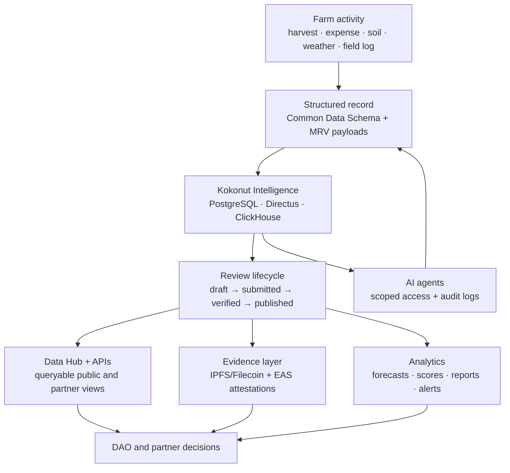
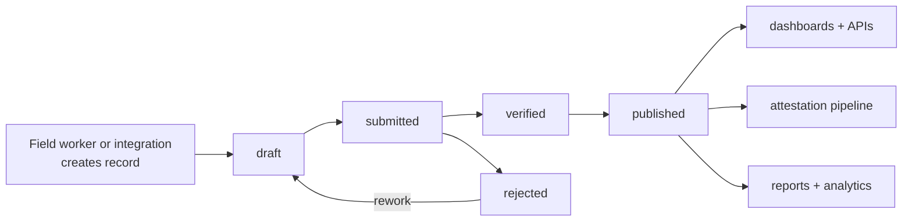

# Kokonut Intelligence turns farm activity into decision-ready evidence.

Every harvest record, soil reading, satellite observation, expense entry, MRV event, EAS attestation, Data Hub metric, and AI-agent output needs a single trusted place to be structured, queryable, and reviewable.

**Kokonut Intelligence** is that layer. It sits between real-world farm activity and the systems that depend on it: farm operators, DAO reviewers, grant funders, impact analysts, public dashboards, AI agents, and future partner integrations.

<div style={{ display: "flex", gap: "12px", justifyContent: "center", flexWrap: "wrap", margin: "1.5rem 0 0.75rem" }}>
  <a href="#how-it-works" style={{ display: "inline-flex", alignItems: "center", gap: "6px", background: "#009F4D", color: "#fff", padding: "10px 20px", borderRadius: "8px", fontWeight: "600", fontSize: "14px", textDecoration: "none" }}>
    See How It Works →
  </a>

  <a href="https://github.com/wasalo/Kokonut-Intelligence" style={{ display: "inline-flex", alignItems: "center", gap: "6px", border: "1.5px solid #009F4D", color: "#009F4D", padding: "10px 20px", borderRadius: "8px", fontWeight: "600", fontSize: "14px", textDecoration: "none", background: "transparent" }}>
    Open the Repository
  </a>
</div>

<p style={{ textAlign: "center", fontSize: "13px", color: "#6b7280", marginTop: "0.25rem" }}>
  Built for farm operators, DAO reviewers, data contributors, developers, MRV analysts, and agent builders.
</p>

<Note>
  Kokonut Intelligence is not a replacement for MRV methodology. MRV defines how farm activity becomes evidence. Kokonut Intelligence implements the data infrastructure that stores, validates, analyzes, attests to, and exposes evidence.
</Note>

---

## Intelligence at a glance

| Question | Short answer |
| --- | --- |
| What is it? | The canonical data and analytics backbone for Kokonut farms. |
| What does it store? | Farm registry records, operations, harvests, expenses, sales, soil data, remote sensing, MRV events, attestations, partner data, and agent logs. |
| What does it power? | Data Hub dashboards, MRV workflows, EAS attestations, EBF reports, CRISP risk analysis, farm scoring, forecasts, and AI-agent workflows. |
| Who uses it? | Farm operators, DAO members, Guild contributors, grant reviewers, partners, developers, and agents. |
| What is live? | Repository architecture, local stack, canonical schemas, farm/MRV data model, Directus, ClickHouse, PostgreSQL, Metabase, Celo EAS integration, and developer quickstart. |
| What should be treated carefully? | Forecasts, scores, carbon or biodiversity-credit claims, institutional-readiness language, and partner-facing outputs until supported by verified records and external due diligence. |

---

## Why this layer exists

Regenerative farms generate many kinds of records. Without a governed intelligence layer, those records become fragmented across spreadsheets, screenshots, wallets, dashboards, reports, sensors, notebooks, and chat messages.

Kokonut Intelligence gives the network a shared source of truth.

| Without Kokonut Intelligence | With Kokonut Intelligence |
| --- | --- |
| Farm data is scattered across tools | Farm data is structured into canonical records |
| Impact claims depend on narrative | Claims can reference MRV events, evidence CIDs, and attestations |
| DAO reviewers inspect one-off documents | Reviewers query consistent data across farms |
| Agents need direct database or manual access | Agents use scoped access, manifests, and audit logs |
| Forecasts are hard to compare with actuals | Forecasts can be checked against harvests, losses, sales, and MRV records |
| Annual reports are manually assembled | Reports can be generated from governed snapshots |

---

## How it works



The core idea is simple: **farm events should become structured records before they become public claims.**

That means every important claim should be traceable back to:

- a farm ID
- a timestamp
- a source or operator
- a record type
- a review status
- a payload or evidence file
- An attestation or report reference when applicable

---

## Architecture

Kokonut Intelligence is a six-layer stack. Each layer has a specific job.

| Layer | Technology | Role |
| --- | --- | --- |
| Canonical core | PostgreSQL, PostGIS, Directus | Source-of-truth records, APIs, role permissions, admin UI, workflows |
| Analytics | ClickHouse | Time-series analysis, sensor aggregation, event queries, performance reporting |
| BI | Metabase | Internal dashboards, operational summaries, and ad-hoc analysis |
| Intelligence services | Python | Forecasting, scoring, ecological analytics, opportunity maps, report generation |
| Verification | EAS on Celo, off-chain signed claims | Attestations for MRV, impact, harvest, financial, and compliance records |
| Blockchain ingestion | RPC, subgraphs, Foundry | Wallet activity, attestations, treasury events, DAO data, resolver contracts |

<Info>
  **Chain clarification:** Gnosis Chain hosts Kokonut DAO governance contracts and treasury execution. Celo hosts farm-data attestations through EAS. Governance capital and farm evidence are connected, but they are not on the same layer.
</Info>

---

## What it implements from the Knowledge Base

| Knowledge Base concept | Intelligence implementation |
| --- | --- |
| Common Data Schema | `farm_registry_record` and validation services for the 13-field farm record |
| MRV workflow | Remote sensing, sensor readings, field observations, MRV events, evidence payloads, and attestation requests |
| Data Hub | Directus and ClickHouse-backed APIs that expose farm data and metrics |
| EAS attestations | Celo schemas, attestation records, resolver-gated publishing, onchain/offchain modes |
| EBF reports | Generated snapshots based on verified ecological and operational records |
| CRISP review | Risk factors derived from ecological, governance, and evidence-quality data |
| 8 Forms of Capital | Metrics that classify farm value across natural, financial, social, human, material, intellectual, cultural, and health capital |
| AI agents | Agent identity, capability manifests, scoped tokens, agent tasks, and action logs |

---

## Core capabilities

<CardGroup cols={2}>
  <Card title="Multi-source ingestion" icon="diagram-project">
    Pull farm records from field logs, Directus entries, sensors, weather APIs, satellite imagery, blockchain data, and attestation indexes.
  </Card>

  <Card title="Governed farm records" icon="database">
    Store farm registry entries, crop cycles, harvests, expenses, sales, losses, MRV events, soil readings, and partner data with clear lifecycle states.
  </Card>

  <Card title="Verification pipeline" icon="stamp">
    Convert eligible records into evidence payloads, IPFS/Filecoin references, Celo EAS attestations, public dashboards, and annual reports.
  </Card>

  <Card title="Analytics and forecasting" icon="chart-line">
    Generate farm scores, revenue forecasts, loss-rate analysis, ecological trends, opportunity maps, and metric snapshots.
  </Card>

  <Card title="Partner dashboards" icon="users-viewfinder">
    Expose buyer, funder, vendor, operator, and internal dashboards with role-based and row-level data controls.
  </Card>

  <Card title="Agent access" icon="robot">
    Let AI agents read canonical data and write verified outputs through scoped access, MCP integration, and full audit logging.
  </Card>
</CardGroup>

---

## Record lifecycle

Every operational record should pass through a review flow before it becomes trusted enough for dashboards, reports, or attestations.



| Status | Meaning |
| --- | --- |
| Draft | A record exists but is not ready for review. |
| Submitted | A field worker, integration, or supervisor has submitted it for review. |
| Verified | A manager, finance reviewer, analyst, or authorized process has approved it. |
| Published | The record can be used in dashboards, reports, API responses, or attestations. |
| Rejected | The record needs correction before it can become evidence. |

---

## Farm scoring and opportunity mapping

Kokonut Intelligence can help rank and compare farms, but scores should be treated as **decision support**, not automatic certification.

| Tool | What it helps with | Trust requirement |
| --- | --- | --- |
| Farm score | Compare financial, ecological, governance, and growth performance | Requires clean records, transparent weights, and reviewable metric definitions |
| Revenue multiplier map | Identify possible revenue-uplift opportunities | Requires market assumptions, operator review, and actuals tracking |
| Revenue forecast | Model scenarios across revenue, NOI, yield, and cash flow | Requires forecast-vs-actual comparison and sensitivity analysis |
| Ecological analytics | Track soil, vegetation, biodiversity, and water indicators | Requires baselines, consistent measurement periods, and MRV methodology |
| Governed metrics engine | Version and compute metrics across farms | Requires source lineage and change governance |

<Warning>
  Scores, forecasts, carbon estimates, biodiversity-credit assumptions, and institutional-readiness labels are not guarantees. They are planning and reviewing tools until supported by verified records, external standards, partner due diligence, and any required third-party validation.
</Warning>

---

## EAS attestation layer on Celo

Kokonut Intelligence uses EAS on Celo for farm-data attestations. This separates **governance execution** from **farm evidence**:

| Chain | Kokonut role |
| --- | --- |
| Gnosis Chain | DAO governance, treasury, membership, proposal execution |
| Celo | Farm evidence, MRV attestations, impact records, harvest proofs, compliance records |

### Celo contracts

| Contract | Address |
| --- | --- |
| EAS v1.3.0 | `0x72E1d8ccf5299fb36fEfD8CC4394B8ef7e98Af92` |
| SchemaRegistry | `0x5ece93bE4BDCF293Ed61FA78698B594F2135AF34` |
| KokonutResolver | `0x6E1502c7a14b45aba5FC420dC92C1E3b38BD79Ad` |
| Kokonut multisig | `0x03779B674CbCBfc0B801c4cAc9DFaC8aACbbD5c5` |

### Registered schemas

| Schema | Use case |
| --- | --- |
| `kokonut-mrv` | MRV claims: location, crop, quantity, evidence CID |
| `kokonut-impact` | Environmental impact: soil carbon, biodiversity index, vegetation indicators |
| `kokonut-financial` | Financial summaries: NOI, revenue, costs, farm score snapshots |
| `kokonut-harvest` | Harvest verification: quantity, quality grade, date, operator |
| `kokonut-compliance` | Partner compliance: audit trails and contractual adherence |

<Note>
  Sensitive data should not be pushed publicly by default. Kokonut Intelligence supports off-chain records, onchain hashes, selective disclosure, and future privacy-preserving proof layers for records that should not be fully public.
</Note>

---

## Roles and access

The Intelligence Layer should make data useful without making every user an administrator.

| Role | Access level | Main responsibility |
| --- | --- | --- |
| Administrator | Full access | Platform configuration, schemas, permissions, infrastructure operations |
| Field Worker | Create and read your own location records | Activities, harvests, expenses, sales, losses, field notes |
| Supervisor | Read and submit | Review drafts and submit records for verification |
| Manager | Approve operational records | Verify operations, field data, crop records, and milestones |
| Finance | Approve financial records | Verify expenses, sales, payments, and revenue events |
| Analyst | Read verified and published data | Dashboards, metrics, forecasts, reports, and DAO review support |
| Agent | Scoped access only | Read or write specific records through capability manifests and audit logs |

---

## Builder quickstart

<Steps>
  <Step title="Clone the repository">
    ```bash
    git clone https://github.com/wasalo/Kokonut-Intelligence.git
    cd Kokonut-Intelligence
    ```
  </Step>
  <Step title="Configure environment variables">
    ```bash
    cp .env.example .env
    # Edit .env with database passwords and API keys
    ```
  </Step>
  <Step title="Start local services">
    ```bash
    docker compose up -d
    docker compose ps
    ```
  </Step>
  <Step title="Seed schemas and demo data">
    ```bash
    ./scripts/seed.sh
    ./scripts/seed-pilot.sh
    ```
  </Step>
  <Step title="Open local tools">
    ```bash
    open http://localhost:8055  # Directus
    open http://localhost:3001  # Metabase
    ```
  </Step>
</Steps>

### Local service endpoints

| Service | URL | Purpose |
| --- | --- | --- |
| Directus | `http://localhost:8055` | Schema management, admin UI, API, primary data entry |
| Metabase | `http://localhost:3001` | Internal dashboards and BI |
| ClickHouse HTTP | `http://localhost:8123` | Analytical queries |
| PostgreSQL | `localhost:5432` | Canonical data store |

---

## What to build first

<CardGroup cols={2}>
  <Card title="Improve farm data quality" icon="database">
    Add validation rules, import tools, field-worker UX improvements, or better error messages for farm records.
  </Card>

  <Card title="Build MRV tooling" icon="satellite-dish">
    Create ingestion, QA, visualization, or attestation workflows for satellite, sensor, drone, or field-observation data.
  </Card>

  <Card title="Create analytics modules" icon="chart-simple">
    Improve loss-rate analysis, farm scoring, ecological trends, forecast-vs-actual tracking, or revenue opportunity maps.
  </Card>

  <Card title="Design agent workflows" icon="robot">
    Build agents that read canonical data, produce bounded outputs, submit MRV events, and leave full action logs.
  </Card>

  <Card title="Improve dashboards" icon="chart-pie">
    Build clearer dashboards for operators, DAO reviewers, buyers, funders, vendors, or public visitors.
  </Card>

  <Card title="Strengthen privacy and access" icon="shield-halved">
    Improve scoped permissions, selective disclosure, partner dashboards, private data handling, and audit trails.
  </Card>
</CardGroup>

---

## Claim safety rules

Use Kokonut Intelligence outputs carefully.

| Claim type | Safe framing |
| --- | --- |
| Forecasts | Scenario estimates that should be compared against actuals. |
| Farm scores | Decision-support signals based on metric weights and available data. |
| Carbon outcomes | Climate co-benefits are not verified through approved methodology and third-party standards. |
| Biodiversity claims | Evidence-backed observations, species records, and trends, not automatic credits. |
| Financial performance | Records and projections, not guaranteed returns. |
| Institutional readiness | A review pathway that requires due diligence, not a status the system grants by itself. |

---

## Internal documentation map

The repository includes deeper documentation for each subsystem.

| Document | What it covers |
| --- | --- |
| `docs/architecture.md` | System overview, data flows, security model |
| `docs/data-dictionary.md` | Tables, fields, metrics, and relationships |
| `docs/api-reference.md` | REST, GraphQL, and ClickHouse API reference |
| `docs/openapi.yaml` | OpenAPI 3.0 specification |
| `docs/attestation-guide.md` | EAS on Celo, schemas, attestation modes, private data, CLI |
| `docs/agent-access.md` | MCP integration, scoped tokens, and audit logging |
| `docs/deployment.md` | Docker setup, environment variables, and backup procedures |
| `docs/sandbox.md` | Developer quickstart and hello-world tutorial |

---

## Next steps

<CardGroup cols={2}>
  <Card title="Build with Kokonut" icon="code" href="/build-with-kokonut">
    Repositories, contracts, schemas, MRV primitives, contribution rules, and builder paths.
  </Card>

  <Card title="MRV Methodology" icon="magnifying-glass-chart" href="/ecosystem-wiki/kokonut-farms/measurement-reporting-and-verification">
    How farm activity becomes structured evidence, public records, attestations, dashboards, and annual reports.
  </Card>

  <Card title="Common Data Schema" icon="database" href="/kokonut-framework/framework-components/common-data-schema">
    The 13-field farm record that makes farms comparable, fundable, governable, and verifiable.
  </Card>

  <Card title="Kokonut × AI Agents" icon="robot" href="/kokonut-x-ai-agents">
    Agent identity, scoped access, MCP integration, x402 payments, and verifiable agent outputs.
  </Card>

  <Card title="Ecological Impact Frameworks" icon="leaf-heart" href="/kokonut-framework/framework-add-ons/ecological-impact-frameworks">
    How EBF and CRISP interpret verified farm data for reporting and risk review.
  </Card>

  <Card title="Adelphi Data Hub" icon="chart-line" href="https://hub.kokonut.network/projects/41">
    Explore live farm data, MRV events, harvest records, and impact metrics for Kokonut's reference farm.
  </Card>
</CardGroup>