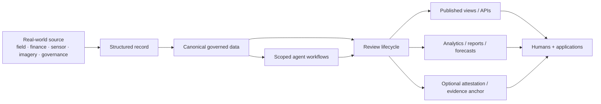
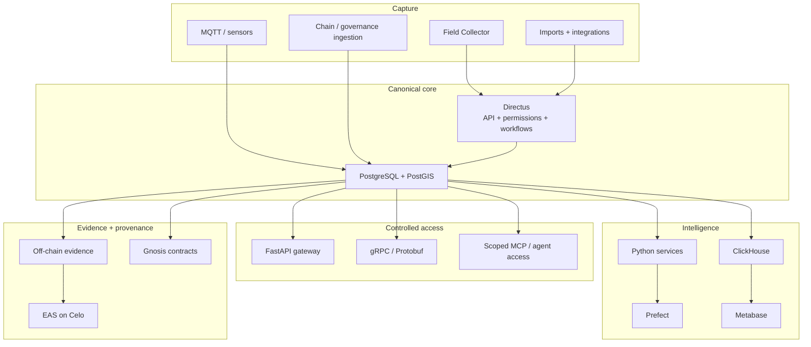
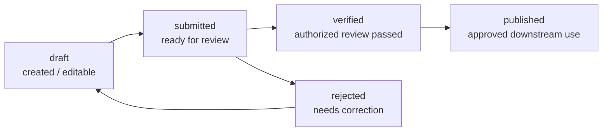
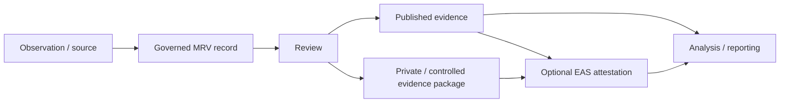
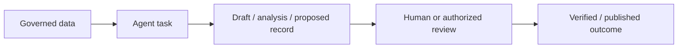

# Kokonut Intelligence turns governed records into usable intelligence.

Kokonut farms generate operational, financial, ecological, governance, sensor, geospatial, and partner data.

**Kokonut Intelligence** is the open-source platform that structures those records, applies permissions and review workflows, computes analytics, supports evidence and reporting, and exposes controlled interfaces for humans, applications, and agents.

It is not one universal truth engine.

It is a **governed implementation layer** where data can move from source activity to reviewable records, published views, analysis, and optional public provenance without collapsing those stages together.

<CardGroup cols={2}>
  <Card title="Understand the architecture" icon="diagram-project" href="#architecture-at-a-glance">
    See the canonical database, APIs, analytics, workflows, field tools, verification, and contract layers.
  </Card>

  <Card title="Follow the record lifecycle" icon="arrows-rotate" href="#governed-record-lifecycle">
    Understand how drafts become reviewed and published records without treating workflow status as scientific certification.
  </Card>

  <Card title="Build on the platform" icon="code" href="#builder-entry-points">
    Choose Directus, the gateway, gRPC, analytics, Field Collector, agents, or smart contracts based on the job.
  </Card>

  <Card title="Open the current repository" icon="code-branch" href="https://git.kokonut.network/Kokonut-Intelligence/~files">
    Verify live architecture, commands, deployments, schemas, and implementation details at their canonical source.
  </Card>
</CardGroup>

<Note>
  **Current source of truth:** implementation details for Kokonut Intelligence live in the active repository at `git.kokonut.network/Kokonut-Intelligence`. This Knowledge Base explains the public architecture and builder contract; volatile versions, addresses, schema UIDs, test counts, and command details should be verified in the repository that owns them.
</Note>

---

## What Kokonut Intelligence is — and is not

| It is | It is not |
| --- | --- |
| A canonical governed data and API layer | A replacement for farm operators or domain experts |
| A platform for operational, ecological, financial, governance, and partner records | Proof that every stored value is correct |
| A review and publication workflow | Scientific certification by database status |
| An analytics and forecasting environment | A guarantee that a model or forecast will be accurate |
| Infrastructure for MRV evidence and attestations | A claim that every record must go on-chain |
| A controlled interface for applications and agents | Permission for agents to self-verify or self-publish claims |
| A place to version metrics, methods, and evidence relationships | One universal scalar measure of “impact” |
| A bridge between field activity and decision-support systems | A substitute for local authority, legal agreements, or governance |

> **The platform governs records. It does not erase the distinction between data, evidence, interpretation, and decision.**

---

## Why this layer exists

Without a governed implementation layer, farm information fragments across:

- field notebooks;
- spreadsheets;
- sensors;
- mobile devices;
- photos;
- satellite and drone workflows;
- invoices;
- wallets;
- governance systems;
- dashboards;
- reports;
- partner files;
- AI-generated drafts.

Kokonut Intelligence creates a shared operating environment where those inputs can become structured and reviewable without requiring every source to become public or on-chain.


```mermaid
flowchart LR
    A["Real-world source\nfield · finance · sensor · imagery · governance"] --> B["Structured record"]
    B --> C["Canonical governed data"]
    C --> D["Review lifecycle"]
    D --> E["Published views / APIs"]
    D --> F["Analytics / reports / forecasts"]
    D --> G["Optional attestation / evidence anchor"]
    E --> H["Humans + applications"]
    F --> H
    G --> H
    C --> I["Scoped agent workflows"]
    I --> D
```

The durable principle is:

> **source → structure → review → publish → attest when useful → interpret**

Not every record needs every step.

---

## Architecture at a glance

The current platform is broader than a database plus dashboard.

| Layer | Current role |
| --- | --- |
| **PostgreSQL + PostGIS** | Canonical relational and geospatial records |
| **Directus** | Canonical API, permissions, workflows, administrative data entry |
| **ClickHouse** | High-volume analytical and time-series events |
| **Redis** | Caching, rate limiting, and session support |
| **Metabase** | Internal BI, aggregate reporting, and analytical dashboards |
| **Python services** | Metrics, forecasts, scoring models, exports, ingestion, reports, ML, systems intelligence, and automation |
| **FastAPI gateway** | Policy-aware application API and Field Collector backend |
| **gRPC + Protobuf** | Type-safe external API and streaming interfaces |
| **Prefect** | Workflow and pipeline orchestration |
| **MQTT / Mosquitto** | TLS sensor and IoT ingestion |
| **EAS on Celo** | Public attestation/provenance metadata where useful |
| **Off-chain evidence** | Detailed, sensitive, or private source material |
| **Foundry + Solidity on Gnosis** | Guild, evidence-review, credit, oracle, privacy, and upgrade contracts |

<Info>
  The exact software versions and deployment inventory evolve. Builders should use the current repository README, architecture document, deployment records, and contract broadcast artifacts for implementation-specific values.
</Info>

### Responsibility map


```mermaid
flowchart TD
    subgraph Capture["Capture"]
      FIELD["Field Collector"]
      SENSORS["MQTT / sensors"]
      INTEGRATIONS["Imports + integrations"]
      CHAIN["Chain / governance ingestion"]
    end

    subgraph Core["Canonical core"]
      PG["PostgreSQL + PostGIS"]
      DIRECTUS["Directus\nAPI + permissions + workflows"]
    end

    subgraph Intelligence["Intelligence"]
      CH["ClickHouse"]
      PY["Python services"]
      PREFECT["Prefect"]
      BI["Metabase"]
    end

    subgraph Access["Controlled access"]
      GATEWAY["FastAPI gateway"]
      GRPC["gRPC / Protobuf"]
      MCP["Scoped MCP / agent access"]
    end

    subgraph Trust["Evidence + provenance"]
      EVIDENCE["Off-chain evidence"]
      EAS["EAS on Celo"]
      GNOSIS["Gnosis contracts"]
    end

    FIELD --> DIRECTUS
    SENSORS --> PG
    INTEGRATIONS --> DIRECTUS
    CHAIN --> PG
    DIRECTUS --> PG
    PG --> CH
    PG --> PY
    PY --> PREFECT
    CH --> BI
    PG --> GATEWAY
    PG --> GRPC
    PG --> MCP
    PG --> EVIDENCE
    EVIDENCE --> EAS
    PG --> GNOSIS
```

---

## The canonical core

For builder purposes, the most important architectural rule is:

> **PostgreSQL + Directus are the canonical schema/API layer.**

This means:

- core records should not be reconstructed independently inside every dashboard;
- external applications should not invent incompatible versions of canonical farm records;
- analytical stores should not silently become the authority for governed record state;
- agent-generated summaries should reference governed data rather than replacing it;
- public reports should be reproducible from reviewed source records where practical.

### Schema ownership

The current repository version-controls:

- PostgreSQL migrations;
- Directus snapshots;
- ClickHouse schemas;
- seed data;
- metric definitions;
- governance configuration;
- attestation configuration;
- contract deployment artifacts.

Builders changing a shared data contract should update the owning schema and its documentation together.

---

## Governed record lifecycle

Governed records generally follow:

> **draft → submitted → verified → published**

`rejected` supports rework and exception paths.


```mermaid
flowchart LR
    A["draft\ncreated / editable"] --> B["submitted\nready for review"]
    B --> C["verified\nauthorized review passed"]
    B --> D["rejected\nneeds correction"]
    D --> A
    C --> E["published\napproved downstream use"]
```

Domain-specific state should remain separate.

Examples include:

- payment status;
- attestation status;
- execution status;
- revocation;
- order fulfillment;
- metric verification;
- certification readiness;
- contract upgrade state.

<Warning>
  **`verified` is a workflow state, not a universal truth label.** It means the relevant authorized review step passed for that record class. It does not automatically mean scientifically validated, externally audited, legally approved, certified, or regulator-endorsed.
</Warning>

### Human review remains part of the system

The current platform deliberately keeps sensitive transitions human-controlled.

For example:

- governed metrics can be computed as draft/unverified values before a human reviewer accepts them;
- agents can draft and submit but cannot verify or publish;
- strategy and decision systems can generate recommendations without automatically executing them;
- critical actuation and upgrade paths use approval/timelock controls.

This is an architectural safety property, not an inconvenience to automate away.

---

## Evidence maturity

Kokonut Intelligence distinguishes record workflow from **evidence strength**.

A useful public claim should not become stronger merely because it passed JSON validation or was written to a blockchain.

The platform uses an evidence-maturity model that progresses from narrative/self-reported material toward structured, reviewed, evidence-linked, attested, and externally verified records.

Conceptually:

| Evidence state | What it adds | What it still does not guarantee |
| --- | --- | --- |
| **Narrative / self-reported** | Context or observation | Independent support |
| **Structured** | Machine-readable record | Accuracy |
| **Reviewed** | Human review | External verification |
| **Evidence-linked** | Traceable files, URLs, hashes, or CIDs | Causality |
| **Attested** | Signed/public provenance | Scientific certification |
| **Externally verified** | Independent verifier + method where required | Applicability beyond the verified scope |

<Warning>
  Public carbon claims are held to a higher evidence threshold in the current implementation. Builders should not infer verified climate outcomes from trees, biochar, vegetation indices, model output, or an EAS attestation alone.
</Warning>

### Evidence quality and record status are different axes

A record can be:

- published but limited in evidentiary strength;
- internally verified but not externally verified;
- evidence-linked but still uncertain;
- attested but later revoked or superseded;
- scientifically strong but intentionally private.

That distinction should remain visible in APIs, dashboards, reports, and agent outputs.

---

## MRV relationship

The [MRV methodology](/ecosystem-wiki/kokonut-farms/measurement-reporting-and-verification) defines how observations become evidence.

Kokonut Intelligence implements the infrastructure needed to operationalize that methodology.


```mermaid
flowchart LR
    A["Observation / source"] --> B["Governed MRV record"]
    B --> C["Review"]
    C --> D["Published evidence"]
    C --> E["Private / controlled evidence package"]
    D --> F["Optional EAS attestation"]
    E --> F
    D --> G["Analysis / reporting"]
    F --> G
```

The platform can support:

- ground observations;
- soil and water sampling;
- remote sensing;
- drone imagery;
- vegetation indices;
- IoT streams;
- harvest records;
- biodiversity observations;
- evidence hashes and CIDs;
- reviewer metadata;
- attestation records;
- reporting snapshots.

It should **not** be described as requiring one fixed IPFS → EAS path for every observation.

---

## Field Collector

Kokonut Intelligence includes an **offline-first Field Collector** for farm data capture.

Its purpose is to let field teams collect structured records even when connectivity is unreliable.

The current platform exposes the collector through the local/mobile stack and supports a policy-aware gateway for synchronization.

Useful field workflows include:

- farm activities;
- harvests;
- expenses;
- field notes;
- soil and water observations;
- GPS and media evidence;
- later synchronization into governed records.

<Card title="Why offline-first matters" icon="mobile-screen">
  Farm-data infrastructure should fit real operating conditions. Connectivity failures should delay synchronization, not force field teams back into unstructured side channels.
</Card>

Builder rule:

> **Offline creation must not bypass review.**

A locally captured record still enters the governed lifecycle after synchronization.

---

## API and integration surfaces

Kokonut Intelligence exposes several interfaces because not every consumer has the same needs.

| Interface | Best suited for |
| --- | --- |
| **Directus REST** | CRUD, integrations, governed application access |
| **Directus GraphQL** | Flexible frontend and relational queries |
| **Directus SDK** | Application integration |
| **Gateway REST API** | Policy-aware application/mobile routes |
| **gRPC + Protobuf** | Type-safe external integrations and streaming |
| **ClickHouse** | Internal/controlled analytical queries |
| **MCP / scoped agent access** | Bounded AI/agent workflows |
| **Python CLIs** | Local administration, analytics, reports, ingestion, validation, and operations |

### Authentication boundaries matter

Different API layers can have different authentication models.

A Directus bearer token should not automatically be assumed valid for:

- gateway routes;
- device synchronization;
- gRPC;
- agent capability access;
- smart-contract execution.

Builders should use the owning interface's documented authentication model rather than creating a universal super-token.

---

## Analytics and decision support

The platform now supports a wide range of analytical methods, including:

- versioned metrics;
- forecast-vs-actual analysis;
- financial and operational reporting;
- ecological analytics;
- geostatistics;
- time-series trends;
- anomaly detection;
- scenario analysis;
- process mining;
- process costing;
- systems-thinking models;
- stock-and-flow simulation;
- strategy and portfolio analysis;
- OODA-style decision workflows;
- risk and readiness models.

This breadth creates an important builder responsibility:

> **A computed output must retain its method, inputs, scope, and limitations.**

### Scores are methods, not truth

Kokonut Intelligence contains multiple scoring and readiness models.

Those can support a particular decision context.

They should not be collapsed into one universal farm-quality or impact ranking.

| Output | Safer interpretation |
| --- | --- |
| Farm / performance score | A configured decision-support model |
| EBF scorecard | An interpretation under the specified EBF implementation |
| CRISP result | A Kokonut risk-review output under defined factors/weights |
| Organic readiness | Readiness indicator, not certification |
| Forecast | Scenario/model output, not an actual |
| Anomaly | Signal for review, not automatic evidence of failure |
| AI summary | Draft synthesis over governed records |

---

## Systems and organizational intelligence

The current platform extends beyond farm accounting into systems and organizational analysis.

Implemented areas include:

- causal-loop analysis;
- leverage-point identification;
- system archetypes;
- double-loop learning;
- stock-and-flow simulation;
- process intelligence;
- organizational work items and escalation;
- objectives and portfolio management;
- budgeting and S&OP;
- capability and strategy maps;
- threatcasting and backcasting;
- stakeholder and consent systems;
- governance circles and roles.

These tools should be understood as **decision-support structures**.

They do not replace:

- farm operators;
- governance votes;
- legal authority;
- scientific review;
- partner due diligence;
- human judgment.

---

## Agents and AI

Kokonut Intelligence includes an internal agent ecosystem with:

- agent identities;
- capability manifests;
- tasks;
- action logs;
- AI summaries;
- scoped Directus/MCP access;
- shared agent scaffolding;
- bounded data access.

The critical permission boundary is:

> **Agents can draft and submit. They cannot verify, publish, attest, or score governed records on their own.**


```mermaid
flowchart LR
    A["Governed data"] --> B["Agent task"]
    B --> C["Draft / analysis / proposed record"]
    C --> D["Human or authorized review"]
    D --> E["Verified / published outcome"]
```

### Internal agents vs. Agentic Marketplace

Kokonut has two related but separate surfaces:

| Surface | Responsibility |
| --- | --- |
| **Kokonut Intelligence** | Governed data access, internal analytical agents, tasks, summaries, evidence workflows |
| **Kokonut Agentic Marketplace** | External agent identity, service commerce, payments, escrow, reputation, bidding, and marketplace coordination |

Marketplace identity, payment, escrow, and reputation logic should not be silently reimplemented inside Kokonut Intelligence.

[Read Kokonut × AI Agents →](/kokonut-x-ai-agents)

---

## Smart contracts and chain roles

Kokonut Intelligence now includes an active smart-contract layer rather than only off-chain schemas and attestations.

### Gnosis

The current repository documents deployed Gnosis contracts for areas including:

- Guild registry and domains;
- task coordination;
- evidence review;
- Guild governance;
- Guild Points / KGP;
- upgrade timelocks;
- credit-token infrastructure;
- price oracle;
- selective disclosure.

Some contracts use upgradeable proxy patterns with timelock controls.

### Celo

Celo remains the primary attestation chain for Kokonut evidence through EAS.

The repository contains registered schemas for several claim classes and maintains the technical attestation configuration.

<Note>
  Deployment addresses, schema UIDs, contract counts, and current verification status are volatile implementation facts. Builders should verify them in the current repository deployment/attestation documentation and chain explorers instead of relying on copied values from this page.
</Note>

### Different chains, different authority

| Surface | Primary role |
| --- | --- |
| **Gnosis** | Governance, Guild/evidence-review contracts, credit/oracle/privacy infrastructure |
| **Celo** | EAS-based evidence provenance and attestations |

Being connected across chains does not make these roles interchangeable.

---

## SAFE execution boundary

Kokonut's execution architecture also separates **proposal** from **authorization**.

Where SAFE workflows are used, automation can prepare or propose a transaction while human owners retain execution authority.

Builder principle:

> **A service that can propose a treasury action should not be documented as if it can independently move funds.**

This same distinction should appear in:

- agent capabilities;
- API permissions;
- governance dashboards;
- transaction-status labels;
- audit logs.

---

## Privacy, consent, and selective disclosure

Open-source infrastructure does not mean all farm evidence should be public.

The current architecture supports:

- role- and row-scoped access;
- field-level restrictions;
- audit logs;
- consent management;
- partner-specific views;
- private stakeholder evidence;
- off-chain evidence;
- hashes and CIDs;
- selective-disclosure contracts;
- public-safe summaries.

<Warning>
  Raw stakeholder feedback, sensitive farm evidence, credentials, personally identifying records, exact locations, or private partner material should not be exposed simply because a public dashboard or attestation exists.
</Warning>

A public attestation can prove that a claim or evidence relationship was anchored without revealing the entire private payload.

---

## Platform integrity

Kokonut Intelligence increasingly treats the platform itself as governed infrastructure.

Current integrity patterns include:

- ordered/checksummed schema migrations;
- pinned container images;
- policy-aware gateway routes;
- lifecycle audit history;
- scoped agent access;
- durable scheduler/worker patterns;
- event/outbox handling;
- human approval gates;
- contract upgrade timelocks;
- CI across Python, Directus extensions, and Solidity.

For builders, that means infrastructure shortcuts can be compatibility changes even when the public API looks unchanged.

---

## Builder entry points

<CardGroup cols={2}>
  <Card title="Data model & workflows" icon="database">
    Work in PostgreSQL migrations, Directus snapshots, permissions, hooks, lifecycle rules, and public-safe views.
  </Card>

  <Card title="Field tools" icon="mobile-screen">
    Improve offline collection, mobile synchronization, device auth, GPS/media capture, and field UX.
  </Card>

  <Card title="Analytics" icon="chart-line">
    Add or improve metrics, forecasts, geostatistics, process intelligence, systems analysis, or forecast reconciliation.
  </Card>

  <Card title="Evidence & MRV" icon="magnifying-glass-chart">
    Improve evidence lineage, maturity, QA, sampling context, attestation preparation, or reviewer workflows.
  </Card>

  <Card title="APIs" icon="code">
    Build through Directus, gateway REST, gRPC/Protobuf, or approved SDK surfaces without bypassing permissions.
  </Card>

  <Card title="Agents" icon="robot">
    Build bounded draft/analysis workflows with explicit inputs, outputs, permissions, review rules, and audit logs.
  </Card>

  <Card title="Smart contracts" icon="file-contract">
    Work on Guild, evidence-review, credit, oracle, privacy, or upgrade infrastructure with the repository's Foundry tests and deployment controls.
  </Card>

  <Card title="Reporting" icon="file-lines">
    Improve report generation, public-interest summaries, uncertainty notes, evidence gaps, and partner-specific outputs.
  </Card>
</CardGroup>

---

## Developer quickstart

Use the live repository's README and `AGENTS.md` as the command source.

The current high-level local flow is:

```bash
git clone https://git.kokonut.network/Kokonut-Intelligence
cd Kokonut-Intelligence

cp .env.example .env
# Configure local secrets.

docker compose up -d

./scripts/seed.sh
./scripts/seed-pilot.sh

# Compute draft governed metric values.
./scripts/compute-metrics.sh

# Run the current platform verification / CI commands documented by the repo.
make ci
```

<Warning>
  Metric computation should not be documented as automatic verification. The current workflow separates computed draft values from later reviewer verification.
</Warning>

### Current local surfaces

The base stack includes interfaces such as:

- Caddy/TLS entrypoint;
- Directus API and admin;
- Field Collector;
- FastAPI gateway;
- Metabase;
- gRPC;
- MQTT;
- PostgreSQL;
- ClickHouse;
- Redis;
- worker/orchestration services.

Exact ports and exposure differ between base, local override, sandbox, and production configurations.

Use the repository deployment docs rather than assuming every internal database or analytical service is exposed on the host.

---

## Builder quality rules

Before changing Kokonut Intelligence or building on it, confirm:

- [ ] The canonical record owner is clear.
- [ ] Draft, submitted, verified, and published states remain distinct.
- [ ] Domain-specific lifecycle states are not overloaded into the canonical status field.
- [ ] Computed metrics are not silently treated as human-verified values.
- [ ] Evidence maturity is not inferred from database completeness alone.
- [ ] Attestation is treated as provenance, not automatic scientific truth.
- [ ] Private evidence remains private unless publication is explicitly authorized.
- [ ] Agents cannot self-verify, self-publish, self-attest, or silently execute privileged actions.
- [ ] Forecasts remain distinguishable from actuals.
- [ ] Model/score definitions are versioned and reviewable.
- [ ] API authentication follows the specific interface being used.
- [ ] Offline/mobile sync does not bypass review.
- [ ] Contract upgrades and treasury actions preserve human/timelock authority.
- [ ] Shared schema/API changes include compatibility and migration planning.
- [ ] Public documentation changes when the public contract changes.

---

## Current maturity

| Surface | Status | Builder interpretation |
| --- | --- | --- |
| Canonical PostgreSQL/Directus data layer | **Active implementation** | Primary governed record/API layer |
| ClickHouse analytics | **Active implementation** | Analytical/event layer, not canonical workflow state |
| Field Collector | **Active implementation** | Offline-first capture and sync surface |
| Gateway REST API | **Active implementation** | Policy-aware application/mobile access |
| gRPC / Protobuf | **Active implementation** | Type-safe external integration surface |
| Prefect / workflow orchestration | **Active implementation** | Pipeline automation with human gates where required |
| MQTT sensor ingestion | **Active implementation** | IoT/telemetry input layer |
| Evidence maturity | **Active methodology + implementation** | Claim strength is distinct from record status |
| EAS on Celo | **Deployed provenance layer** | Attestation does not equal external verification |
| Gnosis smart-contract suite | **Deployed implementation** | Verify current addresses/authority in live deployment records |
| Internal agent system | **Active implementation** | Draft/submit assistance under bounded permissions |
| Agentic Marketplace | **Separate evolving system** | Identity/commerce/escrow/reputation live outside this repository |
| Advanced analytics / scores | **Implemented decision support** | Method-specific outputs, not universal truth |
| Cross-farm replication conclusions | **Evidence-dependent** | Platform capability does not prove outcomes transfer across farms |

---

## Repository documentation map

The active repository contains deeper technical material for:

| Area | Start with |
| --- | --- |
| Architecture | `docs/architecture.md` |
| API and integration | API/gateway/gRPC documentation |
| Data model | schema files + data dictionary |
| Commands | `AGENTS.md` |
| Field collection | Field data collection and Field Collector docs |
| Evidence | evidence maturity + reporting principles |
| Attestations | attestation guide + deployment configuration |
| Agents | agent access, workflows, and safety docs |
| Smart contracts | `contracts/` + deployment/security docs |
| Deployment | Docker / production / sandbox docs |
| Changes | `CHANGELOG.md` + current commits |

<Card title="Open the live repository" icon="code-branch" href="https://git.kokonut.network/Kokonut-Intelligence/~files">
  Use the current OneDev repository for implementation details rather than the older GitHub mirror.
</Card>

---

## Continue through the builder system

<CardGroup cols={2}>
  <Card title="Build with Kokonut" icon="code" href="/build-with-kokonut">
    Return to the ecosystem-wide builder contract, canonical-source rules, maturity states, and contribution workflow.
  </Card>

  <Card title="MRV Methodology" icon="magnifying-glass-chart" href="/ecosystem-wiki/kokonut-farms/measurement-reporting-and-verification">
    See the evidence lifecycle that Kokonut Intelligence operationalizes.
  </Card>

  <Card title="Common Data Schema" icon="database" href="/kokonut-framework/framework-components/common-data-schema">
    Understand the 13-field baseline compatibility contract and its boundaries.
  </Card>

  <Card title="Kokonut × AI Agents" icon="robot" href="/kokonut-x-ai-agents">
    Explore the agent architecture while preserving review, authority, and evidence boundaries.
  </Card>

  <Card title="Ecological Impact Frameworks" icon="leaf" href="/kokonut-framework/framework-add-ons/ecological-impact-frameworks">
    See how EBF and CRISP interpret evidence without becoming automatic certification.
  </Card>

  <Card title="Framework Introduction" icon="scroll" href="/kokonut-framework/Introduction">
    Reconnect the implementation layer to Framework methodology, local authority, and interoperability.
  </Card>
</CardGroup>

> **Kokonut Intelligence is most useful when it makes the path from source record to decision inspectable — without pretending that storage, scoring, automation, or blockchain provenance can replace evidence and judgment.**
