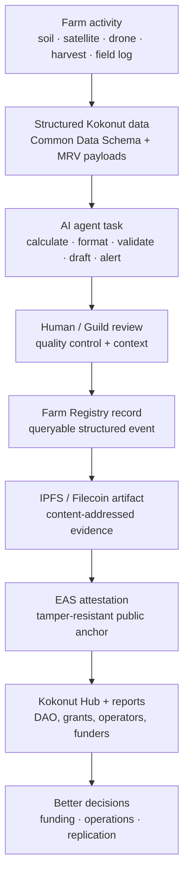
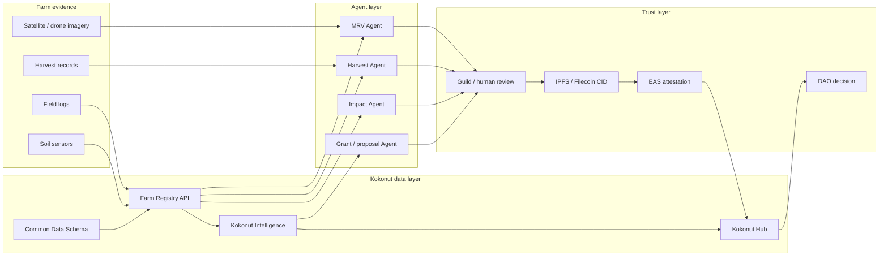

# AI agents turn Kokonut farm data into faster coordination.

Farms produce information constantly: satellite images, field logs, soil readings, drone surveys, crop cycles, harvest records, MRV payloads, and DAO reporting requirements.

Today, much of that work still depends on manual handoffs. An operator collects data, someone processes it, someone else reviews it, another person formats it for a report, and the result may only become useful after long delays.

Kokonut's agent layer is designed to reduce those handoffs. Agents can ingest farm data, calculate metrics, prepare structured records, route outputs for review, trigger payments, and help convert farm activity into evidence that DAO members, Guilds, farm operators, and public goods funders can actually use.

<CardGroup cols={2}>
  <Card title="See what agents can do" icon="robot" href="#agent-use-cases">
    Explore MRV automation, harvest forecasting, impact scoring, grant drafting, proposal drafting, and farm monitoring.
  </Card>

  <Card title="Build your first agent" icon="code" href="#builder-start-path">
    Follow the safe builder path: choose a task, define inputs and outputs, connect to Kokonut data, test, and request review.
  </Card>
</CardGroup>

<Warning>
  The Agentic Marketplace is still in development. Treat contract addresses, service registry flows, marketplace listings, escrow flows, and autonomous payments as developing infrastructure until testnet or mainnet deployments are published. Do not describe planned agent capabilities as live farm guarantees.
</Warning>

---

## What this page is for

| Reader | What you should get from this page | Best next step |
| --- | --- | --- |
| Agent builder | Understand safe first agent opportunities and integration requirements | Start with the MRV Reporter or Harvest Forecaster path |
| Data / MRV engineer | Understand how agents interact with Farm Registry records, IPFS payloads, EAS attestations, and the Kokonut Hub | Review the MRV workflow |
| Farm operator | Understand which farm tasks agents can help automate | Identify repeatable tasks worth automating |
| DAO or Guild reviewer | Understand what needs human review before agent outputs become trusted | Use the review checklist |
| Partner or funder | Understand how automation supports evidence, not hype | Compare estimates, measurements, attestations, and reports |

<Note>
  Agents are not a replacement for agronomists, farm operators, DAO governance, or human review. They are coordination tools that help standardize repeatable work and move evidence through the Kokonut system faster.
</Note>

---

## AI agents at a glance

| Layer | What it does | Status |
| --- | --- | --- |
| Farm data | Reads farm records, crop cycles, harvest events, MRV payloads, and public Data Hub entries | Live data exists for Adelphi; integrations expanding |
| Intelligence layer | Structures, operational, environmental, financial, governance, and Web3 records for analysis | Active infrastructure |
| Agent runtime | Runs task-specific services such as MRV reporters, harvest forecasters, and impact scorers | Developing |
| Identity | Registers agents with names, operators, capabilities, and service metadata | Developing |
| Payments | Uses USDC and x402-style flows for paid service calls | Developing |
| Verification | Connects outputs to IPFS/Filecoin records, Farm Registry events, EAS attestations, and reviewer approval | MRV pipeline active; agent automation developing |
| Reputation | Tracks completed work, quality, disputes, and longer-term contribution history | Developing |

---

## The core idea



The goal is not to let agents invent impact claims. The goal is to help agents move real farm events through a structured evidence pathway.

---

## What agents should automate first?

Agents should begin with repeatable, bounded tasks where the input, output, review rule, and evidence requirement are clear.

<CardGroup cols={2}>
  <Card title="MRV Reporter" icon="satellite-dish">
    Ingests satellite, drone, soil, or field observations and prepares structured MRV payloads for review and attestation.
  </Card>

  <Card title="Harvest Forecaster" icon="chart-line">
    Applies registered crop assumptions to estimate expected harvests, loss rates, revenue scenarios, and actual-vs-forecast differences.
  </Card>

  <Card title="Impact Scorer" icon="star">
    Aggregates verified farm records across a reporting period and prepares draft EBF, SDG, or public-goods reporting summaries.
  </Card>

  <Card title="Grant Drafter" icon="file-pen">
    Pulls structured farm data, MRV records, SDG alignment, and proof points into draft grant applications for human editing.
  </Card>

  <Card title="Proposal Drafter" icon="scroll">
    Converts farm records, budgets, milestones, and evidence into DAO proposal drafts for sponsor review.
  </Card>

  <Card title="Cross-Farm Monitor" icon="binoculars">
    Compares vegetation, harvest, soil, and operations data across farms to flag anomalies, missing records, or possible intervention needs.
  </Card>
</CardGroup>

---

## Live vs. developing

| Area | How to describe it |
| --- | --- |
| Adelphi farm data | Live reference project with public records and MRV workflows |
| MRV methodology | Active trust pipeline for turning farm activity into structured evidence |
| Common Data Schema | Live Framework primitive for standard farm records |
| Kokonut Intelligence | Active data backbone for farm, governance, environmental, financial, and Web3 activity |
| Agentic Marketplace | In development, use the development branch and avoid claiming deployed marketplace behavior until addresses are published |
| x402 payments | Design direction for autonomous service payment; implementation should be tested before production claims |
| Agent reputation | Developing should distinguish task history, review outcomes, Guild recognition, and DAO-approved rewards |
| Carbon or credit-related automation | Research / methodology-dependent; agents can support evidence collection, but cannot create certified climate claims by themselves |

<Warning>
  A useful agent can produce a draft, a calculation, an alert, or a structured payload. A trustworthy Kokonut claim still needs source data, review, evidence storage, attestation, and public reporting.
</Warning>

---

## Agent system architecture



---

## The four builder primitives

| Primitive | Plain English | In Kokonut |
| --- | --- | --- |
| Identity | Who is the agent and who operates it? | Agent name, operator wallet, capability manifest, status, and service metadata |
| Capability | What can the agent do? | Inputs, outputs, pricing, SLA, review rules, and artifact format |
| Payment | How does the agent get paid? | USDC / x402-style calls, escrow for longer tasks, and completion proof requirements |
| Evidence | Why should anyone trust the output? | Source data, IPFS/Filecoin CID, Farm Registry event, EAS attestation, reviewer approval, and public Data Hub record |

---

## Capability manifest

Every agent should declare what it accepts, what it returns, and what review evidence is required.

```json
{
  "agent_name": "kokonut-mrv-reporter",
  "version": "0.1.0",
  "status": "development",
  "description": "Prepares structured MRV payloads from remote sensing or field data for review and attestation.",
  "inputs": {
    "farm_id": {
      "type": "string",
      "required": true,
      "description": "Farm Registry identifier, such as adelphi"
    },
    "period_start": {
      "type": "string",
      "format": "ISO8601",
      "required": true
    },
    "period_end": {
      "type": "string",
      "format": "ISO8601",
      "required": true
    },
    "imagery_source": {
      "type": "string",
      "enum": ["sentinel", "landsat_8", "drone", "field_upload"],
      "required": true
    }
  },
  "outputs": {
    "mrv_event_draft_id": {
      "type": "string",
      "description": "Draft event created before final review"
    },
    "vegetation_indices": {
      "type": "object",
      "properties": {
        "ndvi": { "type": "number" },
        "ndre": { "type": "number" },
        "reci": { "type": "number" },
        "msavi": { "type": "number" }
      }
    },
    "artifact_cid": {
      "type": "string",
      "description": "IPFS/Filecoin CID for the source artifact or generated report"
    },
    "review_status": {
      "type": "string",
      "enum": ["draft", "needs_review", "approved", "rejected"]
    }
  },
  "review_required": true,
  "reviewer_role": "Impact Guild or authorized MRV reviewer"
}
```

<Note>
  Keep manifests versioned. If an agent changes input fields, output fields, pricing, or review rules, publish a new version and document the migration impact.
</Note>

---

## MRV automation workflow

Agents should compress manual work without bypassing verification.

<Steps>
  <Step title="Ingest source data" icon="satellite-dish" iconType="regular">
    Pull satellite imagery, drone uploads, soil readings, harvest logs, or field observations. Record the source, timestamp, farm identifier, and collection method.
  </Step>
  <Step title="Calculate structured metrics" icon="calculator" iconType="regular">
    Calculate vegetation indices, crop estimates, loss-rate scenarios, soil trends, or reporting summaries using documented formulas and farm boundaries.
  </Step>
  <Step title="Create a draft payload" icon="file-code" iconType="regular">
    Format results into a Farm Registry-compatible draft. Mark it as a draft until a reviewer approves it.
  </Step>
  <Step title="Attach evidence" icon="link" iconType="regular">
    Store source files or generated reports with IPFS/Filecoin CIDs so reviewers can inspect the evidence behind the output.
  </Step>
  <Step title="Request review" icon="user-check" iconType="regular">
    Route the draft to the relevant Guild, farm operator, or authorized reviewer. Agents should not self-certify high-impact claims.
  </Step>
  <Step title="Publish and attest" icon="stamp" iconType="regular">
    After approval, submit the final event to the Farm Registry and create the EAS attestation that links the public claim to its evidence.
  </Step>
</Steps>

---

## Vegetation indices agents may compute

| Index | Use case | Review note |
| --- | --- | --- |
| NDVI | General vegetation health across a farm period | Useful, but should be interpreted alongside crop stage and ground context |
| NDRE | Canopy maturity and chlorophyll stress in later growth stages | Works best when crop canopy is developed |
| ReCI | Chlorophyll and nitrogen-related stress signal | Requires agronomic context before recommendations |
| MSAVI | Early growth, sparse canopy, and exposed soil conditions | Better for early-stage plots than NDVI alone |

<Warning>
  Vegetation indices are signals, not final conclusions. Agents should flag potential conditions and route them for review by a farm operator or agronomist before making operational recommendations.
</Warning>

---

## Payments and escrow

Payment automation should match task complexity.

| Task type | Suggested payment pattern | Why |
| --- | --- | --- |
| Fast API call | x402-style pay-per-request | Good for small forecasts, metadata lookups, or simple calculations |
| Long-running analysis | Escrow with completion proof | Better for drone processing, multi-farm reports, or large grant drafts |
| Recurring monitoring | Milestone or subscription-style budget | Useful for weekly or monthly farm monitoring tasks |
| High-risk claims | Payment after review | Avoids rewarding outputs that fail evidence or quality checks |

<Note>
  Keep payment flows separate from evidence quality. A paid output is not automatically a verified output.
</Note>

---

## Reputation and quality control

Agent reputation should be based on useful work, not just task volume.

| Signal | What it means | Who uses it |
| --- | --- | --- |
| Task completion | The agent returned an output before the deadline | Builders, marketplaces, reviewers |
| Review outcome | A human or Guild reviewer accepted, requested changes, or rejected the output | Guilds, DAO members, operators |
| Evidence quality | Source data, formulas, CIDs, and assumptions were inspectable | MRV reviewers, grant reviewers, researchers |
| Dispute history | Outputs were challenged or escalated | Marketplace users and DAO reviewers |
| Long-term contribution | The agent's work consistently supported farm reporting or operations over time | Guilds and DAO proposal reviewers |

Agents that consistently produce useful, reviewable, and evidence-backed outputs can support Guild contribution records. Larger recognition or rewards should still follow the relevant Guild or DAO proposal process.

---

## Builder starts path

<Steps>
  <Step title="Pick one bounded task" icon="bullseye" iconType="regular">
    Start with one repeatable job, such as preparing an MRV draft, calculating a harvest forecast, or formatting a proposal draft.
  </Step>
  <Step title="Define the input and output schema" icon="diagram-project" iconType="regular">
    Write the capability manifest before writing complex code. Reviewers should know exactly what the agent accepts and returns.
  </Step>
  <Step title="Connect to one Kokonut data source" icon="database" iconType="regular">
    Use the Common Data Schema, Farm Registry API, Kokonut Hub, or Kokonut Intelligence as the source of truth. Do not scrape or reinterpret records without documenting the source.
  </Step>
  <Step title="Mark outputs as a draft by default" icon="pen-to-square" iconType="regular">
    Agent outputs should be treated as drafts until a reviewer approves them, especially for MRV, impact, finance, carbon, governance, or grant claims.
  </Step>
  <Step title="Add evidence artifacts" icon="folder-tree" iconType="regular">
    Store source files, generated reports, formulas, and assumptions with CIDs or stable references so outputs are reviewable.
  </Step>
  <Step title="Open an issue or Guild review request" icon="code-pull-request" iconType="regular">
    For non-trivial integrations, open an issue before a pull request. Schema, MRV, attestation, and payment changes need compatibility review.
  </Step>
</Steps>

---

## Safe first agent ideas

| Agent | Input | Output | Reviewer |
| --- | --- | --- | --- |
| MRV Draft Reporter | Farm ID, period, imagery, or field record | Draft MRV payload and evidence CID | Impact Guild / MRV reviewer |
| Harvest Actuals Checker | Crop cycle, planted area, harvest log | Actual-vs-forecast report | Farm operator / Finance Guild |
| Proposal Formatter | Farm record, budget, milestones, evidence | Draft proposal in Kokonut template format | Governance Guild |
| Data Quality Monitor | Farm Registry records and Data Hub entries | Missing fields, stale data, or inconsistency alerts | Technology Guild |
| SDG Evidence Assistant | MRV records, harvests, jobs, and public goods allocation | Draft SDG evidence map | Impact Guild |
| Grant Proof Assistant | Farm summary, MRV records, SDG map, photos | Draft proof package for grant submission | Communications Guild |

---

## What agents should not do

| Do not let agents... | Safer alternative |
| --- | --- |
| Certify carbon credits | Collect evidence that could support future methodology review |
| Claim guaranteed yields or revenue | Compare forecasts against actual records and show assumptions |
| Publish impact claims without evidence | Route drafts through MRV, reviewer approval, and EAS attestation |
| Move DAO funds autonomously | Draft proposals for human sponsorship and DAO vote |
| Change the Common Data Schema silently | Open a Framework Upgrade Proposal with a migration plan |
| Treat planned contracts as deployed | Label infrastructure as live, developing, planned, or deprecated |
| Replace farm operators | Assist operators with alerts, summaries, and structured reports |

---

## How this connects to Kokonut Intelligence

Kokonut Intelligence is the data backbone that can make agents useful. It gives agents access to structured context instead of forcing them to infer from scattered documents.

| Intelligence function | Agent benefit |
| --- | --- |
| Farm operations records | Agents can reference actual activity instead of inventing assumptions |
| Environmental measurements | Agents can calculate trends and flag anomalies |
| Financial and harvest records | Agents can compare forecasts against actuals |
| Web3 and DAO records | Agents can draft proposals and reporting summaries with governance context |
| Queryable analytics layer | Agents can answer structured questions for builders, reviewers, and operators |

[Read Kokonut Intelligence →](/kokonut-intelligence)

---

## Review the checklist before using an agent output

- Does the output cite or reference the source farm record?
- Does it distinguish between forecast, estimate, measurement, attestation, and verified report?
- Does it include timestamps, farm ID, source type, and reviewer status?
- Is the formula or model documented?
- Are source artifacts linked through stable storage or CIDs?
- Has a human or Guild reviewer approved high-impact claims?
- Does the output avoid unsupported financial, carbon, health, or climate claims?
- Does it avoid describing development infrastructure as live?

---

## Developer resources

| Resource | Purpose |
| --- | --- |
| [Build with Kokonut](/build-with-kokonut) | Repositories, deployed contracts, data primitives, and contribution workflow |
| [Farm Registry API](/api-reference/openapi) | API reference for farm records, MRV events, harvests, attestations, and impact endpoints |
| [MRV methodology](/ecosystem-wiki/kokonut-farms/measurement-reporting-and-verification) | Evidence pipeline for farm activity, payloads, IPFS records, EAS attestations, and reports |
| [Common Data Schema](/kokonut-framework/framework-components/common-data-schema) | Baseline farm record consumed by DAO members, developers, agents, and dashboards |
| [Kokonut Intelligence](/kokonut-intelligence) | Canonical data backbone for farm, environmental, financial, governance, and Web3 activity |
| [Kokonut Guilds DAO](/ecosystem-wiki/the-kokonut-dao/kokonut-guilds-dao) | Contribution path for builders who want Guild recognition and possible DAO rewards |
| [Glossary](/ecosystem-wiki/glossary) | Definitions for MRV, EAS, x402, ERC-8004, Guilds, and related terms |

---

<CardGroup cols={2}>
  <Card title="Build with Kokonut" icon="code" href="/build-with-kokonut">
    Start with repos, contribution workflow, data primitives, and live vs. developing infrastructure.
  </Card>

  <Card title="Read the MRV Methodology" icon="magnifying-glass-chart" href="/ecosystem-wiki/kokonut-farms/measurement-reporting-and-verification">
    Understand how agent outputs should become structured evidence instead of unsupported claims.
  </Card>

  <Card title="Open the Agentic Marketplace repo" icon="github" href="https://github.com/wasalo/Kokonut-Agentic-Marketplace">
    Review the marketplace codebase, contracts, frontend, and OpenServ integration work.
  </Card>

  <Card title="Join the Technology Guild" icon="hydra" href="/ecosystem-wiki/the-kokonut-dao/kokonut-guilds-dao">
    Contribute useful agent tooling, earn standing through work, and route larger contributions through DAO governance.
  </Card>
</CardGroup>