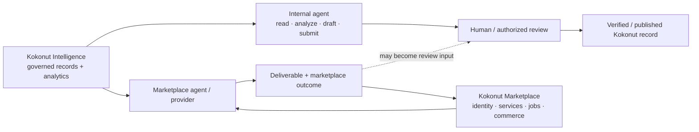
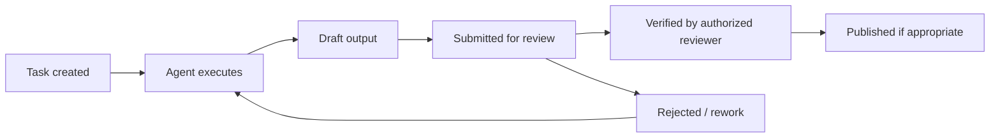
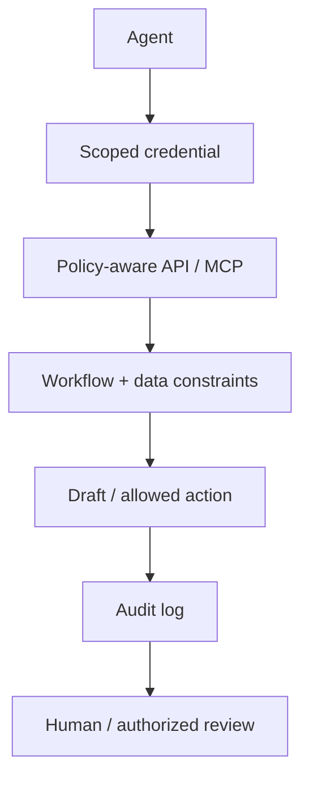
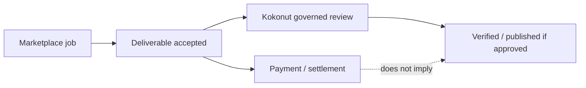
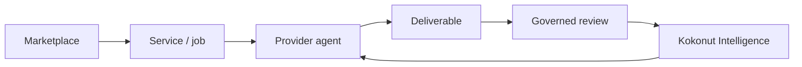

# AI agents should compress coordination without bypassing governance.

Kokonut produces more information than any one person should have to manually reconcile: field observations, harvests, expenses, sensor streams, satellite imagery, forecasts, evidence, governance records, reports, and partner requirements.

AI agents can help turn that information into:

- drafts;
- summaries;
- structured records;
- evidence-gap analysis;
- forecasts;
- alerts;
- proposed actions;
- review-ready reports.

But an agent output is not automatically a trusted Kokonut record.

The durable rule is:

> **Agents can assist the evidence and decision process. They do not inherit the authority of reviewers, farm operators, governance bodies, attestors, or treasury signers.**

<CardGroup cols={2}>
  <Card title="Understand the two agent layers" icon="layer-group" href="#two-agent-systems-one-boundary">
    Separate governed Intelligence agents from marketplace identity, commerce, escrow, and reputation.
  </Card>

  <Card title="See the safety model" icon="shield-halved" href="#agent-safety-boundaries">
    Keep agent outputs draft-first, permission-scoped, reviewable, and auditable.
  </Card>

  <Card title="Build an internal agent" icon="brain" href="#building-on-kokonut-intelligence">
    Use Kokonut Intelligence as the governed data, task, and review environment.
  </Card>

  <Card title="Build in the marketplace" icon="handshake" href="#the-kokonut-marketplace-layer">
    Use the current Kokonut Marketplace for identity, services, jobs, commerce, and coordination.
  </Card>
</CardGroup>

<Warning>
  **Do not collapse capability into authority.** An agent may be technically able to calculate, draft, query, or propose something while still being intentionally unable to verify, publish, attest, execute a treasury action, or make a human-governed decision.
</Warning>

---

## Two agent systems, one boundary

Kokonut currently has two related but distinct agent surfaces.

| Surface | Primary responsibility | Authority boundary |
| --- | --- | --- |
| **Kokonut Intelligence agents** | Governed analysis, synthesis, evidence preparation, draft records, task execution, audit logs | Operate inside Kokonut Intelligence permissions and review workflows |
| **Kokonut Marketplace** | Agent identity, services, jobs, commerce, payment coordination, evaluation, disputes, and reputation | Coordinates economic/service relationships; does not automatically validate Kokonut evidence or Framework claims |

The relationship is:


```mermaid
flowchart LR
    DATA["Kokonut Intelligence\ngoverned records + analytics"]
    INTAGENT["Internal agent\nread · analyze · draft · submit"]
    REVIEW["Human / authorized review"]
    PUBLISHED["Verified / published Kokonut record"]

    MARKET["Kokonut Marketplace\nidentity · services · jobs · commerce"]
    PROVIDER["Marketplace agent / provider"]
    DELIVERY["Deliverable + marketplace outcome"]

    DATA --> INTAGENT
    INTAGENT --> REVIEW
    REVIEW --> PUBLISHED

    MARKET --> PROVIDER
    PROVIDER --> DELIVERY
    DELIVERY --> MARKET

    DATA --> PROVIDER
    DELIVERY -. "may become review input" .-> REVIEW
```

A marketplace job can produce a useful artifact.

That artifact still enters Kokonut's governed review process if it is going to become:

- an MRV claim;
- an impact claim;
- a published report;
- an attestation;
- a financial record;
- a governance record;
- a certified or externally verified conclusion.

> **Marketplace acceptance is not the same thing as evidence verification.**

---

## Why Kokonut uses agents

Agentic workflows are useful when work is:

- repetitive;
- structured;
- bounded;
- evidence-rich;
- reviewable;
- expensive to coordinate manually.

Examples include:

| Work | Why an agent helps | Human / governed boundary |
| --- | --- | --- |
| Evidence-gap review | Checks many records consistently | Reviewer decides whether evidence is sufficient |
| Forecast reconciliation | Compares assumptions vs. actuals repeatedly | Operator/analyst interprets causes and actions |
| Draft reporting | Reuses governed data across report formats | Authorized reviewer approves publication |
| Data QA | Finds missing, stale, inconsistent, or implausible values | Record owner/reviewer corrects or rejects |
| Proposal drafting | Structures budgets, milestones, evidence, and context | Sponsor/governance process authorizes proposal |
| Monitoring | Surfaces anomalies and threshold breaches | Operator decides intervention |
| Synthesis | Summarizes large governed datasets | Reader/reviewer evaluates conclusions |

Agents reduce coordination cost.

They should not reduce accountability.

---

## Kokonut Intelligence is the governed agent environment

The active Kokonut Intelligence platform includes an agent ecosystem with:

- agent identities;
- capability manifests;
- tasks;
- action logs;
- AI summaries;
- scoped MCP / Directus access;
- analytics and reporting services;
- governed source records.

The current platform rule is explicit:

> **Agents can draft and submit governed records but cannot verify, publish, attest, or score them on their own.**

That is one of the most important constraints in the Kokonut architecture.

### Execution and review are different

An agent can successfully finish a task while its output remains untrusted.

For example:


```mermaid
flowchart LR
    A["Task created"] --> B["Agent executes"]
    B --> C["Draft output"]
    C --> D["Submitted for review"]
    D --> E["Verified by authorized reviewer"]
    E --> F["Published if appropriate"]

    D --> G["Rejected / rework"]
    G --> B
```

A completed execution can mean:

- the model returned an answer;
- a calculation ran;
- a file was generated;
- a record draft was created.

It does **not** mean:

- the conclusion is correct;
- the record is verified;
- the claim is publishable;
- the evidence is externally validated.

---

## What internal agents should do

Useful bounded internal-agent work includes:

<CardGroup cols={2}>
  <Card title="Evidence-gap analysis" icon="magnifying-glass-chart">
    Identify missing sources, weak evidence, inconsistent records, or review requirements without inventing the missing proof.
  </Card>

  <Card title="Draft synthesis" icon="file-pen">
    Prepare operational, ecological, financial, stakeholder, or public-interest summaries from governed data.
  </Card>

  <Card title="Forecast support" icon="chart-line">
    Produce scenarios and compare forecast assumptions against governed actual records.
  </Card>

  <Card title="Framework preparation" icon="leaf">
    Prepare draft EBF, SDG, CRISP, or other Framework workspaces for human review.
  </Card>

  <Card title="Proposal support" icon="file-lines">
    Structure farm, Guild, governance, or partner proposals from existing governed information.
  </Card>

  <Card title="Coordination support" icon="diagram-project">
    Summarize options, dependencies, risks, or work queues without becoming the final decision-maker.
  </Card>

  <Card title="Export support" icon="file-export">
    Generate structured compatibility exports and reporting context from approved records.
  </Card>

  <Card title="Monitoring" icon="bell">
    Surface anomalies, evidence gaps, or operational signals for human investigation.
  </Card>
</CardGroup>

---

## What internal agents should not do

Agents should not independently:

- verify governed records;
- publish governed records;
- publish attestations as final authority;
- claim scientific certification;
- raise evidence maturity by assertion;
- approve financial records;
- release treasury or reserve assets;
- override farm operators;
- change governance outcomes;
- perform unrestricted deletes or bulk updates;
- turn a simulation into an autonomous intervention;
- convert a Marketplace reputation score into evidence quality.

<Info>
  An agent may calculate a score or prepare a scorecard draft. That does **not** mean the agent can approve the score, certify its methodology, or publish it as an authoritative Framework conclusion.
</Info>

---

## Agent safety boundaries

Kokonut's agent safety should be implemented as infrastructure, not as a polite prompt.

At minimum, the architecture should preserve:

1. **scoped authentication** — agents use credentials with only the permissions they need;
2. **policy-aware APIs** — the API or gateway enforces allowed resources and actions;
3. **workflow controls** — lifecycle transitions remain permissioned;
4. **data constraints** — prohibited states should fail even when an upper layer makes a mistake;
5. **auditability** — agent actions should leave inspectable logs;
6. **human approval** — high-risk outputs remain review-gated.


```mermaid
flowchart TD
    A["Agent"]
    B["Scoped credential"]
    C["Policy-aware API / MCP"]
    D["Workflow + data constraints"]
    E["Draft / allowed action"]
    F["Audit log"]
    G["Human / authorized review"]

    A --> B
    B --> C
    C --> D
    D --> E
    E --> F
    F --> G
```

### High-risk actions deserve stronger controls

Examples include:

- publishing;
- attesting;
- contract execution;
- treasury actions;
- deleting records;
- bulk updates;
- sensitive financial writes;
- changing governance state;
- exposing private stakeholder evidence;
- changing a record to externally verified.

The correct pattern is usually:

> **prepare → review → authorize → execute**

not:

> **agent decides → agent executes → humans discover it later**

---

## Proposal is not execution

This distinction applies especially strongly to blockchain and treasury workflows.

An agent may be allowed to:

- prepare calldata;
- draft a proposal;
- construct a SAFE transaction;
- prepare an attestation request;
- assemble an evidence package;
- produce a deployment checklist.

That is different from being allowed to:

- sign as an owner;
- execute the SAFE transaction;
- move treasury funds;
- publish an attestation;
- upgrade a contract;
- bypass a timelock.

> **Automation can prepare the action. Authorization remains with the authority that owns the decision.**

---

## Evidence maturity and agents

Agent outputs should not become stronger merely because an LLM rewrote them.

Evidence maturity depends on what supports the claim.

An agent cannot upgrade evidence quality by:

- making prose sound more confident;
- adding a confidence score;
- creating a prettier report;
- storing the same unsupported claim on-chain;
- assigning a numeric score.

Kokonut's evidence model still progresses through materially different states such as:

> **narrative / self-report → structured → reviewed → evidence-linked → attested → externally verified**

The agent can help:

- structure;
- compare;
- find gaps;
- package;
- summarize.

The agent does not get to declare itself externally verified.

---

## Capability manifests

Reusable agents should publish a versioned capability contract.

A useful manifest can look like:

```json
{
  "agent_name": "kokonut-evidence-gap",
  "version": "1.0.0",
  "description": "Identifies missing evidence and review requirements for a governed subject.",
  "inputs": {
    "location_id": {
      "type": "string",
      "format": "uuid",
      "required": true
    },
    "subject_type": {
      "type": "string",
      "required": true
    }
  },
  "outputs": {
    "gaps": {
      "type": "array"
    },
    "review_notes": {
      "type": "string"
    }
  },
  "writes": [],
  "review_required": true
}
```

A production capability definition should make it possible to determine:

- what the agent can read;
- what it can write;
- which record states it can create;
- whether it touches sensitive data;
- whether human review is required;
- what artifacts it emits;
- which agent/version produced the output;
- how actions are audited.

---

## Authentication should be scoped

Internal agents should use the narrowest suitable access method.

Depending on the integration, this can include:

- scoped Directus access;
- gateway API keys;
- time-bounded capability tokens;
- MCP access under the same data policy;
- approved SDK clients.

<Warning>
  Do not use an administrator credential as an ordinary agent credential. If an agent can bypass every permission boundary, the model's behavior is no longer the primary safety problem — the credential design is.
</Warning>

### MCP is a transport, not a new authority model

Connecting an agent through MCP should not let it escape:

- authentication;
- role policy;
- record lifecycle;
- privacy restrictions;
- review requirements;
- audit logging.

The tool interface can change.

The authority boundary should not.

---

## Auditability

Agent actions should be reviewable after execution.

Useful audit metadata includes:

- agent identity;
- task identity;
- requested action;
- target resource;
- subject/record ID;
- payload or artifact hash;
- success/failure/skipped state;
- error context;
- risk classification;
- human-approval requirement;
- timestamps.

This lets a reviewer ask:

- What did the agent do?
- Which data did it use?
- Which task caused the action?
- Was the action allowed?
- Did it create a draft or a final state?
- Was a human required afterward?
- Which model/agent version generated the artifact?

> **Agent accountability requires action history, not just a chat transcript.**

---

## The Kokonut Marketplace layer

The separate **Kokonut Marketplace** is the canonical repository for the agent-economy / service-coordination layer.

Its responsibility is different from Kokonut Intelligence.

At a durable architectural level, the marketplace can coordinate concepts such as:

- agent identity;
- capabilities / services;
- job requests;
- provider discovery;
- payment coordination;
- escrow;
- milestone work;
- evaluation;
- disputes;
- reputation;
- market activity;
- agent-to-agent service relationships.

<Card title="Open the current Marketplace repository" icon="code-branch" href="https://git.kokonut.network/Kokonut-Marketplace/~files">
  Verify the current implementation, protocols, deployments, branches, contract addresses, payment rails, and developer commands in the live OneDev repository.
</Card>

<Warning>
  The Marketplace evolves independently. Do not copy a testnet address, registry version, payment token, contract count, evaluator rule, or branch name into this Knowledge Base and assume it will remain canonical.
</Warning>

### Marketplace state is not evidence state

A marketplace can legitimately track states such as:

- open;
- funded;
- submitted;
- accepted;
- rejected;
- disputed;
- completed;
- refunded.

Those states answer economic/service questions.

They do not answer whether a Kokonut claim is:

- evidence-linked;
- internally verified;
- externally verified;
- scientifically supported;
- ready for publication.

---

## Marketplace roles are not evidence roles

The Marketplace may define roles around the commercial relationship.

Conceptually:

| Marketplace role | Responsibility | Does not automatically imply |
| --- | --- | --- |
| **Requester / client** | Requests and funds work | Framework reviewer authority |
| **Provider / agent** | Performs the service | Authority to verify its own Kokonut output |
| **Evaluator / reviewer** | Judges whether the marketplace deliverable satisfies job rules | Scientific or MRV verifier status |
| **Arbiter / dispute role** | Resolves marketplace disputes | Farm operator or DAO governance authority |

A marketplace evaluator can decide whether a paid deliverable meets a commercial task specification.

That does not automatically make the deliverable:

- scientifically verified;
- regulator-approved;
- Framework-approved;
- published in Kokonut Intelligence;
- eligible for an ecological or financial claim.

---

## Reputation is not evidence maturity

Marketplace reputation is useful.

It can help answer questions such as:

- Is this the same registered agent?
- What services does it offer?
- Has it completed work?
- How did clients/evaluators rate it?
- Has it been involved in disputes?
- Does it have a reliable service history?

Evidence maturity answers a different class of questions:

- What source supports this claim?
- Was it reviewed?
- Is evidence linked?
- Was it attested?
- Was it independently verified?

> **Marketplace reputation measures service history. Evidence maturity measures support for a claim. Keep them separate.**

---

## Payments do not create truth

The marketplace may coordinate compensation through one or more payment and escrow mechanisms.

A payment state can tell us whether work was:

- funded;
- delivered;
- accepted;
- rejected;
- refunded;
- disputed.

It cannot tell us whether the underlying farm, ecological, financial, or impact claim is correct.


```mermaid
flowchart LR
    A["Marketplace job"] --> B["Deliverable accepted"]
    B --> C["Payment / settlement"]

    B --> D["Kokonut governed review"]
    D --> E["Verified / published if approved"]

    C -. "does not imply" .-> E
```

This distinction also protects agent providers.

An agent can complete the commercial task correctly even when:

- source data is incomplete;
- the requested claim cannot be verified;
- a reviewer later rejects the conclusion;
- the correct output is “insufficient evidence.”

A good marketplace should be able to reward accurate refusal and evidence-gap detection, not only confident conclusions.

---

## Building on Kokonut Intelligence

A strong first internal agent is:

- narrow;
- read-heavy;
- reversible;
- draft-first;
- easy to review;
- explicit about evidence.

Good starting patterns include:

| Agent | Input | Output | Reviewer |
| --- | --- | --- | --- |
| Evidence Gap Assistant | Subject + governed records | Missing evidence / review checklist | Domain reviewer |
| Forecast Reconciler | Forecast + actuals | Variance analysis | Operator / analyst |
| Data QA Agent | Canonical records | Missing/stale/inconsistent fields | Data reviewer |
| MRV Draft Assistant | Field/remote records | Draft MRV package | MRV reviewer |
| Proposal Assistant | Farm/budget/milestones/evidence | Draft proposal | Sponsor / governance reviewer |
| Reporting Assistant | Published governed records | Draft report | Authorized publisher |
| Stakeholder Summary Assistant | Consent-safe summaries | Draft synthesis | Human reviewer |

### Builder path

<Steps>
  <Step title="1. Pick one bounded task" icon="bullseye" iconType="regular">
    Avoid “general autonomous farm manager.” Start with one repeatable job whose inputs, outputs, and review authority are clear.
  </Step>

  <Step title="2. Define the capability" icon="diagram-project" iconType="regular">
    Specify input schema, output schema, readable resources, writable resources, risk level, and review requirement.
  </Step>

  <Step title="3. Use governed sources" icon="database" iconType="regular">
    Query Kokonut Intelligence or another documented source of truth rather than silently inferring operational facts from old prose.
  </Step>

  <Step title="4. Default to draft" icon="pen-to-square" iconType="regular">
    Material MRV, finance, governance, impact, certification, and partner outputs should enter review as drafts.
  </Step>

  <Step title="5. Preserve provenance" icon="link" iconType="regular">
    Keep source IDs, periods, model/method versions, evidence references, and artifact hashes where applicable.
  </Step>

  <Step title="6. Log the action" icon="list-check" iconType="regular">
    Make the agent's task, target, result, and risk inspectable.
  </Step>

  <Step title="7. Route to the correct reviewer" icon="user-check" iconType="regular">
    A Technology Guild reviewer cannot silently substitute for agronomic, financial, legal, farm-operator, or governance authority.
  </Step>
</Steps>

---

## Building on Kokonut Marketplace

Marketplace builders should treat the live Marketplace repository as canonical for:

- supported identity standards;
- service/capability registration;
- payment rails;
- contract interfaces;
- deployment networks;
- escrow behavior;
- evaluation/dispute rules;
- reputation;
- indexing;
- frontend/API architecture.

The integration contract with Kokonut Intelligence should remain clear:


```mermaid
flowchart LR
    MARKET["Marketplace"]
    TASK["Service / job"]
    AGENT["Provider agent"]
    ARTIFACT["Deliverable"]
    KI["Kokonut Intelligence"]
    REVIEW["Governed review"]

    MARKET --> TASK
    TASK --> AGENT
    AGENT --> ARTIFACT
    ARTIFACT --> REVIEW
    KI --> AGENT
    REVIEW --> KI
```

Recommended boundary:

- Marketplace owns **service commerce**.
- Kokonut Intelligence owns **governed farm/evidence state**.
- Framework docs own **methodology semantics**.
- Human/domain authorities own **approval decisions**.

---

## Privacy and agent access

Agents should not receive all data merely because it exists.

Apply:

- least-privilege access;
- farm/location scoping;
- partner scoping;
- consent restrictions;
- public/private classifications;
- sensitive-field redaction;
- public-safe summaries;
- controlled evidence access.

This is especially important for:

- stakeholder feedback;
- personal data;
- exact farm locations;
- financial records;
- credentials;
- partner contracts;
- private evidence;
- security-sensitive infrastructure.

<Warning>
  A model's context window is a disclosure surface. Do not send private evidence to an agent or model unless that access is authorized for the task and the integration is designed for that data class.
</Warning>

---

## Forecasts, recommendations, and actuation

Agents can support decisions without owning the decision.

For forecasts:

> **assumption → forecast → actual → variance → updated assumption**

For recommendations:

> **signal → analysis → proposed action → authorized decision**

For physical or financial actuation:

> **detected condition → proposed command → approval gate → execution → audit**

High-consequence automation should preserve explicit human/operator authorization unless a narrowly bounded policy has been intentionally approved for autonomous execution.

---

## Current maturity

| Surface | Status | Builder interpretation |
| --- | --- | --- |
| Kokonut Intelligence agent identities / tasks / logs / summaries | **Active implementation** | Governed internal-agent infrastructure |
| Scoped MCP / Directus agent access | **Active implementation** | Agent access inherits data permissions and workflow rules |
| Draft/submit agent workflow | **Active implementation** | Agents assist without self-verifying or self-publishing |
| Evidence maturity | **Active implementation / methodology** | Separate from agent or marketplace reputation |
| Human review gates | **Core architecture** | High-trust states remain authorized transitions |
| Kokonut Marketplace | **Active evolving repository** | Verify current deployment/protocol details in OneDev |
| Marketplace-to-Intelligence integration | **Integration surface** | Commercial deliverables may feed governed review |
| Fully autonomous farm governance | **Not the model** | Agents do not replace farm or governance authority |
| Autonomous scientific certification | **Not supported** | External verification remains external/human-governed |
| Autonomous treasury control | **Not the default** | Proposal/preparation and execution authority remain distinct |

---

## Builder quality checklist

Before shipping an agent or marketplace integration, confirm:

- [ ] The agent's task is bounded.
- [ ] Read and write permissions are explicit.
- [ ] Draft and final states are distinct.
- [ ] Execution success is not confused with verification.
- [ ] Marketplace acceptance is not confused with evidence verification.
- [ ] Marketplace reputation is not confused with evidence maturity.
- [ ] Forecasts and recommendations expose assumptions.
- [ ] Material claims preserve source/evidence references.
- [ ] Private data is scoped appropriately.
- [ ] Human/domain review remains where required.
- [ ] Agents cannot silently publish, attest, or execute privileged actions.
- [ ] Treasury/SAFE proposal authority is distinct from execution authority.
- [ ] Current Marketplace implementation details were verified in the live OneDev repository.
- [ ] Current Kokonut Intelligence interfaces were verified in the live OneDev repository.
- [ ] High-risk actions are auditable and reversible where possible.

---

## What agents should never be allowed to imply

<Warning>
  Agent outputs should not imply, without the required evidence and authority:

  - “The agent verified this farm.”
  - “The marketplace approved this impact claim.”
  - “Payment proves the deliverable is scientifically correct.”
  - “An EAS attestation certifies the outcome.”
  - “A high reputation score means the evidence is strong.”
  - “A forecast is an achieved result.”
  - “A proposed SAFE transaction moved funds.”
  - “A simulation is an authorized farm intervention.”
  - “A complete schema means the record is true.”
  - “An AI score replaces reviewer judgment.”
</Warning>

---

## Canonical builder sources

| Need | Use |
| --- | --- |
| Governed data, agent tasks, evidence, analytics, APIs | [Kokonut Intelligence](https://git.kokonut.network/Kokonut-Intelligence/~files) |
| Marketplace identity, services, commerce, deployments | [Kokonut Marketplace](https://git.kokonut.network/Kokonut-Marketplace/~files) |
| Ecosystem-wide builder contract | [Build with Kokonut](/build-with-kokonut) |
| Evidence lifecycle | [MRV Methodology](/ecosystem-wiki/kokonut-farms/measurement-reporting-and-verification) |
| Baseline compatibility | [Common Data Schema](/kokonut-framework/framework-components/common-data-schema) |
| Framework methodology | [Framework Introduction](/kokonut-framework/Introduction) |

---

## Continue through the builder system

<CardGroup cols={2}>
  <Card title="Kokonut Intelligence" icon="brain" href="/kokonut-intelligence">
    See the governed data, evidence, API, analytics, privacy, and agent infrastructure.
  </Card>

  <Card title="Build with Kokonut" icon="code" href="/build-with-kokonut">
    Return to canonical sources, maturity states, compatibility rules, and contribution workflow.
  </Card>

  <Card title="MRV Methodology" icon="magnifying-glass-chart" href="/ecosystem-wiki/kokonut-farms/measurement-reporting-and-verification">
    Understand how agent-produced drafts can enter the evidence lifecycle safely.
  </Card>

  <Card title="Common Data Schema" icon="database" href="/kokonut-framework/framework-components/common-data-schema">
    Keep the farm baseline compatible without confusing it with operational evidence.
  </Card>

  <Card title="Kokonut Marketplace" icon="store" href="https://git.kokonut.network/Kokonut-Marketplace/~files">
    Verify the current agent-economy implementation directly in the live repository.
  </Card>

  <Card title="Framework Introduction" icon="scroll" href="/kokonut-framework/Introduction">
    Reconnect agent automation to interoperability, local authority, and evidence boundaries.
  </Card>
</CardGroup>

> **The strongest Kokonut agent is not the one with the most autonomy. It is the one whose capability, evidence, permissions, and authority boundaries are easiest to inspect.**
