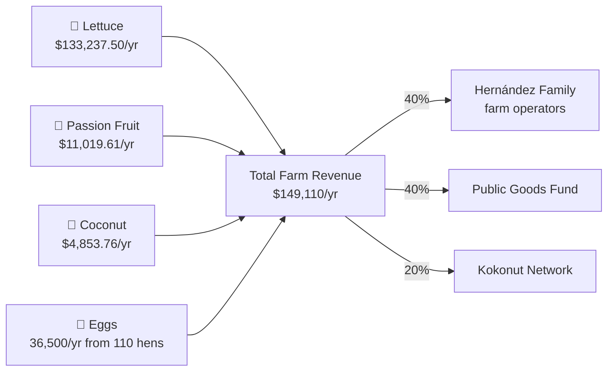
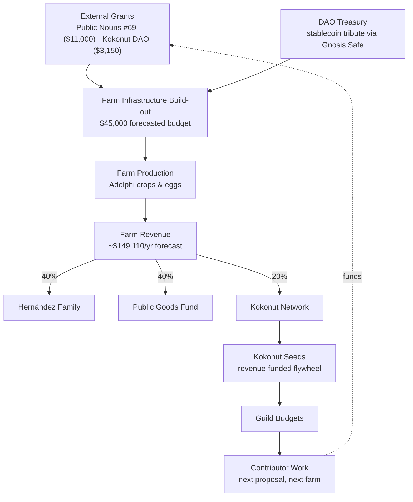

### Financial Model

**Revenue streams (Adelphi, forecast):**

| Crop / Stream | Forecast annual revenue | Notes |
| --- | --- | --- |
| Lettuce | \$133,237.50 | Largest single revenue line; short-cycle, provides near-term cash flow |
| Passion fruit | \$11,019.61 | Mid-cycle vine crop |
| Coconut | \$4,853.76 | Long-cycle (multi-year maturation); 96 trees across 8 plots |
| Eggs | 36,500 eggs/yr from 110 hens | Additional protein/revenue stream layered onto the same land |
| **Total forecast** | **\$149,110/year** | (source: [Adelphi Crops & Harvest Forecast](/ecosystem-wiki/kokonut-farms/adelphi/crops-and-harvest-forecast)) |

The short-cycle lettuce revenue is explicitly what bridges the farm financially while the long-cycle coconut trees mature — a "bridge crop" pattern worth calling out for anyone replicating this with tree crops.

**Cost structure:** Adelphi's infrastructure build-out carries a forecasted budget of \$45,000 USD in total. Against that, two grants have been confirmed to date: an \$11,000 grant from Public Nouns (Proposal #69) and a \$3,150 grant from the Kokonut DAO treasury, both earmarked for critical infrastructure.

Ongoing operating costs are reduced by design through closed-loop inputs — on-site organic matter and poultry byproducts feeding back into soil fertility rather than purchased synthetic inputs — with labor (the 7 jobs created) as the primary recurring operating cost.

**Funding sources & revenue split:**

- **DAO treasury:** stablecoin "tribute" contributions from members flow into a Gnosis Safe–controlled multisig treasury.
- **Grants:** Adelphi's initial buildout was funded via **Public Nouns Proposal #69**, a public-goods-oriented Nouns-ecosystem grant (source: Adelphi Executive Summary; Common Data Schema). Beyond the \$45,000 infrastructure budget tied to Public Nouns Proposal #69, Adelphi has also received a 3,150 grant directly from the Kokonut DAO treasury for infrastructure development — a smaller, DAO-native funding round layered on top of the original external grant, and an early example of the DAO reinvesting its own treasury into the flagship farm rather than relying solely on outside capital.
- **Kokonut Seeds:** a revenue-funded flywheel mechanism that recycles a portion of farm revenue back into Guild budgets, so ongoing contributor funding isn't solely dependent on new capital raises.
- **Revenue split (Adelphi specifically):** 40% to the Hernández family as farm operators, 40% to the public-goods fund, 20% to Kokonut Network.

### Regulatory Compliance

The public documentation is explicit that none of it constitutes legal, tax, or financial advice (source: [Kokonut Moloch DAO](/ecosystem-wiki/the-kokonut-dao/kokonut-moloch-dao)).

What is documented:

- **Organic certification** for Adelphi's produce is pursued through the Dominican Republic's Ministry of Agriculture pathway.
- **Treasury design** deliberately uses stablecoins for tribute and treasury holdings, which reduces (though doesn't eliminate) the DAO's exposure to crypto-asset price volatility relative to holding a volatile governance or utility token as the treasury's primary asset.
- **Risk disclosures** on smart-contract risk, key management, and the experimental nature of DAO tooling are surfaced directly in the FAQ rather than buried.

On the ground, land access runs through a general partnership agreement between Kokonut and the landowner or land steward: the landowner contributes the land itself, and the contract assigns each stakeholder a defined percentage across the full range of capital contributed — not cash alone.

On Kokonut's side, that agreement is signed by a Dominican SRL (Sociedad de Responsabilidad Limitada), which gives the arrangement a recognized legal counterparty under Dominican law. Kokonut DAO itself does not yet have its own legal wrapper — it currently operates through the SRL rather than contracting directly — but Kokonut is evaluating wrapping the DAO through Otoco.io, a Web3 legal-entity platform, so the DAO can hold enforceable rights in real-world contracts on its own rather than exclusively through an intermediary entity.