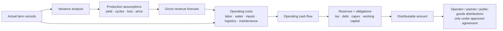
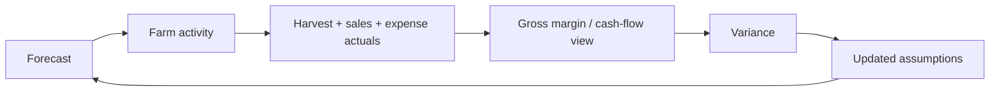
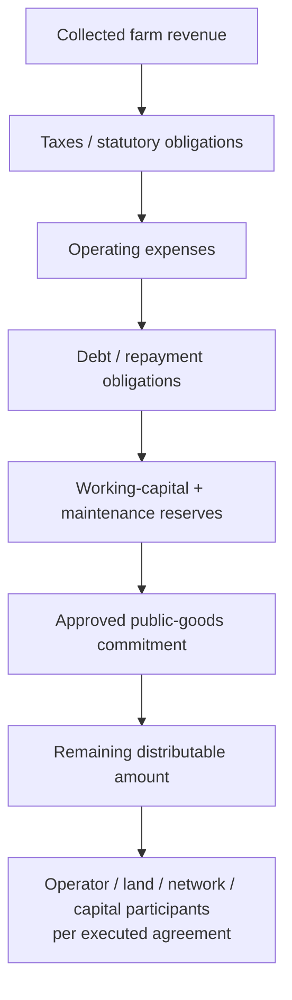
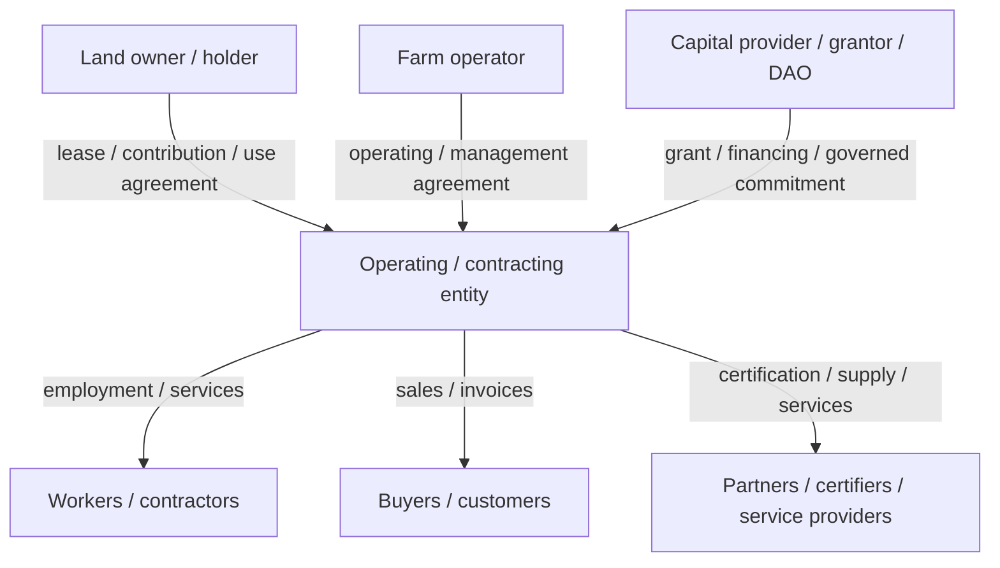
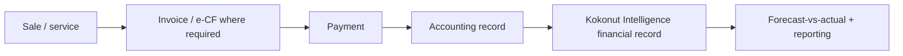
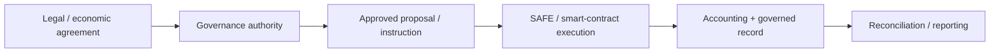

# A regenerative business model is more than a revenue forecast.

A farm can have strong projected revenue and still fail because:

- cash arrives later than expenses;
- costs are incomplete;
- market prices change;
- yields underperform;
- operator compensation is unclear;
- reserves are insufficient;
- land and operating rights are poorly documented;
- revenue-sharing rules conflict;
- tax, labor, certification, or invoicing obligations are missed.

Kokonut's financial model should therefore be read as a set of **testable assumptions connected to governed actual records**.

The legal model should be read the same way:

> **Smart contracts and governance can coordinate rights that already exist. They do not create land title, legal personality, regulatory approval, tax treatment, or enforceable off-chain rights by themselves.**

<CardGroup cols={2}>
  <Card title="Review the Adelphi forecast" icon="calculator" href="/ecosystem-wiki/kokonut-farms/adelphi/crops-and-harvest-forecast">
    Inspect the current crop assumptions, sensitivity, modeled gross revenue, and forecast-vs-actual requirements.
  </Card>

  <Card title="Understand DAO authority" icon="building-columns" href="/ecosystem-wiki/the-kokonut-dao/kokonut-moloch-dao">
    See what Moloch governance can authorize — and what remains outside DAO authority.
  </Card>

  <Card title="Inspect published farm records" icon="chart-line" href="https://hub.kokonut.network/projects/41">
    Use current governed records for actual activity rather than treating a planning model as live financial performance.
  </Card>

  <Card title="Read the evidence standard" icon="magnifying-glass-chart" href="/ecosystem-wiki/kokonut-farms/measurement-reporting-and-verification">
    Keep financial forecasts, transactions, reviewed records, and public claims in their correct evidence classes.
  </Card>
</CardGroup>

<Warning>
  This page is an educational description of Kokonut's model and legal interfaces. It is **not legal, tax, accounting, securities, investment, labor, land-title, or regulatory advice**. A farm or entity adopting the model should obtain advice for its actual jurisdiction, contracts, assets, participants, and transactions.
</Warning>

---

## The economic model in one view

A useful farm model separates five layers.


```mermaid
flowchart LR
    A["Production assumptions\nyield · cycles · loss · price"] --> B["Gross revenue forecast"]
    B --> C["Operating costs\nlabor · water · inputs · logistics · maintenance"]
    C --> D["Operating cash flow"]
    D --> E["Reserves + obligations\ntax · debt · capex · working capital"]
    E --> F["Distributable amount"]
    F --> G["Operator / partner / public-goods distributions\nonly under approved agreement"]

    H["Actual farm records"] --> I["Variance analysis"]
    I --> A
    H --> C
```

The old playbook jumped too quickly from **gross crop forecast** to **stakeholder distribution**.

That is not enough for a defensible business model.

> **Gross revenue is not distributable cash.**

---

## Adelphi forecast — current planning snapshot

The current Adelphi model estimates crop production under documented assumptions.

| Stream | Current planning model | Modeled annual gross revenue |
| --- | --- | ---: |
| **Lettuce** | 48,450 saleable units/harvest × 5 modeled harvests | **$133,237.50** |
| **Passion fruit** | 560 plants · modeled yield and packaging assumptions | **$11,019.61** |
| **Coconut** | 96 trees · productive-maturity assumption | **$4,853.76** |
| **Poultry eggs** | ~100 eggs/day estimate from 110 hens | **Revenue not modeled** |
| **Combined crop model** | Mixed crop maturities; eggs excluded | **$149,110.87/year** |

<Warning>
  **$149,110.87 is modeled gross crop revenue.** It is not recorded annual revenue, net income, EBITDA, free cash flow, household income, DAO income, or an investment return.
</Warning>

The detailed model currently assumes, among other variables:

- a **15% crop-loss rate**;
- **5 lettuce harvests/year**;
- planning prices rather than realized prices;
- productive maturity for the coconut annualized scenario.

[Inspect the full assumptions and sensitivities →](/ecosystem-wiki/kokonut-farms/adelphi/crops-and-harvest-forecast)

---

## Bridge crops and time horizons

The useful business insight behind the Adelphi crop mix is not the headline revenue number.

It is the attempt to combine different cash-flow horizons.

| Horizon | Example | Financial role |
| --- | --- | --- |
| **Short cycle** | Lettuce | Potential earlier production and cash conversion |
| **Medium cycle** | Passion fruit | Seasonal diversification |
| **Long cycle** | Coconut | Perennial productive asset with delayed maturity |
| **Continuous** | Poultry | Ongoing output and nutrient-cycling potential |

A long-cycle regenerative asset may need:

- grants;
- patient equity-like capital;
- partner contributions;
- reserves;
- short-cycle revenue;
- working-capital facilities;
- other bridge financing

before long-duration production becomes meaningful.

<Info>
  The transferable lesson is **match financing duration to biological duration**. Do not assume every tree-based farm can finance its establishment period from early crop revenue alone.
</Info>

---

## Build the cost model before designing distributions

The current crop forecast is intentionally not a full profit-and-loss statement.

A production business model should separately track at least:

### Direct farm costs

- seed and seedlings;
- biological inputs;
- purchased soil amendments;
- poultry feed where applicable;
- water;
- electricity;
- packaging;
- harvest labor;
- field labor;
- crop protection;
- equipment consumables.

### Operating overhead

- management;
- bookkeeping;
- transport;
- communications;
- security;
- software;
- insurance where applicable;
- professional services;
- banking/payment fees;
- partner reporting.

### Asset and infrastructure costs

- irrigation;
- pumps;
- reservoirs;
- solar/electrical systems;
- nursery;
- fencing;
- buildings;
- tools;
- vehicles;
- repairs;
- replacement capex.

### Compliance and market costs

- permits;
- tax compliance;
- electronic invoicing;
- certification;
- laboratory work;
- audits;
- packaging/label requirements;
- sales commissions;
- logistics.

### Reserves and contingencies

- crop failure;
- extreme weather;
- disease;
- equipment failure;
- buyer default;
- price decline;
- emergency labor;
- maintenance;
- legal disputes.

> **A regenerative practice may reduce some external-input costs over time. It should not be described as eliminating operating costs unless the actual accounts demonstrate that.**

---

## Forecast → actual financial model

Each reporting period should make assumptions testable.

| Forecast item | Actual record that should replace or test it |
| --- | --- |
| Planned units | Harvested / saleable units |
| Planning loss rate | Actual loss / rejection rate |
| Planning price | Realized selling price |
| Target market | Actual buyer / channel |
| Expected crop cycles | Actual planting-to-harvest timing |
| Forecast gross revenue | Recorded sales |
| Planned operating cost | Recorded expenses |
| Public-goods scenario | Approved and executed allocation records |
| Distribution assumption | Actual authorized distribution |


```mermaid
flowchart LR
    A["Forecast"] --> B["Farm activity"]
    B --> C["Harvest + sales + expense actuals"]
    C --> D["Gross margin / cash-flow view"]
    D --> E["Variance"]
    E --> F["Updated assumptions"]
    F --> A
```

A mature model should eventually answer:

- Which stream generated revenue?
- Which stream consumed cash?
- What was gross margin?
- Which costs are fixed vs. variable?
- How much working capital was required?
- What capex still needs replacement?
- What obligations must be paid before distributions?
- What cash can legally and prudently be distributed?

---

## The public-goods allocation is currently unresolved

The repository currently contains two different Adelphi allocation models.

### Current farm / Framework model

Several current farm and Framework pages use:

> **10% of gross farm revenue as a public-goods planning assumption**

Under the current modeled crop total, that would be approximately:

```text
Modeled gross crop revenue:  $149,110.87
10% planning scenario:        $14,911.09
```

### Older ReFi Playbook model

Older ReFi pages described:

- **40%** to the Hernández family;
- **40%** to a public-goods fund;
- **20%** to Kokonut Network.

Those are not equivalent models.

<Warning>
  **Neither percentage model should be presented here as a final, legally binding, governance-approved, or already-realized distribution until it is reconciled against the authoritative executed economic agreement or governance record.**
</Warning>

This page therefore does **not** draw a revenue-split diagram.

### The correct distribution waterfall

Before any distribution, the governing agreement should define the order of operations.

A possible structure to document — **not a Kokonut universal rule** — is:


```mermaid
flowchart TD
    A["Collected farm revenue"] --> B["Taxes / statutory obligations"]
    B --> C["Operating expenses"]
    C --> D["Debt / repayment obligations"]
    D --> E["Working-capital + maintenance reserves"]
    E --> F["Approved public-goods commitment"]
    F --> G["Remaining distributable amount"]
    G --> H["Operator / land / network / capital participants\nper executed agreement"]
```

The actual ordering and percentages belong in the farm's approved legal/economic documents.

---

## Capital sources should not be collapsed together

Different capital sources create different obligations.

| Capital source | Typical characteristic | Key question |
| --- | --- | --- |
| **Grant** | Usually non-repayable but purpose-restricted | What deliverables, reporting, and use restrictions apply? |
| **DAO treasury grant** | Proposal-authorized shared capital | What exactly did governance authorize? |
| **Land contribution** | Real-world asset / usage contribution | What legal rights and duration were actually granted? |
| **Operator labor / sweat contribution** | Ongoing work and operating risk | How is compensation separated from ownership/economic participation? |
| **Equipment contribution** | In-kind productive asset | Who owns, maintains, replaces, and insures it? |
| **Loan / debt** | Repayment obligation | What are maturity, interest, security, and default terms? |
| **Equity-like participation** | Residual economic participation | What entity/right is actually being issued? |
| **Public-goods capital** | Mission-restricted funding | What use, evidence, and reporting restrictions exist? |

Adelphi's current public documentation identifies **Public Nouns Proposal #69** as a major public-goods funding milestone.

<Card title="Review Public Nouns Proposal #69" icon="hand-holding-heart" href="https://publicnouns.wtf/vote/69">
  Use the proposal and current farm records to understand the funded scope rather than relying on an old summary of grant amounts.
</Card>

<Note>
  Older ReFi documentation included specific grant amounts and a separate Kokonut DAO infrastructure grant. Those values should only return to this page when they are reconciled against the relevant proposal, treasury, or accounting records.
</Note>

---

## DAO treasury capital is not farm revenue

Kokonut's Moloch DAO can authorize shared treasury capital.

That does not make:

- treasury deposits;
- membership tribute;
- grants;
- farm sales;
- farm profit;
- public-goods distributions

the same accounting category.

A clear implementation should preserve separate ledgers for:

1. DAO treasury assets;
2. approved DAO commitments;
3. farm/entity operating accounts;
4. farm revenue;
5. farm expenses;
6. restricted grants;
7. operator/partner obligations;
8. public-goods commitments;
9. distributions.

> **On-chain transparency does not remove the need for accounting separation.**

[Read the Moloch capital-governance model →](/ecosystem-wiki/the-kokonut-dao/kokonut-moloch-dao)

---

## Tokens do not create off-chain rights by themselves

The current Kokonut DAO documents:

- **$vKKN** as a non-transferable Moloch voting token;
- **Loot** as a non-voting, non-transferable token under the current model.

Those primitives are useful for DAO coordination.

They should not be described as independently establishing:

- land ownership;
- title to a specific tree;
- farm-management authority;
- employment rights;
- a guaranteed share of farm revenue;
- a debt claim;
- a security interest;
- a guaranteed treasury exit value;
- a regulated investment product.

<Warning>
  If a token is intended to represent an off-chain contractual or economic right, the legal agreement must define that right and the relevant Dominican and other applicable law should be reviewed. The blockchain record should not be asked to carry legal meaning that the contract never created.
</Warning>

---

# Legal architecture

## Start with the legal relationships, not the DAO wrapper

A real-world farm can involve several separate legal relationships.


```mermaid
flowchart TD
    LAND["Land owner / holder"]
    OP["Farm operator"]
    ENTITY["Operating / contracting entity"]
    CAPITAL["Capital provider / grantor / DAO"]
    WORKERS["Workers / contractors"]
    BUYERS["Buyers / customers"]
    PARTNERS["Partners / certifiers / service providers"]

    LAND -->|"lease / contribution / use agreement"| ENTITY
    OP -->|"operating / management agreement"| ENTITY
    CAPITAL -->|"grant / financing / governed commitment"| ENTITY
    ENTITY -->|"employment / services"| WORKERS
    ENTITY -->|"sales / invoices"| BUYERS
    ENTITY -->|"certification / supply / services"| PARTNERS
```

The legal question is not:

> “What DAO wrapper do we need?”

The better questions are:

- Who owns or controls the land?
- Who has the right to use it?
- Who employs or contracts workers?
- Who sells the farm products?
- Who receives grant or investment capital?
- Who owns equipment?
- Who bears losses?
- Who signs with buyers?
- Who carries tax obligations?
- Who can bind the project legally?
- Which rights belong to the DAO, if any?
- Which rights remain with the farm/operator/entity?

---

## Documented Kokonut structure vs. legal conclusion

Kokonut public materials describe the use of Dominican legal entities and contractual arrangements alongside the DAO.

This page should not infer more than the executed agreements establish.

<Info>
  **The executed contract, entity records, land-title/tenancy records, governance proposal, and live chain state are stronger sources than descriptive playbook prose.**
</Info>

If a public page says that a landowner “contributes land,” that phrase can mean very different legal things:

- transfer of title;
- lease;
- usufruct;
- license;
- partnership contribution;
- temporary right of use;
- another contractual arrangement.

Those are not interchangeable.

The actual agreement must say which one applies.

---

## Dominican legal interfaces

The following areas are relevant when structuring a Kokonut-style project in the Dominican Republic.

This is a **legal-interface map**, not a determination that any specific structure is appropriate.

| Area | Relevant Dominican framework / authority | Why builders should care |
| --- | --- | --- |
| **Commercial company / SRL** | [Law 479-08 on Commercial Companies](https://transparencia.dgjp.gob.do/wp-content/uploads/2022/11/Ley-No.479-08.pdf), as amended | A Dominican operating company can contract, invoice, hire, own assets, and bear obligations according to its corporate documents and applicable law |
| **Cooperative** | [Law 127-64 on Cooperative Associations](https://www.dgjp.gob.do/wp-content/uploads/2022/05/Ley-Nu%CC%81m.-127-64.pdf) | A cooperative has its own member, capital, governance, reserve, and surplus rules; it should not be treated as interchangeable with a DAO |
| **Nonprofit / foundation** | Law 122-05 on nonprofit associations | Mission/public-goods activity may belong in a separate nonprofit structure depending on the activity and funding |
| **Fideicomiso / trust structure** | [Law 189-11 framework and supervised fiduciary sector](https://www.sb.gob.do/supervisados/fiduciarias/) | A trust structure may be relevant for segregating assets or defining fiduciary purposes, but requires specialized structuring and an authorized fiduciary relationship |
| **Tax** | [Tax Code — Law 11-92](https://dgii.gov.do/transparencia/marcoLegal/Documents/Leyes/11-92.pdf) + DGII rules | Entity form does not eliminate tax, filing, withholding, recordkeeping, or substance requirements |
| **Electronic invoicing** | [Law 32-23 + DGII e-CF guidance](https://dgii.gov.do/publicacionesOficiales/bibliotecaVirtual/contribuyentes/facturacion/Paginas/inicio.aspx) | Farm/product sales and service activity may need to comply with the current e-CF regime and implementation obligations |
| **Organic production / certification** | [Ministry of Agriculture organic-operator/certifier registry](https://agricultura.gob.do/servicios/facilitar-el-acceso-a-los-registros-a-certificadoras-y-operadores-organicos-productores-procesadores-comercializadores-e-inspectores/) | “Organic” should be tied to the applicable registration/certification process rather than marketing language alone |
| **Personal data** | [Law 172-13 on Personal Data Protection](https://indotel.gob.do/wp-content/uploads/2025/04/Ley-172-13-Sobre-proteccion-de-Datos-personales.pdf) | Farm, worker, contributor, partner, location, and stakeholder data can create privacy obligations |
| **Monetary / virtual-asset boundary** | [Banco Central virtual-assets notice](https://cdn.bancentral.gov.do/documents/avisos/documents/aviso20170628.pdf) + current monetary/financial law | On-chain assets should not be assumed to have the status, protections, or payment treatment of Dominican legal tender or regulated deposits |

<Warning>
  Laws, regulations, administrative criteria, tax obligations, deadlines, and regulator positions can change. Verify the current text and obtain Dominican professional advice before relying on this table for a transaction.
</Warning>

---

## SRL: useful legal counterparty, not a DAO wrapper by default

A Dominican **Sociedad de Responsabilidad Limitada (SRL)** is a recognized commercial company form under Law 479-08 and its amendments.

An SRL can be useful where the project needs a legal person to:

- sign contracts;
- invoice;
- hire;
- open bank accounts;
- own or lease assets;
- receive grants or payments;
- enter supply agreements;
- bear operating obligations.

But using an SRL does not automatically make DAO decisions enforceable against that entity.

The legal documents should answer:

- Who owns the SRL?
- Who can legally bind it?
- How are managers appointed/removed?
- Does the entity have an obligation to follow a DAO vote?
- Which DAO proposals are merely recommendations?
- Which contracts incorporate DAO decisions?
- What happens when an on-chain vote conflicts with directors/managers' legal duties?
- Who bears liability for farm operations?

> **An on-chain governance process and a legal entity can be connected. They are not the same institution.**

---

## Cooperative structure: participation is legally defined

A Dominican cooperative organized under **Law 127-64** has its own statutory governance architecture.

The law addresses matters such as:

- constitution through a general assembly;
- statutes;
- member admission and withdrawal;
- capital contributions;
- reserves;
- administration and oversight;
- assemblies;
- member rights and duties;
- surplus/distribution rules.

That makes cooperative design potentially relevant to community ownership.

It also means a cooperative should not be described casually as “the legal wrapper for a DAO.”

If Kokonut uses or develops a cooperative structure, the relationship among:

- cooperative members;
- $vKKN holders;
- Loot holders;
- Guild contributors;
- farm operators;
- landowners

should be explicit rather than assumed to overlap.

---

## Fideicomiso can separate assets — but requires real structuring

Dominican **Law 189-11** provides a legal framework for fideicomisos, and the Superintendencia de Bancos maintains the supervised fiduciary sector for relevant fiduciary companies and financial institutions.

A fideicomiso may be worth evaluating when a project needs to:

- segregate assets from an operating company;
- define a specific long-term purpose;
- separate administration from beneficial interests;
- hold land or other assets under a governed mandate;
- create clearer asset-protection / continuity mechanisms.

That is an architectural option, not a default recommendation.

A farm trust structure requires careful review of:

- settlor/fideicomitente;
- trustee/fiduciaria;
- beneficiary/fideicomisario;
- contributed assets;
- permitted purpose;
- duration;
- governance;
- distributions;
- taxes;
- reporting;
- termination;
- interaction with farm operators and DAO decisions.

---

## Public-goods entity and operating entity can be different

Kokonut also operates a public-goods / foundation dimension.

There can be good reasons to separate:

- commercial farm operations;
- public-goods grants;
- education;
- research;
- open-source development;
- charitable activities;
- asset ownership.

That does not mean every project needs multiple entities.

The design question is:

> **Which legal entity should own each obligation, asset, revenue stream, and mission commitment?**

Avoid creating entity complexity without a clear purpose.

---

## Tax and accounting follow economic reality

The Dominican Tax Code states that legal form does not necessarily bind the tax administration where the underlying taxable reality differs.

For a ReFi project, that means documentation should not assume that:

- calling something a “tribute” makes it non-taxable;
- calling a distribution “public goods” determines its tax treatment;
- routing value through a DAO makes it outside tax rules;
- paying in a token changes the underlying economic nature of a transaction;
- an on-chain transfer is sufficient accounting support by itself.

The farm/entity should maintain records that connect:

- invoice;
- payer/payee;
- contract;
- bank or wallet transaction;
- exchange/conversion basis where relevant;
- tax category;
- expense/revenue classification;
- supporting evidence.

---

## Electronic invoicing is part of the operating stack

The Dominican Republic's **Law 32-23** established mandatory electronic invoicing, with implementation governed by DGII and related regulations/guidance.

That matters for Kokonut because a serious farm-finance stack should eventually reconcile:


```mermaid
flowchart LR
    A["Sale / service"] --> B["Invoice / e-CF where required"]
    B --> C["Payment"]
    C --> D["Accounting record"]
    D --> E["Kokonut Intelligence financial record"]
    E --> F["Forecast-vs-actual + reporting"]
```

The blockchain transaction, bank transfer, or cash receipt is evidence of movement of value.

It is not a substitute for the fiscal document when one is legally required.

---

## Organic claims require the applicable certification path

The Dominican Ministry of Agriculture maintains processes for organic operators and certifiers, including the relevant registry/certification administration.

Therefore:

- regenerative practice is not automatically organic certification;
- syntropic farming is not automatically organic certification;
- avoiding synthetic inputs is not automatically organic certification;
- an MRV record is not organic certification;
- an EAS attestation is not organic certification.

A public claim should state whether certification is:

- planned;
- in conversion;
- submitted;
- approved;
- expired;
- not pursued.

---

## Data and privacy are legal/business concerns

Kokonut may process:

- operator information;
- contributor identities;
- worker records;
- partner contacts;
- land/location information;
- financial information;
- stakeholder feedback;
- photos;
- wallet addresses;
- audit logs.

Dominican **Law 172-13** establishes protections for personal data and rights around personal-data processing.

That reinforces the Kokonut architecture principle:

> **Open-source infrastructure does not require private source data to be public.**

A farm should define:

- purpose of collection;
- access;
- retention;
- publication;
- consent/legal basis where applicable;
- correction/access procedures;
- security;
- cross-system sharing.

---

## Stablecoins and crypto need a separate compliance analysis

Kokonut's DAO infrastructure uses blockchain assets for some governance and treasury workflows.

That technical fact should not be translated into a legal conclusion.

Banco Central's published virtual-asset notice states that virtual assets such as Bitcoin, Litecoin, and Ethereum are not Dominican legal tender, are not backed by the Central Bank, and are not guaranteed as payment instruments within the national payments framework.

A stablecoin may have different economic characteristics from the examples in that notice, but builders should still **not assume** that a stablecoin is:

- Dominican legal tender;
- a regulated bank deposit;
- insured money;
- equivalent to holding USD in a Dominican bank;
- free from tax/accounting obligations;
- automatically usable by regulated financial institutions;
- automatically outside securities, AML, exchange, or payments analysis.

For material transactions, obtain current Dominican legal, tax, accounting, AML, and banking advice specific to the asset and flow.

---

## Smart contracts should mirror — not invent — the agreement

A useful integration pattern is:


```mermaid
flowchart LR
    A["Legal / economic agreement"] --> B["Governance authority"]
    B --> C["Approved proposal / instruction"]
    C --> D["SAFE / smart-contract execution"]
    D --> E["Accounting + governed record"]
    E --> F["Reconciliation / reporting"]
```

The risky pattern is:

```text
smart contract exists
→ therefore legal right exists
```

The stronger pattern is:

```text
legal right / authority is established
→ technical system executes or records it
```

Examples:

- a DAO proposal can authorize a treasury transfer if the DAO actually controls that treasury;
- a SAFE can execute an approved payment;
- an attestation can memorialize a claim;
- a token can represent a contractually defined right if the legal agreement does the work of defining it.

---

## Legal source-of-truth hierarchy

For a real transaction or dispute, use the strongest available source.

1. **Applicable law and regulation**
2. **Registered title / entity / regulatory record**
3. **Executed contract or governing instrument**
4. **Approved governance proposal and execution record**
5. **Accounting / fiscal record**
6. **Governed operational record**
7. **Public documentation**
8. **Marketing or explanatory prose**

<Warning>
  A website description should never override an executed contract, registered right, or applicable law.
</Warning>

---

## What a new farm should document before accepting capital

<Steps>
  <Step title="1. Land rights" icon="map" iconType="regular">
    Record who owns or controls the land, the legal basis for farm access, duration, termination rights, improvements, and what happens to permanent crops/infrastructure.
  </Step>

  <Step title="2. Operating entity" icon="building" iconType="regular">
    Identify the entity or person that hires, buys, sells, invoices, contracts, and carries operating obligations.
  </Step>

  <Step title="3. Operator agreement" icon="tractor" iconType="regular">
    Define who runs the farm, their authority, compensation, duties, performance expectations, and exit process.
  </Step>

  <Step title="4. Capital instrument" icon="coins" iconType="regular">
    State whether money is a grant, loan, membership tribute, equity-like participation, restricted capital, donation, or another legally defined arrangement.
  </Step>

  <Step title="5. Economic waterfall" icon="chart-waterfall" iconType="regular">
    Define expenses, tax, debt, reserves, public-goods commitments, and distributions in the correct order.
  </Step>

  <Step title="6. Governance interface" icon="building-columns" iconType="regular">
    Define which decisions belong to operators, entity managers, cooperative members, DAO voters, SAFE signers, or other authorities.
  </Step>

  <Step title="7. Reporting and evidence" icon="clipboard-check" iconType="regular">
    Define financial records, farm records, MRV, grant reporting, publication rules, and audit/review responsibilities.
  </Step>

  <Step title="8. Failure and exit" icon="door-open" iconType="regular">
    Define what happens after crop failure, funding shortfall, governance disagreement, operator departure, breach, land termination, or project wind-down.
  </Step>
</Steps>

---

## Business-model quality gate

Before presenting a farm as “finance-ready,” ask:

- [ ] Is gross revenue clearly separated from profit and cash flow?
- [ ] Are forecast and actual values separated?
- [ ] Are crop maturities represented correctly?
- [ ] Are operating costs complete enough to support the decision?
- [ ] Are tax and compliance costs included?
- [ ] Is working capital modeled?
- [ ] Are reserves defined?
- [ ] Is the land/right-of-use agreement documented?
- [ ] Is the operator's compensation and authority documented?
- [ ] Is each capital source legally characterized?
- [ ] Is the public-goods allocation authoritative and internally consistent?
- [ ] Are DAO funds separated from farm operating revenue?
- [ ] Do tokens avoid implying rights they do not legally create?
- [ ] Are invoicing/accounting records connected to payments?
- [ ] Are regulated claims such as “organic” backed by the relevant process?
- [ ] Are personal/sensitive records governed appropriately?
- [ ] Is there a failure/exit process?

---

## Current Adelphi model — what is established vs. unresolved

| Topic | Current status | How to use it |
| --- | --- | --- |
| **Farm and local operators** | Documented | Treat as real operating context |
| **Public Nouns #69** | Documented funding milestone | Review proposal and farm records for scope |
| **Crop model** | Documented forecast | Use for planning and variance analysis |
| **$149,110.87 crop total** | Forecast | Never present as realized revenue/profit |
| **Egg production** | Planning estimate / documented flock | Revenue model incomplete |
| **10% public-goods allocation** | Current farm-model assumption | Scenario only until authoritative agreement is reconciled |
| **40/40/20 allocation** | Legacy ReFi documentation | Do not present as current binding model without source reconciliation |
| **Full operating-cost model** | Incomplete in public forecast | Required before profit/distributable-cash claims |
| **Moloch capital governance** | Live | Governs DAO-scoped capital/rights |
| **Farm operating authority** | Local | Not replaced by Moloch |
| **Token-to-legal-right mapping** | Narrow / agreement-dependent | Do not infer land or guaranteed economic rights |
| **Dominican compliance** | Jurisdiction-specific | Verify current entity, tax, invoicing, labor, certification, land, data, and payments requirements |

---

## Legal references for implementation review

<CardGroup cols={2}>
  <Card title="Commercial Companies — Law 479-08" icon="building" href="https://transparencia.dgjp.gob.do/wp-content/uploads/2022/11/Ley-No.479-08.pdf">
    Starting point for Dominican commercial-company structures including SRLs; review amendments and current registry/tax requirements.
  </Card>

  <Card title="Cooperatives — Law 127-64" icon="people-group" href="https://www.dgjp.gob.do/wp-content/uploads/2022/05/Ley-Nu%CC%81m.-127-64.pdf">
    Statutory basis for Dominican cooperative constitution, governance, member rights, capital, reserves, and administration.
  </Card>

  <Card title="Fiduciary sector / Law 189-11" icon="landmark" href="https://www.sb.gob.do/supervisados/fiduciarias/">
    Superintendencia de Bancos reference for the Dominican fideicomiso/fiduciary framework and supervised providers.
  </Card>

  <Card title="Tax Code — Law 11-92" icon="receipt" href="https://dgii.gov.do/transparencia/marcoLegal/Documents/Leyes/11-92.pdf">
    Base tax framework; use current DGII guidance for filings, withholding, invoicing, and entity-specific obligations.
  </Card>

  <Card title="Electronic invoicing — Law 32-23" icon="file-invoice" href="https://dgii.gov.do/publicacionesOficiales/bibliotecaVirtual/contribuyentes/facturacion/Paginas/inicio.aspx">
    Current DGII guidance and legal references for e-CF implementation.
  </Card>

  <Card title="Organic agriculture registry" icon="seedling" href="https://agricultura.gob.do/servicios/facilitar-el-acceso-a-los-registros-a-certificadoras-y-operadores-organicos-productores-procesadores-comercializadores-e-inspectores/">
    Ministry of Agriculture pathway for organic operators and certifiers.
  </Card>

  <Card title="Personal Data — Law 172-13" icon="shield-halved" href="https://indotel.gob.do/wp-content/uploads/2025/04/Ley-172-13-Sobre-proteccion-de-Datos-personales.pdf">
    Personal-data protections relevant to worker, partner, contributor, and stakeholder records.
  </Card>

  <Card title="Banco Central virtual-assets notice" icon="coins" href="https://cdn.bancentral.gov.do/documents/avisos/documents/aviso20170628.pdf">
    Historical official notice on virtual assets and legal-tender/payment-system boundaries; confirm current advice for any material crypto/stablecoin flow.
  </Card>
</CardGroup>

---

## Continue through the playbook

<CardGroup cols={2}>
  <Card title="How It Works" icon="gears" href="/playbooks/regenerative-finance/how-it-works">
    Continue into development phases, authority layers, evidence flow, and technical implementation.
  </Card>

  <Card title="Regenerative & Technical Alignment" icon="seedling" href="/playbooks/regenerative-finance/regenerative-and-technical-alignment">
    Connect the business/legal architecture to regenerative methodology and technical infrastructure.
  </Card>

  <Card title="Adelphi Forecast" icon="calculator" href="/ecosystem-wiki/kokonut-farms/adelphi/crops-and-harvest-forecast">
    Inspect the full crop forecast, sensitivity tables, public-goods inconsistency, and actuals requirements.
  </Card>

  <Card title="DAO Architecture" icon="layer-group" href="/ecosystem-wiki/the-kokonut-dao/dao-layers">
    Keep capital governance, farm operations, evidence review, contribution, and technical execution in their proper authority domains.
  </Card>

  <Card title="Kokonut Intelligence" icon="brain" href="/kokonut-intelligence">
    Use governed financial and operational records to replace planning assumptions with actuals over time.
  </Card>

  <Card title="Executive Summary" icon="scroll" href="/playbooks/regenerative-finance/summary">
    Return to the complete regenerative-finance coordination model and replication principles.
  </Card>
</CardGroup>

> **The strongest regenerative-finance agreement is not the one with the most tokens or contracts. It is the one where the land rights, operating authority, capital obligations, evidence, accounting, and distribution rules all say the same thing.**
