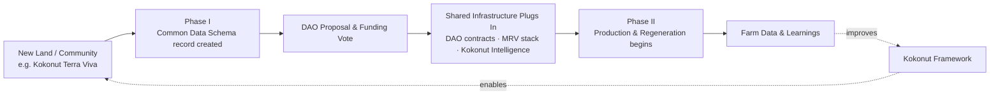

### Kokonut Adelphi (Sabana Grande de Boyá) — the flagship live farm proof

Adelphi is the Kokonut Framework's first live implementation: a 15,725 m² site in Gonzalo, Sabana Grande de Boyá, Monte Plata, converted from underused family land into an active syntropic farm by Yanny and Neury Hernández, funded through Public Nouns Proposal #69.

#### **Success Stories:**

- 96 coconut trees, 560 passion fruit vines, and large-scale lettuce production are active across 13,838 m² of agricultural land.
- 110 free-range hens producing roughly 100 eggs/day, adding a protein/revenue stream beyond the original crop plan.
- 7 direct jobs created in a rural area facing the youth-outmigration pressure, the Problem & Solution page names directly.
- 12\+ native and at-risk species reintroduced through the farm's nursery program, layered into the syntropic design rather than planted as an offset afterthought.
- Primary alignment with 5 SDGs (1, 2, 5, 8, 15), with the farm's own SDG page walking through specific evidence for each rather than a generic checklist (source: [Adelphi SDGs](/ecosystem-wiki/kokonut-farms/adelphi/sustainable-development-goals)).

#### **Lessons Learned:**

- **The capital-to-harvest gap is real and needs a bridge.** The \$45,000 infrastructure budget arrived before any crop revenue existed; the lettuce-as-bridge-crop decision was a direct response to that gap.
- **Organic certification is a process, not a switch.** It's explicitly framed as in progress via the DR Ministry of Agriculture pathway rather than already achieved.
- **Local land-use, water, and market-access pressures shape the design more than the DAO tooling does.** The seven challenges named on the [Adelphi Problem & Solution](/ecosystem-wiki/kokonut-farms/adelphi/problem-and-solution) page are agronomic and socioeconomic, not blockchain problems — a useful reminder that the Web3 layer supports the farm; it doesn't replace good farming.

### Key Takeaways

- Build governance before scaling.
- Standardize data from day one.
- Bridge long-cycle crops with short-cycle revenue.
- Separate governance from impact verification.
- Make proof continuous rather than annual.

### Replication Checklist

To launch a Kokonut-style farm, you'll need:

- Land
- Local operator
- Cooperative agreement
- Multisig wallet
- Baseline MRV
- Crop plan
- Impact metrics
- Governance process
- Treasury
- Reporting cadence
- Funding strategy

**Optional**

- DAO
- Farm registry

### 90-Day Roadmap

1. Week 1–2: Land assessment
2. Week 3–4: DAO proposal
3. Month 2: Infrastructure
4. Month 3: MRV begins
5. Quarter 2: First harvest
6. Year 1: Public dashboard
7. Year 2: Replication

## 🚀 Future Plans & Scaling Potential

### Growth Strategies

- **Geographic replication using the same Framework and schema.** Because the [Common Data Schema](/kokonut-framework/framework-components/common-data-schema) and four-phase process are already generalized rather than Adelphi-specific, a second farm can, in principle, plug into the same DAO/Guild/MRV infrastructure rather than starting over.
- **Chain expansion beyond Gnosis \+ Celo.** The [FAQ](/ecosystem-wiki/faq) lists Base as in development (home of the emerging Agentic Marketplace) and names Arbitrum and Ethereum Mainnet as further roadmap items, alongside Celo's mobile-first orientation as a fit for broader community access.
- **Agentic Marketplace maturation.** ERC-8004-based agent identity/reputation and x402 micropayments are positioned to let AI agents transact directly against farm and Guild work in the future — this is explicitly in development, not live (source: [Build with Kokonut](/build-with-kokonut)).
- **Framework upgrades driven by the Intelligence layer.** Because [Kokonut Intelligence](/kokonut-intelligence) already scores farms across financial, ecological, governance, and growth dimensions, that scoring data is positioned to inform how the Framework itself evolves — e.g., which phase gates or MRV requirements need tightening.

Adelphi's replicability is no longer theoretical: Kokonut has signed an agreement for the adjacent land — roughly 50,000 m², more than three times Adelphi's footprint — to launch **Kokonut Terra Viva**, expected to go live soon. With the land deal secured, Terra Viva sits in Phase I (Planning & Preparation) today, making it the Framework's first real test of moving a second farm through the same four-phase process rather than a hypothetical next step.

## Vision for the Future

Kokonut's own framing describes a long-term shift from a single organization operating farms toward permissionless, replicable farm infrastructure that any aligned community can stand up using the same open tooling — DAO templates, the Common Data Schema, and the Intelligence layer — rather than remaining dependent on Kokonut Network as a central operator.

The Manifesto frames this explicitly around a set of stated freedoms and values for the communities involved, positioning Kokonut less as a company and more as shared infrastructure for regenerative coordination.