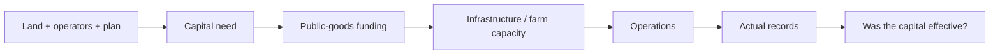
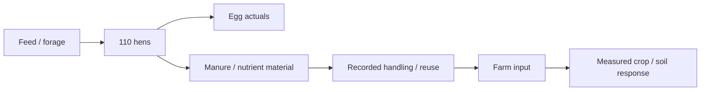
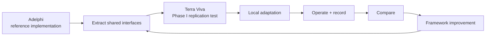
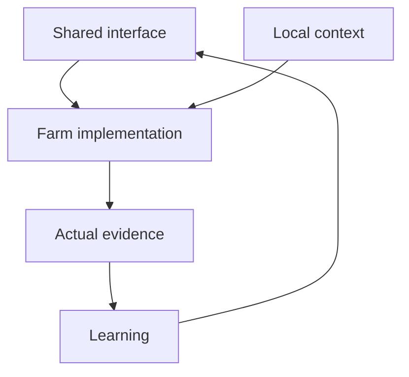

# Case studies should show what happened — not what we hope will happen.

A useful regenerative-finance case study should separate:

- documented state;
- activity;
- measurement;
- forecast;
- reviewed evidence;
- interpretation;
- unresolved questions.

This page therefore treats Kokonut's current farms as **learning cases**, not marketing proof.

> **Adelphi shows that the Kokonut coordination model can be operated in one real farm context. Terra Viva is the next test of whether the shared interfaces remain useful in a second context.**

<CardGroup cols={2}>
  <Card title="Case 1 — Adelphi" icon="seedling" href="#case-1-kokonut-adelphi">
    The first live reference implementation: operations, funding, farm records, evidence, and the gap between forecast and actual.
  </Card>

  <Card title="Case 2 — Terra Viva" icon="map" href="#case-2-kokonut-terra-viva">
    The next replication test: roughly 50,000 m² under agreement entering Phase I — Planning & Preparation.
  </Card>

  <Card title="Cross-case lessons" icon="arrows-rotate" href="#what-the-two-cases-teach-so-far">
    See which ideas appear portable and which still require evidence.
  </Card>

  <Card title="What remains unproven" icon="triangle-exclamation" href="#what-remains-unproven">
    Keep replication, economics, impact, certification, and governance claims inside the evidence.
  </Card>
</CardGroup>

---

# How to read these cases

The same claim discipline used elsewhere in the Framework applies here.

| Claim type | Example | How to read it |
| --- | --- | --- |
| **Documented state** | 15,725 m² mapped at Adelphi | Recorded project/farm attribute |
| **Activity** | Infrastructure built or crops planted | Intervention happened |
| **Measurement / actual** | Harvest quantity, expense, soil value | Recorded observed value |
| **Forecast** | Modeled annual crop revenue | Planning scenario |
| **Attestation / reviewed record** | Published or attested claim | Provenance/review context |
| **Interpretation** | SDG, EBF, CRISP, public-goods analysis | Method applied to evidence |
| **Replication hypothesis** | “This interface should work at another farm” | Still needs testing |

<Warning>
  **Do not compare farms by mixing evidence classes.** A forecast from one farm should not be compared as if it were equivalent to an actual from another.
</Warning>

---

# Case 1 — Kokonut Adelphi

## Why Adelphi matters

Adelphi is Kokonut's first live reference implementation in **Gonzalo, Sabana Grande de Boyá, Monte Plata, Dominican Republic**.

It is useful because several Kokonut components meet in one real operating context:

- local operators;
- land;
- regenerative agriculture;
- infrastructure;
- public-goods funding;
- farm economics;
- operational records;
- MRV;
- Kokonut Intelligence;
- Framework phases;
- reporting;
- governance interfaces.

Adelphi is therefore not simply a farm profile.

It is the first place where the coordination model can be tested against real constraints.

<CardGroup cols={2}>
  <Card title="Adelphi Farm Overview" icon="seedling" href="/ecosystem-wiki/kokonut-farms/adelphi/summary">
    Use the canonical farm page for current documented state, context, Framework phase, and detailed links.
  </Card>

  <Card title="Adelphi Data Hub" icon="chart-line" href="https://hub.kokonut.network/projects/41">
    Use published governed records for changeable operational, harvest, MRV, and project information.
  </Card>
</CardGroup>

---

## Documented reference state

Current public documentation records:

<CardGroup cols={4}>
  <Card title="15,725 m²" icon="map">
    Total mapped site.
  </Card>

  <Card title="13,838 m²" icon="seedling">
    Documented agricultural area.
  </Card>

  <Card title="7 jobs" icon="people-group">
    Jobs supported in the documented implementation.
  </Card>

  <Card title="110 hens" icon="egg">
    Documented free-range laying-hen component.
  </Card>
</CardGroup>

Additional documented farm-system elements include:

- **96 coconut trees** in the current production/forecast model;
- **560 passion-fruit plants** in the current production/forecast model;
- short-cycle vegetable production;
- syntropic plots;
- nursery propagation;
- native / at-risk species work;
- biofactory and biological inputs;
- irrigation and water infrastructure;
- training/community infrastructure;
- geospatial and MRV tooling.

<Note>
  A static case study should not be treated as a live farm dashboard. Current published farm records take precedence when values change.
</Note>

---

## Funding lesson — capital can unlock operations without proving viability

[Public Nouns Proposal #69](https://publicnouns.wtf/vote/69) helped finance critical Adelphi infrastructure.

That establishes an important case-study fact:

> **Public-goods capital helped move the project from land + intention toward an operating farm.**

It does **not** establish that:

- the farm is permanently self-financing;
- the initial budget captured all future operating costs;
- the grant guarantees future revenue;
- the funding source should govern daily farm operations;
- the same funding mechanism will work for another farm.

The stronger lesson is:

```mermaid
flowchart LR
    A["Land + operators + plan"] --> B["Capital need"]
    B --> C["Public-goods funding"]
    C --> D["Infrastructure / farm capacity"]
    D --> E["Operations"]
    E --> F["Actual records"]
    F --> G["Was the capital effective?"]
```

Capital effectiveness is evaluated **after** deployment through the resulting operating evidence.

---

## Economics lesson — forecast is not performance

The current Adelphi crop model forecasts roughly **$149,110.87/year in gross crop revenue** under documented assumptions.

The forecast includes:

| Stream | Current planning basis | Modeled gross revenue |
| --- | --- | ---: |
| **Lettuce** | 48,450 saleable units/harvest × 5 modeled harvests | **$133,237.50** |
| **Passion fruit** | 560 plants under modeled yield/packaging assumptions | **$11,019.61** |
| **Coconut** | 96 trees at modeled productive maturity | **$4,853.76** |
| **Eggs** | ~100 eggs/day estimate from 110 hens | Revenue not included in crop total |

[Read the detailed forecast →](/ecosystem-wiki/kokonut-farms/adelphi/crops-and-harvest-forecast)

<Warning>
  **The $149,110.87 figure is modeled gross crop revenue.** It is not recorded annual revenue, profit, EBITDA, free cash flow, household income, DAO income, or an investment return.
</Warning>

### What Adelphi teaches economically

The case illustrates the need to combine:

- short-cycle production;
- medium-cycle production;
- long-cycle perennial assets;
- continuous production streams;
- patient capital;
- operating reserves;
- actual cost tracking.

The useful question is not:

> “Did the farm hit the model?”

It is:

> **“What did the model get right, what did it get wrong, and how should the next forecast change?”**

---

## Public-goods economics remain unresolved

The repository currently contains two different public-goods allocation models:

- a **10% of modeled gross revenue** assumption in current farm/Framework pages;
- a legacy **40% / 40% / 20%** allocation in older ReFi documentation.

The case study therefore treats the allocation as an **open reconciliation issue**, not a settled success metric.

> **A case study should not turn an unresolved agreement into a headline outcome.**

Future reporting should distinguish:

- approved allocation rule;
- realized revenue;
- amount actually allocated;
- amount transferred;
- amount spent;
- use of funds;
- beneficiary/public-good evidence.

---

## Regenerative-practice lesson — activity is not outcome

Adelphi documents practices aligned with the Framework's regenerative principles.

Examples include:

- reduced-disturbance / syntropic bed management;
- soil cover;
- multi-species systems;
- perennial crops;
- nursery propagation;
- poultry integration;
- on-site biological inputs;
- biomass/nutrient cycling concepts.

These establish **implementation**.

They do not automatically establish:

- improved soil health;
- biodiversity recovery;
- carbon sequestration;
- greater resilience;
- higher profitability.

The evidence path remains:

> **principle → practice → observation → measurement → interpretation**

[Read the 5 Principles →](/kokonut-framework/framework-components/framework-features/5-principles-of-regeneration)

---

## Biodiversity lesson — inventory is the beginning

Adelphi's nursery/agroforestry documentation identifies **12+ native or at-risk species** in the current system.

That is meaningful because it creates:

- inventory;
- propagation activity;
- spatial context;
- survival/condition questions.

It does not by itself establish biodiversity restoration.

A stronger longitudinal case would add:

- survival;
- growth;
- abundance;
- repeat species observations;
- habitat use;
- relevant external conservation status;
- time-series evidence.

> **Species present is not the same claim as biodiversity improved.**

---

## Poultry lesson — integration needs operating evidence

The documented 110-hen component gives Adelphi a useful mixed-system case.

Potential functions include:

- eggs;
- manure;
- nutrient cycling;
- forage;
- diversified production.

The case becomes stronger as the farm can connect:

```mermaid
flowchart LR
    A["Feed / forage"] --> B["110 hens"]
    B --> C["Egg actuals"]
    B --> D["Manure / nutrient material"]
    D --> E["Recorded handling / reuse"]
    E --> F["Farm input"]
    F --> G["Measured crop / soil response"]
```

Without those records, “closed-loop nutrient cycling” remains a design hypothesis rather than a demonstrated farm outcome.

---

## Employment and community lesson — count the activity, then test the outcome

The current public documentation records **7 jobs supported**.

That is an important activity-level social metric.

It does not by itself prove:

- poverty reduction;
- improved household income;
- job quality;
- long-term employment;
- gender equality;
- reduced migration pressure.

Stronger social-impact claims would require evidence appropriate to those questions.

This is why Adelphi's five primary SDG mappings are treated as **evidence-backed interpretations**, not automatic certification.

[Review the Adelphi SDG evidence →](/ecosystem-wiki/kokonut-farms/adelphi/sustainable-development-goals)

---

## Certification lesson — status matters

Current public documentation describes organic certification as **in progress**.

That is the correct status language.

Regenerative practice, syntropic design, biological inputs, MRV, or EAS do not automatically create organic certification.

A case study should preserve the lifecycle:

> **not pursued → preparing → submitted / inspection → certified → renewed / expired / suspended**

rather than collapsing it into:

> “organic farm”

before the applicable process is complete.

---

## Governance lesson — funding authority and farm authority are different

Adelphi makes one of Kokonut's most important governance lessons concrete.

The same project can involve:

- local farm operators;
- land/legal parties;
- public-goods funders;
- Moloch capital governance;
- Guild/domain contributors;
- SAFE execution;
- MRV reviewers;
- technical maintainers.

Those authorities should not be merged.

A capital provider can fund irrigation without deciding the irrigation schedule.

A DAO can approve treasury capital without becoming the agronomist.

A reviewer can verify a record without becoming the landowner.

> **The case demonstrates routed authority more clearly than “decentralized governance.”**

---

## Data lesson — structure improves learning, not truth automatically

Adelphi uses:

- the Common Data Schema;
- Kokonut Intelligence;
- field records;
- remote sensing;
- GPS/geospatial data;
- public Hub records;
- MRV;
- optional EAS provenance.

That allows more of the farm to become inspectable.

The lesson is not:

> “put the farm on-chain.”

The lesson is:

> **capture comparable records early enough that forecasts, funding assumptions, ecological hypotheses, and operating decisions can be tested later.**

---

## What Adelphi currently demonstrates

Adelphi provides evidence that Kokonut can connect, in one farm:

- local operators;
- real agricultural operations;
- public-goods capital;
- Framework phases;
- structured data;
- MRV;
- farm/financial forecasts;
- governed records;
- reporting;
- open technical infrastructure.

That is meaningful.

It is narrower than:

> “Kokonut has proven a universal regenerative-farm model.”

---

## What Adelphi does not prove

<Warning>
  Adelphi does **not** yet prove that:

  - the forecasted crop revenue will be realized consistently;
  - the farm has reached a stable net-profit model;
  - the 10% or legacy 40/40/20 public-goods split is the final binding economic arrangement;
  - regenerative practices have caused every desired ecological outcome;
  - carbon or biodiversity credit eligibility exists;
  - organic certification is complete;
  - seven jobs caused measurable poverty reduction;
  - DAO governance improves every type of farm decision;
  - a second farm will reproduce Adelphi's economics, ecology, or community effects.
</Warning>

That is why a second case matters.

---

# Case 2 — Kokonut Terra Viva

## What is currently documented

Current Kokonut documentation identifies **Kokonut Terra Viva** as:

- roughly **50,000 m²** of adjacent land;
- under agreement;
- a separate farm / replication case;
- entering **Phase I — Planning & Preparation**.

That makes Terra Viva important.

But not because it has already replicated Adelphi.

It matters because it creates the first opportunity to test whether Kokonut's **shared interfaces** remain useful in another implementation.

<Info>
  **Terra Viva is a replication test, not replication proof.**
</Info>

---

## What Phase I should test at Terra Viva

The replication question is not:

> “Can we copy Adelphi onto a larger parcel?”

The better questions are:

### Land and authority

- What exactly is the land/access arrangement?
- Who will operate the farm?
- Which decisions remain local?
- What legal/economic agreements differ from Adelphi?

### Site design

- What are the soil, slope, water, and infrastructure conditions?
- Which crops fit the site?
- Which Adelphi practices should not transfer?

### Economics

- What is the farm-specific budget?
- Which revenue streams are realistic?
- What working capital is required?
- What does the farm need before revenue begins?

### Evidence

- What baseline should exist before intervention?
- Which ecological outcomes are worth measuring?
- What can the operating team realistically collect?

### Governance

- Does the farm need DAO capital?
- Which decisions need shared governance?
- Which should remain entirely local or contractual?

### Technology

- Can the same schema, Intelligence platform, Field Collector, MRV vocabulary, APIs, and reporting patterns be reused?
- What needs to change?

---

## The replication hypothesis

```mermaid
flowchart LR
    A["Adelphi\nreference implementation"]
    B["Extract shared interfaces"]
    C["Terra Viva\nPhase I replication test"]
    D["Local adaptation"]
    E["Operate + record"]
    F["Compare"]
    G["Framework improvement"]

    A --> B
    B --> C
    C --> D
    D --> E
    E --> F
    F --> G
    G --> B
```

The hypothesis is:

> **Framework interfaces, evidence rules, data structures, and coordination patterns can travel farther than Adelphi-specific crops, economics, legal arrangements, or operational choices.**

Terra Viva is where that hypothesis begins to become testable.

---

## What successful replication would look like

Replication should not mean matching Adelphi's numbers.

A stronger test would ask whether Terra Viva can:

- establish its own valid baseline;
- define local authority clearly;
- enter the appropriate Framework phase;
- use compatible records;
- preserve forecast vs. actual;
- use the same evidence vocabulary;
- route capital to the correct authority;
- operate under locally appropriate agronomy;
- use Kokonut Intelligence without duplicating the canonical model;
- produce comparable learning;
- feed improvements back into the Framework.

> **A second farm can be successful precisely because it differs from Adelphi in the right places.**

---

# What the two cases teach so far

## 1. Start with local operators and land reality

Both the Framework and the cases point back to the same foundation:

- land access;
- operator capacity;
- local ecology;
- local economics;
- local relationships.

The stack comes after those questions.

---

## 2. Patient capital and biological time must match

Tree crops, infrastructure, soil work, and market development operate on different timelines.

Financing design should reflect:

- establishment period;
- short-cycle bridge production;
- long-cycle maturity;
- maintenance;
- working capital;
- downside risk.

---

## 3. Forecasts should survive contact with actuals

The value of a forecast is not that it looks compelling.

It is that it gives the farm something explicit to test.

Cross-farm learning becomes more useful when both farms preserve:

- original assumption;
- actual result;
- variance;
- explanation;
- revised assumption.

---

## 4. Regenerative methods need longitudinal evidence

Both farms can use shared regenerative principles.

The evidence should still be local.

A future comparison might ask:

- Did soil cover persist?
- Did plant survival differ?
- Did input dependency change?
- Did production stability improve?
- Which ecological indicators moved?
- Which methods transferred poorly?

---

## 5. Governance should become more specific as the system grows

A second farm increases the cost of vague governance.

It becomes more important to distinguish:

- network capital;
- farm capital;
- farm operator authority;
- legal rights;
- Guild/domain review;
- Framework stewardship;
- MRV review;
- treasury execution.

Replication should make authority **clearer**, not more centralized.

---

## 6. Shared data matters more than shared dashboards

A common dashboard can look consistent while the underlying records mean different things.

The more important replication layer is:

- common semantics;
- stable identifiers;
- lifecycle state;
- source;
- evidence class;
- method;
- privacy;
- review;
- versioning.

> **Interoperable meaning matters more than identical presentation.**

---

# What remains unproven

The current two-case system still needs stronger evidence before making broad claims about:

### Economics

- stable farm-level profitability;
- repeatable margins;
- realized public-goods distributions;
- repeatable financing cost;
- working-capital requirements across farms.

### Ecology

- soil improvement over comparable periods;
- biodiversity change;
- carbon outcomes;
- resilience under stress;
- durability of regenerative outcomes.

### Social outcomes

- income improvement;
- job quality;
- long-term employment;
- food-access effects;
- community-benefit distribution.

### Governance

- whether Moloch/Guild/SAFE coordination improves decisions across multiple farms;
- how conflicts between farm-local and network-level interests are handled;
- which decisions should never be network-governed.

### Replication

- how much of the Framework transfers unchanged;
- which fields/methods require versioning;
- whether operating capacity scales;
- whether new communities can adopt the system without Kokonut acting as central operator.

---

# A case-study evidence template for future farms

Every future Kokonut case study should answer the same core questions.

## Context

- Where is the farm?
- What is the land/access arrangement?
- Who operates it?
- What local problem is being addressed?

## Baseline

- What did the site look like before intervention?
- What was measured?
- What remains unknown?

## Capital

- What capital was required?
- From whom?
- Under what legal/economic terms?
- What was actually received and spent?

## Operations

- What was planted/built/operated?
- Which activities actually occurred?
- Which assumptions changed?

## Economics

- What was forecast?
- What was harvested/sold?
- What costs were incurred?
- What cash-flow constraints emerged?

## Regeneration

- Which principles were implemented?
- What ecological measurements exist?
- Which outcomes remain hypotheses?

## Social value

- What jobs, training, food, or public goods were delivered?
- What stronger social claims still need evidence?

## Governance

- Which decisions were local?
- Which required shared governance?
- Which execution paths were used?

## Data / MRV

- Which source records exist?
- What was reviewed?
- What was published?
- What was attested?
- What remained private?

## Learning

- What failed?
- What changed?
- What should the next farm do differently?

---

# Replace the fixed 90-day roadmap with readiness gates

The previous case-study page included a generic 90-day roadmap.

That creates false precision.

Farm development is better gated by evidence.

| Gate | Readiness question |
| --- | --- |
| **Site** | Do we understand the land, water, operator, legal basis, and constraints? |
| **Plan** | Is the farm design, budget, risk, and market hypothesis reviewable? |
| **Capital** | Is the funding source characterized and authorized? |
| **Operations** | Can the operator execute the approved scope? |
| **Records** | Can actual activity, cost, and evidence be captured? |
| **Phase transition** | Has the farm-specific trigger been satisfied? |
| **Expansion** | Do multi-cycle actuals justify additional scale? |
| **Replication** | Which interfaces worked in another context? |

> **Readiness should trigger the next step. A calendar should not manufacture readiness.**

---

# What should replicate

### Designed to be reusable

- Common Data Schema baseline;
- four-phase Framework;
- evidence vocabulary;
- forecast-vs-actual discipline;
- governed record lifecycle;
- Kokonut Intelligence interfaces;
- MRV structure;
- agent safety rules;
- optional attestation patterns;
- authority-routing principles;
- case-study evidence template.

### Designed to adapt

- farm size;
- crops;
- planting design;
- water system;
- infrastructure;
- operating entity;
- land agreement;
- labor model;
- market channels;
- financing;
- public-goods arrangement;
- certification;
- ecological methods;
- governance scope.

```mermaid
flowchart TD
    SHARED["Shared interface"]
    LOCAL["Local context"]
    FARM["Farm implementation"]
    ACTUAL["Actual evidence"]
    LEARN["Learning"]

    SHARED --> FARM
    LOCAL --> FARM
    FARM --> ACTUAL
    ACTUAL --> LEARN
    LEARN --> SHARED
```

---

# Current case-study maturity

| Case / question | Current status | Safe interpretation |
| --- | --- | --- |
| **Adelphi operating farm** | Documented live reference implementation | First real farm context |
| **Adelphi Framework phase** | Phase II — Production & Regeneration | Active implementation; not final maturity |
| **Adelphi farm-system elements** | Documented | Shows implementation, not all desired outcomes |
| **Adelphi crop economics** | Forecast + evolving actuals | Planning model requires reconciliation |
| **Adelphi public-goods allocation** | Conflicting documented assumptions | Not settled here |
| **Adelphi organic certification** | In progress | Do not claim certified |
| **Adelphi ecological outcomes** | Mixed evidence maturity | Practice ≠ measured impact |
| **Terra Viva land** | ~50,000 m² under agreement | New context exists |
| **Terra Viva Framework phase** | Entering Phase I | Planning/readiness stage |
| **Terra Viva farm outcomes** | Not yet established | Do not infer from Adelphi |
| **Multi-farm replication** | Being tested | Not yet proven |
| **Universal business model** | Not established | Economics remain farm-specific |

---

# Case-study quality gate

Before calling something a “success story,” ask:

- [ ] Is the claim an actual rather than a forecast?
- [ ] Is the reporting period clear?
- [ ] Is the source identifiable?
- [ ] Is the evidence class clear?
- [ ] Is the farm boundary clear?
- [ ] Is the activity separated from the outcome?
- [ ] Are costs separated from gross revenue?
- [ ] Is certification status precise?
- [ ] Are public-goods distributions actual rather than modeled?
- [ ] Are jobs separated from broader livelihood claims?
- [ ] Are remote-sensing signals separated from ecological conclusions?
- [ ] Are governance decisions separated from execution?
- [ ] Are failures and revisions included?
- [ ] Is local context visible?
- [ ] Does the lesson explain what may not transfer?
- [ ] Would another farm know what evidence to collect to test the lesson?

> **A credible case study includes what did not work, what remains unknown, and what would falsify the current interpretation.**

---

## Continue through the playbook

<CardGroup cols={2}>
  <Card title="Adelphi Farm Overview" icon="seedling" href="/ecosystem-wiki/kokonut-farms/adelphi/summary">
    Inspect the canonical first-farm reference and current published-data links.
  </Card>

  <Card title="How It Works" icon="gears" href="/playbooks/regenerative-finance/how-it-works">
    See the operating loops behind farm phases, capital, records, review, decisions, and learning.
  </Card>

  <Card title="Business Model & Legal" icon="file-contract" href="/playbooks/regenerative-finance/business-model-and-legal">
    Review forecast, cost, cash flow, capital, agreements, public-goods economics, and legal boundaries.
  </Card>

  <Card title="Regenerative & Technical Alignment" icon="leaf" href="/playbooks/regenerative-finance/regenerative-and-technical-alignment">
    Keep practice, evidence, technical infrastructure, and external standards aligned without collapsing their meaning.
  </Card>

  <Card title="MRV Methodology" icon="magnifying-glass-chart" href="/ecosystem-wiki/kokonut-farms/measurement-reporting-and-verification">
    Use the evidence model behind every case-study claim.
  </Card>

  <Card title="Kokonut Framework" icon="scroll" href="/kokonut-framework/Introduction">
    See which interfaces are intentionally shared across farms and which decisions remain local.
  </Card>
</CardGroup>

> **The point of a case study is not to prove the model once. It is to make the next implementation better at proving or disproving what the previous one taught us.**
