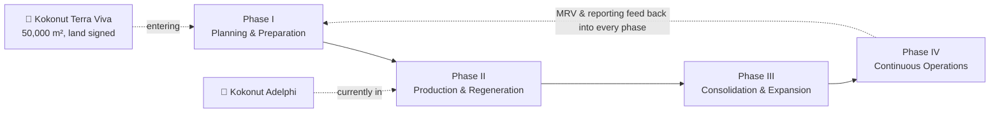
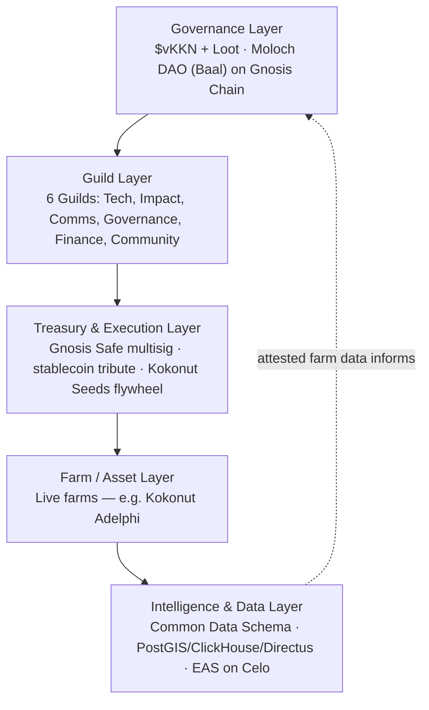
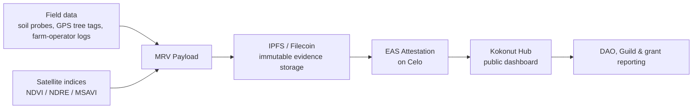
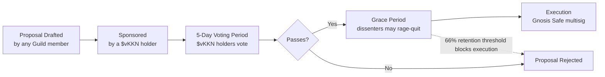

## Implementation Process

The Kokonut Framework organizes farm development into four phases. Phase IV (Continuous Operations) isn't a "final" phase so much as an ongoing layer that runs underneath the other three from the point data collection starts:

- **[Phase I — Planning & Preparation](/kokonut-framework/development-phases/phase-i):** site assessment, baseline data capture, syntropic planting design, DAO proposal drafting and community funding vote.
- **[Phase II — Production & Regeneration](/kokonut-framework/development-phases/phase-ii):** active planting, infrastructure build-out, first harvests, and the start of continuous MRV data capture — **this is where Kokonut Adelphi is today**.
- **[Phase III — Consolidation & Expansion](/kokonut-framework/development-phases/phase-iii):** scaling production, formalizing market/sales channels, and preparing the farm's data and track record for replication or follow-on funding.
- **[Phase IV — Continuous Operations](/kokonut-framework/development-phases/phase-iv):** steady-state farming with ongoing MRV, reporting, and reinvestment — feeding data back into governance and into the next farm's Phase I planning.

## Technology Solutions Used

| Layer | Technology | Status |
| --- | --- | --- |
| DAO governance & treasury | Moloch DAO (Baal framework) on **Gnosis Chain**; \$vKKN (non-transferable governance shares) \+ Loot (transferable economic rights); Gnosis Safe multisig treasury | Live |
| Data standardization | Common Data Schema — a 13-field shared record structure so every farm reports data the same way | Live |
| MRV / field verification | Soil probes, satellite vegetation indices (NDVI/NDRE/MSAVI via Landsat 8/Sentinel), GPS-tagged tree tracking, mobile field logging, IPFS/Filecoin for immutable evidence storage | Live |
| Attestation | Ethereum Attestation Service (EAS) deployed on **Celo** for farm-data attestations, kept separate from Gnosis Chain governance | Live |
| Intelligence/analytics | Kokonut Intelligence — PostgreSQL/PostGIS (spatial), ClickHouse (time-series analytics), Directus (data management), Python-based scoring agents | Live, open-source |
| Agent access | Multi-agent AI ecosystem with MCP-based access to farm data for scoring, forecasting, and decision support | Live/developing, open-source |
| Agentic commerce (roadmap) | Agentic Marketplace, using ERC-8004 agent identity/reputation and x402 micropayments | In development |

#### **MRV pipeline, visually:**

[Kokonut Intelligence](/kokonut-intelligence) layers a scoring system on top of this pipeline: a **Fortune 500 Farm Score** weights Financial performance (45%), Ecological outcomes (25%), Governance health (15%), and Growth trajectory (15%) into a single composite score, with tiers from Developing up through Bronze, Silver, Gold, and Platinum (800\+).

It also runs Monte Carlo simulations for revenue forecasting and a Shannon diversity index for biodiversity scoring, and ships with a "Revenue Multiplier Opportunity Map" across 10 dimensions to surface where a given farm's income could grow.

Worth flagging for accuracy: the open-source repo's seed/demo dataset uses a fictitious "Kokonut Adelphi Demo Farm", purely to test the platform.

## Roles & Responsibilities

- **[DAO members](/ecosystem-wiki/the-kokonut-dao/dao-layers) (\$vKKN holders):** vote on proposals, hold non-transferable governance shares, and can rage-quit (exit with their proportional treasury share) if they disagree with a passed decision they didn't support.
- **[Guilds](/ecosystem-wiki/the-kokonut-dao/kokonut-guilds-dao) (Technology, Impact, Communications, Governance, Finance, Community & Partnerships)** own specific domains of ongoing work; contributors progress through Contributor → Member → Steward → Emeritus tiers based on accumulated contribution.
- **Farm operators:** run day-to-day operations on the ground — at Adelphi, this is the Hernández family — and receive 40% of farm revenue in recognition of that operating role.
- **Community leaders / Stewards:** senior Guild members who mentor newer contributors and hold more governance weight in their domain as they accumulate track record.

## Tips & Best Practices

- **Separate forecasts from actuals, explicitly.** Every revenue and impact figure in Kokonut's own documentation is labeled as a forecast until harvested/measured — worth carrying into any pitch or grant application so funders aren't misled about what's realized vs. projected.
- **Use a short-cycle crop to bridge long-cycle ones.** Coconut takes years to mature; lettuce doesn't. Pairing them is what keeps the farm's cash flow alive during the wait.
- **Don't let governance tokens double as your treasury's volatility risk.** Kokonut's stablecoin-tribute design is a direct response to this common DAO failure mode.
- **Build the data schema before you need to compare two farms.** The Common Data Schema exists precisely so that a second farm's data is comparable to Adelphi's from day one, instead of requiring a retroactive cleanup.
- **Don't claim infrastructure is "live" before it's deployed.** The docs are careful to separate what's live (Gnosis DAO, Celo attestations) from what's in development (the Ethereum-based Agentic Marketplace) — a discipline worth keeping in any external-facing version of this playbook.