# Kokonut works as a set of connected loops — not one command chain.

A Kokonut-style implementation does not begin with a DAO vote or end with an on-chain attestation.

It begins with a real local opportunity:

- land or an operating right;
- accountable operators;
- an agricultural and community context;
- a production hypothesis;
- an economic arrangement;
- evidence that can be collected sustainably.

From there, shared infrastructure helps different actors coordinate without giving one layer authority over everything.

> **The operating pattern is: establish context → authorize what needs authorization → execute locally → record what happened → review the evidence → make the next decision.**

<CardGroup cols={2}>
  <Card title="Follow the farm lifecycle" icon="seedling" href="#the-farm-lifecycle">
    See how the four Framework phases interact and why Phase IV runs continuously.
  </Card>

  <Card title="Follow a funded decision" icon="coins" href="#when-shared-capital-is-needed">
    Separate farm need, evidence, governance authorization, SAFE execution, and accounting.
  </Card>

  <Card title="Follow a record" icon="database" href="#how-a-record-moves">
    Trace field or financial activity through Kokonut Intelligence, review, publication, and optional provenance.
  </Card>

  <Card title="See who decides what" icon="people-arrows" href="#authority-is-routed-not-centralized">
    Keep operators, governance, reviewers, maintainers, and technical systems in their proper domains.
  </Card>
</CardGroup>

---

## The whole system in one view

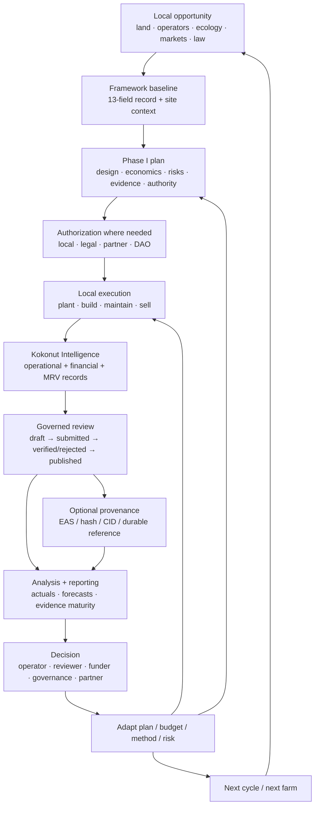
```mermaid
flowchart TD
    LOCAL["Local opportunity\nland · operators · ecology · markets · law"]
    BASELINE["Framework baseline\n13-field record + site context"]
    PLAN["Phase I plan\ndesign · economics · risks · evidence · authority"]
    AUTH["Authorization where needed\nlocal · legal · partner · DAO"]
    EXEC["Local execution\nplant · build · maintain · sell"]
    RECORD["Kokonut Intelligence\noperational + financial + MRV records"]
    REVIEW["Governed review\ndraft → submitted → verified/rejected → published"]
    PROV["Optional provenance\nEAS / hash / CID / durable reference"]
    ANALYSIS["Analysis + reporting\nactuals · forecasts · evidence maturity"]
    DECIDE["Decision\noperator · reviewer · funder · governance · partner"]
    LEARN["Adapt plan / budget / method / risk"]
    REPLICATE["Next cycle / next farm"]

    LOCAL --> BASELINE
    BASELINE --> PLAN
    PLAN --> AUTH
    AUTH --> EXEC
    EXEC --> RECORD
    RECORD --> REVIEW
    REVIEW --> ANALYSIS
    REVIEW --> PROV
    PROV --> ANALYSIS
    ANALYSIS --> DECIDE
    DECIDE --> LEARN
    LEARN --> EXEC
    LEARN --> PLAN
    LEARN --> REPLICATE
    REPLICATE --> LOCAL
```

Several branches are optional.

A farm may not need:

- Moloch capital;
- public attestations;
- AI agents;
- Marketplace services;
- a token;
- IoT sensors.

The required question is not:

> “Did we use the whole Kokonut stack?”

It is:

> **“Did the project use the right authority, records, evidence, and feedback loop for the decision?”**

---

# The farm lifecycle

## Four phases — three development stages plus one continuous function

The [Kokonut Framework](/kokonut-framework/Introduction) organizes farm development into:

1. **Phase I — Planning & Preparation**
2. **Phase II — Production & Regeneration**
3. **Phase III — Consolidation & Expansion**
4. **Phase IV — Continuous Operations**

Phase IV is different from the first three.

It begins with the first useful baseline and runs **across the full lifecycle**.

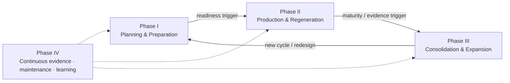
```mermaid
flowchart LR
    P1["Phase I\nPlanning & Preparation"]
    P2["Phase II\nProduction & Regeneration"]
    P3["Phase III\nConsolidation & Expansion"]

    P1 -->|"readiness trigger"| P2
    P2 -->|"maturity / evidence trigger"| P3
    P3 -->|"new cycle / redesign"| P1

    P4["Phase IV\nContinuous evidence · maintenance · learning"]

    P4 -.-> P1
    P4 -.-> P2
    P4 -.-> P3
```

<Info>
  **Phase transitions are evidence-based, not calendar-based.** A farm moves when its farm-specific readiness conditions are satisfied and accepted by the authority responsible for that transition.
</Info>

---

## Phase I — make the opportunity reviewable

[Phase I](/kokonut-framework/development-phases/phase-i) turns a site or project opportunity into an implementation plan.

It should establish:

- land / operating basis;
- local operator responsibility;
- Common Data Schema baseline;
- site diagnosis;
- farm / production design;
- infrastructure needs;
- market hypothesis;
- budget;
- funding route;
- evidence plan;
- risk register;
- authority map;
- Phase II trigger.

### What Phase I does not imply

Completing Phase I does **not** mean:

- the farm is automatically fundable;
- a DAO must vote;
- land rights have been legally verified by the Framework;
- crops are agronomically guaranteed;
- buyers exist;
- impact is proven;
- the farm is ready for certification.

> **Phase I produces a reviewable plan, not a guarantee.**

---

## Phase II — replace assumptions with actuals

[Phase II](/kokonut-framework/development-phases/phase-ii) is where sustained production and regenerative practice meet field reality.

The operating loop is:

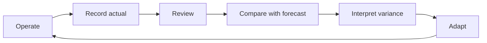
```mermaid
flowchart LR
    A["Operate"] --> B["Record actual"]
    B --> C["Review"]
    C --> D["Compare with forecast"]
    D --> E["Interpret variance"]
    E --> F["Adapt"]
    F --> A
```

Phase II should increasingly replace:

- planned planting → actual planting;
- modeled loss → actual loss;
- target buyer → actual buyer;
- planning price → realized price;
- forecast harvest → harvest actual;
- planned expense → actual expense;
- regenerative-practice intention → documented implementation;
- outcome hypothesis → measured evidence.

<Warning>
  **Phase II is not “the plan being proven correct.”** It is where the plan becomes testable and can be shown to be wrong.
</Warning>

---

## Phase III — consolidate what actually works

[Phase III](/kokonut-framework/development-phases/phase-iii) focuses on durability and bounded expansion.

Depending on the farm, that can include:

- stronger market channels;
- traceability;
- certification readiness;
- maintenance systems;
- operator redundancy;
- process documentation;
- better budgeting;
- renewal plans;
- evidence-backed expansion;
- additional capital proposals;
- new farm onboarding.

The key question is:

> **Which capabilities are strong enough to depend on?**

A farm should not scale a weak process merely because the first implementation exists.

---

## Phase IV — keep evidence and operations current

[Phase IV](/kokonut-framework/development-phases/phase-iv) is the continuous operating function.

It keeps track of:

- activity;
- harvests;
- sales;
- expenses;
- maintenance;
- risks;
- training;
- measurements;
- forecast error;
- evidence freshness;
- publication;
- claims;
- decisions.

Phase IV matters because a “verified” record can still become stale.

A published dashboard can still be wrong for the current period.

A five-year-old claim can be less decision-useful than a recent, comparable measurement.

> **Elapsed time does not create evidence quality. Governed comparable records do.**

---

# Authority is routed, not centralized

Kokonut uses different authorities for different decisions.

| Decision domain | Primary authority | Supporting systems |
| --- | --- | --- |
| **Farm operations** | Local operator / responsible farm team | Framework, Intelligence, evidence, partners |
| **Land / legal rights** | Relevant legal parties and executed agreements | Entity records, title/lease/use documents |
| **Shared DAO capital** | Moloch governance where applicable | Proposals, evidence, treasury data |
| **Treasury execution** | Authorized SAFE / execution path | Approved instruction, audit trail |
| **Contribution work** | Guild/domain process | Contribution records, task systems |
| **Framework methodology** | Framework maintainers + affected reviewers | Docs, evidence, compatibility review |
| **MRV record review** | Authorized reviewer / workflow | Kokonut Intelligence |
| **Scientific / regulated verification** | Qualified external method / verifier where required | Evidence packages, published records |
| **Technical implementation** | Maintainers / deployment authority | Code review, CI, timelocks, manifests |
| **Marketplace delivery** | Marketplace requester/evaluator/dispute process | Marketplace contracts / service records |

One decision can touch several rows.

Example:

> A farm needs a new irrigation pump.

That can involve:

- **operator:** defines operational need;
- **Finance/Impact reviewer:** checks budget/evidence if required;
- **Moloch:** authorizes DAO capital if DAO funds are requested;
- **SAFE signers:** execute the approved transaction;
- **farm/entity:** receives or purchases the asset;
- **Kokonut Intelligence:** records expense, installation, maintenance, and milestone evidence.

No one layer needs to become the authority over all five.

---

# When shared capital is needed

Not every farm activity requires a DAO proposal.

Use formal shared-capital governance when the decision actually falls within shared treasury authority.

## Capital path

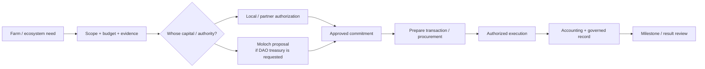
```mermaid
flowchart LR
    NEED["Farm / ecosystem need"]
    SCOPE["Scope + budget + evidence"]
    ROUTE{"Whose capital / authority?"}

    LOCAL["Local / partner authorization"]
    DAO["Moloch proposal\nif DAO treasury is requested"]

    APPROVED["Approved commitment"]
    PREP["Prepare transaction / procurement"]
    EXEC["Authorized execution"]
    ACCOUNT["Accounting + governed record"]
    REVIEW["Milestone / result review"]

    NEED --> SCOPE
    SCOPE --> ROUTE
    ROUTE --> LOCAL
    ROUTE --> DAO
    LOCAL --> APPROVED
    DAO --> APPROVED
    APPROVED --> PREP
    PREP --> EXEC
    EXEC --> ACCOUNT
    ACCOUNT --> REVIEW
```

### Proposal is not execution

A passed governance decision and an executed payment are different events.

A technical system or agent may:

- draft a proposal;
- prepare transaction data;
- prepare SAFE calldata;
- calculate a budget;
- assemble supporting evidence.

That does not mean it can:

- vote as a member;
- sign as a SAFE owner;
- move funds;
- approve its own evidence;
- bypass a timelock or authorization rule.

> **prepare → authorize → execute → reconcile**

is the safer pattern.

---

## Capital state should remain visible

A funding line should distinguish:

| State | Meaning |
| --- | --- |
| **Proposed** | Requested but not approved |
| **Approved** | Authority accepted the commitment |
| **Committed** | Funds/resources reserved or contractually committed |
| **Received** | Recipient obtained the capital |
| **Spent** | Capital was actually used |
| **Reconciled** | Spend/result matched against budget, invoice, evidence, or milestone |
| **Closed / returned** | Obligation completed, returned, or otherwise closed |

The Common Data Schema's `source_of_funding` field should not be used to erase these distinctions.

---

# How farm operations work

Once execution is authorized, local operations remain local.

Typical operating work can include:

- planting;
- irrigation;
- nursery work;
- biological inputs;
- poultry;
- pruning;
- pest/disease response;
- harvesting;
- maintenance;
- purchasing;
- logistics;
- buyer coordination;
- labor;
- field-data collection.

The Framework provides shared structure.

It does not dictate a universal daily operating procedure.

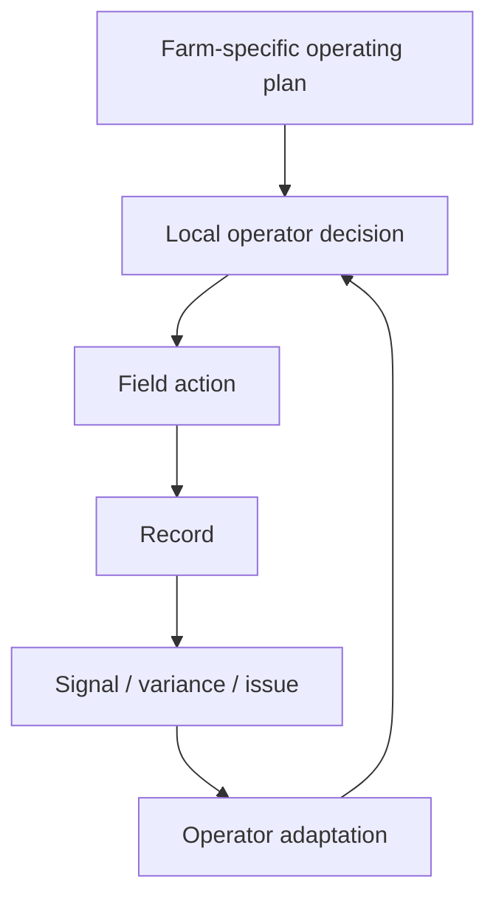
```mermaid
flowchart TD
    PLAN["Farm-specific operating plan"]
    OP["Local operator decision"]
    ACT["Field action"]
    REC["Record"]
    SIGNAL["Signal / variance / issue"]
    ADAPT["Operator adaptation"]

    PLAN --> OP
    OP --> ACT
    ACT --> REC
    REC --> SIGNAL
    SIGNAL --> ADAPT
    ADAPT --> OP
```

### Examples of decisions that normally stay local

- when to irrigate;
- when to harvest;
- whether a plant is diseased;
- how to sequence field labor;
- whether weather requires changing a task;
- whether an input should be applied under the approved farm method;
- when infrastructure needs immediate maintenance.

A token vote should not be required to respond to a leaking irrigation line.

---

# How a record moves

Kokonut Intelligence is the governed implementation layer for operational, financial, evidence, analytical, and reporting records.

The durable lifecycle is:

> **source → structured record → review → publication when appropriate → optional provenance → interpretation**

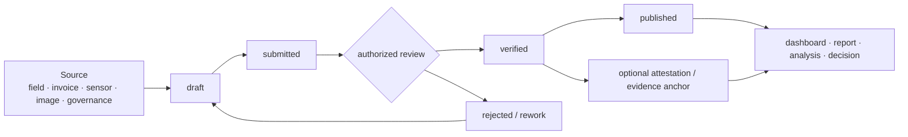
```mermaid
flowchart LR
    SRC["Source\nfield · invoice · sensor · image · governance"]
    DRAFT["draft"]
    SUB["submitted"]
    DEC{"authorized review"}
    VERIFIED["verified"]
    REJECT["rejected / rework"]
    PUB["published"]
    ATT["optional attestation / evidence anchor"]
    USE["dashboard · report · analysis · decision"]

    SRC --> DRAFT
    DRAFT --> SUB
    SUB --> DEC
    DEC --> VERIFIED
    DEC --> REJECT
    REJECT --> DRAFT
    VERIFIED --> PUB
    VERIFIED --> ATT
    PUB --> USE
    ATT --> USE
```

<Warning>
  **Verified is an internal workflow state.** It does not automatically mean externally audited, scientifically validated, legally approved, organically certified, carbon verified, or regulator approved.
</Warning>

---

## The source can be offline

Kokonut Intelligence includes an offline-first Field Collector.

A field worker can create a record when connectivity is poor and synchronize later.

That changes the timing of ingestion.

It does **not** change the review rules.

```text
offline capture
→ sync
→ governed record
→ review
→ publication if appropriate
```

Offline capability should make field work more resilient.

It should not create a second ungoverned source of truth.

---

## The source can be automated

Records can also originate from:

- APIs;
- MQTT / sensor ingestion;
- scheduled integrations;
- chain indexers;
- imports;
- analytical jobs;
- agent drafts.

Automated origin does not imply higher confidence.

Each record still needs the appropriate:

- source metadata;
- method;
- units;
- scope;
- lifecycle state;
- permissions;
- review rule.

---

# How MRV works

MRV should not be represented as one mandatory:

> field → IPFS → EAS → dashboard

pipeline.

The actual evidence sequence is:

> **observe → structure → review → publish → attest when useful → interpret**

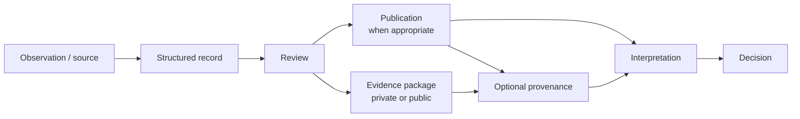
```mermaid
flowchart LR
    OBS["Observation / source"]
    STRUCT["Structured record"]
    REV["Review"]
    PUB["Publication\nwhen appropriate"]
    EVID["Evidence package\nprivate or public"]
    ATT["Optional provenance"]
    INTERP["Interpretation"]
    DEC["Decision"]

    OBS --> STRUCT
    STRUCT --> REV
    REV --> PUB
    REV --> EVID
    PUB --> ATT
    EVID --> ATT
    PUB --> INTERP
    ATT --> INTERP
    INTERP --> DEC
```

### Different evidence answers different questions

| Evidence | Can help answer | Does not automatically prove |
| --- | --- | --- |
| Field note | What an operator observed | Objective outcome |
| Soil measurement | Value under a defined method | Whole-farm regeneration |
| Harvest record | What was harvested | Profit |
| Invoice/payment | What was sold/paid | Ecological impact |
| NDVI / remote index | Vegetation-related signal | Carbon, biodiversity, yield |
| EAS attestation | Provenance / attestor / timing | Scientific truth |
| Framework scorecard | Method-specific interpretation | Certification |
| External verification | Defined claim under a specific method | Every other claim about the farm |

> **The evidence class should travel with the claim.**

---

# How public provenance works

Celo EAS can be used when public provenance adds real value.

Examples can include:

- evidence references;
- reviewed claim metadata;
- verifier/reviewer statements;
- important milestones;
- selected farm events.

Not every observation needs an attestation.

Not every evidence file should be public.

The public record may contain:

- a claim identifier;
- farm/project identifier;
- attestor;
- timestamp;
- schema/type;
- evidence hash/reference;
- revocation/supersession state.

Detailed source evidence can remain access-controlled.

[Read the MRV methodology →](/ecosystem-wiki/kokonut-farms/measurement-reporting-and-verification)

---

# How Kokonut Intelligence creates decision support

Once governed records exist, Kokonut Intelligence can support:

- farm analytics;
- financial analysis;
- forecast-vs-actual;
- ecological indicators;
- geospatial analysis;
- anomaly detection;
- process intelligence;
- systems-thinking analysis;
- risk;
- reporting;
- partner views;
- strategy;
- agent workflows.

A computed output should retain:

- input period;
- source records;
- method/version;
- assumptions;
- evidence maturity;
- uncertainty;
- publication status.

### There is no universal Kokonut “truth score”

The platform can contain:

- farm/performance models;
- EBF scorecards;
- CRISP analysis;
- readiness indicators;
- forecasts;
- anomalies;
- risk models.

Those are **method-specific decision tools**.

They should not be collapsed into one universal impact or quality score.

> **A score can organize a decision. It cannot replace the evidence beneath the decision.**

---

# How agents work

Internal Kokonut Intelligence agents operate inside governed data and permission boundaries.

They can help:

- identify evidence gaps;
- compare forecasts and actuals;
- draft reports;
- summarize records;
- prepare proposals;
- validate structure;
- route work.

They cannot independently:

- verify;
- publish;
- attest;
- certify;
- approve financial records;
- execute treasury actions;
- override farm operators.

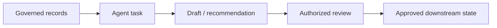
```mermaid
flowchart LR
    DATA["Governed records"]
    AGENT["Agent task"]
    DRAFT["Draft / recommendation"]
    HUMAN["Authorized review"]
    OUT["Approved downstream state"]

    DATA --> AGENT
    AGENT --> DRAFT
    DRAFT --> HUMAN
    HUMAN --> OUT
```

[Read Kokonut × AI Agents →](/kokonut-x-ai-agents)

---

# How the Marketplace fits

The [Kokonut Marketplace](https://git.kokonut.network/Kokonut-Marketplace/~files) is a separate service-commerce layer.

It can coordinate concepts such as:

- agent/service identity;
- capabilities;
- job requests;
- provider discovery;
- payment;
- escrow;
- evaluation;
- disputes;
- reputation.

A marketplace deliverable may feed Kokonut review.

It does not become a verified farm record merely because:

- a job was paid;
- a requester accepted it;
- an evaluator scored it;
- the provider has high reputation.

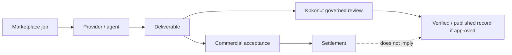
```mermaid
flowchart LR
    JOB["Marketplace job"]
    PROVIDER["Provider / agent"]
    DELIVERY["Deliverable"]
    ACCEPT["Commercial acceptance"]
    PAY["Settlement"]

    REVIEW["Kokonut governed review"]
    RECORD["Verified / published record if approved"]

    JOB --> PROVIDER
    PROVIDER --> DELIVERY
    DELIVERY --> ACCEPT
    ACCEPT --> PAY

    DELIVERY --> REVIEW
    REVIEW --> RECORD

    PAY -. "does not imply" .-> RECORD
```

> **Commerce state and evidence state are different systems.**

---

# How Guilds fit

Guilds coordinate contribution work by domain.

Current domains include:

- Technology;
- Impact;
- Communications;
- Governance;
- Finance;
- Community & Partnerships.

A Guild can help:

- define work;
- review contribution;
- prepare proposals;
- build domain expertise;
- surface evidence;
- recommend standards.

A Guild does not automatically gain:

- DAO treasury authority;
- farm operating authority;
- land rights;
- external certification authority.

### Contribution flow

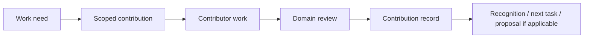
```mermaid
flowchart LR
    NEED["Work need"] --> TASK["Scoped contribution"]
    TASK --> WORK["Contributor work"]
    WORK --> REVIEW["Domain review"]
    REVIEW --> REC["Contribution record"]
    REC --> NEXT["Recognition / next task / proposal if applicable"]
```

The contribution system should reward useful work without pretending every useful contributor must become a capital-governance voter.

---

# How SAFE execution fits

A SAFE is an execution surface.

It should not be described as the place where policy originates.

A robust pattern is:

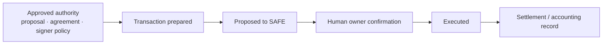
```mermaid
flowchart LR
    AUTH["Approved authority\nproposal · agreement · signer policy"]
    PREP["Transaction prepared"]
    PROPOSE["Proposed to SAFE"]
    SIGN["Human owner confirmation"]
    EXEC["Executed"]
    REC["Settlement / accounting record"]

    AUTH --> PREP
    PREP --> PROPOSE
    PROPOSE --> SIGN
    SIGN --> EXEC
    EXEC --> REC
```

The current Kokonut Intelligence architecture includes propose-only automation patterns where server-held credentials can prepare/propose without becoming SAFE owners.

That separation should remain explicit in UI and documentation.

> **Proposed transaction ≠ signed transaction ≠ executed transaction.**

---

# How reporting works

Reports should be generated from governed records, not from memory or permanently copied numbers.

A reporting workflow can look like:

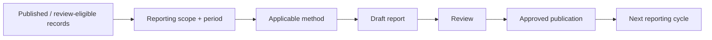
```mermaid
flowchart LR
    DATA["Published / review-eligible records"]
    SCOPE["Reporting scope + period"]
    METHOD["Applicable method"]
    DRAFT["Draft report"]
    REVIEW["Review"]
    RELEASE["Approved publication"]
    NEXT["Next reporting cycle"]

    DATA --> SCOPE
    SCOPE --> METHOD
    METHOD --> DRAFT
    DRAFT --> REVIEW
    REVIEW --> RELEASE
    RELEASE --> NEXT
```

A report should make it possible to distinguish:

- period;
- farm boundary;
- forecast vs. actual;
- evidence class;
- method;
- gaps;
- uncertainty;
- reviewer;
- publication date.

An annual report is useful when annual reporting fits the stakeholder or method.

It is not a universal Phase IV requirement.

---

# How financial learning works

The farm's financial loop should be integrated with its operating loop.

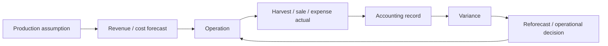
```mermaid
flowchart LR
    A["Production assumption"] --> B["Revenue / cost forecast"]
    B --> C["Operation"]
    C --> D["Harvest / sale / expense actual"]
    D --> E["Accounting record"]
    E --> F["Variance"]
    F --> G["Reforecast / operational decision"]
    G --> C
```

Important boundaries:

- crop forecast ≠ sale;
- sale ≠ payment;
- payment ≠ profit;
- gross revenue ≠ distributable cash;
- DAO grant ≠ farm revenue;
- public-goods scenario ≠ executed distribution.

[Read Business Model & Legal →](/playbooks/regenerative-finance/business-model-and-legal)

---

# How risk flows through the system

Risk should not live only in the initial proposal.

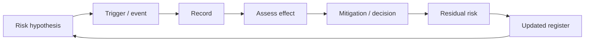
```mermaid
flowchart LR
    A["Risk hypothesis"] --> B["Trigger / event"]
    B --> C["Record"]
    C --> D["Assess effect"]
    D --> E["Mitigation / decision"]
    E --> F["Residual risk"]
    F --> G["Updated register"]
    G --> A
```

Risks can include:

- water;
- weather;
- crop loss;
- disease;
- buyer concentration;
- price;
- labor;
- key-person dependence;
- land/legal changes;
- privacy;
- data quality;
- funding delays;
- infrastructure failure;
- governance disagreement;
- smart-contract or key-management risk.

A risk model that never changes after real events is not part of operations.

---

# Failure and rework are normal states

A real implementation needs explicit paths for things not going as planned.

| Failure / deviation | Appropriate response |
| --- | --- |
| Phase I evidence is insufficient | Keep planning; do not force transition |
| Funding proposal fails | Revise scope, use another capital source, or pause |
| Infrastructure milestone fails | Record variance; correct before acceptance |
| Crop underperforms | Preserve actual; investigate cause; revise forecast |
| Buyer does not materialize | Update market state; change channel assumption |
| Record is rejected | Correct or add evidence; preserve review history |
| Sensor fails | Mark data gap; do not fabricate continuity |
| Agent output is weak | Reject/rework; do not publish because task “completed” |
| Attestation is wrong/stale | Revoke/supersede where applicable; preserve history |
| DAO approves but execution fails | Keep governance and execution states separate |
| Land/operator arrangement changes | Re-open relevant Phase I assumptions |
| Legal/compliance requirement changes | Update operating process and evidence requirements |

> **A trustworthy system makes failure visible enough to learn from it.**

---

# What is actually shared across farms

The purpose of Kokonut is not to make farms identical.

### Shared interfaces

These can be reused:

- Common Data Schema;
- phase logic;
- evidence vocabulary;
- governed record lifecycle;
- forecast-vs-actual pattern;
- authority-routing principles;
- MRV methodology;
- Kokonut Intelligence interfaces;
- reporting patterns;
- agent safety rules;
- contribution patterns;
- optional attestation patterns.

### Local decisions

These should remain farm-specific:

- land arrangement;
- operators;
- crop mix;
- water strategy;
- infrastructure;
- labor;
- markets;
- economic agreement;
- legal entity;
- certification;
- community relationship;
- privacy;
- measurement methods;
- funding mix.

> **Replication preserves interfaces and learning, not identical implementation.**

---

# Adelphi and Terra Viva

The current public documentation positions:

- **Adelphi** as the first live reference implementation, currently documented in **Phase II — Production & Regeneration**;
- **Terra Viva** as the next replication test, with roughly **50,000 m² of adjacent land under agreement** entering **Phase I — Planning & Preparation**.

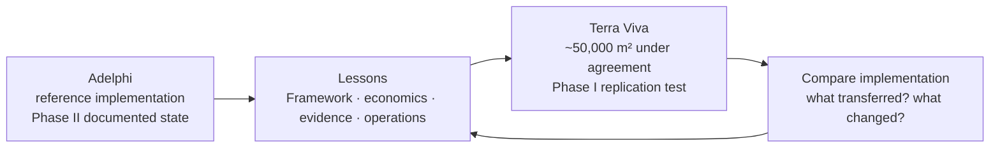
```mermaid
flowchart LR
    A["Adelphi\nreference implementation\nPhase II documented state"]
    B["Lessons\nFramework · economics · evidence · operations"]
    C["Terra Viva\n~50,000 m² under agreement\nPhase I replication test"]
    D["Compare implementation\nwhat transferred? what changed?"]

    A --> B
    B --> C
    C --> D
    D --> B
```

<Warning>
  Terra Viva is a **replication test**, not proof that multi-farm replication has already succeeded. The important evidence will be which shared interfaces remain useful when land, design, economics, operations, and evidence needs change.
</Warning>

---

# Current system map

| Surface | Current role | What not to infer |
| --- | --- | --- |
| **Kokonut Framework** | Shared methodology and compatibility | Universal farm template |
| **Common Data Schema** | 13-field baseline | Complete operational database or approval |
| **Adelphi** | First live reference farm | Universal performance benchmark |
| **Terra Viva** | Next documented replication test | Proven scale |
| **Moloch DAO** | Shared DAO capital and DAO-level rights | Farm-management authority |
| **Guilds** | Contribution coordination | Automatic treasury / land / scientific authority |
| **SAFE** | Authorized transaction execution | Governance policy |
| **Kokonut Intelligence** | Governed data, APIs, analytics, evidence, reports, internal agents | Universal truth engine |
| **EAS on Celo** | Optional public provenance | Scientific certification |
| **Kokonut Marketplace** | Service/agent commerce | Evidence verification |
| **AI agents** | Bounded analysis/draft automation | Final review or execution authority |

---

# Implementation checklist

Before calling a Kokonut-style workflow operational, confirm:

- [ ] Local land / operating basis is documented.
- [ ] Farm operators and their authority are clear.
- [ ] Baseline record exists.
- [ ] Planning values are visibly forecasts.
- [ ] Phase transition conditions are explicit.
- [ ] Capital authorization is routed to the correct authority.
- [ ] Governance approval and technical execution are separate states.
- [ ] Farm actuals enter governed records.
- [ ] Draft / submitted / verified / published states remain distinct.
- [ ] Record verification is not described as external certification.
- [ ] Public/private evidence boundaries are defined.
- [ ] Attestations are used only where provenance adds value.
- [ ] Forecast-vs-actual reconciliation is operating.
- [ ] Agents are permission-scoped and review-gated.
- [ ] Marketplace payment/reputation is separate from evidence maturity.
- [ ] Risk and maintenance are updated from real events.
- [ ] Failures/rejections remain visible.
- [ ] The next decision can be traced back to evidence.

---

# Practical design rules

<CardGroup cols={2}>
  <Card title="Trigger transitions with evidence" icon="flag-checkered">
    Move phases when readiness or maturity conditions are met, not because a generic number of months passed.
  </Card>

  <Card title="Route authority narrowly" icon="people-arrows">
    Give each decision to the operator, reviewer, governance body, legal party, or technical executor that actually owns it.
  </Card>

  <Card title="Preserve actuals and errors" icon="chart-line">
    Do not overwrite old forecasts, failed assumptions, rejected records, or execution failures.
  </Card>

  <Card title="Make automation propose-first" icon="robot">
    Let agents and services prepare work; reserve high-trust states and execution for authorized review.
  </Card>

  <Card title="Use public ledgers deliberately" icon="link">
    Put records on-chain when durable shared provenance solves a real problem, not because every farm event needs blockchain.
  </Card>

  <Card title="Design for offline reality" icon="mobile-screen">
    Field capture should survive poor connectivity without creating an unreviewed second system.
  </Card>

  <Card title="Separate commerce from truth" icon="handshake">
    Payment, acceptance, reputation, and escrow can coordinate services without becoming evidence verification.
  </Card>

  <Card title="Replicate learning" icon="copy">
    Carry forward interfaces and evidence about what worked; redesign what depends on local conditions.
  </Card>
</CardGroup>

---

## Continue through the playbook

<CardGroup cols={2}>
  <Card title="Regenerative & Technical Alignment" icon="seedling" href="/playbooks/regenerative-finance/regenerative-and-technical-alignment">
    Connect regenerative methods, evidence, software, governance, and technical execution without confusing implementation with outcome.
  </Card>

  <Card title="Case Studies" icon="books" href="/playbooks/regenerative-finance/case-studies">
    Examine Adelphi and replication evidence as cases rather than universal templates.
  </Card>

  <Card title="Business Model & Legal" icon="file-contract" href="/playbooks/regenerative-finance/business-model-and-legal">
    Review the economic waterfall, capital categories, legal interfaces, token boundaries, and compliance questions.
  </Card>

  <Card title="DAO Architecture" icon="layer-group" href="/ecosystem-wiki/the-kokonut-dao/dao-layers">
    See the complete authority-routing model across capital, contribution, farm operations, evidence, and execution.
  </Card>

  <Card title="MRV Methodology" icon="magnifying-glass-chart" href="/ecosystem-wiki/kokonut-farms/measurement-reporting-and-verification">
    Follow the detailed evidence lifecycle behind governed records and public claims.
  </Card>

  <Card title="Kokonut Intelligence" icon="brain" href="/kokonut-intelligence">
    Explore the implementation layer for data, APIs, analytics, evidence, Field Collector, agents, and smart contracts.
  </Card>
</CardGroup>

> **Kokonut “works” when each layer can do its job without pretending to be the authority, evidence, or source of truth for every other layer.**
