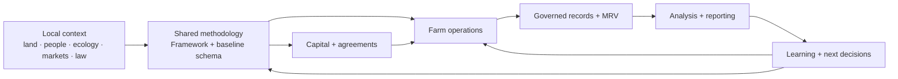
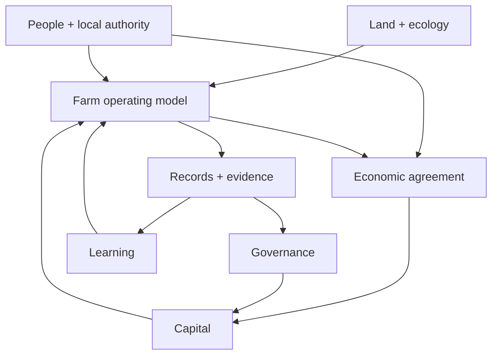
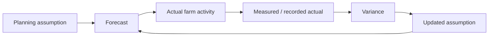

# Start with the farm, not the stack.

Regenerative finance is easiest to misunderstand when the financial or technical layer becomes the story.

A real regenerative project still begins with:

- land;
- people;
- water;
- ecological conditions;
- local knowledge;
- labor;
- infrastructure;
- markets;
- legal relationships;
- operating risk.

Capital, governance, data, blockchain infrastructure, and AI can help coordinate those realities.

They cannot replace them.

This playbook explains how Kokonut connects those pieces into a more inspectable operating model.

> **Use the playbook to structure coordination. Do not use it as a substitute for local agronomy, law, finance, community consent, or evidence.**

<CardGroup cols={2}>
  <Card title="Read the Executive Summary" icon="scroll" href="/playbooks/regenerative-finance/summary">
    Start with the full model, maturity boundaries, replication principle, and evidence-first framing.
  </Card>

  <Card title="Understand the Framework" icon="diagram-project" href="/kokonut-framework/Introduction">
    See the shared methodology that makes farms interoperable without requiring them to be identical.
  </Card>

  <Card title="Review the MRV standard" icon="magnifying-glass-chart" href="/ecosystem-wiki/kokonut-farms/measurement-reporting-and-verification">
    Understand how Kokonut separates observations, measurements, forecasts, attestations, and interpretation.
  </Card>

  <Card title="Build with Kokonut" icon="code" href="/build-with-kokonut">
    Use the current builder contract for repositories, APIs, schemas, evidence, agents, and technical contribution.
  </Card>
</CardGroup>

---

## What this playbook is

The Kokonut Regenerative Finance Playbook is a practical guide to coordinating **real regenerative assets** with:

- shared methodology;
- transparent capital processes;
- compatible data;
- evidence workflows;
- contribution systems;
- open-source software;
- optional public-ledger infrastructure;
- continuous learning.

It is based on Kokonut's work in the Dominican Republic, especially the Adelphi reference farm and the systems built around it.

The playbook is intended to make that experience reusable **without pretending the local context is portable unchanged**.

### The core pattern

The playbook helps connect these layers.

It does not make any one layer sovereign over the others.

---

## What this playbook is not

<Warning>
  This playbook should **not** be read as:

  - a franchise manual;
  - a guaranteed investment model;
  - a promise that farms will become self-funding;
  - a universal DAO template;
  - legal, tax, securities, cooperative, or investment advice;
  - an ecological certification standard;
  - a carbon-credit methodology;
  - proof that Adelphi's outcomes will replicate elsewhere;
  - a requirement to tokenize land, crops, or community rights;
  - a requirement to place every farm record on-chain.
</Warning>

A useful implementation may adopt only part of the Kokonut stack.

For example, a community might use:

- the Framework without a DAO;
- the Common Data Schema without blockchain;
- Kokonut Intelligence without token governance;
- MRV without public attestations;
- local cooperative governance instead of Moloch;
- public-goods accounting without a token.

> **Use the minimum coordination infrastructure that solves the actual problem.**

---

## Who this playbook is for

### Farm and community operators

Use it to think through:

- development phases;
- roles and authority;
- capital needs;
- operating assumptions;
- recordkeeping;
- evidence;
- partner reporting;
- learning loops.

The playbook should support local operators.

It should not move operational authority away from them merely because another participant controls capital or software.

### Cooperatives and community organizations

Use it to explore:

- shared asset coordination;
- member or partner roles;
- transparent funding;
- contribution recognition;
- public-goods commitments;
- evidence and reporting;
- open-source infrastructure.

Local cooperative law, tax treatment, land rights, and contractual relationships still require jurisdiction-specific review.

### ReFi communities and DAOs

Use it when you need a concrete real-world asset context for:

- treasury allocation;
- proposal design;
- evidence requirements;
- accountability;
- contributor coordination;
- long-duration capital.

Do not assume token holders should govern agronomy, community relationships, scientific review, or every technical decision.

### NGOs, foundations, and grant programs

Use it to explore how project funding can be connected to:

- milestones;
- governed records;
- forecasts and actuals;
- evidence maturity;
- public reporting;
- inspectable provenance where useful.

A Kokonut-style data system can improve legibility.

It does not remove the need for due diligence.

### Impact and regenerative-finance practitioners

Use it to examine how ecological, social, productive, and financial value can be discussed together without collapsing them into one number.

The Framework includes several lenses—such as SDGs, EBF, CRISP, the 8 Forms of Capital, and the Pillars of Value—but those lenses have different purposes and evidence requirements.

### Builders and researchers

Use it to extend:

- the Framework;
- Kokonut Intelligence;
- MRV tooling;
- field collection;
- analytics;
- dashboards;
- agent workflows;
- marketplace integrations;
- governance tooling.

For implementation work, prefer the current builder and repository documentation over older code examples embedded in playbook prose.

---

## The problems this playbook helps structure

A regenerative project can fail even when its ecological intention is strong.

Common coordination problems include:

| Problem | Why it matters |
| --- | --- |
| **Capital arrives before revenue** | Tree crops, infrastructure, certification, and soil work may require patient capital |
| **Farm economics are modeled too loosely** | Gross revenue, profit, cash flow, reserves, and distributions are not the same |
| **Authority is unclear** | Funders, operators, landowners, contributors, and governance participants may assume different decision rights |
| **Records are inconsistent** | Comparisons and reporting become expensive or unreliable |
| **Forecasts become marketing claims** | Planning assumptions are mistaken for achieved outcomes |
| **Impact is asserted before evidence matures** | Trust erodes and external verification becomes harder |
| **Technology becomes the project** | Real farm constraints get hidden behind dashboards, tokens, or automation |
| **Public/private boundaries are unclear** | Sensitive farm, financial, community, or personal information can leak |
| **Replication becomes copy-paste** | Local climate, law, culture, markets, and operating capacity are ignored |

Kokonut's approach is to make these problems explicit and route them to the appropriate layer.

---

## A regenerative-finance project needs more than financing

The word **finance** can make the capital layer look primary.

In practice, the system is closer to this:

Capital is one input into a larger living system.

That has several consequences:

- funding a farm does not make the funder the farm operator;
- a governance token does not create agronomic expertise;
- a legal landowner and a DAO can hold different rights;
- a profitable forecast does not mean a project is financeable;
- strong ecological intent does not replace market planning;
- impact evidence does not automatically determine capital allocation.

---

## Preconditions before replication

A community does **not** need every Kokonut component before beginning.

But several foundational questions should have real answers.

### 1. Who has legitimate access to the land?

Document whether land is:

- owned;
- leased;
- contributed;
- held through a cooperative;
- held through another legal arrangement.

Do not let a token or dashboard imply land rights that the legal agreement does not establish.

### 2. Who is accountable for farm operations?

Identify the people responsible for:

- crop decisions;
- labor;
- water;
- maintenance;
- field safety;
- planting and harvest timing;
- operational records.

The answer should not simply be “the DAO.”

### 3. What problem is the farm solving?

The local problem may involve:

- underused land;
- food production;
- soil degradation;
- rural employment;
- market access;
- climate resilience;
- farm income diversification;
- education;
- biodiversity;
- community infrastructure.

The intervention should be designed around the local problem, not around available technology.

### 4. What is the economic arrangement?

Before token design, clarify:

- land contribution;
- labor contribution;
- capital contribution;
- equipment;
- repayment;
- reserves;
- operator compensation;
- revenue;
- costs;
- profit;
- distributions;
- public-goods commitments;
- losses and downside;
- decision rights.

### 5. What evidence can realistically be collected?

Do not design a reporting system around measurements the farm cannot sustain.

Ask:

- Who records the data?
- How often?
- With what device or method?
- What happens offline?
- Who reviews it?
- What evidence stays private?
- What can be published?
- What would require external verification?

### 6. Which coordination problem actually needs Web3?

Possible reasons include:

- transparent shared treasury;
- proposal-based capital governance;
- public provenance;
- portable identity;
- contract-based service coordination.

If the project does not benefit from those properties, use simpler infrastructure.

---

## The authority model

A recurring lesson in Kokonut is that different forms of authority should not be collapsed.

| Responsibility | Typical authority |
| --- | --- |
| **Farm operations** | Local farm operators |
| **Land / legal rights** | Relevant legal parties and agreements |
| **Shared DAO capital** | Moloch governance where applicable |
| **Contribution review** | Relevant Guild/domain reviewers |
| **Framework methodology** | Framework maintainers + affected reviewers |
| **MRV / evidence review** | Authorized evidence/domain reviewers |
| **Technical implementation** | Maintainers and approved execution paths |
| **Treasury execution** | Applicable governance + SAFE / execution authority |
| **Scientific certification** | Qualified external methodology/verifier where required |

[Read the DAO architecture →](/ecosystem-wiki/the-kokonut-dao/dao-layers)

<Info>
  A participant can hold more than one role. The important part is knowing **which authority they are exercising in a given decision**.
</Info>

---

## The evidence contract

Every chapter in this playbook should be read with the same evidence discipline.

### Keep these categories separate

- **documented state** — something recorded as existing;
- **observation** — something seen or logged;
- **measurement** — a quantified source value;
- **derived indicator** — a calculation from source data;
- **forecast/model** — an assumption-based future scenario;
- **reviewed record** — a record that passed an authorized workflow;
- **attestation** — provenance around a claim or record;
- **interpretation** — a conclusion produced from evidence;
- **external verification** — independent verification under an applicable method.

The correct claim strength depends on the evidence beneath it.

> **A stronger sentence needs stronger evidence.**

### Forecasts are not failures when they change

A forecast exists to be tested.

The goal is not to make the first forecast look correct forever.

The goal is to learn.

---

## “Proof” needs a scope

Older ReFi language often uses the word **proof** too broadly.

In this playbook, ask:

> **Proof of what?**

| Phrase | Better question |
| --- | --- |
| Proof of farm activity | Which field, harvest, financial, image, or operational record supports it? |
| Proof of provenance | Who created or attested the record, and when? |
| Proof of payment | Which transaction or ledger record establishes settlement? |
| Proof of ecological change | Which baseline, repeated measurement, method, and period support the comparison? |
| Proof of impact | What causal or methodological standard is being used? |
| Proof of certification | Which authorized certifier and standard issued it? |
| Proof of governance approval | Which proposal, vote, contract state, or execution record shows authorization? |

Blockchain can make some forms of provenance easier to inspect.

It cannot make all of these questions equivalent.

---

## Local context: Dominican Republic first

Kokonut's current model grew from work in the Dominican Republic.

That context matters.

Adelphi reflects local realities such as:

- tropical crop conditions;
- water and infrastructure constraints;
- rural labor and employment;
- market access;
- family and land relationships;
- Dominican legal entities and agreements;
- local agricultural institutions;
- Caribbean climate exposure.

Some of those patterns may be recognizable elsewhere in Latin America and the Caribbean.

That does not make them automatically transferable.

### What should change in another jurisdiction

Expect to redesign or re-review:

- crop mix;
- syntropic planting plan;
- irrigation and water systems;
- labor practices;
- legal entities;
- cooperative arrangements;
- land contracts;
- tax treatment;
- securities/token implications;
- food and organic certification;
- environmental permitting;
- data/privacy rules;
- financing structures;
- buyer channels;
- public-goods commitments.

<Warning>
  **Open-source does not mean jurisdiction-independent.** Code and documentation can travel more easily than legal rights, agricultural methods, markets, and community legitimacy.
</Warning>

---

## Why Adelphi matters

Adelphi is useful as a **reference implementation** because it turns abstract questions into concrete ones.

For example:

- How do you finance infrastructure before long-cycle crops mature?
- How should short-cycle and long-cycle production interact?
- What records are needed to compare forecast and actual harvest?
- How should farm operators and capital governance remain separate?
- Which evidence should be public?
- Which claims require external verification?
- What happens when economic assumptions in different documents conflict?
- Which parts of the Framework improve after real operating experience?

Adelphi is therefore best understood as:

> **a live place for testing the coordination model, not a universal performance benchmark.**

---

## The minimum viable Kokonut-style implementation

A community can begin with a relatively small set of components.

| Minimum component | Why it matters |
| --- | --- |
| **Local operator + clear authority** | Someone must own day-to-day execution |
| **Land/access agreement** | Farm rights must exist outside the software |
| **Farm baseline** | Shared structure improves legibility |
| **Farm plan + economic assumptions** | Capital should finance an explicit operating model |
| **Governed recordkeeping** | Actuals need to replace assumptions over time |
| **Evidence/review process** | Public claims should have an accountable path |
| **Capital authorization** | Funders need to know who can commit resources |
| **Learning loop** | The system should improve from actual outcomes |

Everything else should be added because it solves a problem.

Not because it appears in the Kokonut architecture.

---

## Optional components

Depending on the project, these can be useful but are not universal prerequisites:

- Moloch DAO;
- Guild structure;
- Gnosis SAFE;
- public EAS attestations;
- IoT sensors;
- satellite analytics;
- Kokonut Marketplace;
- AI agents;
- on-chain reputation;
- tokenized contribution recognition;
- public dashboards;
- cross-chain infrastructure.

<Note>
  A component can be important to Kokonut's current implementation and still be optional for someone adapting the playbook elsewhere.
</Note>

---

## What to measure from day one

Not everything needs sophisticated MRV immediately.

Start with records that help answer basic operating questions.

### Operations

- what was planted;
- where;
- when;
- by whom;
- what work happened;
- what inputs were used;
- what infrastructure was installed or repaired.

### Production

- harvest date;
- quantity;
- quality;
- loss;
- destination;
- saleable quantity.

### Finance

- expenses;
- sales;
- realized price;
- unpaid obligations;
- capital expenditures;
- operating costs.

### Evidence

- source;
- timestamp;
- location;
- method;
- reviewer;
- evidence file/reference;
- publication status.

### Learning

- forecast;
- actual;
- variance;
- explanation;
- revised assumption.

This baseline creates more value than collecting large quantities of poorly governed data.

---

## A note on funding credibility

Better records can improve funder diligence.

Transparent governance can improve accountability.

A clear farm plan can make a proposal easier to evaluate.

None of these automatically create institutional credibility.

Credibility is earned through:

- real execution;
- consistent records;
- accurate reporting;
- governance discipline;
- honoring agreements;
- responding to evidence gaps;
- improving forecasts;
- external verification when required;
- time.

> **Infrastructure can make credibility easier to inspect. It cannot manufacture it.**

---

## How to read the rest of the playbook

The chapters are most useful in this order:

<Steps>
  <Step title="1. Executive Summary" icon="scroll" iconType="regular">
    Understand the entire ReFi operating model, what is reusable, and what must remain local.
  </Step>

  <Step title="2. Introduction" icon="compass" iconType="regular">
    Establish the assumptions, authority model, prerequisites, and evidence language you should carry through the rest of the playbook.
  </Step>

  <Step title="3. Business Model & Legal" icon="file-contract" iconType="regular">
    Examine funding, farm economics, agreements, legal counterparties, public-goods assumptions, and unresolved economic questions.
  </Step>

  <Step title="4. How It Works" icon="gears" iconType="regular">
    Follow the development process, governance, records, MRV, Intelligence, and technical coordination layers.
  </Step>

  <Step title="5. Regenerative & Technical Alignment" icon="seedling" iconType="regular">
    Connect ecological methodology and shared values to technical infrastructure without confusing technical verification with ecological truth.
  </Step>

  <Step title="6. Case Studies" icon="books" iconType="regular">
    Study Adelphi and replication attempts as learning cases rather than universal proof.
  </Step>
</Steps>

---

## Reading rules for older playbook material

This playbook is being reconciled against the current Framework, farm, DAO, Intelligence, and builder documentation.

If you find a conflict, use this precedence:

1. **current legal agreement / live chain state / current governed record** for the fact it owns;
2. **current farm or DAO page** for farm- or governance-specific interpretation;
3. **current Framework / MRV page** for shared methodology;
4. **current Kokonut Intelligence or Builder page** for implementation architecture;
5. **playbook prose** as the applied explanation.

<Warning>
  Older playbook pages may still contain legacy assumptions while this documentation sprint is in progress. Examples include fixed public-goods percentages, mandatory IPFS/EAS pipelines, older agent/marketplace descriptions, composite “impact” scoring, or maturity claims that newer pages have narrowed.
</Warning>

---

## Before you adopt a component

Ask five questions.

### 1. What problem does it solve?

If you cannot name the problem, do not add the infrastructure yet.

### 2. Who has authority?

Document who can decide, review, execute, and change the rule.

### 3. What evidence does it need?

Define which records make the system trustworthy enough for its purpose.

### 4. What happens when it fails?

Plan for:

- rejected records;
- failed crops;
- missed forecasts;
- unavailable services;
- disputes;
- lost credentials;
- governance disagreement;
- partner withdrawal;
- incomplete evidence.

### 5. Can the community operate it?

A system that requires specialists the project cannot retain may be less resilient than a simpler one.

---

## What this playbook should help you produce

By the end, a serious implementation should be able to articulate:

- the local problem;
- the farm and operator model;
- land/access rights;
- the development phase;
- economic assumptions;
- funding sources;
- authority boundaries;
- recordkeeping requirements;
- evidence requirements;
- publication/privacy rules;
- governance needs;
- technical dependencies;
- risk and uncertainty;
- how forecasts become actuals;
- how lessons feed the next decision.

That is more useful than merely reproducing Kokonut's stack.

---

## Continue

<CardGroup cols={2}>
  <Card title="Business Model & Legal" icon="file-contract" href="/playbooks/regenerative-finance/business-model-and-legal">
    Examine capital, revenue assumptions, agreements, legal structure, public-goods economics, and unresolved model questions.
  </Card>

  <Card title="How It Works" icon="gears" href="/playbooks/regenerative-finance/how-it-works">
    See how development phases, governance, farm operations, MRV, Intelligence, and technical execution connect.
  </Card>

  <Card title="Kokonut Framework" icon="scroll" href="/kokonut-framework/Introduction">
    Read the current shared methodology before treating a farm-specific practice as a universal rule.
  </Card>

  <Card title="MRV Methodology" icon="magnifying-glass-chart" href="/ecosystem-wiki/kokonut-farms/measurement-reporting-and-verification">
    Use the evidence standard behind forecasts, measurements, claims, attestations, and reporting.
  </Card>

  <Card title="Kokonut Intelligence" icon="brain" href="/kokonut-intelligence">
    Understand the governed data, analytics, evidence, privacy, API, and agent implementation layer.
  </Card>

  <Card title="Build with Kokonut" icon="code" href="/build-with-kokonut">
    Use the current builder contract when adapting or extending the technical stack.
  </Card>
</CardGroup>

> **A regenerative-finance system should make the real-world project easier to understand, finance, operate, evidence, and improve — not make the technology harder to escape.**
