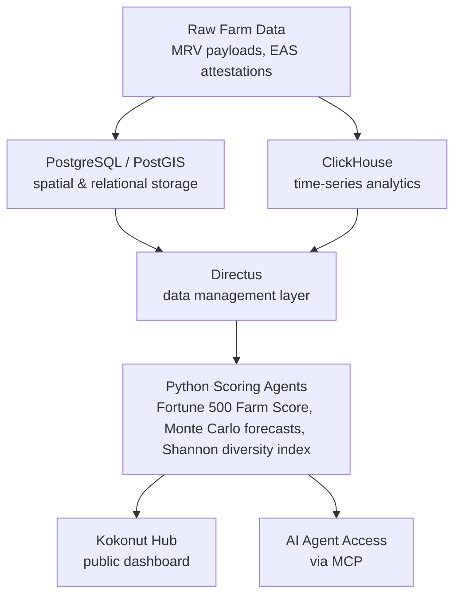

## Regenerative Outcomes

### Web3 Integration

Kokonut runs a deliberately **split-chain architecture**: DAO governance, membership shares (\$vKKN), transferable economic rights (Loot), and treasury execution live on **Gnosis Chain** via a Moloch DAO (Baal framework) and Gnosis Safe multisig, while farm-data attestations run through the **Ethereum Attestation Service deployed on Celo**, with a dedicated schema registry and resolver contract.

This separation means governance risk and data-verification risk sit on different infrastructure rather than being coupled to one chain's uptime or gas conditions.

### Web3 Return-On-Investment

Value creation is measured, not just claimed: Adelphi's Common Data Schema record carries a concrete revenue/allocation split, and Kokonut Intelligence's Fortune 500 Farm Score gives that value a comparable, on-chain-attestable number across financial, ecological, governance, and growth dimensions rather than leaving "impact" as a qualitative claim.

As with any DAO-governed asset, this isn't investment advice or a guaranteed return — \$vKKN is explicitly a non-transferable governance instrument, not a security-like yield product, and Loot's economic value is tied to actual farm performance.

### Reporting & Transparency

The reporting chain is: field/satellite data → MRV payload → IPFS/Filecoin storage → EAS attestation on Celo → public Kokonut Hub dashboard → DAO/Guild/grant reporting.

Ecological scoring draws on the externally maintained **Ecological Benefits Framework (EBF Commons)** rather than an in-house-only rubric, which gives funders an outside reference point for how "ecological impact" is being scored.

### Technical Integration

Interoperability is designed at two levels: the Common Data Schema is a shared JSON/TypeScript-style interface any farm (or any external tool) can read and write against, and Kokonut Intelligence is fully open-source, with MCP-based agent access so third-party AI agents or platforms can query farm data directly rather than needing a bespoke integration.

Interoperability now extends past Kokonut's own schema: Kokonut Intelligence and the Farm Registry are built to be compatible with the Common Impact Data Standard (CIDS) — the open ontology maintained by Common Approach for representing impact data (what, who, how much, contribution and risk) so it can be read by any CIDS-aligned registry or platform — and that compatibility is already integrated into the Intelligence Layer rather than sitting on the roadmap.

The fit is a natural one: Kokonut's own six Pillars of Value (What, Who, How Much, Contribution, Risk, and Public Goods) already track closely with CIDS's impact dimensions, which is part of why the two align without requiring a parallel data model.

## Regen Coordination Stack Alignment

**Regen Coordination** is an existing coalition (GreenPill Network, ReFi DAO, and Celo Public Goods) organized around ReFi Local Nodes and GreenPill Chapters, with its own community playbook library. Kokonut has real, verifiable overlap with that stack already: its attestation layer runs on **Celo**, the same chain Celo Public Goods (a Regen Coordination co-founder) is built around, and its ecological scoring already references the external **EBF Commons** framework rather than reinventing one — both genuine technical alignment points, not aspirational ones.

The Common Data Schema plays a role analogous to what a "Common Approach" shared data model would need across a coordination network: a standard record structure that any participating farm or node can populate in the same way.

Kokonut Network's relationship with Regen Coordination moved from proposal to a confirmed, funded [partnership](https://hub.regencoordination.xyz/t/regen-coordination-gg23-partnerships-overview-what-s-next/234) through the Regen Coordination Global GG23 round (~April 2025): a \$96,000 ImpactQF matching pool across 50 ReFi projects, in which Kokonut was named among the round's standout high-impact projects.

The original partnership proposal set out three further deliverables beyond that funding round: co-creating and publishing a Local ReFi Toolkit Playbook for standing up a Web3-powered syntropic farm using the Kokonut Framework — this playbook is a direct output of that commitment; collaborating on a prospective Celo-based Kokonut Farm DAO with on-chain tree governance and public-goods allocation, potentially alongside ReFi Local Nodes or GreenPill chapters; and deeper integration with the Regen Coordination-aligned stack, including Karma GAP (Kokonut maintains an active public Karma GAP profile), Hypercerts, and Silvi — the last of which is already running in Adelphi's MRV pipeline for GPS-based tree tracking.

## Start Your Own ReFi Farm

The Kokonut Framework is open. The software is open source. The data model is open. The governance is reproducible. You don't need permission to begin.

Everything here is free to fork, read, and test — no permission, no cost, no commitment to look.

**📞** [**Book a 20-minute call to talk about replication or partnership**](https://link.kokonut.network/meeting)

Or, if you're ready to go deeper on your own: explore the [Framework docs](/kokonut-framework/Introduction), fork the [repositories](https://github.com/wasalo/Kokonut-Intelligence), or join the [Discord community](/ecosystem-wiki/open-collaboration-invitation).