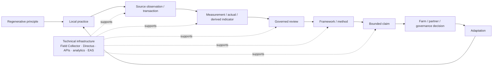
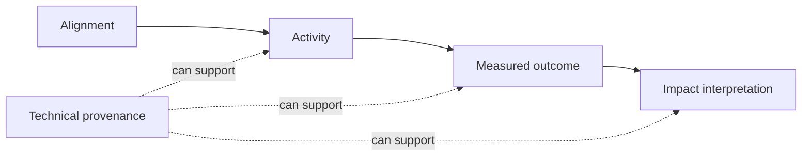
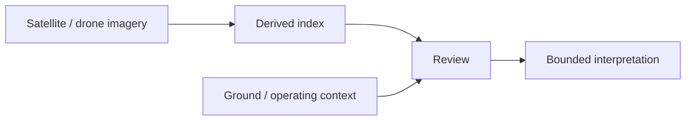
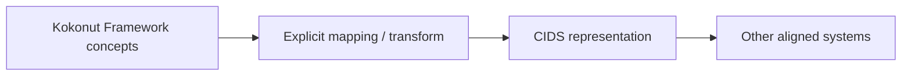
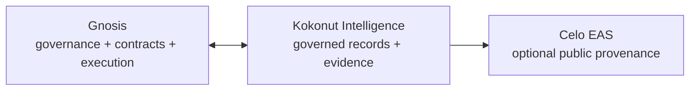
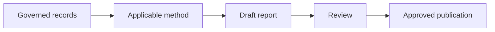

# Technology should make regeneration easier to operate and inspect — not easier to overclaim.

Kokonut combines regenerative agriculture with open-source coordination infrastructure.

The two layers are connected.

They are not interchangeable.

A farm can use excellent software and still have weak regenerative outcomes.

A farm can use strong regenerative practices and still have poor records.

A blockchain attestation can preserve provenance while the underlying claim remains uncertain.

An AI model can detect a pattern without becoming an ecological verifier.

The durable alignment is:

> **regenerative principle → locally adapted practice → source observation → measurement / actual → governed review → bounded interpretation → decision**

Technology belongs around that chain.

It should not skip steps inside it.

<CardGroup cols={2}>
  <Card title="Start with regenerative practice" icon="hand-holding-seedling" href="/kokonut-framework/framework-components/framework-features/5-principles-of-regeneration">
    Use the five principles as design questions without treating implementation as proof of ecological improvement.
  </Card>

  <Card title="Follow the evidence lifecycle" icon="magnifying-glass-chart" href="/ecosystem-wiki/kokonut-farms/measurement-reporting-and-verification">
    Keep observation, measurement, review, publication, attestation, and interpretation distinct.
  </Card>

  <Card title="Understand the implementation layer" icon="brain" href="/kokonut-intelligence">
    See how Kokonut Intelligence stores, reviews, analyzes, publishes, and automates around governed records.
  </Card>

  <Card title="Inspect the external ecological lens" icon="leaf" href="https://ebfcommons.org/what-is-ebf/">
    EBF organizes ecological-benefit interpretation across Air, Water, Soil, Biodiversity, Equity, and Carbon.
  </Card>
</CardGroup>

<Warning>
  **A technical system can strengthen provenance, consistency, review, comparability, and accountability. It cannot turn an unsupported ecological, social, financial, or climate claim into a supported one.**
</Warning>

---

## Three layers must stay distinct

The old version of this page mixed regenerative outcomes, impact scoring, blockchain attestations, and software interoperability into one idea.

A stronger model keeps three layers separate.

| Layer | Core question | Examples | Does not automatically prove |
| --- | --- | --- | --- |
| **Regenerative practice** | What is the farm intentionally doing? | Soil cover, reduced disturbance, perennial systems, biodiversity, animal integration | Ecological improvement |
| **Evidence & interpretation** | What changed, and what can the evidence support? | Measurements, actuals, EBF, CRISP, SDGs, Pillars, 8 Forms of Capital | Certification or causality beyond the method |
| **Technical infrastructure** | How are records captured, governed, analyzed, shared, and audited? | Kokonut Intelligence, APIs, EAS, Gnosis contracts, agents, Marketplace | Truth merely because the system processed it |

The layers should reinforce one another.

They should not inherit each other's authority.

---

## The alignment model


```mermaid
flowchart LR
    PRINCIPLE["Regenerative principle"]
    PRACTICE["Local practice"]
    SOURCE["Source observation / transaction"]
    MEASURE["Measurement / actual / derived indicator"]
    REVIEW["Governed review"]
    METHOD["Framework / method"]
    CLAIM["Bounded claim"]
    DECISION["Farm / partner / governance decision"]
    LEARN["Adaptation"]

    TECH["Technical infrastructure\nField Collector · Directus · APIs · analytics · EAS"]

    PRINCIPLE --> PRACTICE
    PRACTICE --> SOURCE
    SOURCE --> MEASURE
    MEASURE --> REVIEW
    REVIEW --> METHOD
    METHOD --> CLAIM
    CLAIM --> DECISION
    DECISION --> LEARN
    LEARN --> PRACTICE

    TECH -. supports .-> SOURCE
    TECH -. supports .-> MEASURE
    TECH -. supports .-> REVIEW
    TECH -. supports .-> METHOD
    TECH -. supports .-> CLAIM
```

> **The technical layer supports the evidence chain. It is not another rung above external verification.**

---

# Regenerative alignment

## The five principles are shared design questions

The [5 Principles of Regeneration](/kokonut-framework/framework-components/framework-features/5-principles-of-regeneration) are:

1. **Reduce avoidable soil disturbance**
2. **Maintain soil cover**
3. **Increase functional biodiversity**
4. **Integrate animals where appropriate**
5. **Maintain living roots and perennial continuity**

They are intentionally portable.

A farm can implement them differently depending on:

- soil;
- climate;
- water;
- slope;
- crops;
- labor;
- animal suitability;
- market;
- local knowledge;
- risk.

The technical stack should help document **how** a principle is implemented and **what evidence** follows.

It should not convert “principle implemented” into “outcome achieved.”

---

## Principle → practice → evidence

| Principle | Example practice | Technical support | Evidence boundary |
| --- | --- | --- | --- |
| **Reduce avoidable soil disturbance** | Low-disturbance beds, targeted preparation, biological inputs | Activity logs, input records, field notes, soil measurements | Practice record ≠ improved soil condition |
| **Maintain soil cover** | Living cover, mulch, residues, vegetation | GPS/photos, field observations, remote sensing, cover measurements | Cover present ≠ proven erosion reduction |
| **Increase functional biodiversity** | Multi-species systems, agroforestry, nursery | Species records, GPS, survival records, repeated surveys | Species list ≠ biodiversity restoration |
| **Integrate animals where appropriate** | Poultry, manure/nutrient loops | Animal, feed, production, manure, cost records | Animal presence ≠ closed nutrient cycle |
| **Maintain living roots / perennial continuity** | Trees, vines, overlapping crop cycles | Plant inventory, phenology, survival, imagery | Perennial presence ≠ carbon sequestration |

The safe chain is:

> **Principle → practice → observation → measurement → interpretation**

Do not jump directly from principle to outcome.

---

## Syntropic farming is an influence, not a certification

Syntropic agriculture is a major design influence in Kokonut.

Portable ideas include:

- succession;
- stratification;
- biomass cycling;
- continuous vegetation;
- multi-species systems;
- active management;
- perennial structure.

But “syntropic” is not itself:

- a certification;
- a carbon methodology;
- proof of soil restoration;
- proof of biodiversity gain;
- a guarantee of yield;
- a universal crop design.

[Read Why Syntropic Farming →](/kokonut-framework/why-syntropic-farming)

A technical record should therefore say what actually happened.

For example:

- species planted;
- density;
- pruning;
- mulch/biomass;
- soil input;
- survival;
- harvest;
- observed field condition.

That is more useful than a boolean field saying only:

```text
syntropic = true
```

---

# Evidence alignment

## Positive impact is a claim ladder

The [Positive Impact Methodology](/kokonut-framework/framework-components/framework-features/methodology-positive-impact) separates four levels:

1. **Alignment** — the design targets a positive value.
2. **Activity** — the intervention happened.
3. **Measured outcome** — a defined change was recorded.
4. **Impact interpretation** — the evidence supports a bounded conclusion.


```mermaid
flowchart LR
    A["Alignment"] --> B["Activity"]
    B --> C["Measured outcome"]
    C --> D["Impact interpretation"]

    X["Technical provenance"] -. can support .-> B
    X -. can support .-> C
    X -. can support .-> D
```

The technical system can make each level easier to inspect.

It cannot advance a claim from one level to the next without new evidence.

---

## Evidence maturity and record lifecycle are different

Kokonut Intelligence uses a governed record lifecycle:

> **draft → submitted → verified / rejected → published**

That controls workflow.

Evidence strength is a different dimension.

A published record can still be:

- self-reported;
- observational;
- internally reviewed;
- evidence-linked;
- attested;
- externally verified.

<Warning>
  **Internal `verified` status is not a synonym for scientific verification, certification, audit assurance, or regulatory approval.**
</Warning>

This distinction is one of the most important technical-alignment rules in Kokonut.

---

# Ecological interpretation

## EBF is an external ecological-benefit framework

Kokonut uses the external **Ecological Benefits Framework (EBF)** as one interpretation lens.

EBF organizes ecological benefit across six domains:

- **Air**
- **Water**
- **Soil**
- **Biodiversity**
- **Equity**
- **Carbon**

Kokonut Intelligence can implement EBF-oriented scorecards and trust/evidence relationships.

That technical implementation should still preserve the difference between:

- a scorecard;
- the evidence beneath the scorecard;
- the external EBF framework;
- any separate certification or regulated methodology.

> **EBF helps organize ecological-benefit interpretation. It does not create the underlying evidence.**

[Read Kokonut's ecological-impact framework guidance →](/kokonut-framework/framework-add-ons/ecological-impact-frameworks)

---

## CRISP is a Kokonut risk method, not external certification

Kokonut Intelligence currently implements a **CRISP risk-scoring method** across dimensions such as:

- carbon/yield assumptions;
- climate;
- policy;
- financial risk;
- implementation risk.

The Framework treats CRISP as a **Kokonut risk-review method**.

That is different from representing CRISP as:

- a regulator-recognized standard;
- an external certification;
- a universal agricultural risk rating;
- a substitute for due diligence.

A risk score can help ask:

> **What could make this expected benefit fail, weaken, reverse, or become misleading?**

That is useful.

It is not proof that the underlying benefit occurred.

---

## Carbon claims have a higher evidence threshold

Carbon is one of the areas where technical systems most easily create false confidence.

The following do **not** independently prove carbon sequestration:

- planting trees;
- using biochar;
- increasing NDVI;
- implementing syntropic farming;
- creating an EAS attestation;
- running a carbon model;
- publishing a dashboard.

The current Kokonut Intelligence implementation requires a stronger evidence path for public carbon claims, including external verification and methodology context.

A defensible carbon claim may require:

- baseline;
- boundary;
- sampling protocol;
- measurement period;
- laboratory/measurement method;
- model where applicable;
- uncertainty;
- leakage/additionality context where required;
- external verifier;
- methodology reference.

> **Blockchain can anchor a carbon claim. It cannot be the carbon methodology.**

---

# Remote sensing alignment

Remote sensing can make farm monitoring more scalable.

Kokonut can work with derived vegetation indicators such as:

- NDVI;
- NDRE;
- ReCI;
- MSAVI;
- canopy/land-cover analysis;
- geospatial change.

These can help answer questions about vegetation patterns.

They do not directly measure:

- biodiversity;
- soil carbon;
- root condition;
- crop revenue;
- farmer income;
- resilience;
- certified organic status.

### Correct use


```mermaid
flowchart LR
    IMG["Satellite / drone imagery"]
    INDEX["Derived index"]
    CONTEXT["Ground / operating context"]
    REVIEW["Review"]
    INTERP["Bounded interpretation"]

    IMG --> INDEX
    INDEX --> REVIEW
    CONTEXT --> REVIEW
    REVIEW --> INTERP
```

A derived index becomes more useful when it is connected to:

- a defined location;
- a reporting period;
- comparable scenes;
- field context;
- ground measurements where needed;
- method/version;
- uncertainty.

---

# Technical alignment

## Kokonut Intelligence is the implementation layer

The current [Kokonut Intelligence](https://git.kokonut.network/Kokonut-Intelligence/~files) platform provides infrastructure for:

- canonical farm and geospatial records;
- operational and financial events;
- offline field collection;
- APIs;
- sensor ingestion;
- analytics;
- forecasts;
- evidence maturity;
- reporting;
- EBF / risk analysis;
- attestations;
- agents;
- privacy;
- smart contracts.

The canonical data/API core uses PostgreSQL/PostGIS and Directus.

ClickHouse supports analytical/event workloads.

Python services implement analytics, forecasting, reporting, systems intelligence, and other methods.

The important design rule is:

> **The software should preserve the semantics of the Framework rather than silently inventing new ones.**

A new metric is not automatically a new Framework principle.

A new score is not automatically a new impact methodology.

A new database field is not automatically part of the 13-field Common Data Schema.

---

## Capture should fit field reality

Kokonut Intelligence includes an offline-first Field Collector.

That matters because regenerative agriculture happens in places where:

- connectivity may be weak;
- work cannot stop for an API;
- evidence may need GPS/media context;
- the operator may synchronize later.

```text
field activity
→ offline capture
→ synchronization
→ governed record
→ review
→ downstream use
```

Offline-first design is a technical alignment with field reality.

It is not permission to bypass review.

---

## Open APIs should preserve governance

Current integration surfaces include:

- Directus REST;
- Directus GraphQL;
- gateway APIs;
- gRPC / Protobuf;
- SDKs;
- scoped MCP / agent access;
- export/report tooling.

Interoperability is strongest when external tools can consume governed records without bypassing:

- permissions;
- lifecycle states;
- evidence classes;
- privacy;
- source lineage.

> **An open API should make access easier, not authority ambiguous.**

---

# Data-standard alignment

## Kokonut has two different interoperability problems

These should not be confused.

### 1. Farm baseline interoperability

The [Common Data Schema](/kokonut-framework/framework-components/common-data-schema) defines Kokonut's **13-field baseline farm descriptor**.

It answers questions such as:

- what project is this;
- where is it;
- how large is it;
- what revenue streams are planned;
- what markets are targeted;
- what budget/funding context exists;
- what problem/solution is described.

Its purpose is farm-level compatibility.

### 2. Impact-data interoperability

The **Common Impact Data Standard (CIDS)** from [Common Approach](https://www.commonapproach.org/standards/common-impact-data-standard/) is an ontology for representing and exchanging impact models, outcomes, indicators, stakeholder data, and impact reports across software systems.

The current Kokonut Intelligence repository documents a **CIDS Essential Tier JSON-LD export**.

That is an implementation-level interoperability capability.

It does not mean the 13-field farm baseline and CIDS are the same schema.

---

## CIDS and Kokonut's Pillars are related — not identical

Kokonut's six [Pillars of Value](/kokonut-framework/framework-components/pillars-of-value) are:

- **WHAT**
- **WHO**
- **HOW MUCH**
- **CONTRIBUTION**
- **RISK**
- **PUBLIC GOODS**

CIDS is influenced by the Impact Management dimensions:

- what;
- who;
- how much;
- contribution;
- risk;

and adds **how** to represent the organization's efforts/activity model.

Five concepts therefore have strong semantic overlap.

The sixth does **not** map one-to-one:

> **Kokonut PUBLIC GOODS ≠ CIDS HOW**

That difference should be preserved.

A robust exporter should use an explicit, versioned mapping rather than assuming two labels are equivalent because both systems have six concepts.

### Mapping principle


```mermaid
flowchart LR
    K["Kokonut Framework concepts"]
    MAP["Explicit mapping / transform"]
    CIDS["CIDS representation"]
    OTHER["Other aligned systems"]

    K --> MAP
    MAP --> CIDS
    CIDS --> OTHER
```

> **Interoperability means transformable semantics, not forced sameness.**

---

# Blockchain alignment

## Gnosis and Celo have different jobs

Kokonut currently uses a split-chain architecture.

### Gnosis

Gnosis is used for areas such as:

- Moloch governance;
- Guild/evidence-review contracts;
- credit infrastructure;
- price oracle;
- selective disclosure;
- upgrade/timelock controls;
- SAFE execution.

### Celo

Celo is used for:

- EAS attestations;
- public evidence/provenance metadata.


```mermaid
flowchart LR
    GOVERN["Gnosis\ngovernance + contracts + execution"]
    DATA["Kokonut Intelligence\ngoverned records + evidence"]
    CELO["Celo EAS\noptional public provenance"]

    GOVERN <--> DATA
    DATA --> CELO
```

This is an implementation choice.

It should not be interpreted as:

- a requirement for every regenerative project;
- proof that risk is eliminated because two chains are used;
- ecological verification;
- legal enforceability across chains.

> **Different chains can separate technical responsibilities. They do not separate every real-world risk.**

---

## Attestation is provenance

An EAS attestation can help establish:

- who attested;
- what schema/claim type was used;
- which farm/record is referenced;
- when it happened;
- which evidence hash/reference was included;
- whether it was revoked/superseded.

It does not independently establish:

- ecological causality;
- carbon eligibility;
- certified organic status;
- financial accuracy;
- legal ownership;
- community consent.

The safe sequence is:

> **evidence first → attestation when useful**

not:

> **attestation first → therefore evidence**

---

# Governance alignment

Regenerative governance is not the same as token governance.

A farm has many decision domains.

| Decision | Appropriate authority |
| --- | --- |
| Irrigation timing | Farm operator |
| Crop / pruning response | Farm operator / agronomic expertise |
| Shared DAO treasury allocation | Moloch governance |
| SAFE transaction execution | Authorized signers / approved execution path |
| Framework method change | Framework/domain review |
| MRV record approval | Authorized evidence reviewer |
| External certification | Qualified external body |
| Code deployment | Technical maintainers / deployment authority |

The technical stack should make those boundaries visible.

It should not flatten them into:

```text
governance = token vote
```

[Read the DAO architecture →](/ecosystem-wiki/the-kokonut-dao/dao-layers)

---

# Agent alignment

AI agents can help translate regenerative complexity into manageable workflows.

Useful roles include:

- evidence-gap detection;
- forecast reconciliation;
- structured summaries;
- report drafting;
- proposal preparation;
- data QA;
- anomaly detection;
- method-specific analysis.

But the current agent rule remains:

> **Agents can draft and submit. They cannot independently verify, publish, attest, certify, or execute high-trust decisions.**

### Safe agent loop


```mermaid
flowchart LR
    DATA["Governed evidence"]
    AGENT["Agent analysis"]
    DRAFT["Draft / recommendation"]
    REVIEW["Human / authorized review"]
    ACTION["Approved action / publication"]

    DATA --> AGENT
    AGENT --> DRAFT
    DRAFT --> REVIEW
    REVIEW --> ACTION
```

A more capable model does not need broader authority by default.

[Read Kokonut × AI Agents →](/kokonut-x-ai-agents)

---

# Marketplace alignment

The [Kokonut Marketplace](https://git.kokonut.network/Kokonut-Marketplace/~files) can coordinate agent and service commerce.

It can help with:

- service discovery;
- capabilities;
- jobs;
- escrow/payment;
- delivery;
- evaluation;
- disputes;
- reputation.

That is useful for regenerative work because specialist services can become easier to discover and coordinate.

But:

> **commercial acceptance is not ecological verification**

and:

> **reputation is not evidence maturity**

A marketplace provider can complete a paid evidence-analysis job correctly by concluding:

> “The evidence is insufficient to support the requested claim.”

That should be a valid service outcome.

---

# Reporting alignment

A public report should expose the relationship between claim and evidence.

At minimum, material claims should make it possible to identify:

- farm / boundary;
- reporting period;
- evidence class;
- actual vs. forecast;
- method;
- source;
- reviewer;
- uncertainty;
- publication date;
- attestation/provenance where relevant.


```mermaid
flowchart LR
    RECORDS["Governed records"]
    METHOD["Applicable method"]
    DRAFT["Draft report"]
    REVIEW["Review"]
    PUBLIC["Approved publication"]

    RECORDS --> METHOD
    METHOD --> DRAFT
    DRAFT --> REVIEW
    REVIEW --> PUBLIC
```

A dashboard can make this easier.

A dashboard should not hide the distinctions to make the result look cleaner.

---

# External ecosystem alignment

## Regen Coordination — documented ecosystem participation, not technical dependency

Kokonut participated in the **Regen Coordination Global GG23** ecosystem in 2025.

The GG23 retrospective documents a **$96,000 matching pool across 50 projects** and identifies Kokonut Network among projects that received significant relative matching.

That is a useful historical alignment point.

It does not mean:

- Regen Coordination certifies Kokonut;
- Regen Coordination governs Kokonut;
- Kokonut must use the Regen Coordination stack;
- every earlier proposed collaboration has become a production integration.

<Card title="Review the GG23 retrospective" icon="arrow-up-right-from-square" href="https://gitcoin.co/case-studies/gg23-ai-impactqf-regen-coordination-retrospective">
  See the published round design, CIDS/Karma GAP reporting context, AI + human evaluation model, ImpactQF approach, and program results.
</Card>

---

## Shared ideas with the broader ReFi ecosystem

Kokonut has meaningful conceptual/technical overlap with tools and communities that emphasize:

- open impact data;
- public-goods funding;
- Celo;
- Karma GAP;
- ecological frameworks;
- verifiable claims;
- local regenerative projects;
- plural funding;
- open-source coordination.

Alignment should be described precisely.

Examples:

| Alignment | Safe interpretation |
| --- | --- |
| **Celo** | Kokonut uses Celo EAS for public provenance |
| **CIDS** | Kokonut Intelligence documents an Essential Tier JSON-LD export |
| **EBF** | Kokonut uses EBF as an ecological interpretation framework |
| **Karma GAP** | Can provide public project / grant-accountability context where used |
| **Silvi** | Supports tree/geospatial tracking workflows where integrated |
| **Regen Coordination GG23** | Historical funding/evaluation ecosystem participation |

Do not convert “aligned with” into:

- certified by;
- governed by;
- technically dependent on;
- universally interoperable with.

---

# What technical alignment can improve

A well-designed technical layer can improve:

### Consistency

The same concept can use:

- stable IDs;
- shared field definitions;
- versioned methods;
- explicit lifecycle states.

### Provenance

A reviewer can trace:

- who recorded the value;
- when;
- from what source;
- with which method;
- through which review;
- under which version.

### Comparability

Two farms can use compatible structures without using identical farming systems.

### Auditability

Governance, agent, financial, evidence, and publication actions can leave reviewable histories.

### Privacy

Open-source systems can still implement:

- least privilege;
- private evidence;
- partner scopes;
- public summaries;
- selective disclosure.

### Learning

Forecasts, failures, actuals, and decisions can remain linked over time.

---

# What technical alignment cannot guarantee

<Warning>
  No amount of technical integration can by itself guarantee:

  - healthy soil;
  - biodiversity recovery;
  - carbon sequestration;
  - climate resilience;
  - profitable farming;
  - buyer demand;
  - decent work;
  - community legitimacy;
  - legal compliance;
  - organic certification;
  - impact causality;
  - successful replication.
</Warning>

Those depend on real-world execution, local context, evidence, and the appropriate external methods or authorities.

---

# A technical-alignment quality gate

Before describing a regenerative + technical integration as mature, confirm:

- [ ] The regenerative principle is explicit.
- [ ] The actual practice is documented.
- [ ] Observation is not confused with measurement.
- [ ] Measurement is not confused with impact.
- [ ] Forecast is separated from actual.
- [ ] Remote sensing is treated as a derived indicator.
- [ ] Internal verification is separated from external verification.
- [ ] EAS is treated as provenance, not certification.
- [ ] EBF / CRISP / SDG / Pillars outputs retain method and evidence context.
- [ ] CIDS mapping is explicit and versioned.
- [ ] The 13-field Common Data Schema is not confused with CIDS.
- [ ] Gnosis governance authority is not confused with farm authority.
- [ ] SAFE execution is not confused with proposal approval.
- [ ] Agents remain review-gated.
- [ ] Marketplace reputation/payment is separate from evidence maturity.
- [ ] Public/private data boundaries are defined.
- [ ] The technical implementation can fail without hiding the failure.
- [ ] The next decision can be traced to the evidence that informed it.

---

# A better test of “alignment”

Instead of asking:

> “How much Web3 does this farm use?”

ask:

### Regenerative

- Which principle is being implemented?
- Why is it appropriate here?
- What downside or trade-off exists?

### Evidence

- What source proves the activity happened?
- What measurement tests the expected outcome?
- What remains uncertain?

### Technical

- Where is the record stored?
- Who can create, review, publish, and revoke it?
- Can another system understand the data?
- What provenance should be public?

### Governance

- Who owns the real-world decision?
- Who owns the capital decision?
- Who owns the review?
- Who owns execution?

### Learning

- What would make us change the practice?
- What would falsify the claim?
- How does this result improve the next farm?

> **That is regenerative and technical alignment: the infrastructure makes better questions easier to answer without changing who is responsible for the answer.**

---

## Current maturity

| Surface | Current interpretation |
| --- | --- |
| **5 Principles of Regeneration** | Active shared design methodology |
| **Syntropic agriculture** | Major design influence; locally adapted |
| **MRV** | Active evidence methodology |
| **Positive Impact Methodology** | Active claim-strength framework |
| **EBF** | External ecological framework used as an interpretation lens |
| **CRISP** | Implemented Kokonut risk method; not external certification |
| **Common Data Schema** | Active 13-field farm baseline |
| **CIDS export** | Implemented in Kokonut Intelligence at Essential Tier JSON-LD |
| **Kokonut Intelligence** | Active data/evidence/analytics implementation layer |
| **Celo EAS** | Deployed public provenance layer |
| **Gnosis contracts / Moloch / SAFE** | Active governance/execution infrastructure |
| **Internal agents** | Active bounded automation |
| **Kokonut Marketplace** | Separate evolving service-commerce system |
| **Regen Coordination GG23 participation** | Documented 2025 ecosystem/funding history |
| **Universal ecological outcome claims** | Not established |
| **Cross-farm ecological replication** | Evidence-dependent |

---

## Continue through the playbook

<CardGroup cols={2}>
  <Card title="Case Studies" icon="books" href="/playbooks/regenerative-finance/case-studies">
    Apply these boundaries to Adelphi and replication examples without turning one implementation into universal proof.
  </Card>

  <Card title="How It Works" icon="gears" href="/playbooks/regenerative-finance/how-it-works">
    Return to the full operating loops connecting farm phases, capital, records, review, decisions, and learning.
  </Card>

  <Card title="Ecological Impact Frameworks" icon="leaf-heart" href="/kokonut-framework/framework-add-ons/ecological-impact-frameworks">
    Review EBF, CRISP-style risk analysis, evidence requirements, and ecological claim boundaries.
  </Card>

  <Card title="Positive Impact Methodology" icon="recycle" href="/kokonut-framework/framework-components/framework-features/methodology-positive-impact">
    Follow the claim ladder from design alignment to measured outcome and bounded impact interpretation.
  </Card>

  <Card title="Kokonut Intelligence" icon="brain" href="/kokonut-intelligence">
    Explore the current implementation layer for data, Field Collector, APIs, evidence maturity, analytics, attestations, agents, and contracts.
  </Card>

  <Card title="Build with Kokonut" icon="code" href="/build-with-kokonut">
    Use the current builder contract when integrating schemas, APIs, methods, governance, agents, or external systems.
  </Card>
</CardGroup>

> **The purpose of technical alignment is not to make regeneration look more technological. It is to make the path from practice to evidence to decision more inspectable, interoperable, and honest.**
