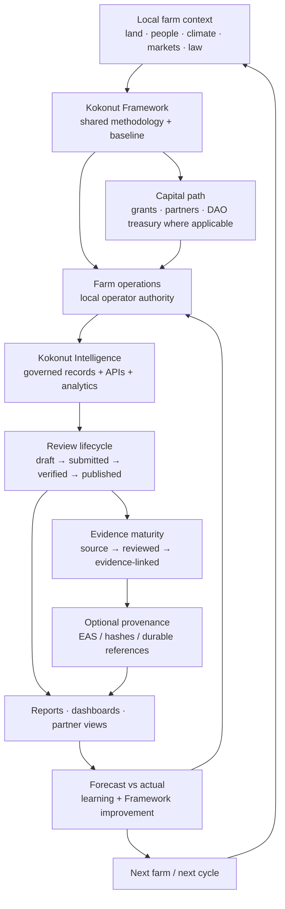
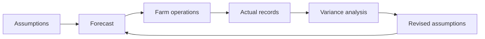
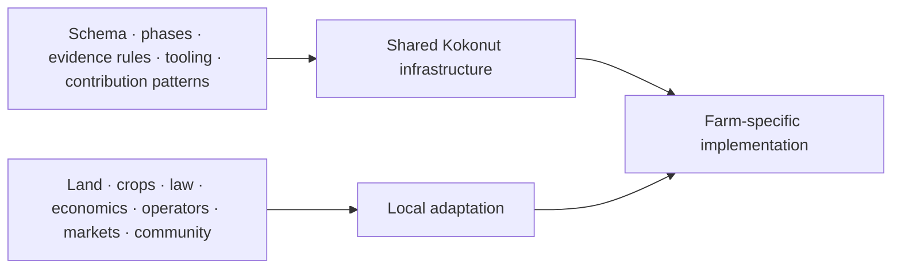

# Regenerative finance works when capital, operations, evidence, and learning stay connected.

This playbook explains how Kokonut combines regenerative agriculture with open-source coordination infrastructure.

The model is not:

- a promise that every regenerative farm will become self-funding;
- a universal legal wrapper;
- a tokenized substitute for farm operations;
- a guarantee of ecological or financial outcomes;
- a requirement that every record go on-chain;
- a blueprint that should be copied without local adaptation.

It is a **repeatable coordination pattern** for connecting:

1. a real farm and local operating authority;
2. a shared farm-development methodology;
3. transparent capital governance where shared treasury funds are involved;
4. structured operational and MRV records;
5. governed review and publication;
6. analytics and decision support;
7. optional public provenance;
8. learning that can improve the next farm.

> **The goal is not to financialize regeneration. The goal is to make capital, evidence, responsibility, and long-term stewardship easier to coordinate around real regenerative assets.**

<CardGroup cols={2}>
  <Card title="Understand the model" icon="diagram-project" href="#the-model-in-one-view">
    See how farm operations, the Framework, capital governance, Kokonut Intelligence, evidence, and learning fit together.
  </Card>

  <Card title="See what can be replicated" icon="copy" href="#what-is-reusable-and-what-must-stay-local">
    Separate portable infrastructure from land-, community-, market-, and jurisdiction-specific decisions.
  </Card>

  <Card title="Check the evidence rules" icon="magnifying-glass-chart" href="#evidence-before-claims">
    Keep forecasts, observations, measurements, attestations, interpretations, and externally verified claims distinct.
  </Card>

  <Card title="Start the playbook" icon="play" href="/playbooks/regenerative-finance/introduction">
    Continue into the implementation model, economics, governance, technical alignment, and case studies.
  </Card>
</CardGroup>

---

## What problem this playbook addresses

Regenerative projects often have several hard problems at the same time.

A farm may need:

- patient capital before long-cycle crops mature;
- short-cycle production to support cash flow;
- local operating capacity;
- clear agreements among land, labor, capital, and coordination contributors;
- a way to distinguish plans from actual results;
- consistent field and financial records;
- credible ecological evidence;
- governance for shared capital;
- partner reporting;
- a way to learn from one farm without pretending another farm is identical.

Those are not one problem.

Kokonut treats them as connected but distinct systems.

| Problem | Kokonut response |
| --- | --- |
| Farm development is hard to coordinate | Four-phase Framework + local operating plan |
| Farm descriptions are inconsistent | 13-field Common Data Schema baseline |
| Shared capital needs accountable authorization | Moloch-style capital governance on Gnosis |
| Operational data becomes fragmented | Kokonut Intelligence as governed data/API layer |
| Impact claims outrun evidence | MRV + evidence maturity + review lifecycle |
| Public provenance is useful for some claims | Optional EAS attestations on Celo |
| Contributors need bounded ways to help | Guild / contribution workflows |
| Automation can create new risk | Agent permissions + human review boundaries |
| Replication can become copy-paste | Interoperability with explicit local adaptation |

---

## The model in one view

No single layer replaces the others.

- capital does not replace agronomy;
- a DAO vote does not replace local farm authority;
- a database does not replace evidence quality;
- an attestation does not replace external verification;
- an AI agent does not replace an authorized reviewer;
- a Framework does not make different farms identical.

---

## The five operating layers

### 1. Local farm and asset layer

Every implementation begins with a specific place.

That means:

- land tenure or access;
- local operators;
- water;
- climate;
- crop suitability;
- labor;
- infrastructure;
- community relationships;
- market channels;
- legal agreements;
- local risks.

The farm is not an abstraction underneath the Web3 system.

It is the system that the rest of the infrastructure exists to support.

### 2. Framework layer

The [Kokonut Framework](/kokonut-framework/Introduction) provides shared structure for:

- describing farms;
- planning development;
- applying regenerative principles;
- thinking across multiple forms of value;
- recording assumptions;
- connecting operations to evidence;
- learning across farms.

Its core design principle is:

> **Interoperability, not uniformity.**

The current Framework includes four development phases:

1. **Planning & Preparation**
2. **Production & Regeneration**
3. **Consolidation & Expansion**
4. **Continuous Operations**

These phases organize work.

They do not guarantee a farm will progress on a fixed schedule.

### 3. Capital-governance layer

Kokonut's live Moloch DAO on Gnosis Chain provides one mechanism for governing **shared DAO capital and DAO-level rights**.

Its authority is deliberately narrower than “govern the farm.”

The Moloch layer can govern matters such as:

- treasury allocation;
- membership;
- $vKKN issuance;
- Loot recognition;
- DAO-funded work;
- governance parameters;
- other DAO-scoped commitments.

It does not automatically control:

- day-to-day agronomy;
- local labor decisions;
- scientific validity;
- evidence review;
- legal land ownership;
- every partner relationship.

[Read the Moloch boundary →](/ecosystem-wiki/the-kokonut-dao/kokonut-moloch-dao)

### 4. Governed intelligence and evidence layer

[Kokonut Intelligence](/kokonut-intelligence) is the current open-source platform for:

- farm operations;
- financial records;
- environmental records;
- MRV;
- analytics;
- reports;
- evidence relationships;
- partner views;
- attestations;
- agent-assisted workflows.

Its canonical record lifecycle is:

> **draft → submitted → verified → published**

That lifecycle is about **authorized workflow state**.

It is not itself scientific certification.

### 5. Contribution and automation layer

Contributors, Guilds, software, and agents can help with:

- technical implementation;
- evidence review;
- dashboards;
- documentation;
- finance;
- governance;
- partnerships;
- reporting;
- analysis;
- workflow automation.

The rule is:

> **Responsibility can be distributed without making authority ambiguous.**

A contributor or agent may prepare work.

The relevant domain still determines whether the work is accepted, published, funded, or acted upon.

---

## Adelphi is the reference implementation — not universal proof

Kokonut Adelphi is the first farm used to operationalize the Framework in the Dominican Republic.

The current documentation describes:

- **15,725 m²** total mapped area;
- **13,838 m²** agricultural area;
- a mixed crop and poultry model;
- syntropic / agroforestry design;
- a four-phase development process;
- public farm records and MRV workflows;
- a crop and gross-revenue forecast used for planning.

Adelphi is valuable because it exposes real coordination problems:

- capital arrives before some crops mature;
- infrastructure and water matter;
- forecasts require assumptions;
- crop cycles behave differently;
- data collection has to survive real field conditions;
- market access cannot be inferred from a target-market field;
- governance and farm operations need separate authority boundaries;
- impact claims need evidence.

<Warning>
  **Adelphi should not be presented as proof that every Kokonut-style farm will achieve the same yields, revenues, ecological outcomes, or funding results.** It is a reference implementation and learning environment.
</Warning>

---

## Forecasts are useful because they can be tested

The current Adelphi crop model includes a combined modeled gross crop revenue of roughly **$149,111/year** under its documented assumptions.

That number is:

- a planning model;
- a mixed-maturity snapshot;
- gross revenue;
- sensitive to yield, loss, cycle frequency, price, establishment, and market access.

It is **not**:

- realized revenue;
- profit;
- EBITDA;
- distributable cash;
- guaranteed household income;
- guaranteed DAO income;
- an investment return.

[Read the forecast assumptions →](/ecosystem-wiki/kokonut-farms/adelphi/crops-and-harvest-forecast)

The correct loop is:

A regenerative-finance system becomes more credible when it gets better at replacing assumptions with actuals.

---

## Economic arrangements must be explicit

The current repository contains a known inconsistency in Adelphi's public-goods allocation documentation.

Some Framework/farm pages model a **10% gross-revenue public-goods assumption**.

Older ReFi Playbook pages describe a separate **40% operator / 40% public-goods / 20% Kokonut Network** allocation.

Those are materially different models.

<Warning>
  **This playbook does not treat either allocation as a universal Kokonut rule or a realized distribution.** The authoritative economic agreement or governance record should determine the actual arrangement for a farm, and the documentation should be reconciled to that source.
</Warning>

This is itself an important ReFi lesson:

> **If the economic agreement is unclear, the tokenomics are not the problem yet — the agreement is.**

For any new farm, document:

- who contributes land;
- who operates the farm;
- who contributes cash or equipment;
- who carries operating risk;
- what gets repaid;
- what is revenue vs. profit;
- what reserves are required;
- whether a public-goods allocation exists;
- when distributions can happen;
- who can change the arrangement;
- what legal agreement makes it enforceable.

---

## Evidence before claims

The ReFi value proposition becomes weaker, not stronger, when blockchain language is used to overstate evidence.

Kokonut's current evidence model separates several things that older documentation sometimes collapsed together.

| Evidence class | What it means |
| --- | --- |
| **Narrative / self-report** | A claim or observation exists |
| **Structured record** | The information is machine-readable |
| **Reviewed record** | An authorized reviewer checked it |
| **Evidence-linked record** | Supporting files, URLs, hashes, or other evidence are connected |
| **Attested record** | A signed/on-chain provenance record exists |
| **Externally verified** | An independent verifier and methodology support the claim where required |

An attestation can establish provenance.

It does not automatically prove:

- causality;
- carbon-credit eligibility;
- biodiversity-credit eligibility;
- regulatory compliance;
- financial performance;
- scientific validity.

For Kokonut, the durable MRV sequence is:

> **observe → structure → review → publish → attest when useful → interpret**

[Read the MRV methodology →](/ecosystem-wiki/kokonut-farms/measurement-reporting-and-verification)

---

## Why on-chain components are optional, not decorative

Blockchain infrastructure is useful when it solves a real coordination problem.

Examples include:

- transparent DAO treasury state;
- inspectable proposal execution;
- durable public attestations;
- cryptographic evidence references;
- shared contract rules;
- agent/service identity;
- auditable transaction history.

It should not be added merely to make a farm sound more “ReFi.”

A good design asks:

> **What coordination problem requires a public ledger here?**

If the answer is “none,” the record may belong in the governed off-chain data layer.

---

## What is reusable and what must stay local

### Reusable infrastructure

These parts are designed to travel more easily across farms:

- four-phase Framework;
- Common Data Schema baseline;
- evidence lifecycle;
- forecast-vs-actual discipline;
- Kokonut Intelligence;
- open-source APIs and data tooling;
- contribution workflows;
- proposal patterns;
- dashboard/reporting patterns;
- optional attestation architecture;
- agent safety boundaries.

### Locally adapted decisions

These should not be copied blindly:

- crop mix;
- planting design;
- water strategy;
- farm economics;
- labor model;
- land agreement;
- legal entity;
- tax treatment;
- cooperative structure;
- market channels;
- certification pathway;
- community-benefit model;
- public-goods allocation;
- governance scope;
- privacy rules;
- evidence methods.

> **Replication should preserve the interfaces, not copy the farm.**

---

## A practical replication path

A new community does not need every Kokonut component on day one.

A safer sequence is:

<Steps>
  <Step title="1. Establish local authority" icon="people-group" iconType="regular">
    Clarify land access, operators, legal counterparties, decision rights, and who is accountable for farm execution.
  </Step>

  <Step title="2. Create the baseline" icon="database" iconType="regular">
    Use the Common Data Schema to establish a compatible farm record while documenting which values are assumptions.
  </Step>

  <Step title="3. Build the farm plan" icon="seedling" iconType="regular">
    Design crops, infrastructure, water, timelines, risks, and market hypotheses for the actual location.
  </Step>

  <Step title="4. Define the economic agreement" icon="file-contract" iconType="regular">
    Separate capital, land, labor, operator compensation, reserves, public-goods commitments, and distribution rules.
  </Step>

  <Step title="5. Choose the capital path" icon="coins" iconType="regular">
    Use grants, partners, local finance, DAO treasury capital, or another structure appropriate to the project. A DAO is optional unless it solves a real governance need.
  </Step>

  <Step title="6. Start governed records early" icon="clipboard-check" iconType="regular">
    Capture operational, financial, and MRV data before the project needs a polished report.
  </Step>

  <Step title="7. Reconcile forecasts with actuals" icon="arrows-rotate" iconType="regular">
    Update planning assumptions from real harvest, sales, losses, costs, ecological observations, and operating experience.
  </Step>

  <Step title="8. Publish only what the evidence supports" icon="upload" iconType="regular">
    Use dashboards, reports, attestations, and partner outputs according to the record's review state, privacy, and evidence maturity.
  </Step>

  <Step title="9. Replicate the learning" icon="copy" iconType="regular">
    Carry forward the improved methods and interfaces, not undocumented assumptions from the first farm.
  </Step>
</Steps>

---

## What the playbook can help you design

<CardGroup cols={2}>
  <Card title="Farm development system" icon="tractor">
    Structure planning, production, expansion, and continuous operations without assuming the same crop plan everywhere.
  </Card>

  <Card title="Capital governance" icon="building-columns">
    Decide when shared treasury capital needs proposal-based authorization and when local operational authority should remain outside token governance.
  </Card>

  <Card title="Evidence system" icon="magnifying-glass-chart">
    Design records, review, evidence maturity, publication, and optional attestation before making strong impact claims.
  </Card>

  <Card title="Economic model" icon="chart-line">
    Separate forecast, actual revenue, operating cost, reserves, distributions, and public-goods commitments.
  </Card>

  <Card title="Contribution system" icon="people-group">
    Give technical, impact, communications, governance, finance, and partnership contributors bounded reviewable work.
  </Card>

  <Card title="Open infrastructure" icon="code">
    Reuse Kokonut's public docs, Framework, Intelligence platform, APIs, and builder interfaces where they fit.
  </Card>
</CardGroup>

---

## What this playbook cannot decide for you

It cannot determine:

- whether a specific farm investment is financially attractive;
- whether a crop is agronomically suitable for your land;
- whether a local legal structure is compliant;
- whether a token or economic arrangement is a security;
- whether an ecological claim qualifies for a regulated credit;
- whether a community accepts the proposed governance model;
- whether an external funder will finance the project;
- whether a forecast will become an actual;
- whether a second farm will reproduce Adelphi's outcomes.

Those require the relevant local, legal, financial, agronomic, scientific, community, and governance review.

---

## Current maturity of the model

| Component | Current interpretation |
| --- | --- |
| **Kokonut Framework** | Active shared methodology; designed to evolve through evidence and use |
| **Common Data Schema** | Active 13-field baseline compatibility contract |
| **Adelphi** | Live reference implementation and learning environment |
| **Crop/revenue model** | Forecast/scenario model requiring reconciliation against actuals |
| **Moloch DAO on Gnosis** | Live shared-capital governance system |
| **Guild contribution model** | Active/evolving coordination model; some reputation mechanics still developing |
| **Kokonut Intelligence** | Active governed data, analytics, evidence, API, reporting, and agent platform |
| **EAS on Celo** | Deployed provenance/attestation layer; not automatic external verification |
| **Kokonut Marketplace** | Separate evolving agent/service commerce system |
| **Cross-farm replication** | Being tested; not yet proof that outcomes generalize |
| **Universal farm economics** | Not established; must be farm-specific |
| **Universal public-goods allocation** | Not established; current documentation requires reconciliation |

---

## What “success” should mean

A successful ReFi implementation is not merely:

- more tokens;
- more dashboards;
- more attestations;
- more governance proposals;
- a higher composite score.

A stronger definition is:

- the farm becomes operationally healthier;
- local operators have clear authority;
- financing matches the farm's time horizon;
- assumptions become measurable;
- records become more reliable;
- evidence becomes easier to inspect;
- public claims become more precise;
- contributors know what they are responsible for;
- shared capital becomes more accountable;
- future decisions improve because previous outcomes were recorded honestly.

> **The finance is regenerative only if the coordination system helps the underlying place, people, and productive asset become more resilient over time.**

---

## How to use the rest of this playbook

| Page | Use it for |
| --- | --- |
| [Introduction](/playbooks/regenerative-finance/introduction) | Understand the audience, problem framing, and local-context assumptions |
| [Business Model & Legal](/playbooks/regenerative-finance/business-model-and-legal) | Examine farm economics, funding, agreements, and regulatory questions |
| [How It Works](/playbooks/regenerative-finance/how-it-works) | Follow the implementation layers and operational process |
| [Regenerative & Technical Alignment](/playbooks/regenerative-finance/regenerative-and-technical-alignment) | Connect regenerative methodology with data, governance, and technical infrastructure |
| [Case Studies](/playbooks/regenerative-finance/case-studies) | Review Adelphi and replication lessons without treating one farm as universal proof |

<Note>
  Some detailed playbook pages may contain older implementation assumptions that are being reconciled as the Knowledge Base is upgraded. When a playbook statement conflicts with a current Framework, farm, DAO, Kokonut Intelligence, or builder page, prefer the more specific current source and update the playbook accordingly.
</Note>

---

## Canonical references

<CardGroup cols={2}>
  <Card title="Kokonut Framework" icon="scroll" href="/kokonut-framework/Introduction">
    Shared methodology, interoperability, development phases, evidence boundaries, and local adaptation.
  </Card>

  <Card title="Common Data Schema" icon="database" href="/kokonut-framework/framework-components/common-data-schema">
    Current 13-field farm baseline and compatibility guidance.
  </Card>

  <Card title="MRV Methodology" icon="magnifying-glass-chart" href="/ecosystem-wiki/kokonut-farms/measurement-reporting-and-verification">
    Evidence lifecycle, claim standard, forecast-vs-actual, and attestation boundaries.
  </Card>

  <Card title="Kokonut Intelligence" icon="brain" href="/kokonut-intelligence">
    Governed records, APIs, analytics, evidence maturity, reporting, privacy, and agents.
  </Card>

  <Card title="Kokonut Moloch DAO" icon="building-columns" href="/ecosystem-wiki/the-kokonut-dao/kokonut-moloch-dao">
    Live shared-capital governance and its authority boundaries.
  </Card>

  <Card title="Build with Kokonut" icon="code" href="/build-with-kokonut">
    Builder contracts, repositories, maturity states, compatibility rules, and contribution paths.
  </Card>
</CardGroup>

---

## Open-source implementation

Use the implementation repository that actually owns the behavior you need.

| Surface | Current source |
| --- | --- |
| Public Knowledge Base / Framework | [Kokonut Public Site](https://github.com/wasalo/Kokonut-Public-Site) |
| Governed data / analytics / evidence / internal agents | [Kokonut Intelligence](https://git.kokonut.network/Kokonut-Intelligence/~files) |
| Agent identity / service commerce / marketplace | [Kokonut Marketplace](https://git.kokonut.network/Kokonut-Marketplace/~files) |

For live DAO balances, proposals, membership, contract state, farm records, or deployment details, use their current authoritative interfaces rather than a static snapshot in this playbook.

---

## Partnership and replication

If you are evaluating Kokonut for:

- a new regenerative farm;
- a community agriculture program;
- a cooperative;
- a public-goods initiative;
- an NGO or foundation program;
- a ReFi ecosystem;
- an open-source integration;
- a research or MRV partnership;

start by identifying **which part of the model you actually need**.

You may need the Framework without the DAO.

You may need the data layer without token governance.

You may need evidence workflows without public attestations.

You may need a local cooperative structure that looks nothing like Adelphi's agreements.

<Card title="Discuss replication or partnership" icon="calendar" href="https://link.kokonut.network/meeting">
  Use a conversation to map the local problem first — then decide which Kokonut components are appropriate.
</Card>

> **Replication should begin with the local problem, not with the stack.**
